# WeaveLink Logical Data Model

The model covers the approved complete product scope. Release priority is represented in seed coverage and does not remove approved Should/Could/Won't structures. Attribute lists below record field names, optionality and cited value sets; they do not infer a storage type. A type is normative only when it appears in **Spec-declared data types** with a direct citation. For every other field, the specification does not declare a type and this logical model intentionally leaves it unassigned until the Plan step.

## Tables

### Identity and access

| Table | Purpose | Attributes (field names; `?` = optional) | Keys and constraints | Citation |
|---|---|---|---|---|
| `users` | First-party Customer or employee identity. | `user_id`; `email`; `full_name [length 1..100]`; `password_hash`; `customer_capability`; `verified_at?`; `active`; `closed_at?`; `anonymized_at?`; `version`; `created_at/updated_at` | PK `user_id`; unique normalized `email`; no role authority from client; closing revokes access without cascading commercial history. | `spec-MFG-01.md §6 User`; §5.2 BR-001..003; approved D3 and Account deletion answer |
| `staff_accounts` | Internal Dony role/lifecycle linked to a User. | `staff_account_id`; `user_id`; `role {Sales,SalesAdmin,SystemAdmin}`; `status {Invited,Active,Suspended,Deleted}`; `invited_at/activated_at/deleted_at?`; `version` | PK; unique FK `user_id`; Deleted terminal; protect last active SystemAdmin; no duplicate name/email columns. | `spec-MFG-03.md §6 StaffAccount`; §5.2 BR-001/002/005/006; approved D3 |
| `sessions` | Revocable server session. | `session_id`; `user_id`; `token_hash`; `idle_expires_at/absolute_expires_at`; `revoked_at?`; `created_at` | PK; FK User; raw token never stored; idle 30m, absolute 24h. | `spec-MFG-01.md §6 Session`; §5.2 BR-004 |
| `one_time_tokens` | Verification/recovery/email-change token. | `token_id`; `user_id`; `purpose`; `portal?`; `token_hash`; `expires_at`; `consumed_at?`; `created_at` | PK; FK User; hashed, purpose-bound, single-use; resend replaces earlier active token. | `spec-MFG-01.md §6 OneTimeToken`; §5.2 BR-005/007; `spec-MFG-02.md §5.2 BR-003` |
| `notifications` | Authoritative recipient inbox. | `notification_id`; `recipient_user_id`; `source_event_id`; `type`; `title/body`; `target_route?`; `email_delivery_state`; `created_at/read_at?` | PK; FK recipient; unique `(source_event_id,recipient_user_id)`; target reauthorized on open. | `spec-MFG-01.md §6 Notification`; `S13-notifications.md §3` |
| `outbox_events` | Durable post-commit notification/email event. | `outbox_event_id`; `source_module`; `source_entity_type/id`; `event_type`; `payload_json`; `delivery_state`; `created_at/delivered_at?` | PK; source identity unique for idempotent projection; excludes secrets/private CRM data. | `spec-MFG-07.md §6 Notification/outbox event`; `spec-MFG-01.md §5 FR-003/009`; approved D4 |
| `staff_invitations` | Employee activation invitation. | `invitation_id`; `staff_account_id`; `email_snapshot`; `role_snapshot`; `token_hash`; `expires_at/accepted_at?`; `delivery_status`; `version` | PK; FK StaffAccount; 48h, single-use; resend invalidates previous token. | `spec-MFG-03.md §6 StaffInvitation`; §5.2 BR-003 |

### Catalogue and assets

| Table | Purpose | Attributes (field names; `?` = optional) | Keys and constraints | Citation |
|---|---|---|---|---|
| `assets` | Private scanned file/storage metadata. | `asset_id`; `owner_user_id?`; `ownership {User,Dony}`; `mime_type {PNG,JPEG,WebP,PDF}`; `scan_status`; `storage_key`; `size_bytes`; `created_at` | PK; owner required for User ownership; private access only; image ≤10 MiB where specified. | `spec-MFG-04.md §6 Asset`; `spec-MFG-05.md §5.3 BR-005`; approved D8 |
| `products` | Stable configurable garment identity. | `product_id`; `sku`; `status {Draft,Published,Hidden,Archived}`; `current_version`; `created_at/updated_at` | PK; unique SKU; Archived terminal; Draft never published may hard-delete. | `spec-MFG-04.md §6 Product`; §5.2 BR-001/005 |
| `product_versions` | Immutable catalogue content/rules version. | `product_version_id`; `product_id`; `version`; `name [length 1..120]`; `description?`; `category`; `branch {Đồng phục,Đồ bảo hộ lao động}`; `sub_type?`; `base_unit_price_vnd`; `min_order_quantity`; `max_units_per_order`; `keywords?`; `created_at` | PK; FK Product; unique `(product_id,version)`; prices nonnegative; MOQ 10..capacity for classroom seed; capacity 1..10000. | `spec-MFG-04.md §5.1 FR-006`; §5.2 BR-002/006; approved Change-over-time answer |
| `product_sizes` | Supported size per ProductVersion. | `product_size_id`; `product_version_id`; `size_label`; `display_order` | PK; FK; unique version/label. Published version requires at least one. | `S17-product-create.md §3`; `spec-MFG-04.md §5.2 BR-003`; approved D2 |
| `product_colors` | Supported colour variant per ProductVersion. | `product_color_id`; `product_version_id`; `color_label`; `display_order` | PK; FK; unique version/label; colours share price table in MVP. | `spec-MFG-04.md §5.2 BR-016`; approved D2 |
| `material_profiles` | Technical grounding keyed by material label. | `material_profile_id`; `material_label`; `durability/breathability/wash_durability/wrinkle_resistance/abrasion_resistance/stain_resistance`; `suited_occupations_json/suited_seasons_json/pros_json/cons_json` | PK; unique `material_label`; reference values only from approved catalogue seed. | `spec-MFG-04.md §6 MaterialProfile` |
| `product_materials` | ProductVersion-supported material option. | `product_material_id`; `product_version_id`; `material_profile_id`; `material_label_snapshot`; `option_surcharge_vnd` | PK; FKs; unique version/profile; surcharge nonnegative; label equals profile key at creation. | `spec-MFG-04.md §6 Product`; §5.5; approved D2 |
| `print_methods` | Print capability/material compatibility. | `print_method_id`; `name`; `multicolor_support`; `fine_detail_support`; `notes?` | PK; candidate unique name; compatibility is expressed through ProductOption/material selection supported by spec. | `spec-MFG-04.md §6 PrintMethod` |
| `volume_pricing_tiers` | Aggregate-quantity price tiers. | `tier_id`; `product_version_id`; `quantity_from`; `quantity_to?`; `unit_price_vnd` | PK; FK; 1..10 tiers; first starts 1; increasing, nonoverlapping lower bounds; price nonnegative. | `spec-MFG-04.md §5.1 FR-006`; §5.2 BR-008; approved D2 |
| `product_options` | Supported material/print/side option and surcharge. | `product_option_id`; `product_version_id`; `option_type {Material,PrintMethod,PrintSide}`; `option_value`; `print_method_id?`; `option_surcharge_vnd` | PK; FK version and optional PrintMethod; unique version/type/value; surcharge nonnegative. | `spec-MFG-04.md §6 Product.options`; `S19-product-design-rules.md §3`; approved D2 |
| `print_areas` | Size/side printable geometry. | `print_area_id`; `product_version_id`; `size_label`; `side {Front,Back}`; `width_mm/height_mm`; `origin_x_mm/origin_y_mm` | PK; FK; unique version/size/side; positive bounded geometry. | `S19-product-design-rules.md §3`; `S20-design-tool.md §3`; approved D2 |
| `product_images` | Ordered ProductVersion image references. | `product_image_id`; `product_version_id`; `asset_id`; `display_order` | PK; FKs; unique version/order; Published product requires ≥1 safe image. | `spec-MFG-04.md §5.2 BR-003/004`; approved D2/D8 |
| `search_synonym_sets` | Reproducible search synonym release. | `synonym_set_id`; `version`; `entries_json`; `updated_by_user_id`; `updated_at` | PK; unique version; administration/storage remains Plan decision, seed only. | `spec-MFG-04.md §6 SearchSynonymSet`; §5.2 BR-011; §10 Q3 |

### Designs

| Table | Purpose | Attributes (field names; `?` = optional) | Keys and constraints | Citation |
|---|---|---|---|---|
| `designs` | Customer-owned design aggregate. | `design_id`; `customer_id`; `product_id`; `source_design_request_id?`; `status {Draft,Saved,ProofDelivered,Delivered}`; `current_version`; `created_at/updated_at` | PK; FKs; provenance cannot be cleared; Customer may exist with zero Designs. | `spec-MFG-05.md §6 Design`; §5.3 BR-001; approved Empty-state answer |
| `design_versions` | Immutable design content/review version. | `design_version_id`; `design_id`; `version`; `product_version_id`; `source {CustomerUploaded,CustomerProvidedImport,DonyTechnicalAdjustment,DonyDesign}`; `review_state {Draft,SharedForReview,Approved,Superseded}`; `uploader_user_id`; `original_channel?`; `change_note?`; `preview_asset_id?`; `created_at` | PK; unique design/version; content immutable; sharing supersedes prior shared version. | `spec-MFG-05.md §5.4`; §6 DesignVersion |
| `design_placements` | Artwork placement in one immutable DesignVersion. | `placement_id`; `design_version_id`; `asset_id`; `side {Front,Back}`; `x_mm/y_mm/width_mm/height_mm`; `processing_method?` | PK; FKs; positive dimensions and fully within cited PrintArea; no rotation/text implied. | `spec-MFG-05.md §6 DesignAsset variant`; `S20-design-tool.md §3`; approved D2/D8 |
| `design_requests` | Assessed design-service request. | `design_request_id`; `customer_id`; `product_id`; `requirements [length 20..5000]`; `requested_deadline?`; `committed_due_at?`; `complexity {Simple,Complex}?`; `rationale/rejection_reason?`; `assessed_by_staff_id?`; `assessed_at?`; `fee_vnd?`; `proposal_version?`; `accepted_fee_version/accepted_fee_vnd?`; `accepted_by_user_id?`; `accepted_at?`; `fee_order_id?`; `fee_allocation_version?`; `state`; `assignee_staff_id?`; `version`; `created_at` | PK; FKs; fee null preassessment, 0 Simple, 1..9999999999 Complex; state machine in BR-002; at most one resulting Design (approved D6). | `spec-MFG-05.md §6 DesignRequest`; §5.2/5.3 BR-002..007; approved D6 |
| `design_request_assets` | Safe attachment links for DesignRequest. | `design_request_asset_id`; `design_request_id`; `asset_id`; `display_order` | PK; FKs; unique request/asset; 0..5 PNG/JPEG/WebP assets ≤10 MiB. | `spec-MFG-05.md §5.1 FR-006`; §5.3 BR-005; approved D8 |
| `design_feedback` | Customer's one decision/feedback on a shared version. | `feedback_id`; `design_version_id`; `author_user_id`; `decision {RevisionRequested}`; `change_request_text [length 10..500]`; `preferred_colour/additional_notes?`; `created_at`; `idempotency_key` | PK; FK; one owner decision per shared version across feedback/approval. | `spec-MFG-05.md §5.1 FR-017`; §5.4; approved D4 |
| `design_feedback_assets` | Safe image links for DesignFeedback. | `design_feedback_asset_id`; `feedback_id`; `asset_id`; `display_order` | PK; FKs; unique feedback/asset; 0..3 scanned image assets ≤10 MiB. | `spec-MFG-05.md §5.1 FR-017`; approved D8 |
| `staff_replies` | Customer-visible reply to feedback. | `staff_reply_id`; `feedback_id`; `author_staff_id`; `reply_text [length 1..5000]`; `created_at`; `idempotency_key` | PK; FKs; append-only; does not change lifecycle/fee. | `spec-MFG-05.md §5.1 FR-021`; approved D4 |
| `staff_reply_assets` | Safe image links for StaffReply. | `staff_reply_asset_id`; `staff_reply_id`; `asset_id`; `display_order` | PK; FKs; unique reply/asset; 0..3 scanned PNG/JPEG/WebP assets ≤10 MiB. | `spec-MFG-05.md §5.1 FR-021`; approved D8 |
| `customer_approvals` | Approval of exact shared DesignVersion. | `approval_id`; `design_version_id`; `customer_id`; `approved_at`; `request_version`; `idempotency_key` | PK; unique version; exact owner/current shared version only. | `spec-MFG-05.md §6 CustomerApproval`; §5.1 FR-018 |
| `customer_provided_confirmations` | Confirmation of unchanged imported source. | `confirmation_id`; `design_version_id`; `confirmer_user_id`; `recorded_by_staff_id?`; `original_channel`; `source_evidence`; `confirmed_at`; `idempotency_key` | PK; unique version; forbidden for Dony-created/changed versions. | `spec-MFG-05.md §6 CustomerProvidedConfirmation`; §5.1 FR-020 |
| `product_mockup_templates` | Calibrated ProductVersion view template. | `mockup_template_id`; `product_version_id`; `view_id`; `base_asset_id`; `surface_grid_json/masks_json`; `material_color_support_json` | PK; FKs; unique version/view; unsupported views disabled. | `spec-MFG-05.md §6 ProductMockupTemplate`; §5.1 FR-015 |

### Orders, payments and contracts

| Table | Purpose | Attributes (field names; `?` = optional) | Keys and constraints | Citation |
|---|---|---|---|---|
| `quotes` | Expiring immutable commercial proposal. | `quote_id`; `customer_id`; `journey_intent_id?`; `buyer_type {BusinessBuyer,ResellerShop}`; `buyer_legal_name [length 1..200]`; `buyer_tax_id [length 1..50]`; `billing_address [length 1..250]`; `product_version_id/design_version_id`; delivery fields `recipient_name/phone/address_line/ward/province/country`; `merchandise_subtotal_vnd/merge_discount_vnd/shipping_vnd/tax_vnd/design_fee_vnd/total_vnd/deposit_preview_vnd`; `merge_opt_in`; `policy_version?`; `expires_at`; `version`; `created_at` | PK; FKs; exact immutable buyer/address/product/design/price snapshot; 30m expiry; VND integers; no BuyerOrganization master. | `spec-MFG-06.md §6 Quote/BuyerOrganization snapshot`; §5.1 FR-002; approved D7 and Change-over-time answer |
| `quote_size_quantities` | Size quantities included in Quote. | `quote_size_quantity_id`; `quote_id`; `size_label`; `quantity` | PK; FK; unique quote/size; positive; aggregate within MOQ/capacity. | `S30-create-order.md §3 quantity_by_size`; approved D2 |
| `orders` | Made-to-order aggregate and immutable transaction snapshot. | `order_id`; `order_number`; `customer_id`; `journey_intent_id?`; buyer/address/product/design/price snapshot fields matching Quote; `status`; `current_quote_cycle`; `approved_sample_id/contract_id?`; `deposit_percent`; `contract_total_vnd/accepted_deposit_vnd/accepted_order_credit_vnd/balance_due_vnd`; `balance_due_at/received_at/completed_at?`; `received_by_staff_id?`; goods `carrier/tracking_number/shipped_at/estimated_delivery_from/estimated_delivery_to/delivery_evidence_asset_id/delivery_evidence_verified_at`; `manual_refund_required`; `version`; `created_at/updated_at` | PK; unique immutable `order_number`; all product attributes used by Order frozen; canonical status transitions only; cancellation uses status plus timeline, no cancellation table. | `spec-MFG-06.md §6 Order`; §5.2 BR-001..019; approved Cancellation and Change-over-time answers |
| `order_size_quantities` | Immutable size quantities copied to Order. | `order_size_quantity_id`; `order_id`; `size_label`; `quantity` | PK; FK; unique order/size; positive. | `spec-MFG-06.md §6 Order quantity snapshot`; `S35 §3 item_snapshot`; approved D2 |
| `order_quote_cycles` | Retained quote/design/sample revision cycle. | `order_quote_cycle_id`; `order_id`; `cycle_number`; `quote_id`; `design_version_id`; `customer_approved_at?`; `created_at` | PK; FKs; unique order/cycle and quote; cycle 1+; never overwrites earlier cycle. | `spec-MFG-06.md §5.2 BR-015`; transition reference; approved D5 |
| `production_samples` | Physical sample cycle. | `sample_id`; `order_quote_cycle_id`; `design_version_id`; `status {InPreparation,Shipped,Approved,RevisionRequested}`; `carrier/tracking_number?`; `sent_at/received_at/approved_at?`; `estimated_delivery_from/to?`; `feedback?`; `evidence_asset_id?`; `version` | PK; FKs; date-range validation from BR-018; Approved exact version gates contract. | `spec-MFG-06.md §6 ProductionSample`; §5.2 BR-002/015/018 |
| `payment_transactions` | DEPOSIT/BALANCE attempt and provider state. | `payment_transaction_id`; `order_id/customer_id`; `purpose {DEPOSIT,BALANCE}`; `amount_vnd`; `currency {VND}`; `status {Pending,Succeeded,Failed,Expired}`; `provider_reference/provider_event_id?`; `paid_at?`; `refund_status?`; `expires_at?`; `version`; `idempotency_key`; `created_at` | PK; FKs; one active Pending per order/purpose; unique provider event/reference where present; exact server amount. | `spec-MFG-06.md §6 PaymentTransaction`; §5.2 BR-004..006 |
| `refund_records` | Full-system provider refund only where specified. | `refund_id`; `payment_transaction_id`; `amount_vnd`; `status {Requested,Succeeded,Failed}`; `provider_reference?`; `requested_at/settled_at?`; `idempotency_key` | PK; FK; captured funds only; MVP late deposit uses manual flag and no record. | `spec-MFG-06.md §5.1 FR-005`; §5.2 BR-013/019; approved Cancellation answer |
| `order_timeline_events` | Append-only transition/audit evidence. | `event_id`; `order_id`; `prior_status/target_status?`; `actor_kind`; `actor_user_id?`; `event_source`; `bound_entity_type/id/version?`; `sample_cycle?`; `evidence_asset_id?`; `idempotency_reference?`; `occurred_at` | PK; FK; append-only; cancellation reason/evidence stored here; deduplicate source/idempotency reference. | `spec-MFG-06.md §6 OrderTimelineEvent`; `spec-MFG-07.md §6`; approved Cancellation answer |
| `contract_templates` | Immutable versions of Dony templates. | `contract_template_id`; `template_family_id`; `name [length 1..120]`; `version`; `structured_body`; `status {Draft,Published,Archived}`; `created_at` | PK; unique family/version; Published immutable; placeholders allowlisted. | `spec-MFG-09.md §6 ContractTemplate`; §5.2 BR-002/003 |
| `contracts` | Generated order contract version. | `contract_id`; `order_id`; `contract_template_id`; buyer snapshot fields; `approved_design_version_id/approved_sample_id`; `contract_total_vnd/deposit_percent/deposit_due_vnd/balance_due_vnd`; `balance_due_rule/payment_policy_version`; `version/template_version`; `content_hash`; `pdf_asset_id?`; `status {Draft,Ready,Signed,Superseded,Voided}`; `ready_at/signed_at/voided_at?` | PK; FKs; Ready requires persisted PDF; current approved bindings only; Signed immutable. | `spec-MFG-09.md §6 Contract`; §5.2 BR-001..005 |
| `signature_evidence` | Application acknowledgement for exact Contract hash/version. | `signature_evidence_id`; `contract_id`; `signer_user_id`; `typed_name [length 1..100]`; `consent_text_version`; `contract_hash`; `server_timestamp`; `observed_ip/user_agent`; `challenge_digest?` | PK; unique Contract; server-derived identity/IP; not a certified digital signature. | `spec-MFG-09.md §6 SignatureEvidence`; §5.1 FR-008; §5.2 BR-004 |

### CRM and production planning

| Table | Purpose | Attributes (field names; `?` = optional) | Keys and constraints | Citation |
|---|---|---|---|---|
| `customer_assignments` | Current/history Sales ownership. | `assignment_id`; `customer_id/sales_user_id/assigned_by_user_id`; `assigned_at/ended_at?`; `active`; `version` | PK; FKs; at most one active assignment per Customer/open lead; history retained. | `spec-MFG-08.md §6 CustomerAssignment`; §5.2 BR-001 |
| `consultations` | CRM lead. | `consultation_id`; `customer_id`; `pipeline_stage`; `customer_model {Unclassified,B2B,B2B2C}`; `owner_sales_user_id?`; contact/requirement fields; `design_source/design_readiness?`; `technical_adjustment_required`; `proposal_milestone?`; `lost_reason/lost_note?`; `stage_entered_at`; `version`; `created_at/updated_at` | PK; unique active/open Customer lead; LeadIn has no owner; Customer can exist without Consultation. | `spec-MFG-08.md §6 Consultation`; §5.2 BR-001/005..010; approved Empty-state answer |
| `lead_design_links` | Consultation-specific Design scope. | `lead_design_link_id`; `consultation_id/design_id`; `design_scope {InScope,Dropped}`; `version`; `created_at/updated_at` | PK; unique consultation/design; dropping never changes Design history. | `spec-MFG-08.md §6 LeadDesignLink`; §5.2 BR-008 |
| `stage_histories` | Append-only pipeline transition. | `stage_history_id`; `consultation_id`; `from_stage/to_stage?`; `actor_user_id?`; `source`; `reason/reference?`; `occurred_at` | PK; FK; append-only. | `spec-MFG-08.md §6 StageHistory`; §5.2 BR-004/005 |
| `interaction_logs` | External contact summary. | `interaction_id`; `consultation_id`; `type {General,DesignDiscussion}`; `channel {Phone,Email,Zalo,Messenger,Meeting,Other}`; `occurred_at`; `summary [length 1..5000]`; `author_user_id`; `design_version_id?` | PK; FKs; append-only; occurrence not future; sends no message. | `spec-MFG-08.md §5.4`; §6 InteractionLog |
| `internal_notes` | Staff-only lead knowledge. | `note_id`; `consultation_id`; `text [length 1..5000]`; `author_user_id`; `pinned`; `created_at` | PK; FK; append-only; max three pinned per lead. | `spec-MFG-08.md §5.4`; §6 InternalNote |
| `admin_reviews` | Structured internal decision. | `review_id`; `consultation_id`; `type {CommittedDueDateChange,Other}`; `requested_value [length 1..500]`; `reason [length 1..1000]`; `status {Pending,Approved,Rejected}`; `requester_user_id`; `requested_at`; `decider_user_id?`; `decided_at?`; `decision_note?` | PK; FK; terminal Approved/Rejected; rejected requires note; no automatic commercial override. | `spec-MFG-08.md §5.4`; §5.2 BR-011 |
| `flexible_preferences` | Explicit quote-level flexible choice. | `flexible_preference_id`; `quote_id`; `merge_opt_in`; `accepted_policy_version?`; `accepted_at?`; `incentive_vnd` | PK; unique Quote; accepted policy required when true; incentive formula/cap from BR-001. | `spec-MFG-10.md §5.1 FR-003`; §5.2 BR-001; approved D4 |
| `production_readiness` | Frozen commercial calendar/readiness facts. | `production_readiness_id`; `order_id`; `production_ready_at`; `readiness_day_1/last_waiting_date/production_window_first_date/production_due_at`; `wait_end_exclusive_at`; `calendar_version`; `waiting_workdays`; `production_window_min/max_workdays` | PK; unique Order; values follow Monday–Friday inclusive formula; late approval does not reset due date. | `spec-MFG-10.md §6 ProductionReadiness`; §5.2 BR-002; §5.3 |
| `individual_production_plans` | Approved flexible individual fallback. | `individual_plan_id`; `order_id`; `approved_by_staff_id`; `approved_at`; `started_by_staff_id?`; `started_at?`; `status {Approved,Started,Completed}`; `retained_incentive_vnd`; `version` | PK; unique active Order plan; approval and start are distinct human acts. | `spec-MFG-10.md §5.2 BR-003/006/009`; approved D4 |
| `production_capacity_profiles` | Shared garment-type/material daily throughput. | `capacity_profile_id`; `production_type_key`; `material_profile_id`; `daily_output_capacity`; `active`; `version`; `updated_by_staff_id`; `updated_at` | PK; positive capacity; unique active `(production_type_key,material_profile_id)`; versions/history allowed. | `spec-MFG-10.md §6 ProductionCapacityProfile`; approved Duplicates answer |
| `production_batches` | Human-approved shared sewing run. | `batch_id`; `capacity_profile_id`; `kind {BaseRun,NewSewingGroup}`; `status {ScheduledOpen,Locked,InProduction,Completed}`; `scheduled_start_at/planned_completion_at`; `daily_capacity_snapshot/total_quantity/required_workdays`; `approved_by_staff_id`; `approved_at/locked_at/started_at?`; `version` | PK; FK; no additions after lock; explicit human start; new group ≥2, base run may have one. | `spec-MFG-10.md §6 ProductionBatch`; §5.2 BR-005/006 |
| `batch_memberships` | Exclusive active Order assignment to Batch. | `batch_membership_id`; `batch_id/order_id`; `assigned_at/released_at/started_at?`; `active`; `lock_start_version` | PK; FKs; at most one active production assignment per Order; started membership immutable. | `spec-MFG-10.md §6 BatchMembership`; §5.2 BR-007 |

### Analytics and system operations

| Table | Purpose | Attributes (field names; `?` = optional) | Keys and constraints | Citation |
|---|---|---|---|---|
| `product_entries` | Authenticated product-entry attribution. | `product_entry_id`; `owner_user_id/product_id`; `source`; `entered_at`; `product_version` | PK; FKs; authenticated only; no guest stitching. | `spec-MFG-11.md §5.3`; §6 ProductEntry; approved D4 |
| `journey_intents` | Explicit owned design/order intent. | `journey_intent_id`; `owner_user_id`; `product_entry_id?`; `intent_type`; `parent_intent_id?`; `created_at` | PK; FKs; explicit continuation only; one entry may start many intents. | `spec-MFG-11.md §5.3`; approved D4 |
| `analytics_events` | Validated analytics evidence envelope. | `analytics_event_id`; `schema_version`; `event_name/source_kind/entity_type`; `entity_id`; `occurred_at/received_at`; `actor_kind`; `customer_id/product_entry_id/journey_intent_id/product_id/design_id/quote_id/order_id/request_id/contract_id?`; bound versions/sample cycle/reason code/source_event_id/dataset flags | PK; unique source event identity; excludes free text, addresses, notes, content, secrets and provider payloads; 13-month raw retention. | `spec-MFG-11.md §5.4/5.7`; §6 AnalyticsEvent |
| `analytics_results` | Immutable protected aggregate snapshot. | `analytics_result_id`; `query_context_json`; `unit/template/cohort/observation_mode`; `eligible_count/immature_count?`; `cutoff`; `timezone`; `generated_at/expires_at`; `source_watermark/definition_version`; `coverage_json/metrics_json` | PK; seven-day expiry; reads reauthorize; unsupported data represented as coverage, not zero. | `spec-MFG-11.md §6 AnalyticsResult`; §5.7 |
| `export_requests` | Asynchronous private result export. | `export_request_id`; `actor_user_id/analytics_result_id`; `format {CSV,XLSX}`; `dataset {revenue,orders,customers,funnel}`; `watermark`; `created_at/completed_at/expires_at?`; `state {Queued,Running,Succeeded,Failed}`; `private_asset_id?`; `row_count?`; `safe_error?` | PK; FKs; result/dataset allowlist; 100,000-row cap; successful file expires seven days. | `spec-MFG-11.md §5.6/5.7`; §6 ExportRequest |
| `audit_events` | Redacted operational audit event. | `audit_event_id`; `actor_id?`; `buyer_organization_context?`; `target_type/target_id/action/outcome`; `severity {INFO,WARN,ERROR}`; `request_id`; `occurred_at`; `redacted_details_json?` | PK; append-only; no DEBUG/password/token/card data; 365-day retention. | `spec-MFG-12.md §6 AuditEvent`; §5.2 BR-001 |
| `backups` | Verified encrypted base backup. | `backup_id`; `created_at`; `creator_id?`; `state`; `manifest_reference/checksum/schema_version`; `asset_count`; `transaction_log_start/end`; `error_code?` | PK; success only after database/assets/checksum/schema/log verification; retention seven daily/four weekly. | `spec-MFG-12.md §6 Backup`; §5.2 BR-002/003 |
| `system_configs` | Immutable activated configuration version. | `system_config_id`; `version`; typed fields from S49 including public contacts, secret references, fee/shipping, backup and notification settings; `activated_at`; `actor_id` | PK; unique version; entire allowlisted patch validates atomically; secret values are references only; MFG-10 constants read-only. | `spec-MFG-12.md §6 SystemConfig`; §5.2 BR-005/006; `S49 §3` |
| `restore_journals` | Restore/reconciliation operation outside restored snapshot. | `restore_journal_id`; `backup_id`; `committed_watermark`; `state`; `started_at/completed_at?`; `payment_event_reference?`; `error_code?` | PK; FK Backup; one restore lock; transaction chain verified; provider events reconciled idempotently. | `spec-MFG-12.md §6 Restore journal`; §5.2 BR-003/004 |

## Spec-declared data types

Only declarations made explicitly by the specification are recorded here. Lengths, value sets and numeric bounds remain constraints rather than inferred storage types. A field absent from this table has no type declaration in the specification; no UUID, string, datetime, boolean, JSON or database-specific type is silently assigned to it.

| Logical table/field | Type or domain declared by the specification | Citation |
|---|---|---|
| `users.full_name`, `users.email` | String | `spec-MFG-01.md §5.1 FR-002`; `spec-MFG-02.md §5.1 FR-003` |
| User, notification and staff identifiers when used by the cited functions | UUID | `spec-MFG-01.md §5.1 FR-003/013`; `spec-MFG-03.md §5.1 FR-003..008` |
| `staff_accounts.role`, `staff_accounts.status`, invitation delivery status | Enum | `spec-MFG-03.md §5.1 FR-001/003/004/008` |
| `staff_accounts.version`, invitation expiry | Integer / DateTime respectively | `spec-MFG-03.md §5.1 FR-003/006` |
| Product identifiers and image identifiers used by catalogue functions | UUID / array of UUIDs | `spec-MFG-04.md §5.1 FR-002/006/007/009..011/017/018` |
| Product versions, VND prices, surcharges, quantities, MOQ and capacity | Integer | `spec-MFG-04.md §5.1 FR-006/008..011`; §5.2 BR-002 |
| Product visibility state and comparison branch | Enum | `spec-MFG-04.md §5.1 FR-011/014/017..019` |
| Design/request identifiers and asset identifiers used by design functions | ID/UUID domain as declared by each function | `spec-MFG-05.md §5.1 FR-001..006/010..021` |
| Design/request versions, fee values and background-removal tolerance | Integer, including integer VND where stated | `spec-MFG-05.md §5.1 FR-003/007/012/014/015/017..021` |
| Design request deadline | Date | `spec-MFG-05.md §5.1 FR-006` |
| Design/request actions and processing modes | Enum where explicitly declared | `spec-MFG-05.md §5.1 FR-007/014` |
| Quote and order quantities, money and deposit values | Integer; money is integer VND | `spec-MFG-06.md §5.1 FR-002/004`; §5.2 BR-003 |
| Quote/order/payment identifiers used by order and payment functions | UUID/IDs as declared by each function | `spec-MFG-06.md §5.1 FR-001/003..006`; `spec-MFG-07.md §5.1 FR-002/003/006` |
| Order lifecycle actions and payment purpose | Enum or the explicit `DEPOSIT`/`BALANCE` domain | `spec-MFG-06.md §5.1 FR-003/004`; `spec-MFG-07.md §5.1 FR-006` |
| CRM consultation, Sales user and design identifiers | UUID/IDs as declared by each function | `spec-MFG-08.md §5.1 FR-002/003/006..008` |
| CRM expected versions and pagination values | Integer | `spec-MFG-08.md §5.1 FR-001/003/005/008` |
| Contract, order, template, sample and asset identifiers | UUID/IDs as declared by each function | `spec-MFG-09.md §5.1 FR-001..009` |
| Contract/template/order versions | Integer/version domain | `spec-MFG-09.md §5.1 FR-001..004/006..009` |
| Flexible-choice flag `merge_opt_in` | Boolean semantics defined by the specification | `spec-MFG-10.md §5.1 FR-003` |
| Production quantities, daily capacity and required workdays | Positive integer/count domain | `spec-MFG-10.md §5.2 BR-004/005`; §6 ProductionCapacityProfile/ProductionBatch |
| Analytics export format and dataset | Enumerated `CSV`/`XLSX` and `revenue`/`orders`/`customers`/`funnel` domains | `spec-MFG-11.md §5.1 FR-003` |
| Audit severity, dates, pagination and backup identifier inputs | Enum/date/integer and UUID where stated | `spec-MFG-12.md §5.1 FR-001/002/005` |
| System configuration patch | Typed allowlisted object; concrete field types come from S49 | `spec-MFG-12.md §5.1 FR-006/007`; `S49-system-configuration.md §3` |

## Relationships

```mermaid
erDiagram
    %% citation: spec-MFG-01.md §6 StaffAccount; approved D3
    USER ||--o| STAFF_ACCOUNT : "may hold employee role"
    %% citation: spec-MFG-01.md §6 Session
    USER ||--o{ SESSION : "opens"
    %% citation: spec-MFG-01.md §6 OneTimeToken
    USER ||--o{ ONE_TIME_TOKEN : "receives"
    %% citation: spec-MFG-01.md §6 Notification
    USER ||--o{ NOTIFICATION : "receives"
    %% citation: spec-MFG-03.md §6 StaffInvitation
    STAFF_ACCOUNT ||--o{ STAFF_INVITATION : "is invited through"
    %% citation: spec-MFG-07.md §6 Notification-outbox event; approved D4
    OUTBOX_EVENT ||..o{ NOTIFICATION : "projects to"

    %% citation: spec-MFG-04.md §6 ProductVersion; §5.2 BR-006
    PRODUCT ||--|{ PRODUCT_VERSION : "has immutable versions"
    %% citation: S17-product-create.md §3 supported_sizes; approved D2
    PRODUCT_VERSION ||--o{ PRODUCT_SIZE : "supports"
    %% citation: spec-MFG-04.md §6 Product.available_colors; approved D2
    PRODUCT_VERSION ||--o{ PRODUCT_COLOR : "supports"
    %% citation: spec-MFG-04.md §6 Product.material_label and multi-material note; approved D2
    PRODUCT_VERSION ||--o{ PRODUCT_MATERIAL : "supports"
    %% citation: spec-MFG-04.md §6 MaterialProfile
    MATERIAL_PROFILE ||..o{ PRODUCT_MATERIAL : "grounds"
    %% citation: spec-MFG-04.md §5.1 FR-006; §5.2 BR-008; approved D2
    PRODUCT_VERSION ||--o{ VOLUME_PRICING_TIER : "prices by quantity"
    %% citation: spec-MFG-04.md §6 Product.options; approved D2
    PRODUCT_VERSION ||--o{ PRODUCT_OPTION : "offers"
    %% citation: spec-MFG-04.md §6 PrintMethod; §5 FR-023
    PRINT_METHOD ||..o{ PRODUCT_OPTION : "implements print option"
    %% citation: S19-product-design-rules.md §3 print_area; approved D2
    PRODUCT_VERSION ||--o{ PRINT_AREA : "bounds artwork"
    %% citation: spec-MFG-04.md §6 Product.images; approved D2/D8
    PRODUCT_VERSION ||--o{ PRODUCT_IMAGE : "shows"
    %% citation: S17-product-create.md §3 image_asset_ids; approved D8
    ASSET ||..o{ PRODUCT_IMAGE : "supplies"

    %% citation: spec-MFG-05.md §6 Design
    USER ||--o{ DESIGN : "owns"
    %% citation: spec-MFG-05.md §6 Design
    PRODUCT ||--o{ DESIGN : "is customized by"
    %% citation: spec-MFG-05.md §5.4
    DESIGN ||--|{ DESIGN_VERSION : "contains immutable versions"
    %% citation: spec-MFG-05.md §6 DesignAsset variant; S20 §3; approved D2/D8
    DESIGN_VERSION ||--o{ DESIGN_PLACEMENT : "places artwork"
    %% citation: spec-MFG-05.md §6 DesignAsset variant; approved D8
    ASSET ||..o{ DESIGN_PLACEMENT : "provides artwork"
    %% citation: spec-MFG-05.md §6 DesignRequest
    USER ||--o{ DESIGN_REQUEST : "submits"
    %% citation: spec-MFG-05.md §6 DesignRequest
    PRODUCT ||--o{ DESIGN_REQUEST : "is requested for"
    %% citation: S29-staff-design-workspace.md §Creation mode; approved D6
    DESIGN_REQUEST o|..o| DESIGN : "may produce"
    %% citation: spec-MFG-05.md §5.1 FR-006; approved D8
    DESIGN_REQUEST ||--o{ DESIGN_REQUEST_ASSET : "has attachments"
    %% citation: spec-MFG-05.md §5.1 FR-006; approved D8
    ASSET ||..o{ DESIGN_REQUEST_ASSET : "attaches to request"
    %% citation: spec-MFG-05.md §5.1 FR-017; approved D4
    DESIGN_VERSION ||--o{ DESIGN_FEEDBACK : "receives"
    %% citation: spec-MFG-05.md §5.1 FR-017
    USER ||--o{ DESIGN_FEEDBACK : "authors"
    %% citation: spec-MFG-05.md §5.1 FR-017; approved D8
    DESIGN_FEEDBACK ||--o{ DESIGN_FEEDBACK_ASSET : "has attachments"
    %% citation: spec-MFG-05.md §5.1 FR-017; approved D8
    ASSET ||..o{ DESIGN_FEEDBACK_ASSET : "attaches to feedback"
    %% citation: spec-MFG-05.md §5.1 FR-021; approved D4
    DESIGN_FEEDBACK ||--o{ STAFF_REPLY : "receives reply"
    %% citation: spec-MFG-05.md §5.1 FR-021
    STAFF_ACCOUNT ||--o{ STAFF_REPLY : "authors"
    %% citation: spec-MFG-05.md §5.1 FR-021; approved D8
    STAFF_REPLY ||--o{ STAFF_REPLY_ASSET : "has attachments"
    %% citation: spec-MFG-05.md §5.1 FR-021; approved D8
    ASSET ||..o{ STAFF_REPLY_ASSET : "attaches to reply"
    %% citation: spec-MFG-05.md §6 CustomerApproval
    DESIGN_VERSION ||--o| CUSTOMER_APPROVAL : "may receive owner approval"
    %% citation: spec-MFG-05.md §6 CustomerApproval
    USER ||--o{ CUSTOMER_APPROVAL : "grants"
    %% citation: spec-MFG-05.md §6 CustomerProvidedConfirmation
    DESIGN_VERSION ||--o| CUSTOMER_PROVIDED_CONFIRMATION : "may receive source confirmation"
    %% citation: spec-MFG-05.md §6 ProductMockupTemplate
    PRODUCT_VERSION ||--o{ PRODUCT_MOCKUP_TEMPLATE : "renders through"

    %% citation: spec-MFG-06.md §6 Quote
    USER ||--o{ QUOTE : "requests"
    %% citation: spec-MFG-06.md §6 Quote
    PRODUCT_VERSION ||--o{ QUOTE : "is snapshotted by"
    %% citation: spec-MFG-06.md §6 Quote
    DESIGN_VERSION ||--o{ QUOTE : "is priced by"
    %% citation: S30-create-order.md §3 quantity_by_size; approved D2
    QUOTE ||--|{ QUOTE_SIZE_QUANTITY : "contains size quantities"
    %% citation: spec-MFG-06.md §6 Order
    USER ||--o{ ORDER : "places"
    %% citation: approved interrogation Change over time; spec-MFG-06.md §6 Order
    PRODUCT_VERSION ||..o{ ORDER : "is frozen into"
    %% citation: approved interrogation Change over time; spec-MFG-06.md §6 Order
    DESIGN_VERSION ||..o{ ORDER : "is frozen into"
    %% citation: S35-customer-order-detail.md §3 item_snapshot; approved D2
    ORDER ||--|{ ORDER_SIZE_QUANTITY : "freezes size quantities"
    %% citation: spec-MFG-06.md §5.2 BR-015; approved D5
    ORDER ||--|{ ORDER_QUOTE_CYCLE : "retains revision cycles"
    %% citation: spec-MFG-06.md §5.2 BR-015; approved D5
    QUOTE ||..o| ORDER_QUOTE_CYCLE : "binds one cycle"
    %% citation: spec-MFG-06.md §5.2 BR-015
    DESIGN_VERSION ||..o{ ORDER_QUOTE_CYCLE : "binds exact design"
    %% citation: spec-MFG-06.md §6 ProductionSample; §5.2 BR-015
    ORDER_QUOTE_CYCLE ||--o| PRODUCTION_SAMPLE : "may produce sample"
    %% citation: spec-MFG-06.md §6 PaymentTransaction
    ORDER ||--o{ PAYMENT_TRANSACTION : "has payment attempts"
    %% citation: spec-MFG-06.md §5.2 BR-013; approved Cancellation answer
    PAYMENT_TRANSACTION ||--o{ REFUND_RECORD : "may be refunded by"
    %% citation: spec-MFG-06.md §6 OrderTimelineEvent; approved Cancellation answer
    ORDER ||--|{ ORDER_TIMELINE_EVENT : "records transitions"

    %% citation: spec-MFG-08.md §6 Consultation; approved Empty-state answer
    USER ||..o| CONSULTATION : "may become a lead"
    %% citation: spec-MFG-08.md §6 CustomerAssignment
    USER ||--o{ CUSTOMER_ASSIGNMENT : "has assignment history"
    %% citation: spec-MFG-08.md §6 CustomerAssignment
    STAFF_ACCOUNT ||--o{ CUSTOMER_ASSIGNMENT : "owns assigned customer"
    %% citation: spec-MFG-08.md §6 Consultation
    CONSULTATION ||--o{ STAGE_HISTORY : "records stage changes"
    %% citation: spec-MFG-08.md §6 LeadDesignLink
    CONSULTATION ||--o{ LEAD_DESIGN_LINK : "scopes designs"
    %% citation: spec-MFG-08.md §6 LeadDesignLink
    DESIGN ||--o{ LEAD_DESIGN_LINK : "is scoped by leads"
    %% citation: spec-MFG-08.md §6 InteractionLog
    CONSULTATION ||--o{ INTERACTION_LOG : "records contact"
    %% citation: spec-MFG-08.md §6 InternalNote
    CONSULTATION ||--o{ INTERNAL_NOTE : "has staff notes"
    %% citation: spec-MFG-08.md §6 AdminReview
    CONSULTATION ||--o{ ADMIN_REVIEW : "requests decisions"

    %% citation: spec-MFG-09.md §6 ContractTemplate
    CONTRACT_TEMPLATE ||--o{ CONTRACT : "generates"
    %% citation: spec-MFG-09.md §6 Contract
    ORDER ||--o{ CONTRACT : "has versions"
    %% citation: spec-MFG-09.md §6 Contract; PDF required before Ready
    CONTRACT ||..o| ASSET : "stores private PDF"
    %% citation: spec-MFG-09.md §6 SignatureEvidence
    CONTRACT ||--o| SIGNATURE_EVIDENCE : "may be acknowledged by"
    %% citation: spec-MFG-09.md §6 SignatureEvidence
    USER ||--o{ SIGNATURE_EVIDENCE : "acknowledges"

    %% citation: spec-MFG-10.md §5.1 FR-003; approved D4
    QUOTE ||--o| FLEXIBLE_PREFERENCE : "records choice"
    %% citation: spec-MFG-10.md §6 ProductionReadiness
    ORDER ||--o| PRODUCTION_READINESS : "acquires readiness"
    %% citation: spec-MFG-10.md §5.2 BR-003/006; approved D4
    ORDER ||--o| INDIVIDUAL_PRODUCTION_PLAN : "may receive fallback plan"
    %% citation: spec-MFG-10.md §6 ProductionCapacityProfile; approved Duplicates answer
    MATERIAL_PROFILE ||..o{ PRODUCTION_CAPACITY_PROFILE : "identifies material scope"
    %% citation: spec-MFG-10.md §6 ProductionBatch
    PRODUCTION_CAPACITY_PROFILE ||--o{ PRODUCTION_BATCH : "allocates capacity to"
    %% citation: spec-MFG-10.md §6 BatchMembership
    PRODUCTION_BATCH ||--o{ BATCH_MEMBERSHIP : "contains"
    %% citation: spec-MFG-10.md §6 BatchMembership
    ORDER ||--o{ BATCH_MEMBERSHIP : "is assigned through"

    %% citation: spec-MFG-11.md §6 ProductEntry; approved D4
    USER ||--o{ PRODUCT_ENTRY : "creates authenticated entry"
    %% citation: spec-MFG-11.md §6 ProductEntry
    PRODUCT ||--o{ PRODUCT_ENTRY : "is viewed in"
    %% citation: spec-MFG-11.md §5.3; approved D4
    PRODUCT_ENTRY ||--o{ JOURNEY_INTENT : "starts explicit intents"
    %% citation: spec-MFG-11.md §5.3
    JOURNEY_INTENT o|..o{ ORDER : "attributes orders"
    %% citation: spec-MFG-11.md §6 AnalyticsEvent
    JOURNEY_INTENT o|..o{ ANALYTICS_EVENT : "correlates evidence"
    %% citation: spec-MFG-11.md §6 AnalyticsResult
    ANALYTICS_RESULT ||--o{ EXPORT_REQUEST : "pins exports"
    %% citation: spec-MFG-12.md §6 AuditEvent
    USER o|..o{ AUDIT_EVENT : "may act in"
    %% citation: spec-MFG-12.md §6 Backup
    STAFF_ACCOUNT o|..o{ BACKUP : "may trigger"
    %% citation: spec-MFG-12.md §6 Restore journal
    BACKUP ||--o{ RESTORE_JOURNAL : "may be restored through"

    %% citation: spec-MFG-04.md §6 SearchSynonymSet
    USER ||..o{ SEARCH_SYNONYM_SET : "publishes"
    %% citation: spec-MFG-12.md §6 SystemConfig
    USER ||..o{ SYSTEM_CONFIG : "activates"
```

## Type conflicts and decisions needed

| Table/field | Conflicting declarations | Sources | Decision required |
|---|---|---|---|
| `staff_accounts.work_email/full_name` | Repeated on StaffAccount and User | `spec-MFG-01.md §6`; `spec-MFG-03.md §6` | Approved D3: store only on User; StaffAccount references User. |
| Product material | Singular `material_label` and multi-material options | `spec-MFG-04.md §6`; §5.5 | Approved D2: ProductMaterial rows each reference exact MaterialProfile. |
| Product capacity | `capacity` versus `max_units_per_order` | `spec-MFG-04.md §6`; `S17 §3` | Canonical `max_units_per_order`; not stock or daily throughput. |
| Buyer organization | Declared snapshot but explicitly not authority/tenant | `spec-MFG-06.md §6`; `S30 §3` | Approved D7: embed immutable fields in Quote, Order and Contract; no master table. |
| Cancellation evidence | Possible separate cancellation record versus status/timeline | MFG-06/07 rules | Approved interrogation: no cancellation table; use Order status and timeline. |
| Product/order change over time | Current Product versus transaction snapshot | `spec-MFG-04.md §5.2 BR-006`; `spec-MFG-06.md §6` | Approved interrogation: freeze every product attribute used by Order. |

## Natural keys to confirm

Natural-key coverage is assessed for all 66 logical tables. The eight candidates below are the only business identities supported by an explicit specification rule or an approved, cited decision. A per-table `unique` constraint is not automatically a natural key: it may instead enforce deduplication, ordering, one-to-one cardinality or one active record.

| Table | Candidate natural key | Evidence | Decision |
|---|---|---|---|
| `users` | normalized `email` | `spec-MFG-01.md §5.2 BR-001` | Confirmed unique. |
| `products` | `sku` | `spec-MFG-04.md §5.2 BR-001` | Confirmed unique across Dony catalogue. |
| `orders` | `order_number` | `spec-MFG-06.md §5.2 BR-017` | Confirmed globally unique, immutable and never reused. |
| `material_profiles` | `material_label` | `spec-MFG-04.md §6 MaterialProfile` | Confirmed key and exact join label. |
| `notifications` | `(source_event_id, recipient_user_id)` | `spec-MFG-01.md §6 Notification` | Confirmed uniqueness for deduplication. |
| `payment_transactions` | one active `(order_id,purpose)` | `spec-MFG-06.md §5.2 BR-005` | Confirmed conditional uniqueness for Pending attempts; provider references unique when present. |
| `production_capacity_profiles` | active `(production_type_key,material_profile_id)` | approved interrogation: Duplicates; `spec-MFG-10.md §5.2 BR-005` | Confirmed conditional uniqueness among active profiles. |
| `contract_templates` | `(template_family_id,version)` | `spec-MFG-09.md §5.2 BR-002`; §6 | Use surrogate template ID plus immutable family/version; template name alone is not declared unique. |

### Tables without another specification-supported natural key

For the remaining 58 tables, the cited entity/field material does not declare another stable business identity. No natural key is added by inference. Their documented uniqueness rules remain operational constraints rather than being silently promoted to natural keys.

| Domain | Tables assessed | Evidence | Decision |
|---|---|---|---|
| Identity and access | `staff_accounts`, `sessions`, `one_time_tokens`, `outbox_events`, `staff_invitations` | `spec-MFG-01.md §6`; `spec-MFG-03.md §6`; `spec-MFG-07.md §6` | No additional natural key asserted. |
| Catalogue and assets | `assets`, `product_versions`, `product_sizes`, `product_colors`, `product_materials`, `print_methods`, `volume_pricing_tiers`, `product_options`, `print_areas`, `product_images`, `search_synonym_sets` | `spec-MFG-04.md §5/§6`; `S17-product-create.md §3`; `S19-product-design-rules.md §3` | No additional natural key asserted. Collection uniqueness remains a version-scoped operational constraint. |
| Designs | `designs`, `design_versions`, `design_placements`, `design_requests`, `design_request_assets`, `design_feedback`, `design_feedback_assets`, `staff_replies`, `staff_reply_assets`, `customer_approvals`, `customer_provided_confirmations`, `product_mockup_templates` | `spec-MFG-05.md §5/§6`; `S20-design-tool.md §3`; `S29-staff-design-workspace.md §3` | No additional natural key asserted. Evidence/version uniqueness remains a lifecycle or cardinality constraint. |
| Orders, payments and contracts | `quotes`, `quote_size_quantities`, `order_size_quantities`, `order_quote_cycles`, `production_samples`, `refund_records`, `order_timeline_events`, `contracts`, `signature_evidence` | `spec-MFG-06.md §5/§6`; `spec-MFG-07.md §5/§6`; `spec-MFG-09.md §5/§6` | No additional natural key asserted. Idempotency and one-evidence rules are not natural keys. |
| CRM and production planning | `customer_assignments`, `consultations`, `lead_design_links`, `stage_histories`, `interaction_logs`, `internal_notes`, `admin_reviews`, `flexible_preferences`, `production_readiness`, `individual_production_plans`, `production_batches`, `batch_memberships` | `spec-MFG-08.md §5/§6`; `spec-MFG-10.md §5/§6` | No additional natural key asserted. Active-record exclusivity is conditional cardinality, not permanent identity. |
| Analytics and system operations | `product_entries`, `journey_intents`, `analytics_events`, `analytics_results`, `export_requests`, `audit_events`, `backups`, `system_configs`, `restore_journals` | `spec-MFG-11.md §5/§6`; `spec-MFG-12.md §5/§6` | No additional natural key asserted. Source-event deduplication and configuration version uniqueness remain operational constraints. |

