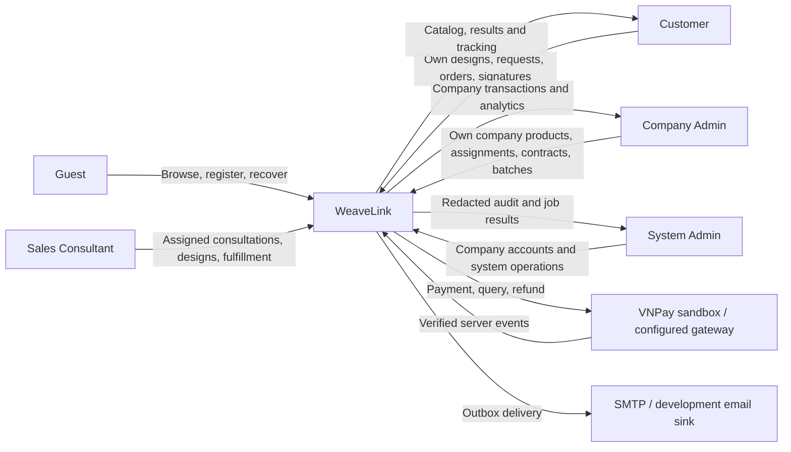

# System context

WeaveLink is a web platform for made-to-order garments, customer designs and paid design services. This revised context resolves inherited actor boundaries using [D01](../system-decisions.md). A company is a tenant; a customer may purchase from multiple companies, but one order belongs to one company.

Member denotes authenticated users, not an additional assignable role. Gateway/email are external actors; the worker executes trusted events and scheduled jobs. Production planning is internal; carrier and tracking data are staff-entered and no carrier API is assumed. See the [screen catalogue](../screen-list.md) for entry points.
