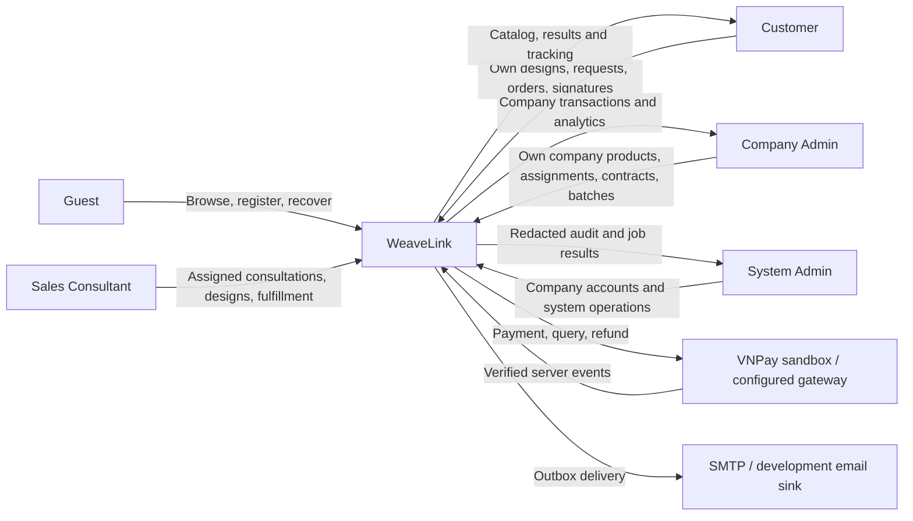

# Context Diagram

```mermaid
flowchart LR
    Guest["Guest"] -->|Browse, register, recover| Platform["WeaveLink"]
    Customer["Customer"] -->|Own designs, requests, orders, signatures| Platform
    Platform -->|Catalog, results and tracking| Customer
    Consultant["Sales Consultant"] -->|Assigned consultations, designs, fulfillment| Platform
    Admin["Company Admin"] -->|Own company products, assignments, contracts, batches| Platform
    Platform -->|Company transactions and analytics| Admin
    SystemAdmin["System Admin"] -->|Company accounts and system operations| Platform
    Platform -->|Redacted audit and job results| SystemAdmin
    Platform -->|Payment, query, refund| Gateway["VNPay sandbox / configured gateway"]
    Gateway -->|Verified server events| Platform
    Platform -->|Outbox delivery| Mail["SMTP / development email sink"]
```

Nodes found: 8

Arrows found: 11

Unreadable text: None.
