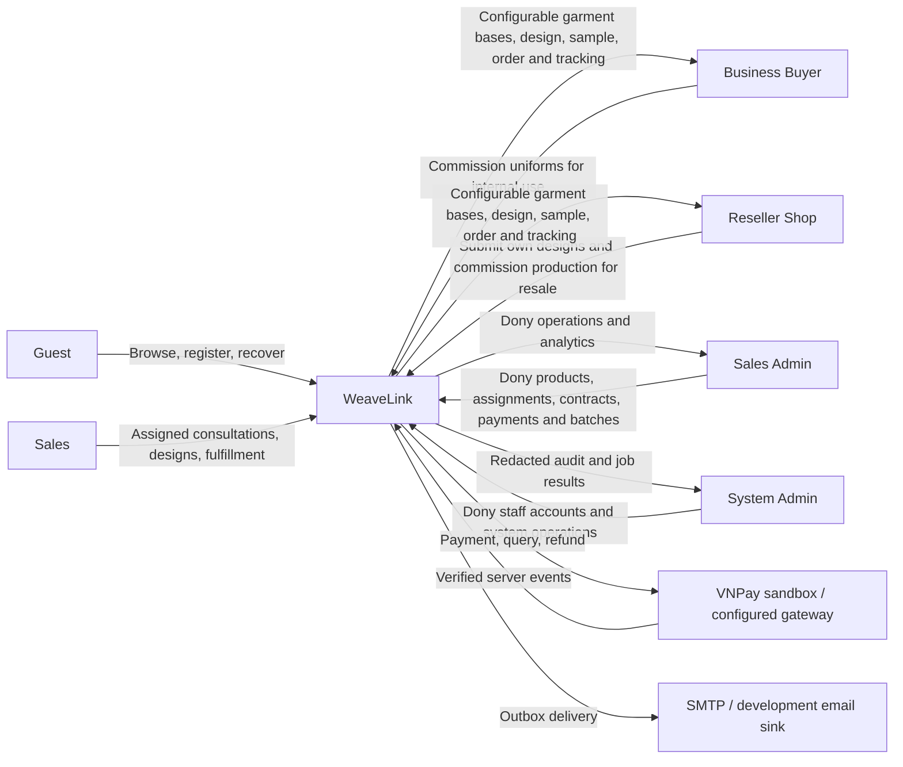

# Context Diagram

```mermaid
flowchart LR
    Guest["Guest"] -->|Browse, register, recover| Platform["WeaveLink"]
    Buyer["Business Buyer"] -->|Commission uniforms for internal use| Platform
    Reseller["Reseller Shop"] -->|Submit own designs and commission production for resale| Platform
    Platform -->|Configurable garment bases, design, sample, order and tracking| Buyer
    Platform -->|Configurable garment bases, design, sample, order and tracking| Reseller
    Consultant["Sales"] -->|Assigned consultations, designs, fulfillment| Platform
    Admin["Sales Admin"] -->|Dony products, assignments, contracts, payments and batches| Platform
    Platform -->|Dony operations and analytics| Admin
    SystemAdmin["System Admin"] -->|Dony staff accounts and system operations| Platform
    Platform -->|Redacted audit and job results| SystemAdmin
    Platform -->|Payment, query, refund| Gateway["VNPay sandbox / configured gateway"]
    Gateway -->|Verified server events| Platform
    Platform -->|Outbox delivery| Mail["SMTP / development email sink"]
```

Nodes found: 9

Arrows found: 13

Unreadable text: None.
