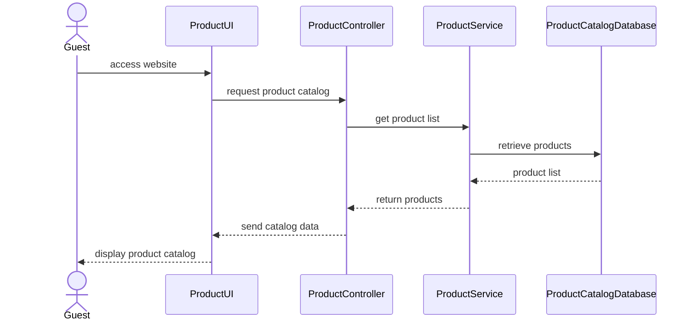
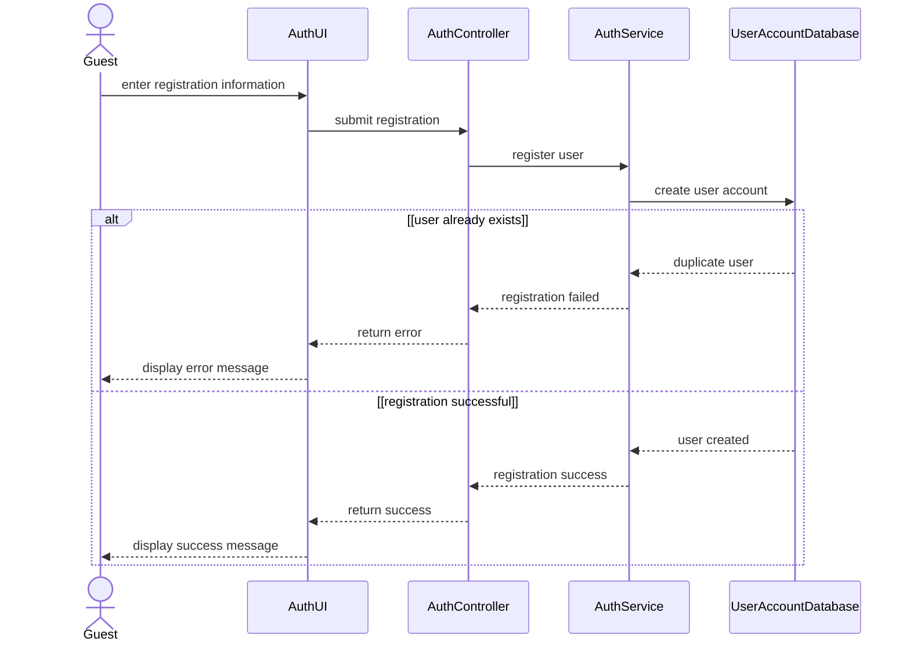
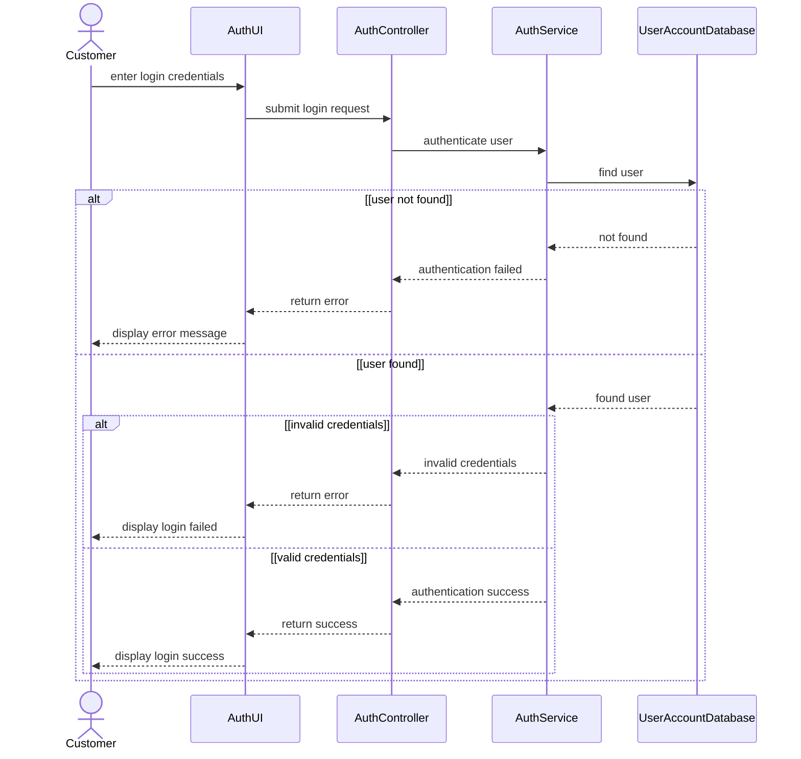
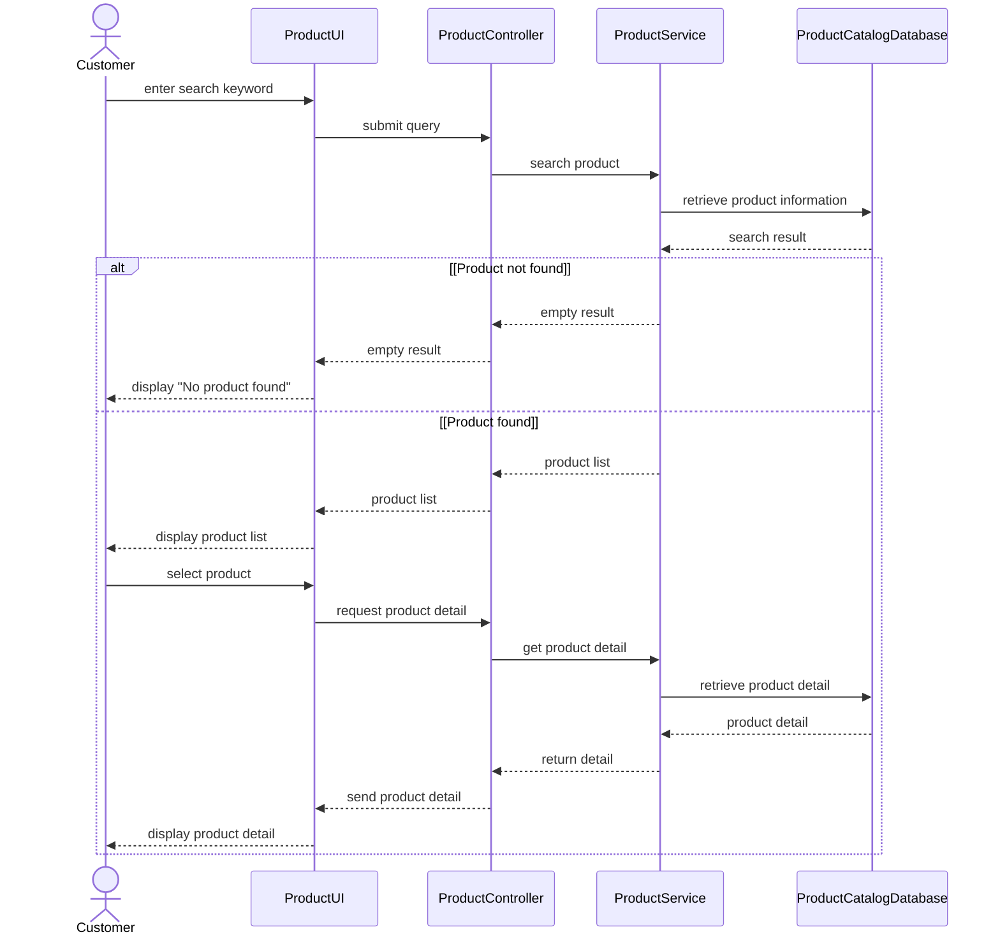
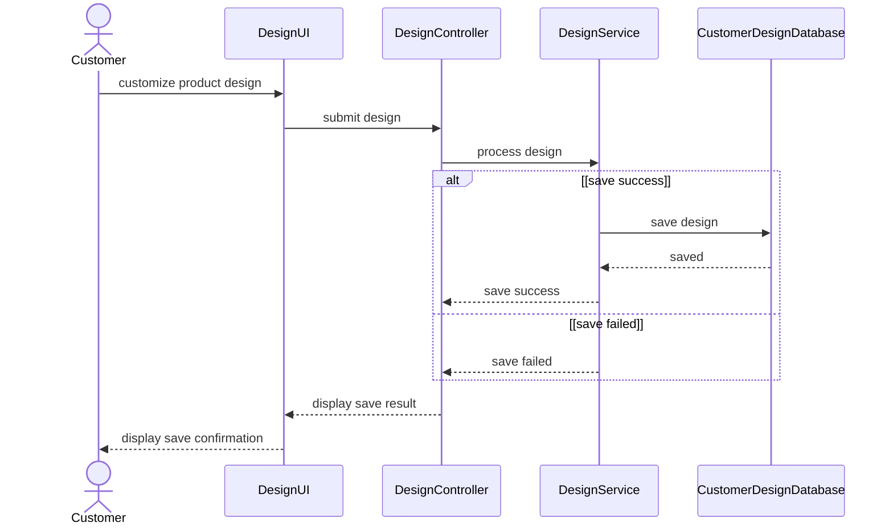
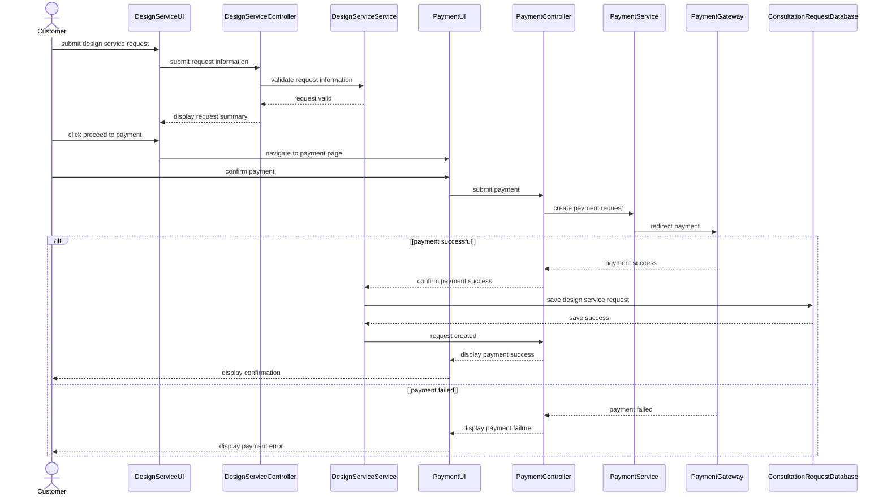
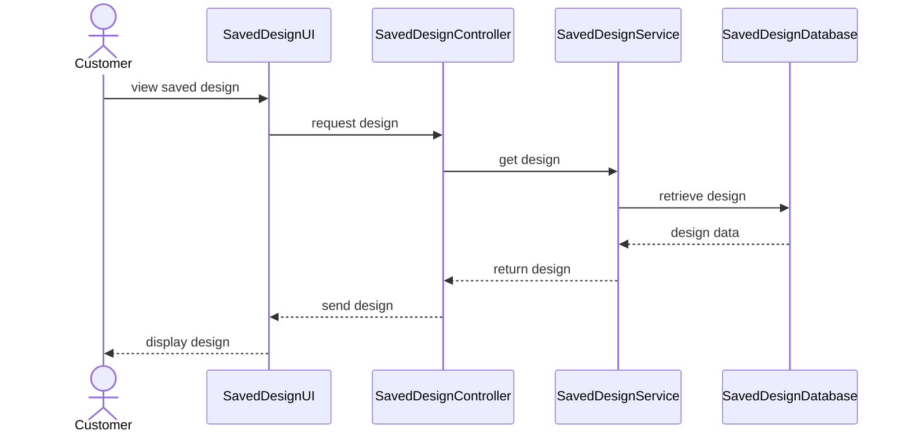
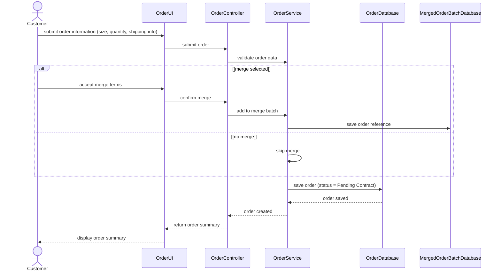
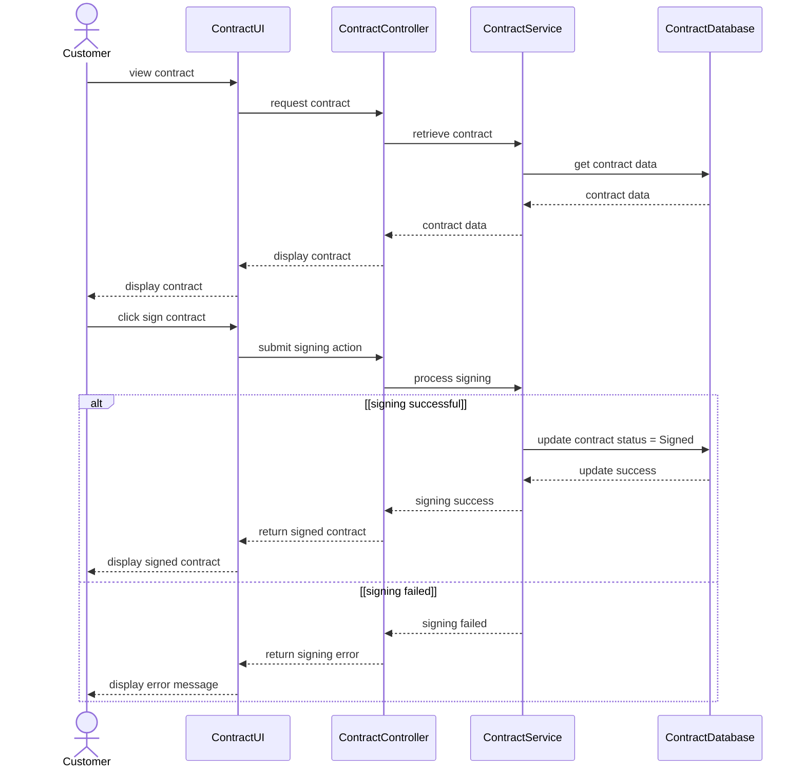
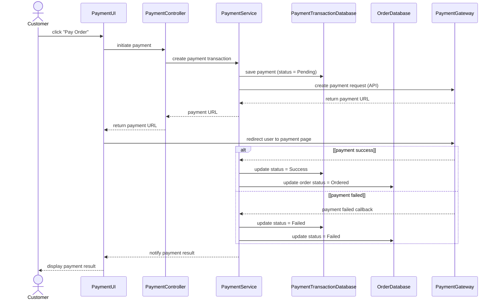

# SD-01: Browse Product Catalog (Guest)

# SD-02: Sign Up

# SD-03: Log In

# SD-04 – Search and View Product Detail

# SD-05A: Self Design Product

# SD-05B: Request Design Service

# SD-06: View Saved Design

# SD-07: Create Order

# SD-08: View and Sign Digital Contract

# SD-09: Make Order Payment

| Diagram | Participants | Arrows | Unreadable text |
|---|---:|---:|---|
| SD-01 | 5 | 8 | None |
| SD-02 | 5 | 12 | None |
| SD-03 | 5 | 15 | None |
| SD-04 | 5 | 19 | None |
| SD-05A | 5 | 9 | None |
| SD-05B | 9 | 21 | None |
| SD-06 | 5 | 8 | None |
| SD-07 | 6 | 13 | None |
| SD-08 | 5 | 19 | None |
| SD-09 | 7 | 17 | None |

The first return arrow in the `[payment success]` branch of SD-09 has no visible label in the source image.
