# UC-G01: View product catalog — SD-01: Browse Product Catalog (Guest)

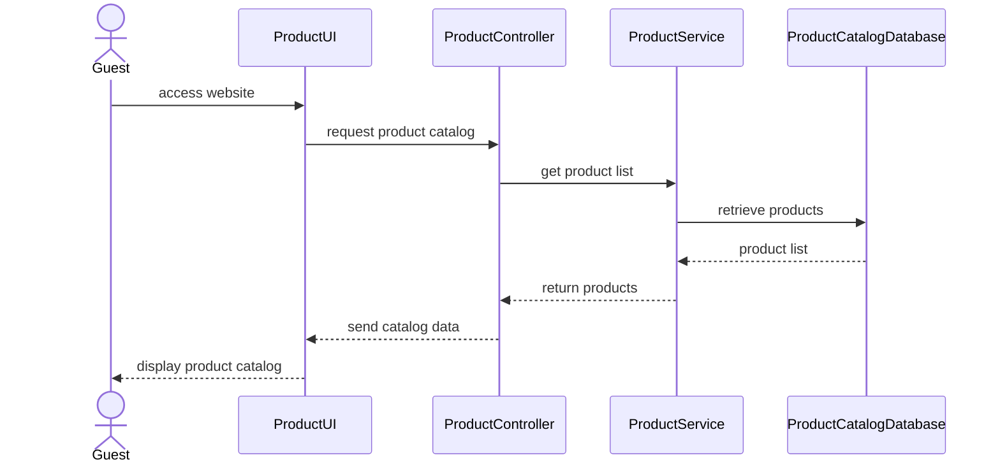

# UC-G03: Register account — SD-02: Sign Up

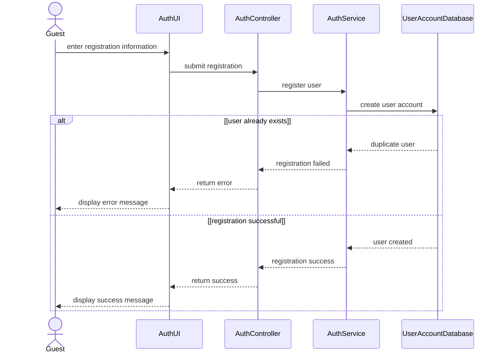

# UC-M01: Log in — SD-03: Log In

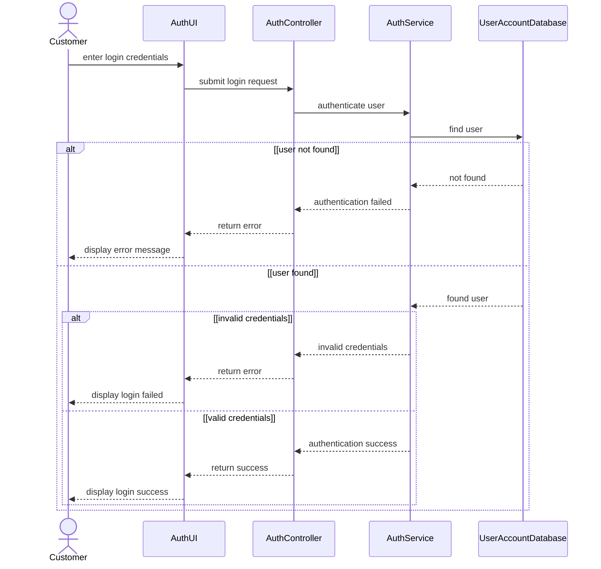

# UC-G02: Search products — SD-04 – Search and View Product Detail

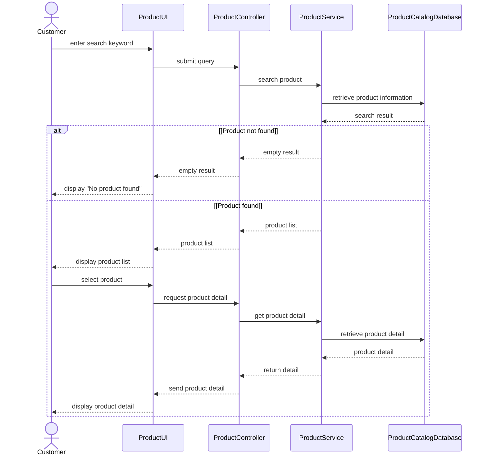

# UC-C02: Design product — SD-05A: Self Design Product

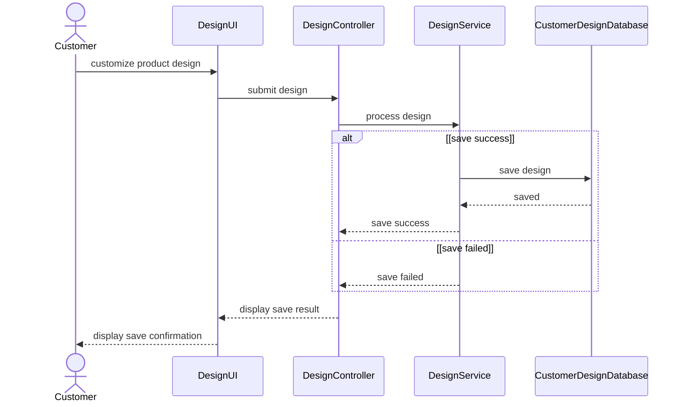

# UC-C04: Request design service — SD-05B: Request Design Service

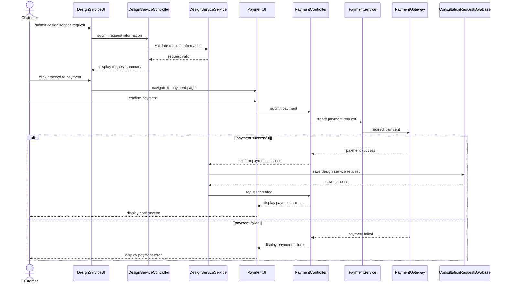

# UC-C03: View saved design — SD-06: View Saved Design

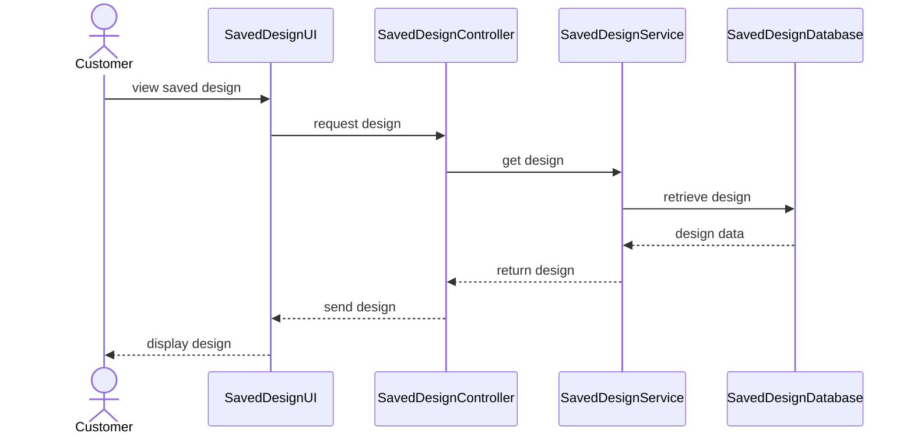

# UC-C05: Finalize order — SD-07: Create Order

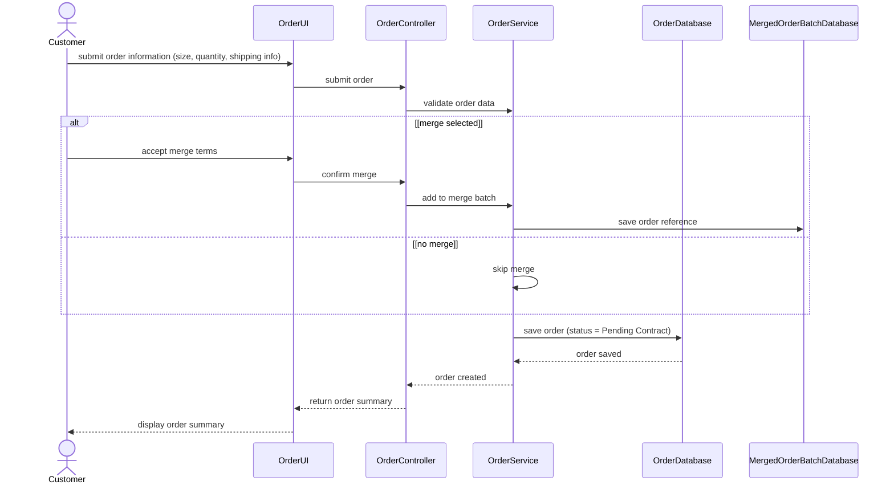

# UC-C09: View/Sign contract — SD-08: View and Sign Digital Contract

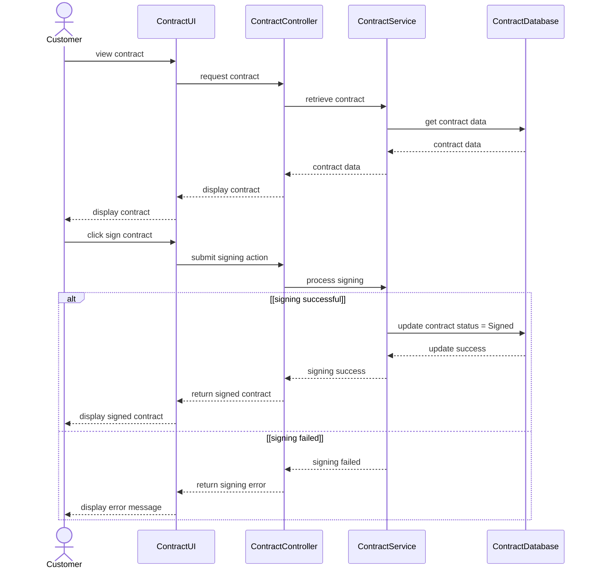

# UC-C12: Make payment — SD-09: Make Order Payment

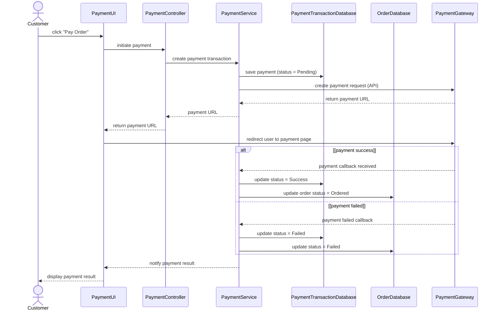

| Diagram | Participants | Arrows | Unreadable text |
|---|---:|---:|---|
| SD-01 | 5 | 8 | None |
| SD-02 | 5 | 12 | None |
| SD-03 | 5 | 15 | None |
| SD-04 | 5 | 19 | None |
| SD-05A | 5 | 9 | None |
| SD-05B | 9 | 21 | None |
| SD-06 | 5 | 8 | None |
| SD-07 | 6 | 13 | None |
| SD-08 | 5 | 19 | None |
| SD-09 | 7 | 17 | None |

The first return arrow in the `[payment success]` branch of SD-09 has no visible label in the source image.

# MFG-07: Track, cancel and fulfill order — SD-10

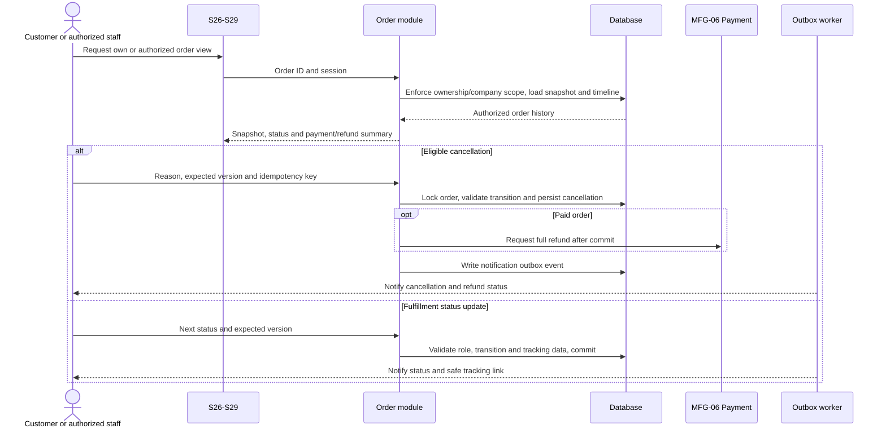

# MFG-08: Assign customer and manage consultation — SD-11

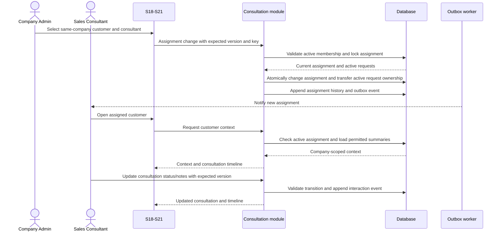

# MFG-10: Merge production and batch lifecycle — SD-12

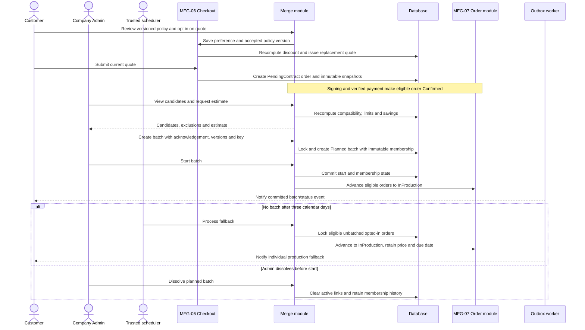

# MFG-11: Company analytics and export — SD-13

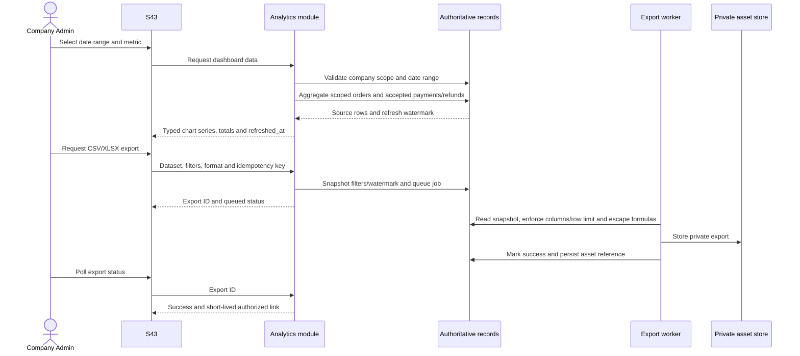

# MFG-12: System operations, backup, restore and configuration — SD-14

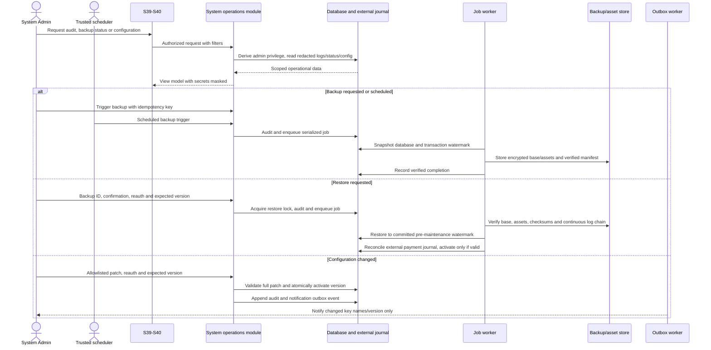
