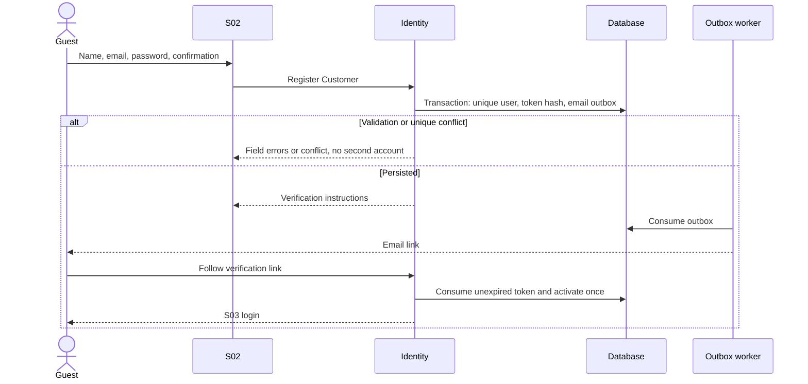
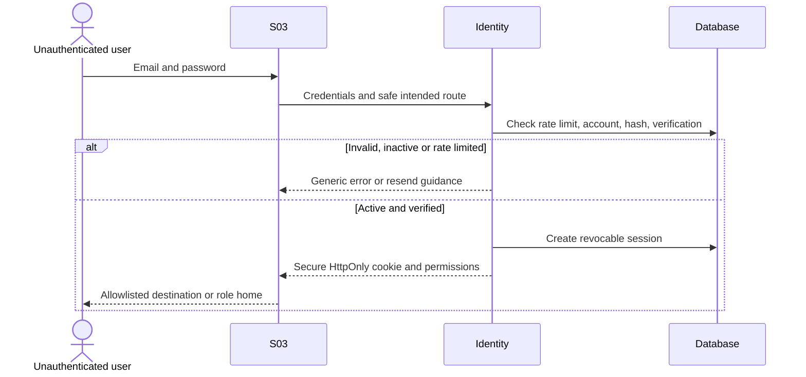
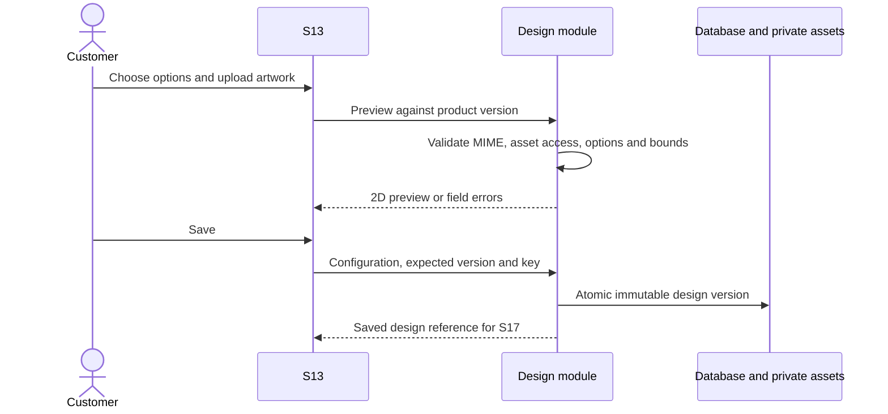
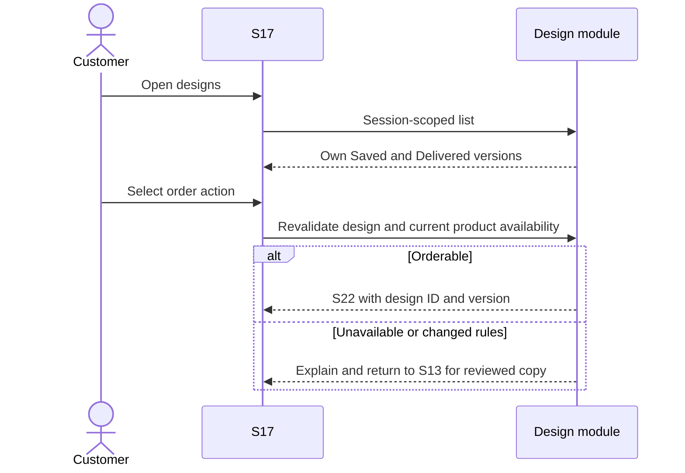

The ten inherited sequence IDs are retained. Authorization, validation, optimistic version checks, idempotency, and durable outbox behavior apply to every call. Error responses never commit partial business state. Internal participants are logical modules in one transactional backend.

# UC-G01: View product catalog — SD-01: Browse Product Catalog (Guest)

```mermaid
sequenceDiagram
    actor G as Guest
    participant UI as S08
    participant API as Catalog API
    participant DB as Database
    G->>UI: Open catalog
    UI->>API: Validated page, filters and sort
    API->>DB: Published products in active companies
    DB-->>API: Page plus total
    API-->>UI: Public product view models
    UI-->>G: Grid or empty state; retry on outage
```

# UC-G03: Register account — SD-02: Sign Up and Verify Email



Delivery failure is an outbox failure, not a failed account creation. Verification-link consumption uses S02's verification state, not a new undocumented screen.

# UC-M01: Log in — SD-03: Log In



# UC-G02: Search products — SD-04: Search and View Product Detail

```mermaid
sequenceDiagram
    actor U as Guest or customer
    participant UI as S08 and S09
    participant P as Product API
    U->>UI: Search and filters
    UI->>P: Validated search query
    P-->>UI: Published matches or empty list
    U->>UI: Select product UUID
    UI->>P: Get public product and rules
    alt Hidden, archived or inactive company
        P-->>UI: 404; back to S08
    else Available
        P-->>UI: Current product version and design options
    end
```

# UC-C02: Product Customization — SD-05A: Self Design Product



# UC-C04: Request design service — SD-05B: Request Design Service

```mermaid
sequenceDiagram
    actor C as Customer
    participant D as Design module
    participant P as Payment module
    participant A as Company Admin
    participant S as Assigned consultant
    C->>D: S15 valid requirements and deadline
    D->>D: Persist AwaitingPayment and fee snapshot
    D-->>C: Request ID for S16
    C->>P: Initiate SERVICE attempt
    P->>P: Verify gateway event and lock request
    alt Verified success before cancellation or expiry
        P->>D: Atomic Paid state and outbox
        D-->>A: Paid request notice
        A->>D: Assign consultant and committed due date
        S->>D: Start InProgress then deliver validated design
        D-->>C: Delivered version visible in S17
    else Failed attempt
        P-->>C: Retry while request active
    else Late funds for cancelled or expired request
        P->>P: Record received funds and full refund obligation
        P-->>C: Request unchanged; refund status
    end
```

# UC-C03: View saved design — SD-06: View Saved Design



# UC-C05: Finalize order — SD-07: Create Order

```mermaid
sequenceDiagram
    actor C as Customer
    participant UI as S22 to S25
    participant O as MFG-06 Checkout
    participant DB as Database
    C->>UI: Quantities, address, merge preference and policy consent
    UI->>O: Request server quote
    O->>O: Validate product, design, capacity and exact VND formula
    O->>DB: Immutable quote with 30-minute expiry
    O-->>UI: Complete price breakdown and policy snapshot
    C->>UI: Review and submit
    UI->>O: Quote ID, expected version, idempotency key
    O->>DB: Lock quote and revalidate expiry, ownership and versions
    alt Valid and unconsumed
        O->>DB: Atomic PendingContract order, snapshots and preference
        O-->>UI: Order ID; S27 waiting for contract
    else Replayed same submission
        O-->>UI: Existing order
    else Stale or changed
        O-->>UI: 409; requote and explicit review
    end
```

Checkout never creates a batch. Changing inputs creates a replacement quote; old quote is invalidated and never changes an already submitted order.

# UC-C09: View/Sign contract — SD-08: View and Sign Digital Contract

```mermaid
sequenceDiagram
    actor A as Company Admin
    actor C as Customer
    participant K as Contract module
    participant DB as Database and assets
    A->>K: Generate from order and template version
    K->>DB: Persist Draft and immutable source snapshot
    K->>K: Render and hash private PDF
    K->>DB: Ready only after PDF succeeds; ready outbox
    K-->>C: S34 notice
    C->>K: View current PDF, password reauthenticate
    K-->>C: One-time challenge bound to contract hash and version
    C->>K: Typed name, consent, challenge, expected version and key
    K->>DB: Lock current contract and order; consume challenge
    alt Valid current Ready version
        K->>DB: Atomic Signed evidence and AwaitingPayment order
        K-->>C: Signed receipt and S35 action
    else Stale, expired or invalid
        K-->>C: Error; preserve unsigned state
    end
```

Signed-notification dispatch happens after commit. Old unsigned versions may be Superseded; eligible cancellation makes the current contract Voided. A signed version is never revised in place.

# UC-C12: Make payment — SD-09: Make Order Payment

```mermaid
sequenceDiagram
    actor C as Customer
    participant UI as S35
    participant P as MFG-06 Payment
    participant V as VNPay
    participant DB as Database and durable journal
    C->>UI: Pay signed AwaitingPayment order
    UI->>P: Resource ID and idempotency key
    P->>DB: Validate snapshot; create or reuse Pending attempt
    P-->>UI: Hosted redirect URL
    UI->>V: Hosted payment
    par Server notification
        V->>P: Signed provider event
        P->>P: Verify merchant, reference, amount and signature
        P->>DB: Lock and deduplicate
        alt First valid success for active resource
            P->>DB: Succeeded payment, Confirmed order, outbox
        else Failed attempt
            P->>DB: Failed payment; order remains AwaitingPayment
        else Late or duplicate funds
            P->>DB: Record payment and refund obligation; no resurrection
        end
        P-->>V: Acknowledge only durable processing
    and Browser return
        V-->>UI: Return URL
        UI->>P: Fetch own persisted payment state
        P-->>UI: Processing, result or retry action
    end
```

A repeated callback for the same transaction has no second effect. Timeout triggers a provider query and redacted audit; a browser return or query result alone is not settlement. Both ORDER and SERVICE payments use the same VNPay 2.1.0 adapter with HMAC-SHA512 signing, integer VND amounts multiplied by 100 for `vnp_Amount`, verified server IPN, runtime credentials, and sandbox tests.

## Additional flow coverage

Company/staff provisioning, profile edits, product publishing, consultation updates, batch confirmation/dissolution, analytics/export and backup/restore are specified by the respective module flows and acceptance scenarios. They do not reuse legacy sequence IDs misleadingly. Traceability: [function catalogue](../function-list.md), [49 use cases](use-case.md), [43 screens](../screen-list.md).
