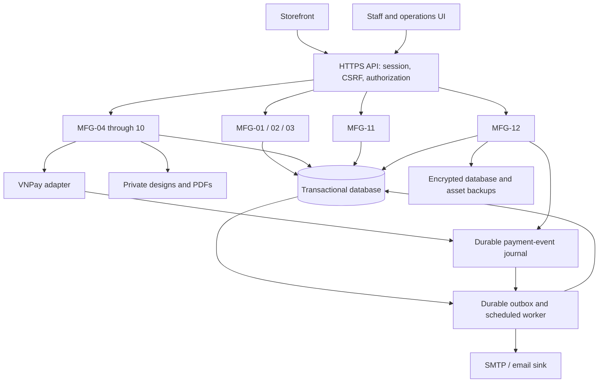

# System configuration and data ownership

Target a modular web application, one transactional relational database, private asset storage and a background worker. DBIZ2 service boxes are logical boundaries; independent microservices are not required. The coding agent may select frontend/backend technology without changing [shared contracts](../system-decisions.md).

## Preserved information-file identifiers

| ID | Canonical contents | Owner / access |
|---|---|---|
| ILF-01 | User, Company, Membership, Session, hashed verification/reset/invitation tokens | MFG-01/02/03; restricted identity service |
| ILF-02 | Product, versioned design rules, options and capacity | MFG-04; Published subset public |
| ILF-03 | Design versions and asset references | MFG-05; owner and authorized staff |
| ILF-04 | CheckoutDraft and Quote | MFG-06; owner; never authoritative after submission |
| ILF-05 | Order snapshots, transitions and fulfillment | MFG-06/07; owner and authorized staff |
| ILF-06 | PaymentTransaction, refund and reconciliation | MFG-06; own result or same-company admin |
| ILF-07 | DesignRequest, Consultation, Assignment, internal notes | MFG-05/08; scoped staff; own request projection for customer |
| ILF-08 | Contract versions and signature evidence | MFG-09; parties only |
| ILF-09 | MergeBatch and membership history | MFG-10; company admin; per-order customer projection |
| ILF-10 | Typed versioned configuration, secret references | MFG-12; System Admin |
| ILF-11 | Append-only redacted audit | MFG-12; System Admin |
| ILF-13 | Versioned contract templates | MFG-09; Company Admin |
| ILF-14 | Backup/restore manifest, checksums and jobs | MFG-12; System Admin |

The inherited numbering has no ILF-12; do not renumber. Notification/outbox and export jobs are supporting tables, not fabricated legacy ILF entries. Aggregates derive from authoritative transactions by company and watermark. Payment-event/restore audit journals live outside restored snapshots to avoid forgetting provider effects.

## Transactions and availability

Order creation plus quote consumption/preference, signing plus order transition, settlement plus resource transition, and batch execution plus memberships each commit atomically. Side effects use durable jobs/outbox. Contract stays Draft until its PDF exists. Callback acknowledgement follows durable commit; a database failure is not acknowledged as success. Reconciliation is retryable and ordered per resource.

Use TLS, private storage, authorization on every object and secrets outside Git. Seed visibly labelled fake company/customer records in development. A one-time deployment bootstrap command creates the initial System Admin with runtime-supplied credentials; never a public endpoint or committed default password. Subsequent staff provisioning follows D01.

## Future application delivery checks

Unit tests: state guards and integer pricing. Integration tests: tenancy, sessions/CSRF, idempotent outbox/callbacks, transactional workflows and restore reconciliation. End-to-end tests: both design routes, paid service delivery, checkout, signing, failed-payment retry, cancellation/refund and merge production. Sandbox tests follow the [VNPay contract](../integrations/vnpay.md). Application source/build does not yet exist; current documentation checks are in [validation report](../validation-report.md).
