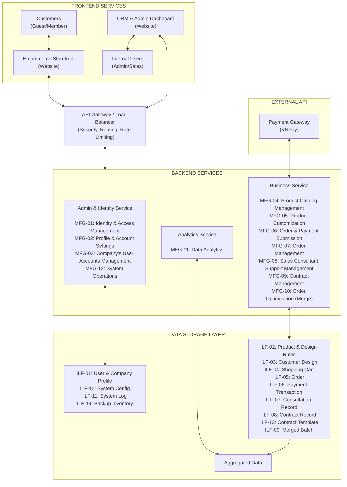

# 1.3b System Overall Configuration

This system provides services via the Web in a client-server format.

```mermaid
flowchart TD
    subgraph FrontendServices[FRONTEND SERVICES]
        Customers["Customers<br/>(Guest/Member)"]
        Storefront["E-commerce Storefront<br/>(Website)"]
        CRM["CRM & Admin Dashboard<br/>(Website)"]
        InternalUsers["Internal Users<br/>(Admin/Sales)"]
        Customers <--> Storefront
        CRM <--> InternalUsers
    end

    APIGateway["API Gateway / Load Balancer<br/>(Security, Routing, Rate Limiting)"]

    subgraph ExternalAPI[EXTERNAL API]
        PaymentGateway["Payment Gateway<br/>(VNPay)"]
    end

    subgraph BackendServices[BACKEND SERVICES]
        AdminIdentity["Admin & Identity Service<br/><br/>MFG-01: Identity & Access Management<br/>MFG-02: Profile & Account Settings<br/>MFG-03: Company's User Accounts Management<br/>MFG-12: System Operations"]
        AnalyticService["Analytics Service<br/><br/>MFG-11: Data Analytics"]
        BusinessService["Business Service<br/><br/>MFG-04: Product Catalog Management<br/>MFG-05: Product Customization<br/>MFG-06: Order & Payment Submission<br/>MFG-07: Order Management<br/>MFG-08: Sales Consultant Support Management<br/>MFG-09: Contract Management<br/>MFG-10: Order Optimization (Merge)"]
    end

    subgraph DataStorageLayer[DATA STORAGE LAYER]
        UserCompanyProfile["ILF-01: User & Company Profile<br/>ILF-10: System Config<br/>ILF-11: System Log<br/>ILF-14: Backup Inventory"]
        AggregatedData["Aggregated Data"]
        BusinessData["ILF-02: Product & Design Rules<br/>ILF-03: Customer Design<br/>ILF-04: Shopping Cart<br/>ILF-05: Order<br/>ILF-06: Payment Transaction<br/>ILF-07: Consultation Record<br/>ILF-08: Contract Record<br/>ILF-13: Contract Template<br/>ILF-09: Merged Batch"]
    end

    Storefront <--> APIGateway
    CRM <--> APIGateway
    APIGateway <--> BackendServices
    PaymentGateway <--> BusinessService
    AdminIdentity <--> UserCompanyProfile
    AnalyticService <--> AggregatedData
    BusinessService <--> BusinessData
    BusinessData --> AggregatedData
```

Nodes found: 12

Arrows found: 17

Unreadable text: None.
