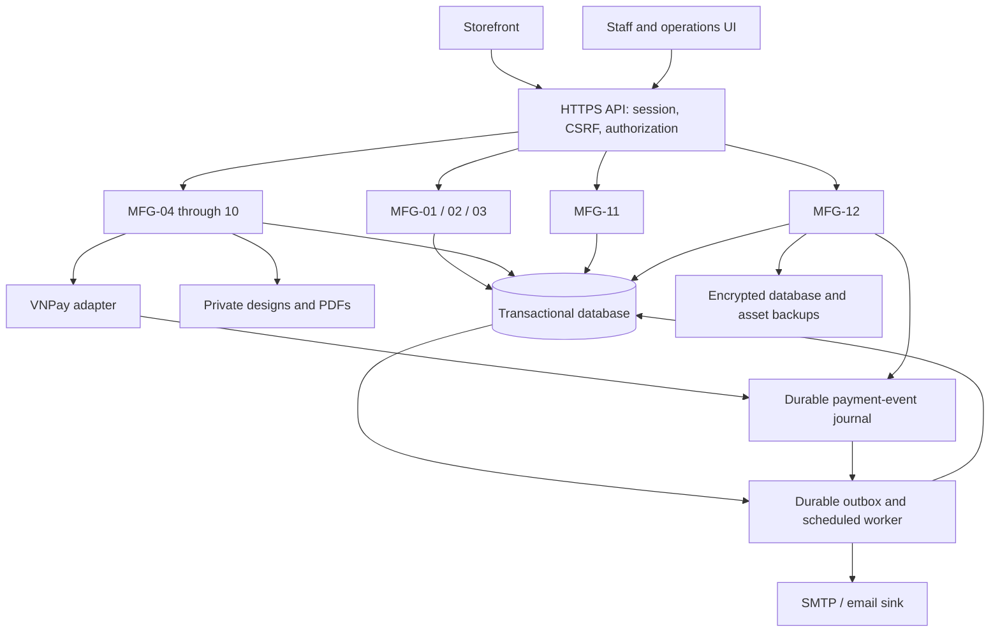

# 1.3b System Overall Configuration

This system provides services via the Web in a client-server format. The diagram shows logical boundaries; they may be deployed as one modular application.

Nodes found: 15

Arrows found: 18

Unreadable text: None.
