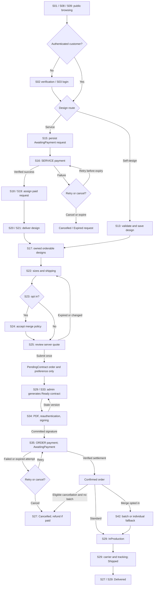

```mermaid
flowchart TD
    Browse["S01 / S08 / S09: public browsing"] --> Auth{"Authenticated customer?"}
    Auth -->|No| Login["S02 verification / S03 login"]
    Login --> Choice
    Auth -->|Yes| Choice{"Design route"}
    Choice -->|Self-design| Editor["S13: validate and save design"]
    Choice -->|Service| Request["S15: persist AwaitingPayment request"]
    Request --> ServicePay["S16: SERVICE payment"]
    ServicePay -->|Verified success| Assign["S18 / S19: assign paid request"]
    ServicePay -->|Failure| ServiceRetry{"Retry or cancel?"}
    ServiceRetry -->|Retry before expiry| ServicePay
    ServiceRetry -->|Cancel or expire| ServiceEnd["Cancelled / Expired request"]
    Assign --> Delivery["S20 / S21: deliver design"]
    Delivery --> Designs["S17: owned orderable designs"]
    Editor --> Designs
    Designs --> OrderInput["S22: sizes and shipping"]
    OrderInput --> Merge{"S23: opt in?"}
    Merge -->|Yes| Policy["S24: accept merge policy"]
    Policy --> Review["S25: review server quote"]
    Merge -->|No| Review
    Review -->|Expired or changed| OrderInput
    Review -->|Submit once| Persist["PendingContract order and preference only"]
    Persist --> Contract["S29 / S33: admin generates Ready contract"]
    Contract --> Sign["S34: PDF, reauthentication, signing"]
    Sign -->|Stale version| Contract
    Sign -->|Committed signature| Pay["S35: ORDER payment; AwaitingPayment"]
    Pay -->|Failed or expired attempt| Retry{"Retry or cancel?"}
    Retry -->|Retry| Pay
    Retry -->|Cancel| Cancel["S27: Cancelled; refund if paid"]
    Pay -->|Verified settlement| Confirmed["Confirmed order"]
    Confirmed -->|Eligible cancellation and no batch| Cancel
    Confirmed -->|Merge opted in| Batch["S42: batch or individual fallback"]
    Confirmed -->|Standard| Production["S29: InProduction"]
    Batch --> Production
    Production --> Shipped["S29: carrier and tracking; Shipped"]
    Shipped --> Delivered["S27 / S29: Delivered"]
```

Nodes found: 29

Arrows found: 35

Unreadable text: None.
