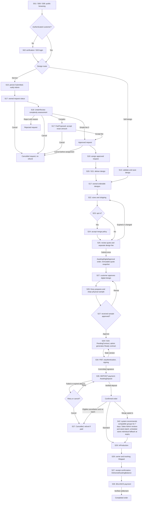

```mermaid
flowchart TD
    Browse["S01 / S08 / S09: public browsing"] --> Auth{"Authenticated customer?"}
    Auth -->|No| Login["S02 verification / S03 login"]
    Login --> Choice
    Auth -->|Yes| Choice{"Design route"}
    Choice -->|Self-design| Editor["S13: validate and save design"]
    Choice -->|Service| Request["S15: persist Submitted; notify Admin"]
    Request --> Status["S17: owned request status"]
    Status --> Assessment["S18: UnderReview complexity assessment"]
    Assessment -->|Simple fee 0| Approved["Approved request"]
    Assessment -->|Complex| Proposal["S17: FeeProposed; accept exact amount"]
    Proposal -->|Accept fee| Approved
    Assessment -->|Reject with reason| Rejected["Rejected request"]
    Status -->|Cancel| ServiceEnd["Cancelled request; no refund"]
    Assessment -->|Cancel| ServiceEnd
    Proposal -->|Cancel| ServiceEnd
    Approved -->|Cancel before assignment| ServiceEnd
    Approved --> Assign["S19: assign approved request"]
    Assign --> Delivery["S20 / S21: deliver design"]
    Delivery --> Designs["S17: owned orderable designs"]
    Editor --> Designs
    Designs --> OrderInput["S22: sizes and shipping"]
    OrderInput --> Merge{"S23: opt in?"}
    Merge -->|Yes| Policy["S24: accept merge policy"]
    Policy --> Review["S25: review quote and separate design fee"]
    Merge -->|No| Review
    Review -->|Expired or changed| OrderInput
    Review -->|Submit once| Persist["AwaitingDigitalApproval order; immutable quote snapshot"]
    Persist --> Digital["S27: customer approves digital design"]
    Digital --> Sample["S29: Dony prepares and ships physical sample"]
    Sample --> SampleDecision{"S27: received sample approved?"}
    SampleDecision -->|Revise| Digital
    SampleDecision -->|Approve| Contract["S29 / S33: PendingContract; admin generates Ready contract"]
    Contract --> Sign["S34: PDF, reauthentication, signing"]
    Sign -->|Stale version| Contract
    Sign -->|Committed signature| Deposit["S35: DEPOSIT payment; AwaitingDeposit"]
    Deposit -->|Failed or expired attempt| Retry{"Retry or cancel?"}
    Retry -->|Retry| Deposit
    Retry -->|Cancel| Cancel["S27: Cancelled; refund if paid"]
    Deposit -->|Verified deposit| Confirmed["Confirmed order"]
    Confirmed -->|Eligible cancellation and no batch| Cancel
    Confirmed -->|Merge opted in| Batch["S42: system recommends compatible groups for 7 days; Sales Admin reviews and starts batch; scheduler starts individual fallback at expiry"]
    Confirmed -->|Standard| Production["S29: InProduction"]
    Batch --> Production
    Production --> Shipped["S29: carrier and tracking; Shipped"]
    Shipped --> Received["S27: receipt confirmation; DeliveredAwaitingBalance"]
    Received --> Balance["S35: BALANCE payment"]
    Balance -->|Verified settlement| Completed["Completed order"]
```

Nodes found: 30

Arrows found: 41

Unreadable text: None.
