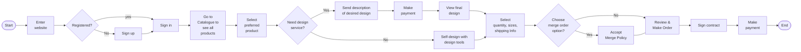

```mermaid
flowchart LR
    Start([Start])
    EnterWebsite["Enter<br/>website"]
    Registered{"Registered?"}
    SignUp["Sign up"]
    SignIn["Sign in"]
    Catalogue["Go to<br/>Catalogue to<br/>see all<br/>products"]
    PreferredProduct["Select<br/>preferred<br/>product"]
    DesignService{"Need design<br/>service?"}
    SendDescription["Send description<br/>of desired design"]
    DesignPayment["Make<br/>payment"]
    ViewFinalDesign["View final<br/>design"]
    SelfDesign["Self-design with<br/>design tools"]
    SelectOrder["Select<br/>quantity, sizes,<br/>shipping Info"]
    MergeOrder{"Choose<br/>merge order<br/>option?"}
    AcceptMerge["Accept<br/>Merge Policy"]
    ReviewOrder["Review &<br/>Make Order"]
    SignContract["Sign contract"]
    OrderPayment["Make<br/>payment"]
    End([End])

    Start --> EnterWebsite
    EnterWebsite --> Registered
    Registered -->|No| SignUp
    Registered -->|yes| SignIn
    SignUp --> SignIn
    SignIn --> Catalogue
    Catalogue --> PreferredProduct
    PreferredProduct --> DesignService
    DesignService -->|Yes| SendDescription
    DesignService -->|No| SelfDesign
    SendDescription --> DesignPayment
    DesignPayment --> ViewFinalDesign
    ViewFinalDesign --> SelectOrder
    SelfDesign --> SelectOrder
    SelectOrder --> MergeOrder
    MergeOrder -->|Yes| AcceptMerge
    MergeOrder -->|No| ReviewOrder
    AcceptMerge --- ReviewOrder
    ReviewOrder --> SignContract
    SignContract --> OrderPayment
    OrderPayment --> End
```

Nodes found: 19

Arrows found: 20 (plus 1 connector without a visible arrowhead)

Unreadable text: None.
