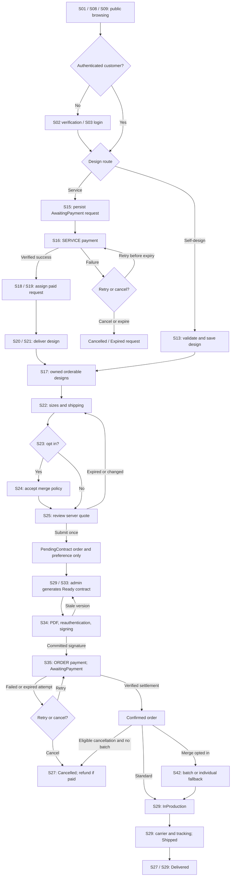

# End-to-end usage flow

Implementation flow revised 2026-09-19 under [system decisions](../system-decisions.md). Retains the DBIZ2 journey while resolving persistence, payment and merge boundaries. See the [screen catalogue](../screen-list.md) for routes.

Server guards D05..D09 control transitions. Browser redirects, email delivery and display labels never change business state independently. Customers reopen orders in S26/S27 while awaiting admin contract generation; generation failure leaves PendingContract visible and retryable by admin. Signing failure without a stale version stays S34 and preserves consent input safely.

## Staff and operations paths

- Company Admin: S10 -> S11/S12/S14 for products; S18 -> S19 for assignments; S28 -> S29 -> S33 for contracts; S30 -> S31/S32 for templates; S36 -> S37 for reconciliation/refunds; S42 for batches; S43 for analytics/export.
- Sales Consultant: S20 -> S21 for assigned consultations and design delivery; S28/S29 expose only assigned customer orders and fulfillment actions.
- System Admin: S41 for companies/staff; S39 for configuration/backup/restore; S40 for redacted audit logs.
- All authenticated roles: S06 profile, S07 password, S38 notifications. Recovery enters S04/S05 before login.
