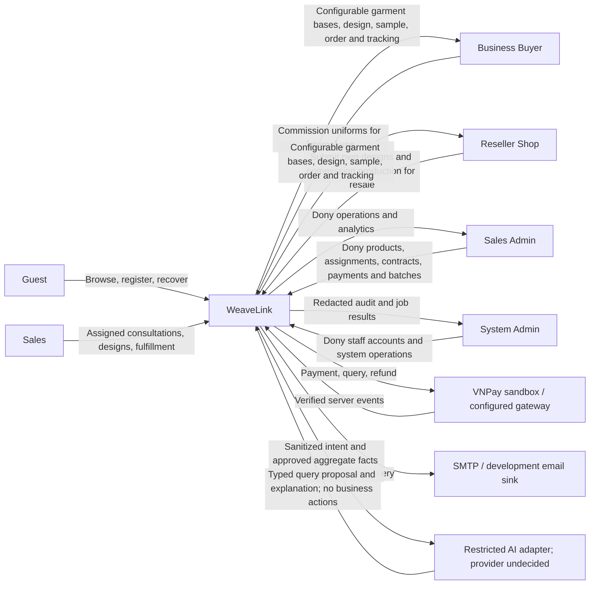

# Context Diagram

Nodes found: 10

Arrows found: 15

Unreadable text: None.

The AI provider/model is chosen and configured at Plan under MFG-11 I-01; its product data boundary and page-memory-only conversation policy are already defined in MFG-11 5.7. It has no direct database or business-action access. Sales Admin alone accesses commercial analytics; System Admin receives redacted operational diagnostics.

Guest catalog browsing remains public but emits no analytics behavior events. Only authenticated Customer interactions and authoritative customer-linked business events feed MFG-11; no guest-to-login identity integration is introduced.
