# UC-G01: View product catalog — SD-01: Browse Product Catalog (Guest)

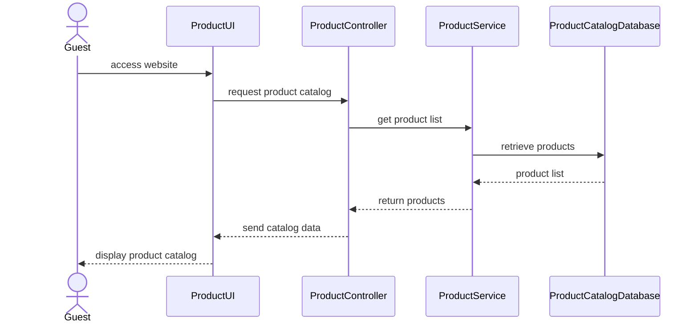

# UC-G03: Register account — SD-02: Sign Up

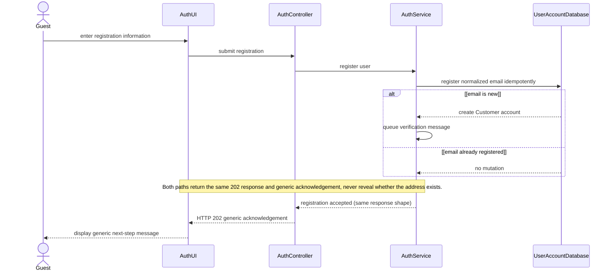

# UC-M01: Log in — SD-03: Log In

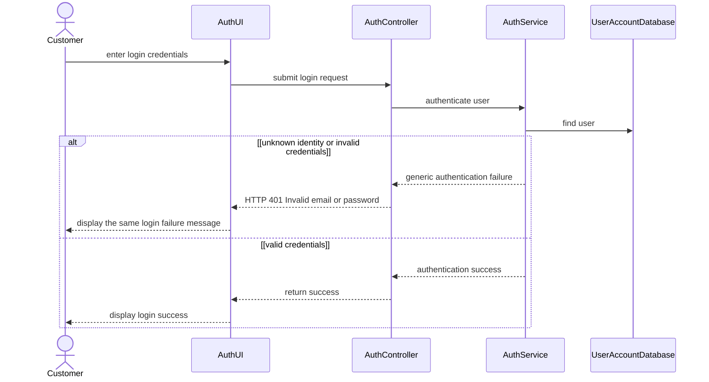

# UC-G02: Search products — SD-04: Search and View Product Detail

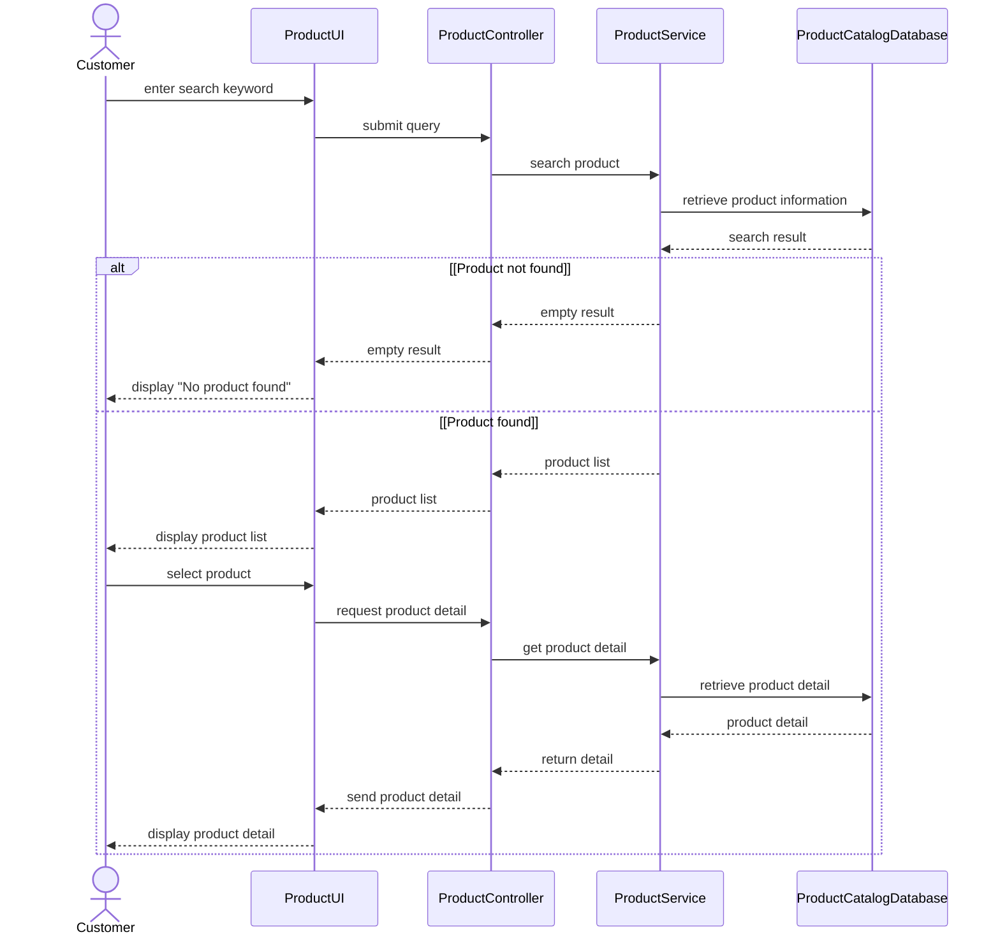

## UC-G02 extension: Product Finder (MFG-04/F-PROD-012, Should)

The Must full-search flow above remains available. When enabled, suggestions and paginated results share the matching rules in [MFG-04 sections 5.3–5.4](../../specs/spec-MFG-04.md#53-keyword-matching-model-f-prod-012) and [S08](../../screens/S08-product_catalog_screen.md). Physical index storage is a Plan decision. No search analytics are introduced.

```mermaid
sequenceDiagram
    actor Buyer as Guest/Member
    participant S08
    participant SearchService
    participant Catalogue
    Buyer->>S08: focus empty field or type query
    S08->>SearchService: settled q and active scope/filters
    SearchService->>SearchService: validate q <=100 and allowlisted constraints
    alt invalid input
        SearchService-->>S08: 400/422; preserve input, no broader search
    else valid input
        SearchService->>Catalogue: current Published/version-eligible candidate data
        Catalogue-->>SearchService: public products under active constraints
        alt trimmed query empty
            SearchService-->>S08: at most 4 featured products
        else keyword entered
            SearchService->>SearchService: normalise and match all query tokens; rank
            SearchService-->>S08: at most 10 matches, total count, stored attribute reasons
            S08-->>Buyer: four visible rows or labelled no-match alternatives
        end
        S08->>S08: discard responses for previous query/filter state
        Buyer->>S08: choose product or full results
        Note over S08,Catalogue: S09 rechecks Published status; full S08 search keeps query/filters
    end
```
# UC-C02: Design product — SD-05A: Self Design Product

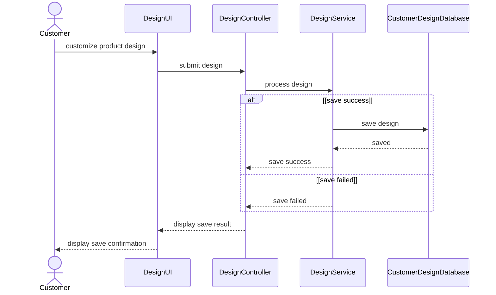

# UC-C04: Request design service — SD-05B: Request Design Service

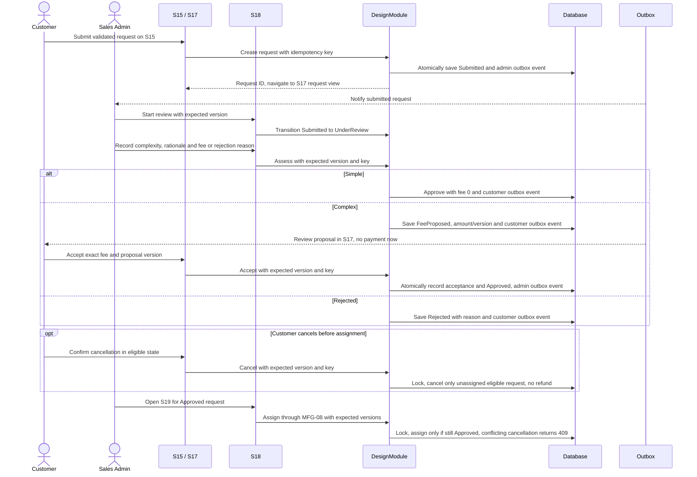

# UC-C03: View saved design — SD-06: View Saved Design

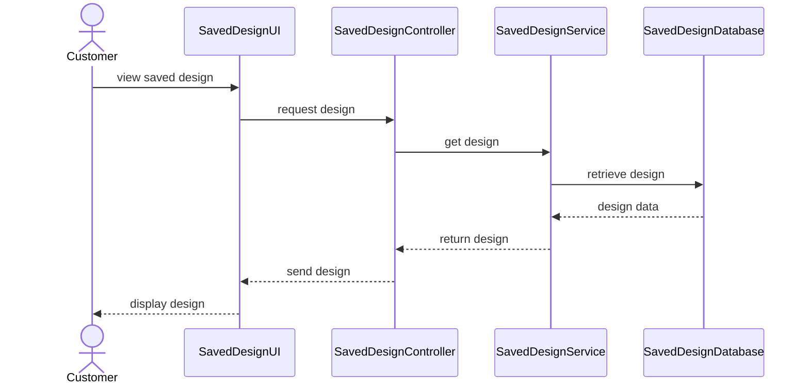

# UC-C05: Finalize order — SD-07: Create Order

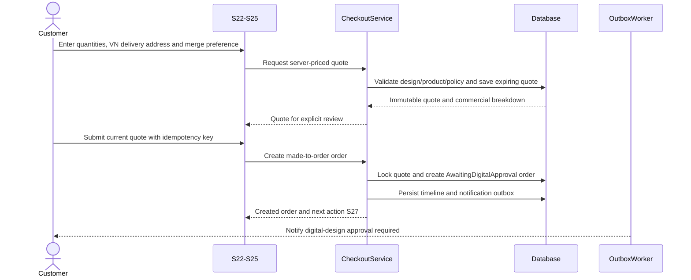

# UC-C09: View/Sign contract — SD-08: View and Sign Digital Contract

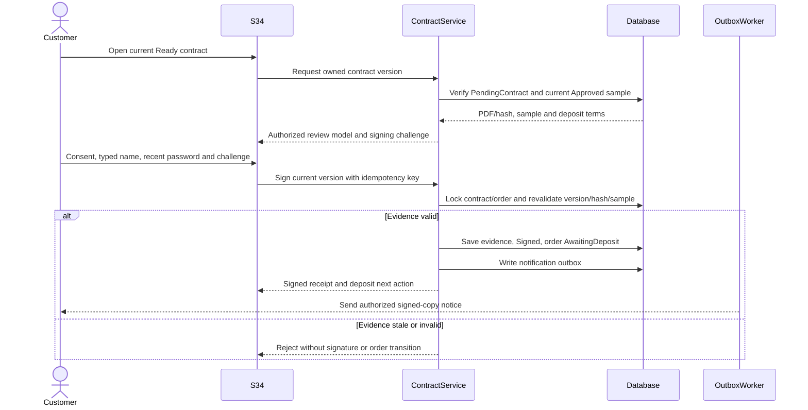

# UC-C12: Make payment — SD-09: Pay Deposit or Remaining Balance

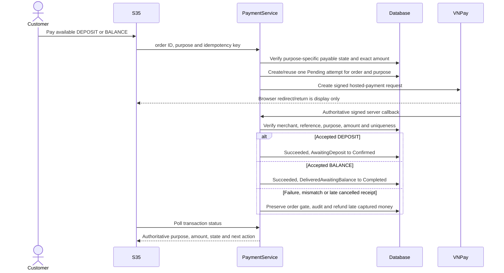

| Diagram | Participants | Arrows | Unreadable text |
|---|---:|---:|---|
| SD-01 | 5 | 8 | None |
| SD-02 | 5 | 12 | None |
| SD-03 | 5 | 15 | None |
| SD-04 | 5 | 19 | None |
| SD-05A | 5 | 9 | None |
| SD-05B | 7 | 22 | None |
| SD-06 | 5 | 8 | None |
| SD-07 | 5 | 11 | None |
| SD-08 | 5 | 13 | None |
| SD-09 | 5 | 13 | None |

# MFG-07: Track, cancel and fulfill order — SD-10

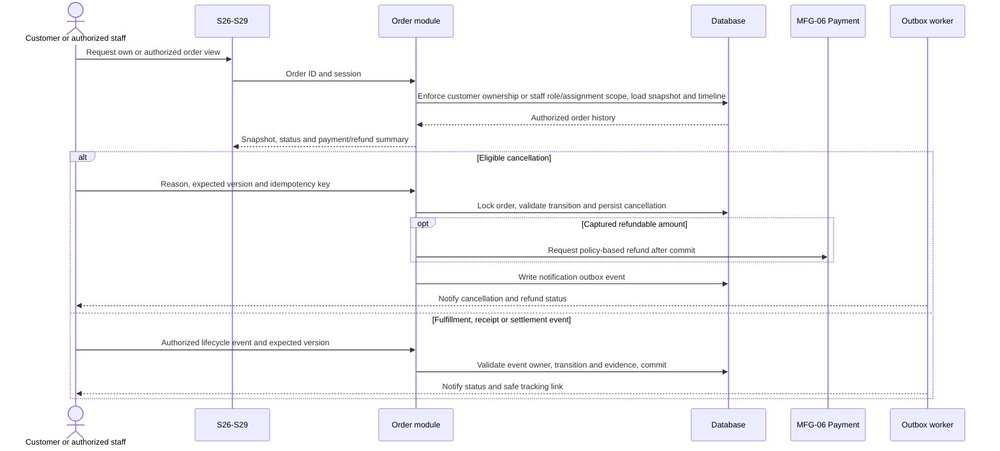

# MFG-08: Assign customer and manage consultation — SD-11

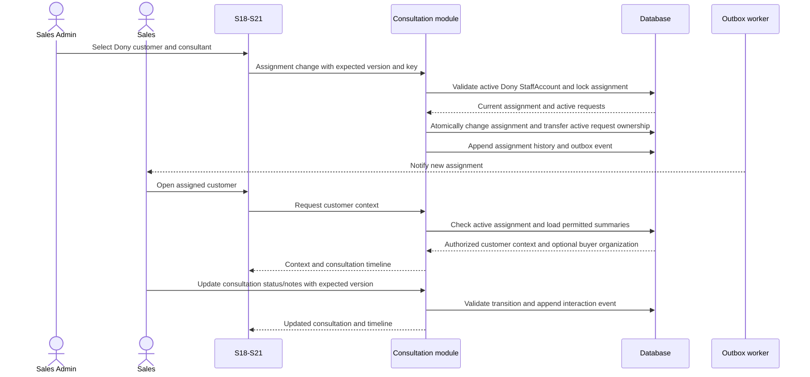

# MFG-10: Merge production and batch lifecycle — SD-12

```mermaid
sequenceDiagram
    actor Customer
    actor Admin as Sales Admin
    participant Checkout as MFG-06
    participant Merge as MFG-10
    participant Order as MFG-07
    participant Scheduler
    Customer->>Checkout: Choose standard or offered flexible terms and policy
    Checkout->>Checkout: Check materials/capacity, snapshot price and readiness-based terms
    Note over Checkout,Order: Design/sample approval, contract signing and deposit establish production_ready_at
    Order->>Merge: Ready Confirmed order; derive day-7 wait and separate 8-14-day production dates
    Merge-->>Admin: Existing open run first, otherwise flexible group or individual plan
    Admin->>Merge: Approve schedule/addition with expected versions
    Merge->>Merge: Persist exclusively assigned sewing membership and approved schedule
    Note over Merge,Order: Scheduled assignment is not InProduction
    Admin->>Merge: Lock membership, then explicitly start on schedule
    Merge->>Order: Atomically advance all locked members to InProduction
    alt Flexible waiting deadline without approved feasible placement
        Scheduler->>Merge: Detect expiry; send deduplicated approval-required notice
        Admin->>Merge: Review; approve individual plan and explicitly start
        Merge->>Order: Advance only after explicit human approval/start
    end
    Note over Customer,Order: Preserve each customer's price, deadline and private order tracking
```

# MFG-11: Dony analytics, funnel and matching export — SD-13

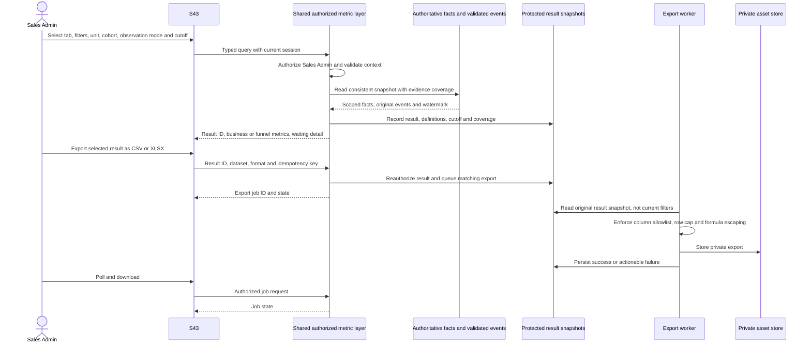

When the original snapshot cannot be reproduced, export fails explicitly instead of substituting current data. Interaction evidence cannot settle orders; committed timeline/outbox events are projected idempotently. MFG-11 5.3 owns resolved authenticated product-entry/intent/order formulas and coverage; 5.7 owns 12-month reporting and seven-day result/export lifetimes. Guest views are neither collected nor replayed at login.

# MFG-11: Grounded prompt analysis — SD-13A

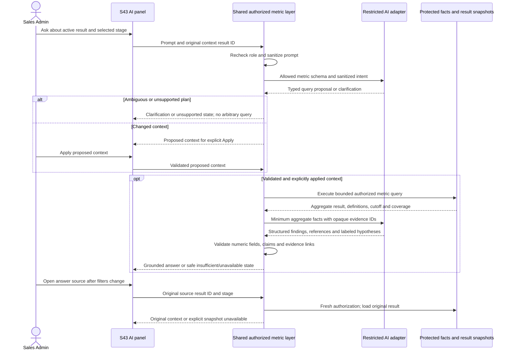

For unchanged valid context, the existing applied dashboard context satisfies the Apply condition. Model failure does not disable deterministic charts or exports. Provider/model selection and runtime limits remain Plan item I-01; the product retention rules are resolved in MFG-11 5.7. No external provider or direct model database access is implied. Prompt/answer conversation is transient processing plus memory in the active page, not a persistent history. Closing/reloading/leaving that page or losing the session clears it; source results expire after seven days and must not be silently refreshed.

# MFG-12: System operations, backup, restore and configuration — SD-14

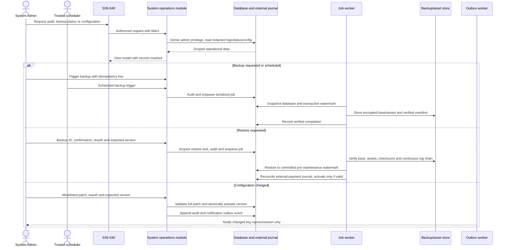
