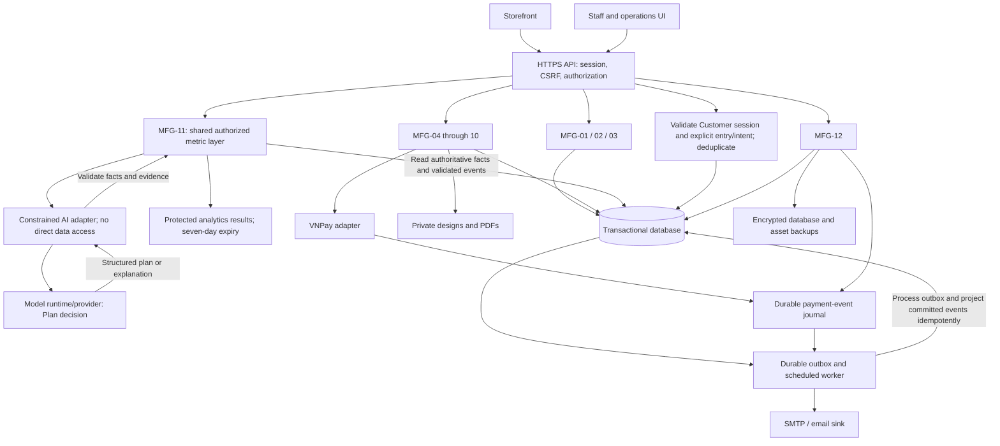

# 1.3b System Overall Configuration

This system provides services via the Web in a client-server format. The diagram shows logical boundaries; they may be deployed as one modular application.

Nodes found: 18

Arrows found: 26

Unreadable text: None.

MFG-11 chart, export and AI paths share metric definitions, role checks, unit/cohort filters and result snapshots. The collector cannot assert payments or business approvals; the worker projects authoritative timeline/outbox facts. Neither analytics nor the model is on the synchronous checkout/payment path. These are logical boundaries, not selected services, database technology or dependencies. MFG-12 remains deferred. MFG-11 5.3 defines authenticated-only entry/intent identity; 5.7 defines the 12-month reporting window and retention. No guest collector or persistent chat store is required. The current dashboard page holds transient AI conversation; its metric-source results have a separate seven-day lifetime. Provider activation follows Plan item I-01 in MFG-11 section 10.
