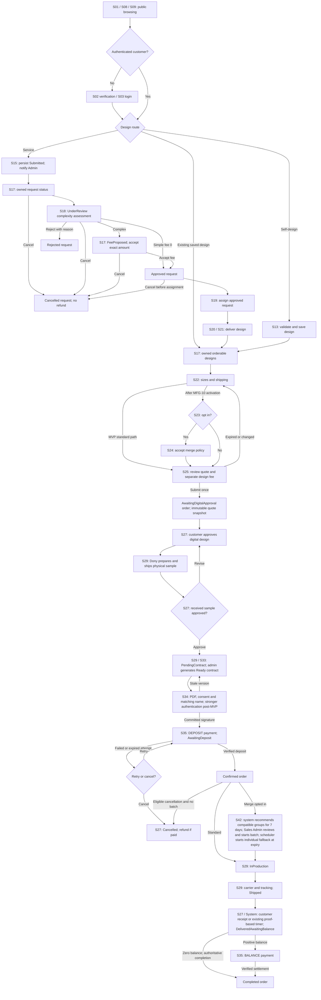
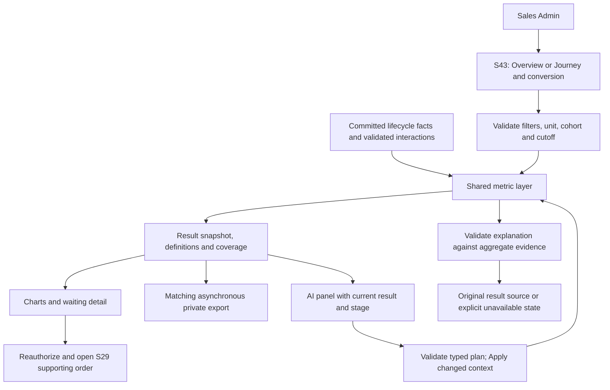

Nodes found: 35

Arrows found: 50

Unreadable text: None.

The first diagram shows the complete-system business paths; README owns the MVP slice. Service design and merge remain deferred until their modules are active. Returning to an existing design does not imply a new editor/save step. The sample-revision arrow includes the new bound design/quote approval cycle defined by MFG-06.

## Analytics usage (Should extension)

Authenticated product-entry, explicit-intent and order identity/formulas belong to MFG-11. Guest browsing produces no analytics events and is never replayed after login. Explicit new design/reorder creates a new intent; reload/edit/requote/payment retry resumes the existing one. A missing link is not a dropout; sample rework, contract preparation, customer signing and payment waits are separate. AI does not change any node of the business flow. Disabled branches and missing tracking display coverage states instead of artificial zero conversion.

Reporting covers the rolling last 12 calendar months. Observed nonprogression is shown without an inactivity-based abandonment rule. AI conversation remains only on the active dashboard page and is cleared on page reload/close/navigation away, logout or access revocation; closing only the panel may preserve it until that page ends.
