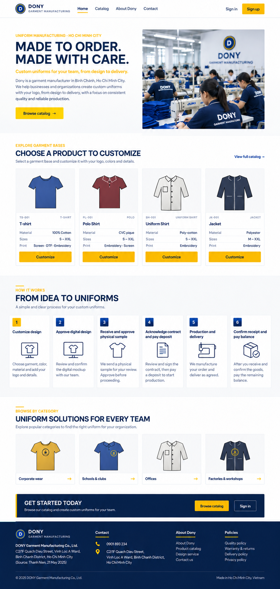

# Screen Spec: S01 Home Page

| Field | Value |
|---|---|
| Screen ID | `S01` |
| Screen name | Home Page |
| Actor | Guest and all authenticated roles |
| Priority | Must (MVP) |
| Belongs to module | [MFG-04](../specs/spec-MFG-04.md) |
| Route | `/` |
| Mockup image | img/S01-01-home-page.png |
| Status | Resolved implementation specification |

## 1. Purpose

**Shown when:** The landing page queries only currently Published products and configured public Dony contacts. It keeps sign-up, sign-in, catalog browsing and public About and Contact pages available without exposing staff data. All identifiers and permissions come from the server session; list filters are allowlisted and recoverable failures preserve entered values.

**The user leaves this screen when:** An authorized action in section 5 succeeds, the user follows a role-allowed global route, or they return to the validated originating route.

## 2. Mockup

The homepage informational process copy must match MFG-06: digital-design approval, physical-sample shipment/approval, contract/deposit, production/delivery and balance. After MFG-10 activation, advertise flexible terms only for eligible products: 5% of merchandise subtotal capped at 250000 VND, with the same versioned waiting/completion terms as S31/S32. Standard internal sewing batching adds no incentive. Do not imply universal eligibility, guaranteed merging or ready-made stock availability.

### Mockup deviations

- Hide the mockup footer entry for Design service in MVP; S24 is post-MVP.

## 3. Element inventory

| # | Element | Type | Content / data source | Required | Validation |
|---|---|---|---|---|---|
| 1 | Screen heading | Heading | Home Page | Yes | Static route title. |
| 2 | Route | Navigation target | / | Yes | Access checked on server. |
| 3 | product_id | Field / control | UUID, nullable | As specified | product_id: UUID, nullable; only Published products with public-safe name/image/price. |
| 4 | company_name/contact_links | Field / control | strings from configured company profile | As specified | company_name/contact_links: strings from configured company profile; omit unknown contacts. |
| 5 | navigation_visibility | Field / control | role-derived | As specified | Show Sign up/Sign in to Guest; render authenticated navigation from server permissions. |
| 6 | API errors | Field / control | standard API error envelope | As specified | 400 malformed; 422 invalid fields; 409 stale/duplicate; 429 rate limit; 503 dependency failure |
| 7 | Browse published item | Action | Open product detail. | Available when authorized | Destination: S15 |
| 8 | Start customization/request | Action | Preserve intended route through sign-in when needed. | Available when authorized | Destination: S20 or S24 |
| 9 | About/contact | Action | Open approved public information pages; show configured contacts only. | Available when authorized | Destination: S02 / S03 |

## 4. States

**Loading, access, errors and retry:** Show a labelled Loading state while reads resolve. A missing or inaccessible route returns a safe 401/403/404 without disclosing protected records. Error states show the API code, message, field_errors and request_id while preserving safe input. Retry transient reads; retry a mutation only with the original idempotency key and identical payload. Preserve safe user input after recoverable failures.

| State | What the user sees | Trigger |
|---|---|---|
| Empty | Show no published products; retain public navigation and explain that the catalog is currently empty. | Screen has no eligible or matching record |
| Success | Refresh the committed Home Page data and show the next action permitted by its lifecycle and actor. | Valid action commits |
| Conflict | The Home Page data or lifecycle changed concurrently; reload authoritative state and do not replay a stale mutation. | Stale version, duplicate or invalid lifecycle transition |
## 5. Interactions and navigation

| # | Element | User action | System response | Goes to screen |
|---|---|---|---|---|
| 1 | Browse published item | Activate | Open product detail. | S15 |
| 2 | Start customization/request | Activate | Preserve intended route through sign-in when needed. | S20 or S24 |
| 3 | About/contact | Activate | Open approved public information pages; show configured contacts only. | S02 / S03 |

Portal: Guest and all authenticated roles. Route: /. Back preserves the originating route and filters. 

## 6. Screen-level rules

| Rule ID | Rule | Source |
|---|---|---|
| SR-001 | Check access and ownership on the server; never trust submitted customer, company, role, price, stage or provider status. Apply the documented 401/403/404 behavior and field rules. | Project baseline |
| SR-002 | IDs are UUIDs; timestamps are UTC and displayed in Asia/Ho_Chi_Minh; money and quantities are integers. Mutations use expected versions and idempotency keys where specified. | Project baseline |
| SR-003 | Apply the owning module's lifecycle and validation rules; preserve immutable submitted snapshots and design versions. | Project baseline |
| SR-004 | Use documented project assumptions; do not invent factual company, author, client-approval or course identifiers. | Project baseline |

### Acceptance scenarios

1. When no published products exist, show an honest empty catalog panel and continue navigation.
2. When no Dony public contact is configured, hide contact/social links and render no fabricated values.

## 7. Linked requirements

| FR ID (from the module spec) | What this screen does for it |
|---|---|
| MFG-04/F-PROD-001 | **View Catalog** — Return Dony's paginated catalogue of Published configurable garment bases using allowlisted category and sort values; these are not ready-made inventory. |

## 8. Responsive and accessibility notes

Support 360px through desktop; stack columns and use labelled horizontal-scroll tables on narrow screens. Controls are keyboard-operable with visible focus, logical headings, associated form labels, and aria-live status/error announcements. Text contrast is at least 4.5:1 (large text 3:1); pointer targets are at least 24px. Preserve user-entered data after recoverable failures. Confirm destructive actions, disable duplicate submit while pending, and enforce idempotency on the server.

## 9. Open questions

| # | Question | Blocking? | Status |
|---|---|---|---|
| 1 | No unresolved screen behavior questions remain; routes, fields, permissions, and defaults are resolved in this specification and its linked module requirements. | No | Resolved |

## Completion checklist

- [x] Route, actor, module, priority, and mockup status are identified.
- [x] Element fields, actions, validation, and data ownership are documented.
- [x] Loading, empty, forbidden, error, retry, success, and conflict states are documented.
- [x] Navigation and acceptance scenarios are explicit.
- [x] Responsive and accessibility requirements are documented in this screen.
- [x] No unresolved screen-level decisions remain.
