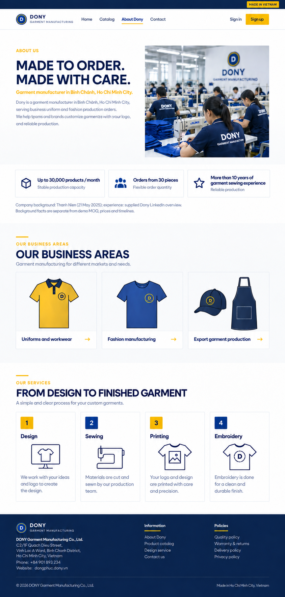

# Screen Spec: S02 About Dony

| Field | Value |
|---|---|
| Screen ID | `S02` |
| Screen name | About Dony |
| Actor | Guest and authenticated users |
| Priority | Should (MVP) |
| Belongs to module | [MFG-04](../specs/spec-MFG-04.md) |
| Route | `/about` |
| Mockup image | img/S02-01-about-dony.png |
| Status | Approved final demo specification |

## 1. Purpose

**Shown when:** A visitor opens the public About page from the storefront. S02 shares the public navigation used by the [S01 Home Page](S01-home-page.md); the page introduces Dony as a made-to-order garment manufacturer and summarizes its production capabilities for prospective business buyers and reseller shops.

**The user leaves this screen when:** They follow a public storefront navigation link or return to S01.

## 2. Mockup

### Mockup deviations

- Treat extra marketing copy in the generated mockup as placeholder text; render only the source-backed content listed below.
- Treat the factory image as illustrative, not a photograph of Dony's actual facility.

## 3. Element inventory

| # | Element | Type | Content / data source | Required | Validation |
|---|---|---|---|---|---|
| 1 | Storefront header | Navigation | Home, Products, About Dony, Contact | Yes | Links target S01 `/`, S14 `/catalog`, S02 `/about`, and S03 `/contact`. |
| 2 | Hero | Heading / image | “Made to order. Made with care.” and illustrative factory image | Yes | Do not imply ready-made inventory or present the image as an actual Dony facility. |
| 3 | Capability highlights | Content | Up to 30,000 products per month; orders from 30 pieces; more than 10 years of garment sewing experience | Yes | Attribute capacity and MOQ to Thanh Niên; attribute experience to the supplied LinkedIn overview. |
| 4 | Business areas | Content | Uniforms and workwear; fashion manufacturing; export garment production | Yes | Do not add unsupported company claims. |
| 5 | Production services | Content | Design, sewing, printing, and embroidery | Yes | Static informational content. |
| 6 | Footer | Navigation | Existing storefront footer pattern | Yes | Repeat About and Contact links; follow the S01 storefront footer pattern. |

## 4. States

**Loading, access, errors and retry:** Show a labelled Loading state while reads resolve. A missing or inaccessible route returns a safe 401/403/404 without disclosing protected records. Error states show the API code, message, field_errors and request_id while preserving safe input. Retry transient reads; retry a mutation only with the original idempotency key and identical payload. Preserve safe user input after recoverable failures.

| State | What the user sees | Trigger |
|---|---|---|
| Success | Public About content and storefront navigation. | Page content is available |
| Loading / error | Keep storefront navigation available; show the shared loading or failure treatment. | Content is loading or a read fails |

## 5. Interactions and navigation

| # | Element | User action | System response | Goes to screen |
|---|---|---|---|---|
| 1 | Home | Activate | Open the storefront home page. | S01 |
| 2 | Products | Activate | Open the public catalog. | S14 |
| 3 | About Dony | Activate | Remain on the About page. | S02 |
| 4 | Contact | Activate | Open the public contact page. | S03 |

Portal: Guest and authenticated users. Route: `/about`. Navigation follows the public storefront pattern on S01.

## 6. Screen-level rules

| Rule ID | Rule | Source |
|---|---|---|
| SR-001 | Check access and ownership on the server; never trust submitted customer, company, role, price, stage or provider status. Apply the documented 401/403/404 behavior and field rules. | Project baseline |
| SR-002 | IDs are UUIDs; timestamps are UTC and displayed in Asia/Ho_Chi_Minh; money and quantities are integers. Mutations use expected versions and idempotency keys where specified. | Project baseline |
| SR-003 | Apply the owning module's lifecycle and validation rules; preserve immutable submitted snapshots and design versions. | Project baseline |
| SR-004 | Use documented project assumptions; do not invent factual company, author, client-approval or course identifiers. | Project baseline |
| S02-001 | Do not imply ready-made inventory; Dony produces garments to order. | MFG-04/FR-001; S02 content scope |
| S02-002 | Do not add unsupported customer logos, testimonials, certifications, awards, sustainability claims, or delivery promises. | S02 content scope |
| S02-003 | Keep external company facts attributed background information; they do not change demo MOQ, price, capacity, or lead-time rules in MFG-04/MFG-06/MFG-10. | S02 content scope |
| S02-004 | Treat generated mockup imagery as illustrative and do not present placeholder marketing copy as approved content. | S02 mockup deviations |

### Acceptance scenarios

1. When the page renders, show only the approved informational content and the public links to S01, S14, S02, and S03.
2. When the page or image fails to load, retain public storefront navigation and use the shared failure state.

## 7. Linked requirements

| FR ID (from the module spec) | What this screen does for it |
|---|---|
| MFG-04/FR-001 | Provides the public About page as part of the storefront navigation; it does not alter catalog or demo commercial rules. |

## 8. Responsive and accessibility notes

Support 360px through desktop. Keep headings semantic, links keyboard-operable with visible focus, text contrast at least 4.5:1 (3:1 for large text), and pointer targets at least 24px. Preserve safe input after recoverable failures.

## 9. Open questions

| # | Question | Blocking? | Status |
|---|---|---|---|
| 1 | Confirm that the attributed public company facts remain current before implementation. | No | Verify before implementation |

## 10. Sources

- [Thanh Niên — Đồng phục DONY - Xưởng may đồng phục chuyên nghiệp, giá tốt](https://thanhnien.vn/dong-phuc-dony-xuong-may-dong-phuc-chuyen-nghiep-gia-tot-185250521140043262.htm)
- [Dony LinkedIn overview](https://www.linkedin.com/company/dony-international-corporation/?originalSubdomain=vn) (provided by the user; not independently verified in this task)
- [Dony Garment — products and services](https://donygarment.webflow.io/)
