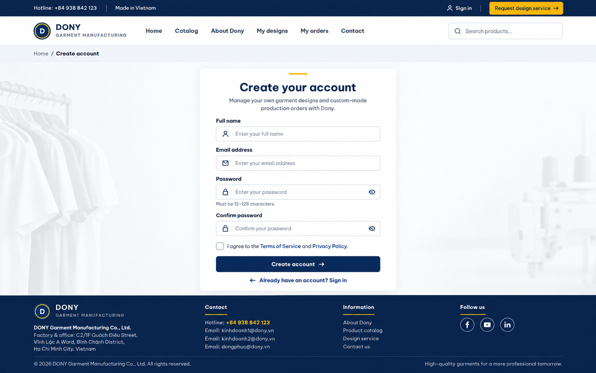

# Screen Spec: S02 Sign Up

| Field | Value |
|---|---|
| Screen ID | `S02` |
| Screen name | Sign Up |
| Actor | Guest |
| Priority | P1 |
| Belongs to module | [MFG-01](../specs/spec-MFG-01.md) |
| Route | `/sign-up` |
| Mockup image | img/S02-sign_up_screen.png |
| Status | Resolved implementation specification |

## 1. Purpose

**Shown when:** Registration creates a Customer identity in pending-verification state on Dony's public storefront. The page retains the shared customer utility bar, store navigation header and footer. The registrant may represent a company buying uniforms for internal use or a Reseller Shop commissioning garments from its own designs for resale. Registration never creates a Sales, Sales Admin or System Admin account and never provisions a company as a system tenant. All identifiers and permissions come from the server session; list filters are allowlisted and recoverable failures preserve entered values.

**The user leaves this screen when:** An authorized action in section 5 succeeds, the user follows a role-allowed global route, or they return to the validated originating route.

## 2. Mockup

Written behavior below takes precedence over obsolete sample content.

## 3. Element inventory

| # | Element | Type | Content / data source | Required | Validation |
|---|---|---|---|---|---|
| 1 | Screen heading | Heading | Sign Up | Yes | Static route title. |
| 2 | Route | Navigation target | /sign-up | Yes | Access checked on server. |
| 3 | full_name | Field / control | string, required, trim, 1..100 characters. | As specified | full_name: string, required, trim, 1..100 characters. |
| 4 | email | Field / control | string, required, normalize case, globally unique | As specified | email: string, required, normalize case, globally unique; valid email format. |
| 5 | password | Field / control | string, required, 12..128 characters, spaces allowed | As specified | password: string, required, 12..128 characters, spaces allowed; never echoed or logged. |
| 6 | Verification link | Field / control | cryptographically random, hashed at rest, single-use, 24h expiry. | As specified | Verification link: cryptographically random, hashed at rest, single-use, 24h expiry. |
| 7 | API errors | Field / control | standard API error envelope | As specified | 400 malformed; 422 invalid fields; 409 stale/duplicate; 429 rate limit; 503 dependency failure |
| 8 | Create account | Action | Validate fields, create Guest-registered Customer pending verification, queue 24h link; neutral success. | Available when authorized | Destination: S03 |
| 9 | Resend verification | Action | Rate-limit; invalidate prior token; report generic queued state. | Available when authorized | Destination: S02 |
| 10 | Sign in | Action | Navigate to login. | Available when authorized | Destination: S03 |

## 4. States

| State | What the user sees | Trigger |
|---|---|---|
| Loading | Load the S02 Sign Up view model and show labelled progress; keep writes disabled until route data and authorization are resolved. | Request starts |
| Empty | No Sign Up records match the current route/filter; preserve inputs and show only the screen’s authorized next action. | Screen has no eligible or matching record |
| Forbidden/not found | Return a safe 401/403/404 for S02 Sign Up without revealing inaccessible record, customer, staff or payment details. | 401/403/404 |
| Error | For S02 Sign Up, show the API code, message, field_errors and request_id; preserve safe user-entered values. | Request failure |
| Retry | Retry transient reads for S02 Sign Up; retry a mutation only with its original idempotency key and identical payload, never as a new side effect. | Recoverable failure |
| Success | Refresh the committed Sign Up data and show the next action permitted by its lifecycle and actor. | Valid action commits |
| Conflict | The Sign Up data or lifecycle changed concurrently; reload authoritative state and do not replay a stale mutation. | Stale version, duplicate or invalid lifecycle transition |
## 5. Interactions and navigation

| # | Element | User action | System response | Goes to screen |
|---|---|---|---|---|
| 1 | Create account | Activate | Validate fields, create Guest-registered Customer pending verification, queue 24h link; neutral success. | S03 |
| 2 | Resend verification | Activate | Rate-limit; invalidate prior token; report generic queued state. | S02 |
| 3 | Sign in | Activate | Navigate to login. | S03 |

Portal: Guest. Route: /sign-up. Back preserves the originating route and filters. Fallback: Customer→S26; Sales Admin→S28; Sales→S20; System Admin→S41; Guest→S01. Enforce role, ownership and assignment before rendering.

## 6. Screen-level rules

| Rule ID | Rule | Source |
|---|---|---|
| SR-001 | Access and ownership are checked server-side; do not trust submitted customer, company, role, price, or provider status. Apply 401/403/404 behavior and the field rules above. | Authorization and data ownership requirements |
| SR-002 | IDs are UUIDs; timestamps are UTC and displayed in Asia/Ho_Chi_Minh; money and quantities are integers. Mutations use expected_version; significant create/sign/pay/batch operations use idempotency keys. | Data representation and concurrency requirements |
| SR-003 | Apply the module lifecycle and validation rules linked below; preserve immutable submitted snapshots. | Module specification |
| SR-004 | Selected product and technical defaults are project implementation decisions; do not invent factual company, author, client-approval, or course identifiers. | Project implementation assumptions |

### Acceptance scenarios

1. With valid fields, create only a Customer account and queue a single-use verification link expiring in 24h.
2. With duplicate email or delivery failure, return a non-enumerating response and preserve safe form values.

## 7. Linked requirements

| FR ID (from the module spec) | What this screen does for it |
|---|---|
| MFG-01/F-USER-001 | **Register Account** — Render the registration form and verification guidance. |
| MFG-01/F-USER-002 | **Register Account** — Validate fields and atomically create one pending Customer without disclosing whether an email already exists. |
| MFG-01/F-USER-003 | **Register Account** — Issue a hashed verification token and durable email event. |

## 8. Responsive and accessibility notes

Support 360px through desktop; stack columns and use labelled horizontal-scroll tables on narrow screens. Controls are keyboard-operable with visible focus, logical headings, associated form labels, and aria-live status/error announcements. Text contrast is at least 4.5:1 (large text 3:1); pointer targets are at least 24px. Preserve user-entered data after recoverable failures. Confirm destructive actions, disable duplicate submit while pending, and enforce idempotency on the server.

## 9. Open questions

| # | Question | Blocking? | Status |
|---|---|---|---|
| 1 | No unresolved screen behavior questions remain; routes, fields, permissions, and defaults are resolved in this specification and its linked module requirements. | No | Resolved |

## Completion checklist

- [x] Route, actor, module, priority, and mockup status are identified.
- [x] Element fields, actions, validation, and data ownership are documented.
- [x] Loading, empty, forbidden, error, retry, success, and conflict states are documented.
- [x] Navigation and acceptance scenarios are explicit.
- [x] Responsive and accessibility requirements follow the shared baseline.
- [x] No unresolved screen-level decisions remain.
