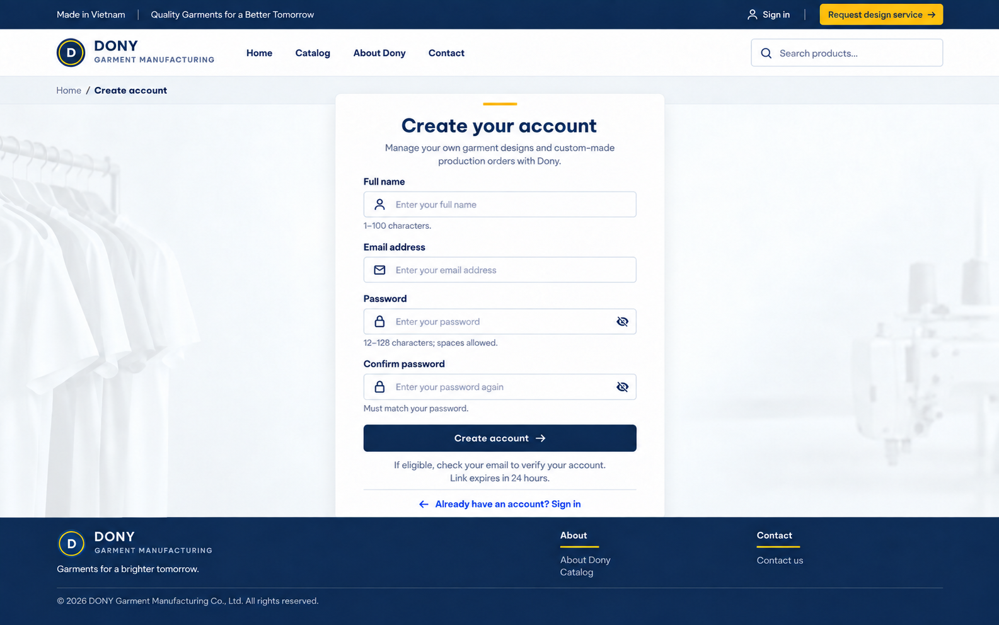

# Screen Spec: S04 Sign Up

| Field | Value |
|---|---|
| Screen ID | `S04` |
| Screen name | Sign Up |
| Actor | Guest |
| Priority | Must (MVP) |
| Belongs to module | [MFG-01](../specs/spec-MFG-01.md) |
| Route | `/sign-up` |
| Mockup image | img/S04-01-customer-sign-up.png |
| Status | Resolved implementation specification |

## 1. Purpose

**Shown when:** Registration creates a Customer identity in pending-verification state on Dony's public storefront. The page retains the shared customer utility bar, store navigation header and footer. The registrant may represent a company buying uniforms for internal use or a Reseller Shop commissioning garments from its own designs for resale. Registration never creates a Sales, Sales Admin or System Admin account and never provisions a company as a system tenant. All identifiers and permissions come from the server session; list filters are allowlisted and recoverable failures preserve entered values.

**The user leaves this screen when:** An authorized action in section 5 succeeds, the user follows a role-allowed global route, or they return to the validated originating route.

## 2. Mockup

The mockup illustrates the defined workflow. Fictional sample values do not replace the field, lifecycle and release-scope rules below.

### Mockup deviations

- Hide the header “Request design service” action in MVP; S24 is post-MVP.

## 3. Element inventory

| # | Element | Type | Content / data source | Required | Validation |
|---|---|---|---|---|---|
| 1 | Screen heading | Heading | Sign Up | Yes | Static route title. |
| 2 | Route | Navigation target | /sign-up | Yes | Access checked on server. |
| 3 | full_name | Field / control | string, required, trim, 1..100 characters. | As specified | full_name: string, required, trim, 1..100 characters. |
| 4 | email | Field / control | string, required, normalize case, globally unique | As specified | email: string, required, normalize case, globally unique; valid email format. |
| 5 | password | Field / control | string, required, 12..128 characters, spaces allowed | As specified | password: string, required, 12..128 characters, spaces allowed; never echoed or logged. |
| 6 | confirmation | Secret input | Required password confirmation | Yes | Must match password exactly; 12..128 characters; never echoed, persisted or logged. |
| 7 | Verification link | Field / control | cryptographically random, hashed at rest, single-use, 24h expiry. | As specified | Verification link: cryptographically random, hashed at rest, single-use, 24h expiry. |
| 8 | API errors | Field / control | standard API error envelope | As specified | 400 malformed; 422 invalid fields/confirmation mismatch; 429 rate limit; 503 dependency failure; duplicate email uses the same generic 202 acknowledgement |
| 9 | Create account | Action | Validate fields, create Guest-registered Customer pending verification, queue 24h link; neutral success. | Available when authorized | Destination: S05 |
| 10 | Resend verification | Action | Rate-limit; invalidate prior token; report generic queued state. | Available when authorized | Destination: S04 |
| 11 | Sign in | Action | Navigate to login. | Available when authorized | Destination: S05 |

## 4. States

**Loading, access, errors and retry:** Show a labelled Loading state while reads resolve. A missing or inaccessible route returns a safe 401/403/404 without disclosing protected records. Error states show the API code, message, field_errors and request_id while preserving safe input. Retry transient reads; retry a mutation only with the original idempotency key and identical payload. Preserve safe user input after recoverable failures.

| State | What the user sees | Trigger |
|---|---|---|
| Initial | Show the four required registration fields and sign-in link. | Registration form opened |
| Success | Display the same generic verification guidance for both new and existing email addresses; never disclose account existence. | HTTP 202 accepted |
| Invalid input | Highlight malformed fields or mismatched confirmation; keep safe fields and clear secret inputs as required. | HTTP 422 validation failure |
## 5. Interactions and navigation

| # | Element | User action | System response | Goes to screen |
|---|---|---|---|---|
| 1 | Create account | Activate | Validate fields, create Guest-registered Customer pending verification, queue 24h link; neutral success. | S05 |
| 2 | Resend verification | Activate | Rate-limit; invalidate prior token; report generic queued state. | S04 |
| 3 | Sign in | Activate | Navigate to login. | S05 |

Portal: Guest. Route: /sign-up. Back preserves the originating route and filters. 

## 6. Screen-level rules

| Rule ID | Rule | Source |
|---|---|---|
| SR-001 | Check access and ownership on the server; never trust submitted customer, company, role, price, stage or provider status. Apply the documented 401/403/404 behavior and field rules. | Project baseline |
| SR-002 | IDs are UUIDs; timestamps are UTC and displayed in Asia/Ho_Chi_Minh; money and quantities are integers. Mutations use expected versions and idempotency keys where specified. | Project baseline |
| SR-003 | Apply the owning module's lifecycle and validation rules; preserve immutable submitted snapshots and design versions. | Project baseline |
| SR-004 | Use documented project assumptions; do not invent factual company, author, client-approval or course identifiers. | Project baseline |

### Acceptance scenarios

1. With valid fields and matching password confirmation, create only a Customer account and queue a single-use verification link expiring in 24h.
2. With duplicate email or delivery failure, return a non-enumerating response and preserve safe form values.

## 7. Linked requirements

| FR ID (from the module spec) | What this screen does for it |
|---|---|
| MFG-01/F-USER-001 | **Register Account** — Render the registration form and verification guidance. |
| MFG-01/F-USER-002 | **Register Account** — Validate fields and atomically create one pending Customer without disclosing whether an email already exists. |
| MFG-01/F-USER-003 | **Register Account** — Issue a hashed verification token and durable email event. |

## 8. Responsive and accessibility notes

Support 360px through desktop; stack columns and use labelled horizontal-scroll tables on narrow screens. Controls are keyboard-operable with visible focus, logical headings, associated form labels, and aria-live status/error announcements. Text contrast is at least 4.5:1 (large text 3:1); pointer targets are at least 24px. Preserve user-entered data after recoverable failures. Confirm destructive actions, disable duplicate submit while pending, and enforce idempotency on the server.

## 9. Open questions

| # | Question | Blocking? | Status |
|---|---|---|---|
| 1 | No unresolved screen behavior questions remain; routes, fields, permissions, and defaults are resolved in this specification and its linked module requirements. | No | Resolved |

## Completion checklist

- [x] Route, actor, module, priority, and mockup status are identified.
- [x] Element fields, actions, validation, and data ownership are documented.
- [x] Loading, empty, forbidden, error, retry, success, and conflict states are documented.
- [x] Navigation and acceptance scenarios are explicit.
- [x] Responsive and accessibility requirements are documented in this screen.
- [x] No unresolved screen-level decisions remain.
