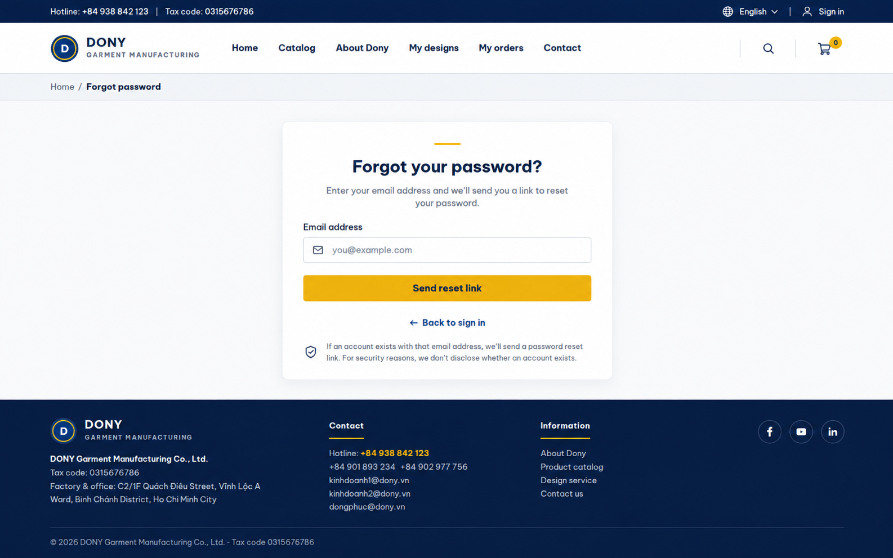

# Screen Spec: S04 Forgot Password

| Field | Value |
|---|---|
| Screen ID | `S04` |
| Screen name | Customer Storefront Forgot Password |
| Actor | Guest |
| Priority | P1 |
| Belongs to module | [MFG-01](../specs/spec-MFG-01.md) |
| Route | `/forgot-password` (Customer storefront only) |
| Mockup image | img/S04-forgot_password_screen.png |
| Status | Resolved implementation specification |

## 1. Purpose

**Shown when:** A Customer requests account recovery from the Dony storefront. This page retains the storefront utility bar, customer navigation header and footer. Password recovery returns the same confirmation for known and unknown email addresses. Eligible requests queue a single-use Customer-bound reset link and invalidate the previous Customer link. Staff recovery is isolated to S45; no social-provider recovery is offered.

**The user leaves this screen when:** An authorized action in section 5 succeeds, the user follows a role-allowed global route, or they return to the validated originating route.

## 2. Mockup

Written behavior below takes precedence over obsolete sample content.

## 3. Element inventory

| # | Element | Type | Content / data source | Required | Validation |
|---|---|---|---|---|---|
| 1 | Screen heading | Heading | Forgot Password | Yes | Static route title. |
| 2 | Route | Navigation target | /forgot-password or /staff/forgot-password | Yes | Portal is explicit and retained through recovery. |
| 3 | email | Field / control | string required, normalized | As specified | email: string required, normalized; do not indicate whether it exists. |
| 4 | Link request | Field / control | max 3 per account/IP/hour | As specified | Link request: max 3 per account/IP/hour; resend invalidates prior link. |
| 5 | Response | Field / control | same neutral confirmation for existing and absent accounts. | As specified | Response: same neutral confirmation for existing and absent accounts. |
| 6 | API errors | Field / control | standard API error envelope | As specified | 400 malformed; 422 invalid fields; 409 stale/duplicate; 429 rate limit; 503 dependency failure |
| 7 | Request reset | Action | Apply generic response and queue email only if eligible; invalidate prior link. | Available when authorized | Destination: S03 |
| 8 | Resend | Action | Enforce request limit and queue latest link for the same portal. | Available when authorized | Destination: S04 |

## 4. States

| State | What the user sees | Trigger |
|---|---|---|
| Loading | Load the S04 Forgot Password view model and show labelled progress; keep writes disabled until route data and authorization are resolved. | Request starts |
| Empty | No Customer Storefront Forgot Password records match the current route/filter; preserve inputs and show only the screen’s authorized next action. | Screen has no eligible or matching record |
| Forbidden/not found | Return a safe 401/403/404 for S04 Forgot Password without revealing inaccessible record, customer, staff or payment details. | 401/403/404 |
| Error | For S04 Forgot Password, show the API code, message, field_errors and request_id; preserve safe user-entered values. | Request failure |
| Retry | Retry transient reads for S04 Forgot Password; retry a mutation only with its original idempotency key and identical payload, never as a new side effect. | Recoverable failure |
| Success | Return the same neutral confirmation regardless of email existence; send a time-limited reset link when eligible. | Valid action commits |
| Conflict | The Customer Storefront Forgot Password data or lifecycle changed concurrently; reload authoritative state and do not replay a stale mutation. | Stale version, duplicate or invalid lifecycle transition |
## 5. Interactions and navigation

| # | Element | User action | System response | Goes to screen |
|---|---|---|---|---|
| 1 | Request reset | Activate | Apply generic response and queue email only if eligible; invalidate prior link. | S03 |
| 2 | Resend | Activate | Enforce request limit and queue latest link. | S04 |

Portal: Guest. Route: /forgot-password. Back preserves the originating route and filters. Fallback: Customer→S26; Sales Admin→S28; Sales→S20; System Admin→S41; Guest→S01. Enforce role, ownership and assignment before rendering.

## 6. Screen-level rules

| Rule ID | Rule | Source |
|---|---|---|
| SR-001 | Access and ownership are checked server-side; do not trust submitted customer, company, role, price, or provider status. Apply 401/403/404 behavior and the field rules above. | Authorization and data ownership requirements |
| SR-002 | IDs are UUIDs; timestamps are UTC and displayed in Asia/Ho_Chi_Minh; money and quantities are integers. Mutations use expected_version; significant create/sign/pay/batch operations use idempotency keys. | Data representation and concurrency requirements |
| SR-003 | Apply the module lifecycle and validation rules linked below; preserve immutable submitted snapshots. | Module specification |
| SR-004 | Selected product and technical defaults are project implementation decisions; do not invent factual company, author, client-approval, or course identifiers. | Project implementation assumptions |

### Acceptance scenarios

1. For existing and unknown emails, show identical confirmation text and response shape in each portal.
2. At fourth request within an hour, return 429 without sending another link.

## 7. Linked requirements

| FR ID (from the module spec) | What this screen does for it |
|---|---|
| MFG-01/F-USER-007 | **Forgot Password** — Render the email-only recovery form. |
| MFG-01/F-USER-008 | **Forgot Password** — Validate recovery input without exposing account existence. |
| MFG-01/F-USER-009 | **Forgot Password** — Issue and deliver a hashed reset token. |

## 8. Responsive and accessibility notes

Support 360px through desktop; stack columns and use labelled horizontal-scroll tables on narrow screens. Controls are keyboard-operable with visible focus, logical headings, associated form labels, and aria-live status/error announcements. Text contrast is at least 4.5:1 (large text 3:1); pointer targets are at least 24px. Preserve user-entered data after recoverable failures. Confirm destructive actions, disable duplicate submit while pending, and enforce idempotency on the server.

## 9. Open questions

| # | Question | Blocking? | Status |
|---|---|---|---|
| 1 | No unresolved screen behavior questions remain; routes, fields, permissions, and defaults are resolved in this specification and its linked module requirements. | No | Resolved |

## Completion checklist

- [x] Route, actor, module, priority, and mockup status are identified.
- [x] Element fields, actions, validation, and data ownership are documented.
- [x] Loading, empty, forbidden, error, retry, success, and conflict states are documented.
- [x] Navigation and acceptance scenarios are explicit.
- [x] Responsive and accessibility requirements follow the shared baseline.
- [x] No unresolved screen-level decisions remain.
