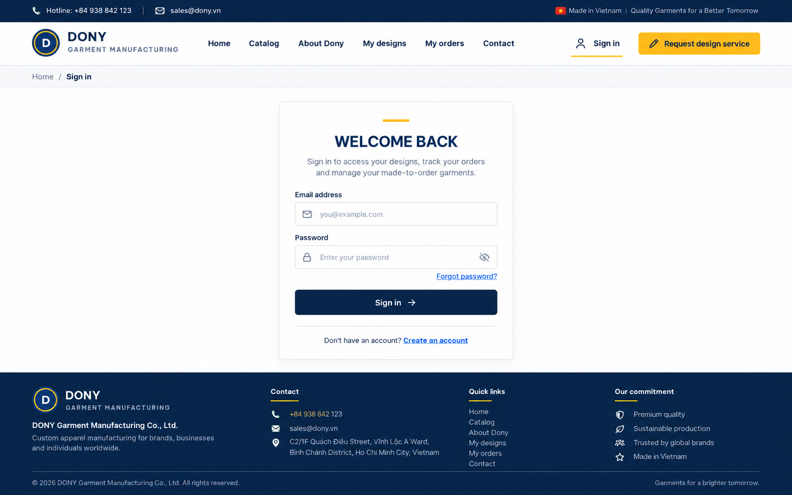

# Screen Spec: S05 Log In

| Field | Value |
|---|---|
| Screen ID | `S05` |
| Screen name | Customer Storefront Log In |
| Actor | Guest / Customer |
| Priority | Must (MVP) |
| Belongs to module | [MFG-01](../specs/spec-MFG-01.md) |
| Route | `/login` (Customer storefront only) |
| Mockup image | img/S05-01-customer-login.png |
| Status | Resolved implementation specification |

## 1. Purpose

**Shown when:** A Guest or Customer opens the storefront sign-in route `/login`. Staff sign-in and invitation acceptance are handled only by S08 at `/staff/login`.

**The user leaves this screen when:** Authentication succeeds and the server redirects to an allowlisted Customer route or the storefront default.

## 2. Mockup

### Mockup deviations

- Hide the header “Request design service” action in MVP; S24 is post-MVP.
- The mockup omits the generic resend-verification action; implement the action below.
- Omit Google/Facebook sign-in controls; social sign-in is not available.

## 3. Element inventory

| # | Element | Type | Content / data source | Required | Validation |
|---|---|---|---|---|---|
| 1 | Screen heading | Heading | Log In | Yes | Static route title. |
| 2 | Route / portal | Navigation target | `/login`, Customer storefront | Yes | Route-derived; never accept a client-supplied role. |
| 3 | Email | Field / control | Email address | Yes | Trim and case-normalize. |
| 4 | Password | Field / control | Secret | Yes | Verify hash; never log or echo. |
| 5 | return_to | Field / control | Internal URL, optional | As specified | Allowlisted route only; reject external redirects. |
| 6 | Create account | Action | Open Customer registration | Yes | Destination: S04. |
| 7 | Verification state | Field / control | Server result | As specified | Unverified accounts receive no session; response remains generic. |
| 8 | Failed attempts | Field / control | Server counter | As specified | Limit 5 per account/IP within 15 minutes; return 429. |
| 9 | Authenticate | Action | Verify credentials, establish session, redirect | Yes | Secure session cookie; destination is allowlisted return_to or S14. |
| 10 | Forgot password | Action | Open Customer recovery | Yes | Destination: S06. |
| 11 | Resend verification | Action | Generic, rate-limited resend request | As specified | Available after any login attempt; show the same acknowledgement regardless of account state. |
| 12 | Social sign-in | Provider controls | None | No | Not available; omit provider controls. |

## 4. States

**Loading, access, errors and retry:** Show a labelled Loading state while reads resolve. A missing or inaccessible route returns a safe 401/403/404 without disclosing protected records. Error states show the API code, message, field_errors and request_id while preserving safe input. Retry transient reads; retry a mutation only with the original idempotency key and identical payload. Preserve safe user input after recoverable failures.

| State | What the user sees | Trigger |
|---|---|---|
| Empty | Not applicable; sign-in is a form and has no list data. | Static form route |
| Success | Authenticated Customer session and allowlisted destination. | Valid verified credentials |
| Verification required | Generic response and resend-verification action; do not reveal whether an account exists. | Credentials identify an unverified account |
| Rate limited | Generic rate-limit response; no session is created. | Account/IP limit is reached |

## 5. Interactions and navigation

| Action | Result | Destination / rule |
|---|---|---|
| Authenticate | Validate credentials and verification status; on success create session and secure cookie. | Allowlisted return_to or S14 |
| Resend verification | Submit a rate-limited request and show generic acknowledgement. | Remain on S05 |
| Forgot password | Start Customer password recovery. | S06 |
| Create account | Open registration. | S04 |

## 6. Screen-level rules

| Rule ID | Rule | Source |
|---|---|---|
| SR-001 | Check access and ownership on the server; never trust submitted customer, company, role, price, stage or provider status. Apply the documented 401/403/404 behavior and field rules. | Project baseline |
| SR-002 | IDs are UUIDs; timestamps are UTC and displayed in Asia/Ho_Chi_Minh; money and quantities are integers. Mutations use expected versions and idempotency keys where specified. | Project baseline |
| SR-003 | Apply the owning module's lifecycle and validation rules; preserve immutable submitted snapshots and design versions. | Project baseline |
| SR-004 | Use documented project assumptions; do not invent factual company, author, client-approval or course identifiers. | Project baseline |
- Do not create a session for an unverified account.
- Use the same response shape for an unknown account, invalid credentials, and an unverified account; the unverified path may show the verification-required action without exposing account existence.
- Resend requests are rate-limited and return a generic acknowledgement.
- After five failed attempts per account/IP within 15 minutes, return 429.
- Staff sign-in is available only on S08.

## 7. Linked requirements

| Requirement | Summary |
|---|---|
| MFG-01/FR-004 | Render the Customer sign-in mode and portal-specific recovery route. |
| MFG-01/FR-005 | Authenticate, rate-limit, and establish a secure session only for verified accounts. |
| MFG-01/US-1 | Register, verify email, and resend verification without revealing account existence. |
| MFG-01/US-2 | Sign in, handle unverified accounts, and establish a session only after successful verification. |

## 8. Responsive and accessibility notes

Use associated labels, keyboard-operable controls, visible focus, inline validation, and an announced authentication result. Keep the form usable at narrow viewport widths.

## 9. Open questions

None.
