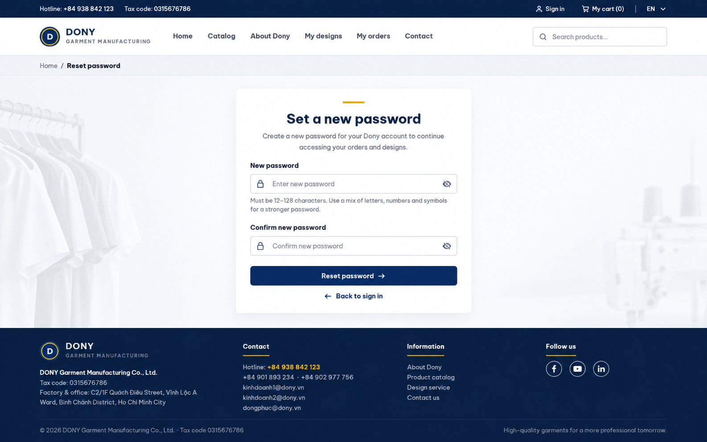

# Screen Spec: S05 Reset Password

| Field | Value |
|---|---|
| Screen ID | `S05` |
| Screen name | Customer Storefront Reset Password |
| Actor | Guest with single-use token |
| Priority | P1 |
| Belongs to module | [MFG-01](../specs/spec-MFG-01.md) |
| Route | `/reset-password?token={token}` (Customer storefront only) |
| Mockup image | img/S05-reset_password_screen.png |
| Status | Resolved implementation specification |

## 1. Purpose

**Shown when:** The Customer storefront-bound token query parameter authorizes one password reset for 30 minutes. This page uses the storefront header and footer. Successful reset revokes all sessions and consumes the token, then returns to S03. Staff reset is isolated to S46. Provider/social login is unsupported.

**The user leaves this screen when:** An authorized action in section 5 succeeds, the user follows a role-allowed global route, or they return to the validated originating route.

## 2. Mockup

Written behavior below takes precedence over obsolete sample content.

## 3. Element inventory

| # | Element | Type | Content / data source | Required | Validation |
|---|---|---|---|---|---|
| 1 | Screen heading | Heading | Reset Password | Yes | Static route title. |
| 2 | Route | Navigation target | Customer or staff reset-password route with token | Yes | Token purpose must match portal. |
| 3 | token | Field / control | required query secret | As specified | token: required query secret; single-use hashed token; 30m expiry. |
| 4 | new_password | Field / control | required, 12..128 characters, spaces allowed. | As specified | new_password: required, 12..128 characters, spaces allowed. |
| 5 | confirm_password | Field / control | required | As specified | confirm_password: required; exact match with new_password. |
| 6 | reset_effect | Field / control | server rule | As specified | A successful reset consumes the token and revokes every existing session for that user. |
| 7 | API errors | Field / control | standard API error envelope | As specified | 400 malformed; 422 invalid fields; 409 stale/duplicate; 429 rate limit; 503 dependency failure |
| 8 | Reset password | Action | Validate single-use token/password match, update hash, revoke all sessions. | Available when authorized | Destination: S03 |
| 9 | Request new link | Action | Discard token route and open recovery. | Available when authorized | Destination: S04 |

## 4. States

| State | What the user sees | Trigger |
|---|---|---|
| Loading | Load the S05 Reset Password view model and show labelled progress; keep writes disabled until route data and authorization are resolved. | Request starts |
| Empty | No Customer Storefront Reset Password records match the current route/filter; preserve inputs and show only the screen’s authorized next action. | Screen has no eligible or matching record |
| Forbidden/not found | Return a safe 401/403/404 for S05 Reset Password without revealing inaccessible record, customer, staff or payment details. | 401/403/404 |
| Error | For S05 Reset Password, show the API code, message, field_errors and request_id; preserve safe user-entered values. | Request failure |
| Retry | Retry transient reads for S05 Reset Password; retry a mutation only with its original idempotency key and identical payload, never as a new side effect. | Recoverable failure |
| Success | Invalidate reset token, update credentials, and return to the matching sign-in portal. | Valid action commits |
| Conflict | The Customer Storefront Reset Password data or lifecycle changed concurrently; reload authoritative state and do not replay a stale mutation. | Stale version, duplicate or invalid lifecycle transition |
## 5. Interactions and navigation

| # | Element | User action | System response | Goes to screen |
|---|---|---|---|---|
| 1 | Reset password | Activate | Validate single-use token/password match, update hash, revoke all sessions. | S03 |
| 2 | Request new link | Activate | Discard token route and open recovery. | S04 |

Portal: Guest with single-use token. Route: /reset-password?token={token}. Back preserves the originating route and filters. Fallback: Customer→S26; Sales Admin→S28; Sales→S20; System Admin→S41; Guest→S01. Enforce role, ownership and assignment before rendering.

## 6. Screen-level rules

| Rule ID | Rule | Source |
|---|---|---|
| SR-001 | Access and ownership are checked server-side; do not trust submitted customer, company, role, price, or provider status. Apply 401/403/404 behavior and the field rules above. | Authorization and data ownership requirements |
| SR-002 | IDs are UUIDs; timestamps are UTC and displayed in Asia/Ho_Chi_Minh; money and quantities are integers. Mutations use expected_version; significant create/sign/pay/batch operations use idempotency keys. | Data representation and concurrency requirements |
| SR-003 | Apply the module lifecycle and validation rules linked below; preserve immutable submitted snapshots. | Module specification |
| SR-004 | Selected product and technical defaults are project implementation decisions; do not invent factual company, author, client-approval, or course identifiers. | Project implementation assumptions |

### Acceptance scenarios

1. With valid token and matching valid passwords, consume token once, hash password and revoke all sessions.
2. With expired/reused token or mismatch, reject safely; no password or token is echoed.

## 7. Linked requirements

| FR ID (from the module spec) | What this screen does for it |
|---|---|
| MFG-01/F-USER-010 | **Reset Password** — Verify token purpose, expiry and consumption state. |
| MFG-01/F-USER-011 | **Reset Password** — Atomically replace the password and revoke sessions. |

## 8. Responsive and accessibility notes

Support 360px through desktop; stack columns and use labelled horizontal-scroll tables on narrow screens. Controls are keyboard-operable with visible focus, logical headings, associated form labels, and aria-live status/error announcements. Text contrast is at least 4.5:1 (large text 3:1); pointer targets are at least 24px. Preserve user-entered data after recoverable failures. Confirm destructive actions, disable duplicate submit while pending, and enforce idempotency on the server.

## 9. Open questions

| # | Question | Blocking? | Status |
|---|---|---|---|
| 1 | No unresolved screen behavior questions remain; routes, fields, permissions, and defaults are resolved in this specification and its linked module requirements. | No | Resolved |

## Completion checklist

- [x] Route, actor, module, priority, and mockup status are identified.
- [x] Element fields, actions, validation, and data ownership are documented.
- [x] Loading, empty, forbidden, error, retry, success, and conflict states are documented.
- [x] Navigation and acceptance scenarios are explicit.
- [x] Responsive and accessibility requirements follow the shared baseline.
- [x] No unresolved screen-level decisions remain.
