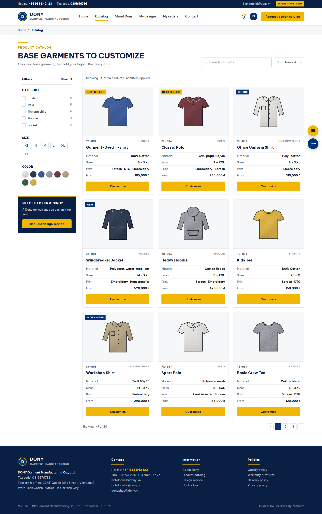

# Screen Spec: S08 Product Catalog

| Field | Value |
|---|---|
| Screen ID | `S08` |
| Screen name | Product Catalog |
| Actor | Guest/Member |
| Priority | P1 |
| Belongs to module | [MFG-04](../specs/spec-MFG-04.md) |
| Route | `/catalog` |
| Mockup image | img/S08-product_catalog_screen.png |
| Status | Resolved implementation specification |

## 1. Purpose

**Shown when:** The public catalog returns Published products only, with allowlisted search, category, size, color and sort filters. All identifiers and permissions come from the server session; list filters are allowlisted and recoverable failures preserve entered values.

**The user leaves this screen when:** An authorized action in section 5 succeeds, the user follows a role-allowed global route, or they return to the validated originating route.

## 2. Mockup

Written behavior below takes precedence over obsolete sample content.

## 3. Element inventory

| # | Element | Type | Content / data source | Required | Validation |
|---|---|---|---|---|---|
| 1 | Screen heading | Heading | Product Catalog | Yes | Static route title. |
| 2 | Route | Navigation target | /catalog | Yes | Access checked on server. |
| 3 | q | Field / control | optional trimmed search string. | As specified | q: optional trimmed search string. |
| 4 | category,size,color | Field / control | optional allowlisted filters supported by product. | As specified | category,size,color: optional allowlisted filters supported by product. |
| 5 | sort | Field / control | allowlisted (name, unit_price_vnd, created_at) | As specified | sort: allowlisted (name, unit_price_vnd, created_at); page>=1, page_size 1..100 default20. |
| 6 | Results | Field / control | Published products only | As specified | Results: Published products only; unit_price_vnd integer. |
| 7 | API errors | Field / control | standard API error envelope | As specified | 400 malformed; 422 invalid fields; 409 stale/duplicate; 429 rate limit; 503 dependency failure |
| 8 | Search/filter/sort | Action | Query published products using allowlisted filters and pagination. | Available when authorized | Destination: S08 |
| 9 | Open product | Action | Load public detail after published-state check. | Available when authorized | Destination: S09 |

## 4. States

| State | What the user sees | Trigger |
|---|---|---|
| Loading | Load the S08 Product Catalog view model and show labelled progress; keep writes disabled until route data and authorization are resolved. | Request starts |
| Empty | Show “No matching products” with a clear-filters action; preserve search and filter values. | Screen has no eligible or matching record |
| Forbidden/not found | Return a safe 401/403/404 for S08 Product Catalog without revealing inaccessible record, customer, staff or payment details. | 401/403/404 |
| Error | For S08 Product Catalog, show the API code, message, field_errors and request_id; preserve safe user-entered values. | Request failure |
| Retry | Retry transient reads for S08 Product Catalog; retry a mutation only with its original idempotency key and identical payload, never as a new side effect. | Recoverable failure |
| Success | Refresh the committed Product Catalog data and show the next action permitted by its lifecycle and actor. | Valid action commits |
| Conflict | The Product Catalog data or lifecycle changed concurrently; reload authoritative state and do not replay a stale mutation. | Stale version, duplicate or invalid lifecycle transition |
## 5. Interactions and navigation

| # | Element | User action | System response | Goes to screen |
|---|---|---|---|---|
| 1 | Search/filter/sort | Activate | Query published products using allowlisted filters and pagination. | S08 |
| 2 | Open product | Activate | Load public detail after published-state check. | S09 |

Portal: Guest/Member. Route: /catalog. Back preserves the originating route and filters. Fallback: Customer→S26; Sales Admin→S28; Sales→S20; System Admin→S41; Guest→S01. Enforce role, ownership and assignment before rendering.

## 6. Screen-level rules

| Rule ID | Rule | Source |
|---|---|---|
| SR-001 | Access and ownership are checked server-side; do not trust submitted customer, company, role, price, or provider status. Apply 401/403/404 behavior and the field rules above. | Authorization and data ownership requirements |
| SR-002 | IDs are UUIDs; timestamps are UTC and displayed in Asia/Ho_Chi_Minh; money and quantities are integers. Mutations use expected_version; significant create/sign/pay/batch operations use idempotency keys. | Data representation and concurrency requirements |
| SR-003 | Apply the module lifecycle and validation rules linked below; preserve immutable submitted snapshots. | Module specification |
| SR-004 | Selected product and technical defaults are project implementation decisions; do not invent factual company, author, client-approval, or course identifiers. | Project implementation assumptions |

### Acceptance scenarios

1. Search and filter return only Published products and preserve page/filter state.
2. Hidden/Archived product never appears even when its identifier is supplied as a filter.

## 7. Linked requirements

| FR ID (from the module spec) | What this screen does for it |
|---|---|
| MFG-04/F-PROD-001 | **View Catalog** — Return Dony's paginated catalogue of Published configurable garment bases using allowlisted category and sort values; these are not ready-made inventory. |
| MFG-04/F-PROD-002 | **View Catalog** — Return a product detail and options for a canonical product UUID; nonpublic products return 404. |

## 8. Responsive and accessibility notes

Support 360px through desktop; stack columns and use labelled horizontal-scroll tables on narrow screens. Controls are keyboard-operable with visible focus, logical headings, associated form labels, and aria-live status/error announcements. Text contrast is at least 4.5:1 (large text 3:1); pointer targets are at least 24px. Preserve user-entered data after recoverable failures. Confirm destructive actions, disable duplicate submit while pending, and enforce idempotency on the server.

## 9. Open questions

| # | Question | Blocking? | Status |
|---|---|---|---|
| 1 | No unresolved screen behavior questions remain; routes, fields, permissions, and defaults are resolved in this specification and its linked module requirements. | No | Resolved |

## Completion checklist

- [x] Route, actor, module, priority, and mockup status are identified.
- [x] Element fields, actions, validation, and data ownership are documented.
- [x] Loading, empty, forbidden, error, retry, success, and conflict states are documented.
- [x] Navigation and acceptance scenarios are explicit.
- [x] Responsive and accessibility requirements follow the shared baseline.
- [x] No unresolved screen-level decisions remain.
