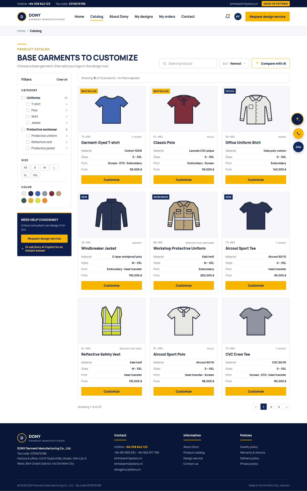
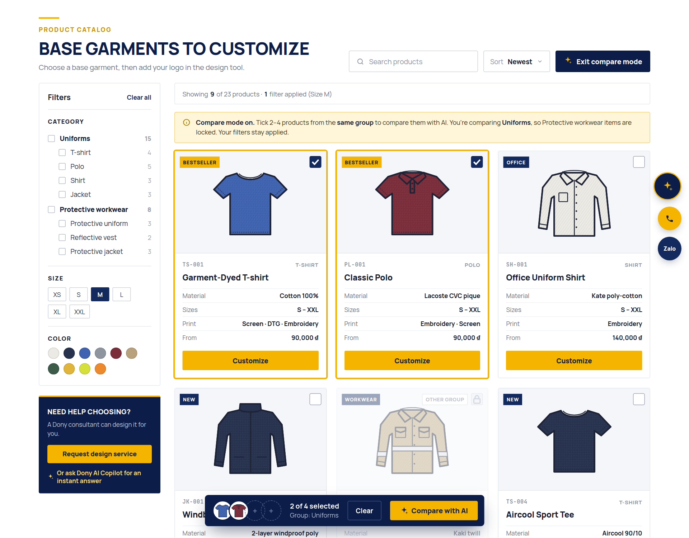
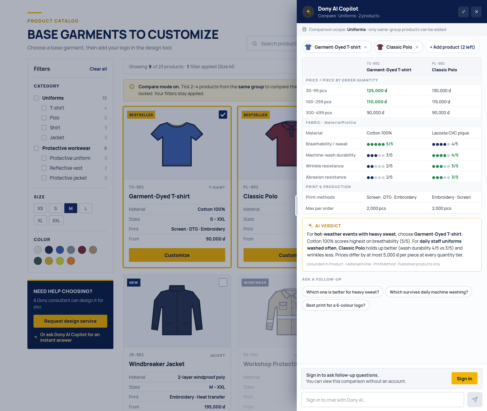
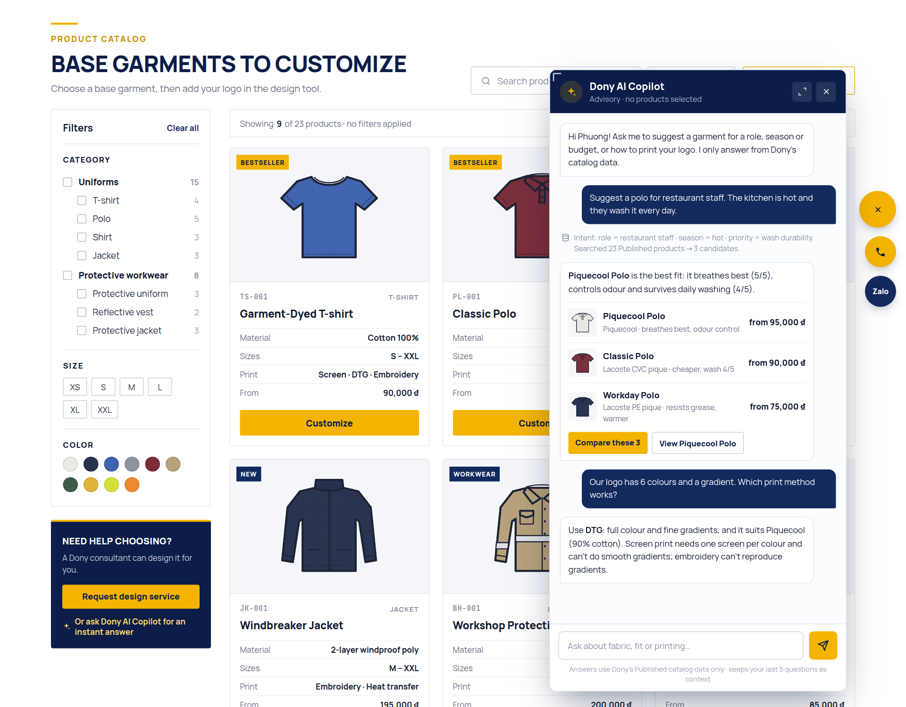

# Screen Spec: S08 Product Catalog

| Field | Value |
|---|---|
| Screen ID | `S08` |
| Screen name | Product Catalog |
| Actor | Guest/Member |
| Priority | P1 |
| Belongs to module | [MFG-04](../specs/spec-MFG-04.md) |
| Route | `/catalog` |
| Mockup image | img/S08-product_catalog_screen.png |
| Status | Resolved implementation specification |

## 1. Purpose

**Shown when:** The public catalog returns Published products only, with allowlisted search, category, size, color and sort filters. All identifiers and permissions come from the server session; list filters are allowlisted and recoverable failures preserve entered values.

**The user leaves this screen when:** An authorized action in section 5 succeeds, the user follows a role-allowed global route, or they return to the validated originating route.

## 2. Mockup

Written requirements take precedence over illustrative mockup content. Product names, counts, prices, material ratings and lead times in these images are sample content, not approved catalogue facts or delivery promises. The design-service action remains subject to MFG-05 release scope.

## 3. Element inventory

| # | Element | Type | Content / data source | Required | Validation |
|---|---|---|---|---|---|
| 1 | Screen heading | Heading | Product Catalog | Yes | Static route title. |
| 2 | Route | Navigation target | /catalog | Yes | Access checked on server. |
| 3 | q | Field / control | optional trimmed search string, at most 100 characters; longer input returns 422 and is preserved. | As specified | q: optional trimmed search string, at most 100 characters; longer input returns 422 and is preserved. |
| 4 | category,size,color | Field / control | optional allowlisted filters supported by product. | As specified | category,size,color: optional allowlisted filters supported by product. |
| 5 | sort | Field / control | allowlisted (name, unit_price_vnd, created_at) | As specified | sort: allowlisted (name, unit_price_vnd, created_at); page>=1, page_size 1..100 default20. |
| 6 | Results | Field / control | Published products only | As specified | Results: Published products only; unit_price_vnd integer. |
| 7 | API errors | Field / control | standard API error envelope | As specified | 400 malformed; 422 invalid fields; 409 stale/duplicate; 429 rate limit; 503 dependency failure |
| 8 | Search/filter/sort | Action | Query published products using allowlisted filters and pagination. | Available when authorized | Destination: S08 |
| 9 | Open product | Action | Load public detail after published-state check. | Available when authorized | Destination: S09 |
| 10 | Compare with AI | Action | Toggle compare mode and enable checkbox selection for 2-4 Published products in the same `branch`; do not show Draft/Hidden/Archived products. | Available when authorized | Destination: AI Copilot compare panel |
| 11 | AI Copilot compare panel | Component | Pop-up or side drawer that renders the grounded comparison table and verdict. | Available when authorized | Must keep the same `branch` and hide cross-branch items from selection |

### Product Finder extension (Should)

The Must catalogue grid and search remain available independently. When F-PROD-012 is enabled, apply [MFG-04 US-8 and sections 5.3–5.4](../specs/spec-MFG-04.md#53-keyword-matching-model-f-prod-012) to the existing search field, using the same current category/size/colour/material/price filters as the grid. Show the selected category scope; reject unknown values without resetting to all categories. Both suggestions and the full grid use the same matching rules; the full grid keeps normal pagination and the existing explicit sort options.

| Panel state | Content and behavior |
|---|---|
| Empty query, focused | Up to four eligible featured products without panel scrolling, Published product count for the active constraints, popular keywords and current-session recent searches. Fewer than four eligible products shows only those products. |
| Matching query | Query, total eligible match count before the suggestion cap, recognised attribute chips and up to ten matching products; four rows visible with a visible scrollbar/list-edge fade. Footer runs the full query on S08, preserving filters. |
| No match | Explicit no-match message; valid spelling suggestion or popular keywords are labelled alternatives, never product matches. Activating a keyword submits that keyword under the same active filters. Show the design-service route only if enabled by MFG-05 release scope. |
| Loading/error/rejected input | Labelled progress or recoverable error, preserving query and filters. Do not present old-query results as current matches; late responses for previous queries/filters cannot overwrite the current panel. |

Each product row follows the same catalogue content as [S09](S09-product_detail_screen.md): safe image, stored name with matching text highlighted, existing secondary name if available, supported colour swatches with names, material, SKU, catalogue price and MOQ. Emphasise a matched colour first. Price remains catalogue information under MFG-04 tier/surcharge rules, not a confirmed quote. Attribute labels come from stored catalogue values; matching uses all-token AND, normalisation, synonyms and typo limits in MFG-04, with no generated product claims.

Debounce requests; use MFG-04 performance targets. Arrow keys move the active row and bring it into view; Enter opens the active product on S09, or runs full search on S08 when no row is active. Escape closes the panel; clear empties the input. Use a labelled combobox with announced expanded/loading/count/error state and active option, visible focus and a distinct active-row background. The four-row list must fit the 360px layout without horizontal overflow. Selecting a product rechecks its current Published status; hidden/archived products are never exposed by stale suggestions.

The optional service action references [S15](S15-design_service_request_screen.md), preserving its login and availability rules. Product discovery stays public. Recent searches exist only for the current browser session; this extension adds no MFG-11 query tracking.

### AI Compare and advisory extension (Should)

Compare with AI enters a selection mode while preserving the catalogue query, filters and pagination. Select 2-4 Published products from the same `branch`; disable cross-branch checkboxes and further additions at four products. Show the selected count/group with Clear, Exit compare mode and Compare actions. The AI Copilot drawer displays quantity-tier pricing, material facts, print compatibility, pros/cons and a grounded verdict. The first selected product defines the branch; same-branch products can be added or removed within the comparison limits.

Guests may read the comparison but must sign in at S03 before sending questions; preserve a safe return route and the comparison context. Advisory opens independently of compare selection and accepts free-form needs after login, returning four candidates by default and eight maximum. Turning recommendations into a comparison still requires 2-4 same-branch products. Product Finder retains its existing keyword matching and suggestion behavior independently.

Follow-ups on the five technical criteria use the active comparison set's Product/MaterialProfile/PrintMethod data. Keep only the latest five Q&A exchanges as context. Missing evidence shows "Chưa đủ dữ liệu, Dony sẽ liên hệ trực tiếp." Apply [MFG-04 section 5.5](../specs/spec-MFG-04.md#55-ai-compare-and-advisory-f-prod-013--f-prod-014), including current visibility checks and MVP colour-invariant prices. A suggested product opens its current Published detail on S09.

## 4. States

| State | What the user sees | Trigger |
|---|---|---|
| Loading | Load the S08 Product Catalog view model and show labelled progress; keep writes disabled until route data and authorization are resolved. | Request starts |
| Empty | Show “No matching products” with a clear-filters action; preserve search and filter values. | Screen has no eligible or matching record |
| Forbidden/not found | Return a safe 401/403/404 for S08 Product Catalog without revealing inaccessible record, customer, staff or payment details. | 401/403/404 |
| Error | For S08 Product Catalog, show the API code, message, field_errors and request_id; preserve safe user-entered values. | Request failure |
| Retry | Retry transient reads for S08 Product Catalog; retry a mutation only with its original idempotency key and identical payload, never as a new side effect. | Recoverable failure |
| Success | Refresh the committed Product Catalog data and show the next action permitted by its lifecycle and actor. | Valid action commits |
| Conflict | The Product Catalog data or lifecycle changed concurrently; reload authoritative state and do not replay a stale mutation. | Stale version, duplicate or invalid lifecycle transition |
| AI loading | Show labelled comparison/advisory progress without presenting an older response as current. | AI request pending |
| AI unavailable/error | Preserve safe query/selection state, show a recoverable error and keep ordinary catalogue/detail usable. | Webhook unconfigured or request fails |
| AI insufficient data | Show "Chưa đủ dữ liệu, Dony sẽ liên hệ trực tiếp." for unsupported conclusions. | Required grounding evidence missing |

## 5. Interactions and navigation

| # | Element | User action | System response | Goes to screen |
|---|---|---|---|---|
| 1 | Search/filter/sort | Activate | Query published products using allowlisted filters and pagination. | S08 |
| 2 | Open product | Activate | Load public detail after published-state check. | S09 |
| 3 | Compare with AI | Activate | Enter compare mode and let the user select 2-4 Published products in the same `branch`; products from other groups are disabled via checkbox state. | AI Copilot compare panel |
| 4 | AI Copilot compare panel | Activate | Show grounded comparison facts and verdict; guests may view, but free-text chat requires login with a safe `return_to` back to this screen. | S08 or login flow |

Portal: Guest/Member. Route: /catalog. Back preserves the originating route and filters. Fallback: Customer→S26; Sales Admin→S28; Sales→S20; System Admin→S41; Guest→S01. Enforce role, ownership and assignment before rendering.

## 6. Screen-level rules

| Rule ID | Rule | Source |
|---|---|---|
| SR-001 | Access and ownership are checked server-side; do not trust submitted customer, company, role, price, or provider status. Apply 401/403/404 behavior and the field rules above. | Authorization and data ownership requirements |
| SR-002 | IDs are UUIDs; timestamps are UTC and displayed in Asia/Ho_Chi_Minh; money and quantities are integers. Mutations use expected_version; significant create/sign/pay/batch operations use idempotency keys. | Data representation and concurrency requirements |
| SR-003 | Apply the module lifecycle and validation rules linked below; preserve immutable submitted snapshots. | Module specification |
| SR-004 | Selected product and technical defaults are project implementation decisions; do not invent factual company, author, client-approval, or course identifiers. | Project implementation assumptions |

### Acceptance scenarios

1. Search and filter return only Published products and preserve page/filter state.
2. Draft/Hidden/Archived products never appear, including exact SKU matches and stale index entries.
3. When Product Finder is enabled, compare unaccented/partial/joined/typo and category-plus-colour queries with the MFG-04 keyword test set; suggestions and full search share eligible matches.
4. Four featured products at most; ten suggestions at most with four visible rows; the total count is calculated after all active constraints and before the cap.
5. Unknown filters or a query longer than 100 characters are rejected without broadening; late responses cannot overwrite newer query/filter state.
6. Keyboard navigation, Enter/Escape/clear, full-results navigation and optional S15 navigation preserve the specified route and release boundaries.

7. Compare mode preserves search/filter state; 2-4 same-branch products can be compared, cross-branch items and a fifth addition are blocked, and invalid/stale selections are rechecked before use.
8. Guest sees the grounded comparison but cannot send questions until login restores the comparison context; authenticated advisory works without preselection and observes the 4-default/8-maximum candidate cap.
9. Technical follow-ups use the selected products and latest five exchanges; missing evidence returns the fixed fallback, and colour selection does not change a product's MVP price table.

## 7. Linked requirements

| FR ID (from the module spec) | What this screen does for it |
|---|---|
| MFG-04/F-PROD-001 | **View Catalog** — Return Dony's paginated catalogue of Published configurable garment bases using allowlisted category and sort values; these are not ready-made inventory. |
| MFG-04/F-PROD-002 | **View Catalog** — Return a product detail and options for a canonical product UUID; nonpublic products return 404. |
| MFG-04/F-PROD-003 | Must paginated keyword search with validated filters and preserved query state. |
| MFG-04/F-PROD-012 (FR-012..017) | Should Product Finder: keyword matching, featured/results/no-match panel, attribute reasons, scope and current Published-only search eligibility. |
| MFG-04/F-PROD-013 (FR-018..020, FR-022..025) | Same-branch comparison, guest view/login-gated follow-up and grounded technical answers. |
| MFG-04/F-PROD-014 (FR-020..025) | Login-gated advisory without preselection, bounded candidate suggestions and catalogue-grounded answers. |

## 8. Responsive and accessibility notes

Support 360px through desktop; stack columns and use labelled horizontal-scroll tables on narrow screens. Controls are keyboard-operable with visible focus, logical headings, associated form labels, and aria-live status/error announcements. Text contrast is at least 4.5:1 (large text 3:1); pointer targets are at least 24px. Preserve user-entered data after recoverable failures. Confirm destructive actions, disable duplicate submit while pending, and enforce idempotency on the server.

## 9. Open questions

| # | Question | Blocking? | Status |
|---|---|---|---|
| 1 | AI webhook runtime contract and conversation storage remain Plan decisions; see MFG-04 section 10. | Yes, before implementing AI | Open; product behavior is defined above |

## Completion checklist

- [x] Route, actor, module, priority, and mockup status are identified.
- [x] Element fields, actions, validation, and data ownership are documented.
- [x] Loading, empty, forbidden, error, retry, success, and conflict states are documented.
- [x] Navigation and acceptance scenarios are explicit.
- [x] Responsive and accessibility requirements follow the shared baseline.
- [ ] Resolve the MFG-04 AI integration handoff at Plan before implementation.
