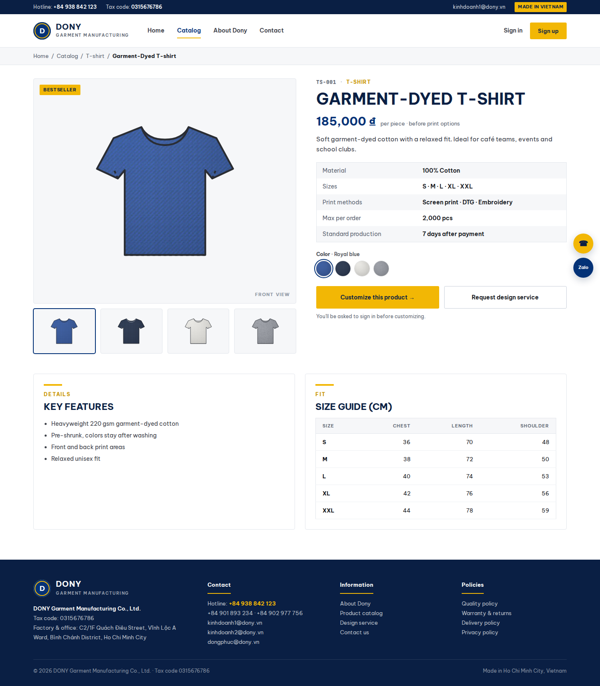

# Screen Spec: S09 Product Detail

| Field | Value |
|---|---|
| Screen ID | `S09` |
| Screen name | Product Detail |
| Actor | Guest and authenticated user |
| Priority | P1 |
| Belongs to module | [MFG-04](../specs/spec-MFG-04.md) |
| Route | `/products/{product_id}` |
| Mockup image | img/S09-product_detail_screen.png |
| Status | Resolved implementation specification |

## 1. Purpose

**Shown when:** The product detail shows a current Published Dony garment base, supported materials, colours, customization methods, capacity and safe images. It describes what Dony can manufacture to order; it is not a ready-made item or stock record. Hidden, Archived or inaccessible products return not found. All identifiers and permissions come from the server session; list filters are allowlisted and recoverable failures preserve entered values.

**The user leaves this screen when:** An authorized action in section 5 succeeds, the user follows a role-allowed global route, or they return to the validated originating route.

## 2. Mockup

Written behavior below takes precedence over obsolete sample content.

## 3. Element inventory

| # | Element | Type | Content / data source | Required | Validation |
|---|---|---|---|---|---|
| 1 | Screen heading | Heading | Product Detail | Yes | Static route title. |
| 2 | Route | Navigation target | /products/{product_id} | Yes | Access checked on server. |
| 3 | product_id | Field / control | UUID path | As specified | product_id: UUID path; inaccessible/unpublished product returns 404. |
| 4 | name, SKU, category | Field / control | Read-only Dony product-base data. | As specified | Describes a configurable garment base, not a finished item in stock. |
| 5 | unit_price_vnd | Field / control | integer >=0 | As specified | unit_price_vnd: integer >=0; no client price edits. |
| 6 | sizes/colors/materials/capacity | Field / control | only currently supported options | As specified | sizes/colors/materials/capacity: only currently supported options; no checkout if Hidden/Archived. |
| 7 | API errors | Field / control | standard API error envelope | As specified | 400 malformed; 422 invalid fields; 409 stale/duplicate; 429 rate limit; 503 dependency failure |
| 8 | Customize | Action | Customer opens a design bound to current product_version; Guest/non-Customer authenticates with safe return_to. | Available when authorized | Destination: S13 or S03 |
| 9 | Request design service | Action | Customer opens DesignRequest form; Guest/non-Customer authenticates with safe return_to. | Available when authorized | Destination: S15 or S03 |
| 10 | Back to results | Action | Preserve catalog filters. | Available when authorized | Destination: S08 |

## 4. States

| State | What the user sees | Trigger |
|---|---|---|
| Loading | Load the S09 Product Detail view model and show labelled progress; keep writes disabled until route data and authorization are resolved. | Request starts |
| Empty | Show a safe unavailable-product state with a link back to the catalog; do not expose unpublished data. | Screen has no eligible or matching record |
| Forbidden/not found | Return a safe 401/403/404 for S09 Product Detail without revealing inaccessible record, customer, staff or payment details. | 401/403/404 |
| Error | For S09 Product Detail, show the API code, message, field_errors and request_id; preserve safe user-entered values. | Request failure |
| Retry | Retry transient reads for S09 Product Detail; retry a mutation only with its original idempotency key and identical payload, never as a new side effect. | Recoverable failure |
| Success | Refresh the committed Product Detail data and show the next action permitted by its lifecycle and actor. | Valid action commits |
| Conflict | The Product Detail data or lifecycle changed concurrently; reload authoritative state and do not replay a stale mutation. | Stale version, duplicate or invalid lifecycle transition |
## 5. Interactions and navigation

| # | Element | User action | System response | Goes to screen |
|---|---|---|---|---|
| 1 | Customize | Activate | Customer opens a design bound to current product_version; Guest/non-Customer authenticates with safe return_to. | S13 or S03 |
| 2 | Request design service | Activate | Customer opens DesignRequest form; Guest/non-Customer authenticates with safe return_to. | S15 or S03 |
| 3 | Back to results | Activate | Preserve catalog filters. | S08 |

Portal: Guest and authenticated user. Route: /products/{product_id}. Back preserves the originating route and filters. Fallback: Customer→S26; Sales Admin→S28; Sales→S20; System Admin→S41; Guest→S01. Enforce role, ownership and assignment before rendering.

## 6. Screen-level rules

| Rule ID | Rule | Source |
|---|---|---|
| SR-001 | Access and ownership are checked server-side; do not trust submitted customer, company, role, price, or provider status. Apply 401/403/404 behavior and the field rules above. | Authorization and data ownership requirements |
| SR-002 | IDs are UUIDs; timestamps are UTC and displayed in Asia/Ho_Chi_Minh; money and quantities are integers. Mutations use expected_version; significant create/sign/pay/batch operations use idempotency keys. | Data representation and concurrency requirements |
| SR-003 | Apply the module lifecycle and validation rules linked below; preserve immutable submitted snapshots. | Module specification |
| SR-004 | Selected product and technical defaults are project implementation decisions; do not invent factual company, author, client-approval, or course identifiers. | Project implementation assumptions |

### Acceptance scenarios

1. Published product detail shows supported options and integer VND price from server.
2. Hidden/Archived/inaccessible product id returns 404; no checkout action is offered.

## 7. Linked requirements

| FR ID (from the module spec) | What this screen does for it |
|---|---|
| MFG-04/F-PROD-002 | **View Catalog** — Return a product detail and options for a canonical product UUID; nonpublic products return 404. |

## 8. Responsive and accessibility notes

Support 360px through desktop; stack columns and use labelled horizontal-scroll tables on narrow screens. Controls are keyboard-operable with visible focus, logical headings, associated form labels, and aria-live status/error announcements. Text contrast is at least 4.5:1 (large text 3:1); pointer targets are at least 24px. Preserve user-entered data after recoverable failures. Confirm destructive actions, disable duplicate submit while pending, and enforce idempotency on the server.

## 9. Open questions

| # | Question | Blocking? | Status |
|---|---|---|---|
| 1 | No unresolved screen behavior questions remain; routes, fields, permissions, and defaults are resolved in this specification and its linked module requirements. | No | Resolved |

## Completion checklist

- [x] Route, actor, module, priority, and mockup status are identified.
- [x] Element fields, actions, validation, and data ownership are documented.
- [x] Loading, empty, forbidden, error, retry, success, and conflict states are documented.
- [x] Navigation and acceptance scenarios are explicit.
- [x] Responsive and accessibility requirements follow the shared baseline.
- [x] No unresolved screen-level decisions remain.
