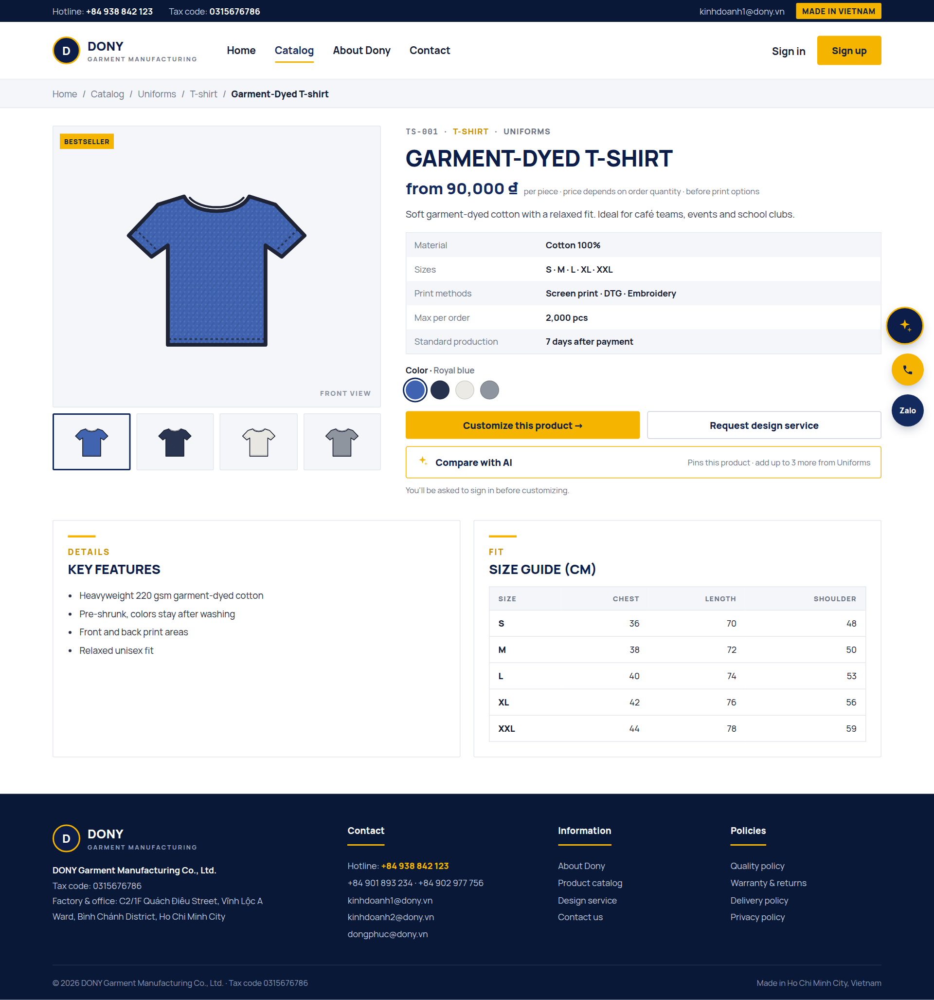
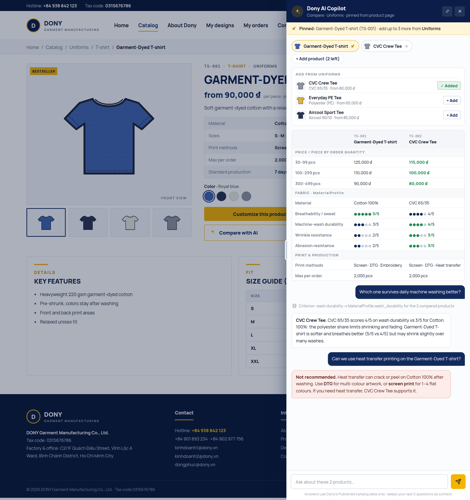

# Screen Spec: S09 Product Detail

| Field | Value |
|---|---|
| Screen ID | `S09` |
| Screen name | Product Detail |
| Actor | Guest and authenticated user |
| Priority | P1 |
| Belongs to module | [MFG-04](../specs/spec-MFG-04.md) |
| Route | `/products/{product_id}` |
| Mockup image | img/S09-product_detail_screen.png |
| Status | Resolved implementation specification |

## 1. Purpose

**Shown when:** The product detail shows a current Published Dony garment base, supported materials, colours, customization methods, capacity and safe images. It describes what Dony can manufacture to order; it is not a ready-made item or stock record. Hidden, Archived or inaccessible products return not found. All identifiers and permissions come from the server session; list filters are allowlisted and recoverable failures preserve entered values.

**The user leaves this screen when:** An authorized action in section 5 succeeds, the user follows a role-allowed global route, or they return to the validated originating route.

## 2. Mockup

Written requirements take precedence over illustrative mockup content. Product names, counts, prices, material ratings and lead times in these images are sample content, not approved catalogue facts or delivery promises. The design-service action remains subject to MFG-05 release scope.

## 3. Element inventory

| # | Element | Type | Content / data source | Required | Validation |
|---|---|---|---|---|---|
| 1 | Screen heading | Heading | Product Detail | Yes | Static route title. |
| 2 | Route | Navigation target | /products/{product_id} | Yes | Access checked on server. |
| 3 | product_id | Field / control | UUID path | As specified | product_id: UUID path; inaccessible/unpublished product returns 404. |
| 4 | name, SKU, category | Field / control | Read-only Dony product-base data. | As specified | Describes a configurable garment base, not a finished item in stock. |
| 5 | unit_price_vnd | Field / control | integer >=0 | As specified | unit_price_vnd: integer >=0; no client price edits. |
| 6 | sizes/colors/materials/capacity | Field / control | only currently supported options | As specified | sizes/colors/materials/capacity: only currently supported options; no checkout if Hidden/Archived. |
| 7 | API errors | Field / control | standard API error envelope | As specified | 400 malformed; 422 invalid fields; 409 stale/duplicate; 429 rate limit; 503 dependency failure |
| 8 | Customize | Action | Customer opens a design bound to current product_version; Guest/non-Customer authenticates with safe return_to. | Available when authorized | Destination: S13 or S03 |
| 9 | Request design service | Action | Customer opens DesignRequest form; Guest/non-Customer authenticates with safe return_to. | Available when authorized | Destination: S15 or S03 |
| 10 | Back to results | Action | Preserve catalog filters. | Available when authorized | Destination: S08 |
| 11 | Compare with AI | Action | Pin the current product as the starting context and open AI Copilot in compare mode; allow selecting up to 3 additional Published products from the same `branch` only. | Available when authorized | Destination: AI Copilot compare panel |
| 12 | AI Copilot compare panel | Component | Side-drawer or popup with AI-generated comparison table, material and print insights, and a verdict grounded in Product/MaterialProfile/PrintMethod. | Available when authorized | Must keep the current product as the context anchor |

### Pinned AI Compare extension (Should)

Compare with AI pins the current Published product as the comparison anchor and opens AI Copilot. Add 1-3 additional Published products from the same `branch` to reach the 2-4-product comparison set; keep the anchor pinned while this S09 comparison is active. Other branches are disabled. Product/MaterialProfile/PrintMethod supply the comparison table, technical follow-ups, print warnings and grounded verdict under [MFG-04 section 5.5](../specs/spec-MFG-04.md#55-ai-compare-and-advisory-f-prod-013--f-prod-014).

Guests may read results but must sign in through S03 before sending questions, using a safe `return_to` that restores the product/compare context. Keep only the latest five Q&A exchanges; do not treat the conversation as MFG-11 guest analytics. All colours of one product use the same MVP price table; other material/print surcharges retain BR-008. Missing evidence shows "Chưa đủ dữ liệu, Dony sẽ liên hệ trực tiếp." If a product becomes nonpublic, do not serve its stale facts as a current comparison.

## 4. States

| State | What the user sees | Trigger |
|---|---|---|
| Loading | Load the S09 Product Detail view model and show labelled progress; keep writes disabled until route data and authorization are resolved. | Request starts |
| Empty | Show a safe unavailable-product state with a link back to the catalog; do not expose unpublished data. | Screen has no eligible or matching record |
| Forbidden/not found | Return a safe 401/403/404 for S09 Product Detail without revealing inaccessible record, customer, staff or payment details. | 401/403/404 |
| Error | For S09 Product Detail, show the API code, message, field_errors and request_id; preserve safe user-entered values. | Request failure |
| Retry | Retry transient reads for S09 Product Detail; retry a mutation only with its original idempotency key and identical payload, never as a new side effect. | Recoverable failure |
| Success | Refresh the committed Product Detail data and show the next action permitted by its lifecycle and actor. | Valid action commits |
| Conflict | The Product Detail data or lifecycle changed concurrently; reload authoritative state and do not replay a stale mutation. | Stale version, duplicate or invalid lifecycle transition |
| AI loading | Show labelled comparison/advisory progress without presenting an older response as current. | AI request pending |
| AI unavailable/error | Preserve safe query/selection state, show a recoverable error and keep ordinary catalogue/detail usable. | Webhook unconfigured or request fails |
| AI insufficient data | Show "Chưa đủ dữ liệu, Dony sẽ liên hệ trực tiếp." for unsupported conclusions. | Required grounding evidence missing |

## 5. Interactions and navigation

| # | Element | User action | System response | Goes to screen |
|---|---|---|---|---|
| 1 | Customize | Activate | Customer opens a design bound to current product_version; Guest/non-Customer authenticates with safe return_to. | S13 or S03 |
| 2 | Request design service | Activate | Customer opens DesignRequest form; Guest/non-Customer authenticates with safe return_to. | S15 or S03 |
| 3 | Back to results | Activate | Preserve catalog filters. | S08 |
| 4 | Compare with AI | Activate | Pin the current product as the comparison anchor and open AI Copilot compare mode; the user may add 1-3 more Published products from the same `branch`, while other branch items remain disabled. | AI Copilot compare panel |
| 5 | AI Copilot follow-up | Activate | When the comparison panel is open, guests may read the comparison but must login before free-form questions. Chat stays scoped to the active compare set and the last 5 Q&A exchanges. | S09 or login flow |

Portal: Guest and authenticated user. Route: /products/{product_id}. Back preserves the originating route and filters. Fallback: Customer→S26; Sales Admin→S28; Sales→S20; System Admin→S41; Guest→S01. Enforce role, ownership and assignment before rendering.

## 6. Screen-level rules

| Rule ID | Rule | Source |
|---|---|---|
| SR-001 | Access and ownership are checked server-side; do not trust submitted customer, company, role, price, or provider status. Apply 401/403/404 behavior and the field rules above. | Authorization and data ownership requirements |
| SR-002 | IDs are UUIDs; timestamps are UTC and displayed in Asia/Ho_Chi_Minh; money and quantities are integers. Mutations use expected_version; significant create/sign/pay/batch operations use idempotency keys. | Data representation and concurrency requirements |
| SR-003 | Apply the module lifecycle and validation rules linked below; preserve immutable submitted snapshots. | Module specification |
| SR-004 | Selected product and technical defaults are project implementation decisions; do not invent factual company, author, client-approval, or course identifiers. | Project implementation assumptions |

### Acceptance scenarios

1. Published product detail shows supported options and integer VND price from server.
2. Hidden/Archived/inaccessible product id returns 404; no checkout action is offered.

3. S09 remains pinned when adding 1-3 same-branch products; cross-branch/fifth selections are blocked and Published state is rechecked.
4. Guests can read results; questions require login with restored context, and follow-ups stay grounded in the active products and latest five exchanges.
5. Missing material/print evidence uses the fixed fallback; changing colour does not alter the MVP price table and a comparison does not create a quote or delivery commitment.

## 7. Linked requirements

| FR ID (from the module spec) | What this screen does for it |
|---|---|
| MFG-04/F-PROD-002 | **View Catalog** — Return a product detail and options for a canonical product UUID; nonpublic products return 404. |
| MFG-04/F-PROD-013 (FR-018..020, FR-022..025) | Same-branch comparison, guest view/login-gated follow-up and grounded technical answers. |

## 8. Responsive and accessibility notes

Support 360px through desktop; stack columns and use labelled horizontal-scroll tables on narrow screens. Controls are keyboard-operable with visible focus, logical headings, associated form labels, and aria-live status/error announcements. Text contrast is at least 4.5:1 (large text 3:1); pointer targets are at least 24px. Preserve user-entered data after recoverable failures. Confirm destructive actions, disable duplicate submit while pending, and enforce idempotency on the server.

## 9. Open questions

| # | Question | Blocking? | Status |
|---|---|---|---|
| 1 | AI webhook runtime contract and conversation storage remain Plan decisions; see MFG-04 section 10. | Yes, before implementing AI | Open; product behavior is defined above |

## Completion checklist

- [x] Route, actor, module, priority, and mockup status are identified.
- [x] Element fields, actions, validation, and data ownership are documented.
- [x] Loading, empty, forbidden, error, retry, success, and conflict states are documented.
- [x] Navigation and acceptance scenarios are explicit.
- [x] Responsive and accessibility requirements follow the shared baseline.
- [ ] Resolve the MFG-04 AI integration handoff at Plan before implementation.
