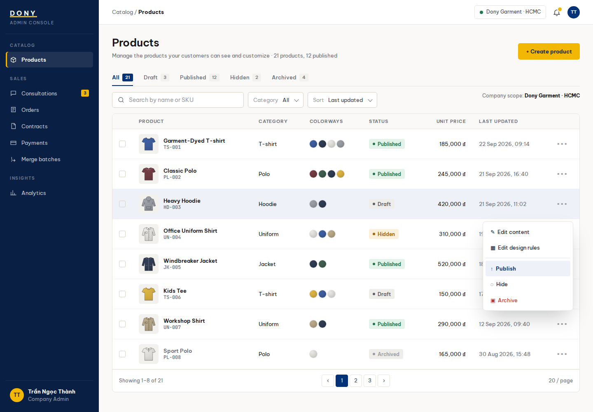

# Screen Spec: S10 Product List (Sales Admin)

| Field | Value |
|---|---|
| Screen ID | `S10` |
| Screen name | Product List (Sales Admin) |
| Actor | Sales Admin |
| Priority | P2 |
| Belongs to module | [MFG-04](../specs/spec-MFG-04.md) |
| Route | `/admin/products` |
| Mockup image | img/S10-product_list_company_admin_screen.png |
| Status | Resolved implementation specification |

## 1. Purpose

**Shown when:** The Sales Admin manages Dony's configurable garment bases, with Draft, Published, Hidden and Archived status and product-level actions. These records describe production options and rules, not ready-made inventory. All identifiers and permissions come from the server session; list filters are allowlisted and recoverable failures preserve entered values.

**The user leaves this screen when:** An authorized action in section 5 succeeds, the user follows a role-allowed global route, or they return to the validated originating route.

## 2. Mockup

Written behavior below takes precedence over obsolete sample content.

## 3. Element inventory

| # | Element | Type | Content / data source | Required | Validation |
|---|---|---|---|---|---|
| 1 | Screen heading | Heading | Product List (Sales Admin) | Yes | Static route title. |
| 2 | Route | Navigation target | /admin/products | Yes | Access checked on server. |
| 3 | q | Field / control | optional trimmed search | As specified | q: optional trimmed search; status: Draft, Published, Hidden, Archived. |
| 4 | page / page_size / sort / filters | Field / control | pagination and allowlisted query | As specified | page >=1; page_size 1..100, default 20; reject unknown sort/filter fields. |
| 5 | Each row | Field / control | product UUID, SKU, name, state, unit_price_vnd integer, updated_at, version. | As specified | Each row: product UUID, SKU, name, state, unit_price_vnd integer, updated_at, version. |
| 6 | Dony administration scope | Field / control | session-derived, read-only | As specified | Require an active Sales Admin role; no company or tenant selector is accepted. |
| 7 | API errors | Field / control | standard API error envelope | As specified | 400 malformed; 422 invalid fields; 409 stale/duplicate; 429 rate limit; 503 dependency failure |
| 8 | Create product | Action | Open create form. | Available when authorized | Destination: S11 |
| 9 | Edit content | Action | Open Dony-owned product base form. | Available when authorized | Destination: S12 |
| 10 | Edit design rules | Action | Open rule form for same product. | Available when authorized | Destination: S14 |
| 11 | Publish/hide/archive | Action | Confirm and apply allowed state transition; archive terminal and removes public listing. | Available when authorized | Destination: S10 |

## 4. States

| State | What the user sees | Trigger |
|---|---|---|
| Loading | Load the S10 Product List (Sales Admin) view model and show labelled progress; keep writes disabled until route data and authorization are resolved. | Request starts |
| Empty | No Product List (Sales Admin) records match the current route/filter; preserve inputs and show only the screen’s authorized next action. | Screen has no eligible or matching record |
| Forbidden/not found | Return a safe 401/403/404 for S10 Product List (Sales Admin) without revealing inaccessible record, customer, staff or payment details. | 401/403/404 |
| Error | For S10 Product List (Sales Admin), show the API code, message, field_errors and request_id; preserve safe user-entered values. | Request failure |
| Retry | Retry transient reads for S10 Product List (Sales Admin); retry a mutation only with its original idempotency key and identical payload, never as a new side effect. | Recoverable failure |
| Success | Refresh the committed Product List (Sales Admin) data and show the next action permitted by its lifecycle and actor. | Valid action commits |
| Conflict | The Product List (Sales Admin) data or lifecycle changed concurrently; reload authoritative state and do not replay a stale mutation. | Stale version, duplicate or invalid lifecycle transition |
## 5. Interactions and navigation

| # | Element | User action | System response | Goes to screen |
|---|---|---|---|---|
| 1 | Create product | Activate | Open create form. | S11 |
| 2 | Edit content | Activate | Open Dony-owned product base form. | S12 |
| 3 | Edit design rules | Activate | Open rule form for same product. | S14 |
| 4 | Publish/hide/archive | Activate | Confirm and apply allowed state transition; archive terminal and removes public listing. | S10 |

Portal: Sales Admin. Route: /admin/products. Back preserves the originating route and filters. Fallback: Customer→S26; Sales Admin→S28; Sales→S20; System Admin→S41; Guest→S01. Enforce role, ownership and assignment before rendering.

## 6. Screen-level rules

| Rule ID | Rule | Source |
|---|---|---|
| SR-001 | Access and ownership are checked server-side; do not trust submitted customer, company, role, price, or provider status. Apply 401/403/404 behavior and the field rules above. | Authorization and data ownership requirements |
| SR-002 | IDs are UUIDs; timestamps are UTC and displayed in Asia/Ho_Chi_Minh; money and quantities are integers. Mutations use expected_version; significant create/sign/pay/batch operations use idempotency keys. | Data representation and concurrency requirements |
| SR-003 | Apply the module lifecycle and validation rules linked below; preserve immutable submitted snapshots. | Module specification |
| SR-004 | Selected product and technical defaults are project implementation decisions; do not invent factual company, author, client-approval, or course identifiers. | Project implementation assumptions |

### Acceptance scenarios

1. Sales Admin sees Dony's configurable garment bases and can archive one after confirmation; there is no company/tenant selector.
2. Publishing fails until all required content, option, capacity, and safe-image checks pass.

## 7. Linked requirements

| FR ID (from the module spec) | What this screen does for it |
|---|---|
| MFG-04/F-PROD-004 | **Add Product** — Show management actions only for Dony Sales Admins. |
| MFG-04/F-PROD-005 | **Add Product** — Render product creation form and upload constraints. |
| MFG-04/F-PROD-006 | **Add Product** — Save a validated Draft product with idempotency and Dony-scoped SKU uniqueness. |
| MFG-04/F-PROD-007 | **Update Product** — Render an authorized product edit model with current version. |
| MFG-04/F-PROD-008 | **Update Product** — Update allowlisted product fields atomically with expected-version checks. |
| MFG-04/F-PROD-009 | **Delete Product** — Require explicit confirmation before archiving a product. |
| MFG-04/F-PROD-010 | **Delete Product** — Soft-archive a published/used product while retaining historical references; hard-delete only a never-published Draft after explicit confirmation. |
| MFG-04/F-PROD-011 | **Publish Product** — Change product visibility to an explicitly requested valid state. |

## 8. Responsive and accessibility notes

Support 360px through desktop; stack columns and use labelled horizontal-scroll tables on narrow screens. Controls are keyboard-operable with visible focus, logical headings, associated form labels, and aria-live status/error announcements. Text contrast is at least 4.5:1 (large text 3:1); pointer targets are at least 24px. Preserve user-entered data after recoverable failures. Confirm destructive actions, disable duplicate submit while pending, and enforce idempotency on the server.

## 9. Open questions

| # | Question | Blocking? | Status |
|---|---|---|---|
| 1 | No unresolved screen behavior questions remain; routes, fields, permissions, and defaults are resolved in this specification and its linked module requirements. | No | Resolved |

## Completion checklist

- [x] Route, actor, module, priority, and mockup status are identified.
- [x] Element fields, actions, validation, and data ownership are documented.
- [x] Loading, empty, forbidden, error, retry, success, and conflict states are documented.
- [x] Navigation and acceptance scenarios are explicit.
- [x] Responsive and accessibility requirements follow the shared baseline.
- [x] No unresolved screen-level decisions remain.
