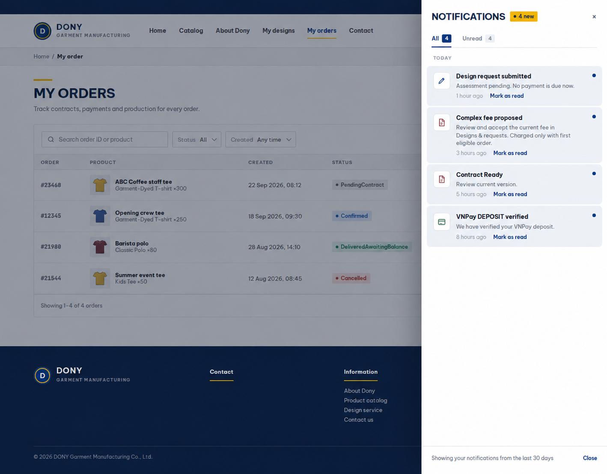

# Screen Spec: S13 Notification Panel

| Field | Value |
|---|---|
| Screen ID | `S13` |
| Screen name | Notification Panel |
| Actor | Authenticated user |
| Priority | Must (MVP) |
| Belongs to module | [MFG-01](../specs/spec-MFG-01.md) |
| Route | `/notifications` |
| Mockup image | img/S13-01-notifications.png |
| Status | Resolved implementation specification |

## 1. Purpose

**Shown when:** The authenticated recipient sees their persisted in-app notifications. Opening a target rechecks authorization; email delivery remains secondary. All identifiers and permissions come from the server session; list filters are allowlisted and recoverable failures preserve entered values.

**The user leaves this screen when:** An authorized action in section 5 succeeds, the user follows a role-allowed global route, or they return to the validated originating route.

## 2. Mockup

The mockup illustrates the defined workflow. Fictional sample values do not replace the field, lifecycle and release-scope rules below.

### Mockup deviations

- Hide the “Design service” navigation entry and design-request/fee notification examples while the Could service workflow is outside MVP.

## 3. Element inventory

| # | Element | Type | Content / data source | Required | Validation |
|---|---|---|---|---|---|
| 1 | Screen heading | Heading | Notification Panel | Yes | Static route title. |
| 2 | Route | Navigation target | /notifications | Yes | Access checked on server. |
| 3 | notification_id / recipient | Field / control | UUID plus session-derived owner | As specified | Sanitize event/target content; never accept a submitted recipient as authority. |
| 4 | read_at / pagination | Field / control | nullable UTC plus bounded paging | As specified | Event/recipient uniqueness suppresses duplicates. |
| 5 | target_route | Field / control | optional internal route | As specified | Reauthorize the target when opened; hide invalid or inaccessible deep links. |
| 6 | email_delivery_state | Field / control | secondary read-only status | As specified | The persisted in-app inbox remains authoritative. |
| 7 | order lifecycle event | Notification payload | safe design/sample/contract/deposit/production/shipment/receipt/balance label | Optional | Identify the order by its `order_number` (MFG-06 BR-017), never by UUID text. Deep link to S35, S37, S38 or S40 only after fresh authorization; never include provider secrets. |
| 8 | API errors | Field / control | standard API error envelope | As specified | 400 malformed; 422 invalid fields; 409 stale/duplicate; 429 rate limit; 503 dependency failure |
| 9 | Mark read | Action | Persist recipient read_at; repeated action is idempotent. | Available when authorized | Destination: S13 |
| 10 | Open notification | Action | Resolve allowlisted target and reauthorize target access. | Available when authorized | Destination: authorized target route |
| 11 | Close | Action | Return to prior validated route. | Available when authorized | Destination: Origin |

## 4. States

**Loading, access, errors and retry:** Show a labelled Loading state while reads resolve. A missing or inaccessible route returns a safe 401/403/404 without disclosing protected records. Error states show the API code, message, field_errors and request_id while preserving safe input. Retry transient reads; retry a mutation only with the original idempotency key and identical payload. Preserve safe user input after recoverable failures.

| State | What the user sees | Trigger |
|---|---|---|
| Empty | Show “You are all caught up” when no unread or recent notification exists. | Screen has no eligible or matching record |
| Success | Refresh the committed Notification Panel data and show the next action permitted by its lifecycle and actor. | Valid action commits |
| Conflict | The Notification Panel data or lifecycle changed concurrently; reload authoritative state and do not replay a stale mutation. | Stale version, duplicate or invalid lifecycle transition |
## 5. Interactions and navigation

| # | Element | User action | System response | Goes to screen |
|---|---|---|---|---|
| 1 | Mark read | Activate | Persist recipient read_at; repeated action is idempotent. | S13 |
| 2 | Open notification | Activate | Resolve allowlisted target and reauthorize target access. | authorized target route |
| 3 | Close | Activate | Return to prior validated route. | Origin |

Portal: Authenticated user. Route: /notifications. Back preserves the originating route and filters. 

### Merge approval notices (post-MFG-10 activation)

Send deduplicated negative-benefit advance warnings, waiting-expiry approval requests and missed-plan/deadline-risk notices to Sales Admin. The operational link opens [S46](S46-production-planning.md) with the order/run context after fresh authorization, preserving unread/handled status. A delivered notice, click or read acknowledgement does not approve a plan, convert a flexible order or start production. Customer notices describe only their own committed terms and genuinely approved/started plan, not other customers or a pending recommendation.

### Sales pipeline and design collaboration notices

Persist assignment/reassignment notices for affected staff/customer recipients, Pending Admin Review notices for Sales Admin and decision notices for the requester, deduplicated per committed event and recipient. Missing committed_due_at on an eligible assigned request may notify Sales Admin; a missing date is not an overdue event. Staff links open the reauthorized S27/S28 lead or S29 workspace.

Customer design notices open S26 request detail or the exact shared design/version. Sharing, feedback, a staff reply, approval, source confirmation and request/fee decisions notify only authorized participants. Customer payloads omit CRM notes, internal discussions, Admin Review text and private Draft versions. An old notification never bypasses current ownership/assignment checks. Mark-read does not approve a design, accept a fee or change a stage.

## 6. Screen-level rules

| Rule ID | Rule | Source |
|---|---|---|
| SR-001 | Check access and ownership on the server; never trust submitted customer, company, role, price, stage or provider status. Apply the documented 401/403/404 behavior and field rules. | Project baseline |
| SR-002 | IDs are UUIDs; timestamps are UTC and displayed in Asia/Ho_Chi_Minh; money and quantities are integers. Mutations use expected versions and idempotency keys where specified. | Project baseline |
| SR-003 | Apply the owning module's lifecycle and validation rules; preserve immutable submitted snapshots and design versions. | Project baseline |
| SR-004 | Use documented project assumptions; do not invent factual company, author, client-approval or course identifiers. | Project baseline |

### Acceptance scenarios

1. User sees only own persisted notifications and repeated mark-read is idempotent.
2. Opening an unauthorized/stale target is blocked after a fresh server access check.
3. Each committed digital approval, sample dispatch/decision, contract readiness/signature, deposit, shipment/receipt and balance event creates at most one notification per recipient; email failure does not roll back state.
4. MVP: a successful deposit recorded on a Cancelled order notifies Sales Admin that a manual refund is required (MFG-06 BR-019); the link opens S37 for that order.

## 7. Linked requirements

| FR ID (from the module spec) | What this screen does for it |
|---|---|
| MFG-01/F-USER-012 | **View notifications** — List the session owner's persisted in-app notifications with unread count and reauthorized target links. |
| MFG-01/F-USER-013 | **View notifications** — Mark an owned notification read idempotently. |

## 8. Responsive and accessibility notes

Support 360px through desktop; stack columns and use labelled horizontal-scroll tables on narrow screens. Controls are keyboard-operable with visible focus, logical headings, associated form labels, and aria-live status/error announcements. Text contrast is at least 4.5:1 (large text 3:1); pointer targets are at least 24px. Preserve user-entered data after recoverable failures. Confirm destructive actions, disable duplicate submit while pending, and enforce idempotency on the server.

## 9. Open questions

| # | Question | Blocking? | Status |
|---|---|---|---|
| 1 | No unresolved screen behavior questions remain; routes, fields, permissions, and defaults are resolved in this specification and its linked module requirements. | No | Resolved |

## Completion checklist

- [x] Route, actor, module, priority, and mockup status are identified.
- [x] Element fields, actions, validation, and data ownership are documented.
- [x] Loading, empty, forbidden, error, retry, success, and conflict states are documented.
- [x] Navigation and acceptance scenarios are explicit.
- [x] Responsive and accessibility requirements are documented in this screen.
- [x] No unresolved screen-level decisions remain.
