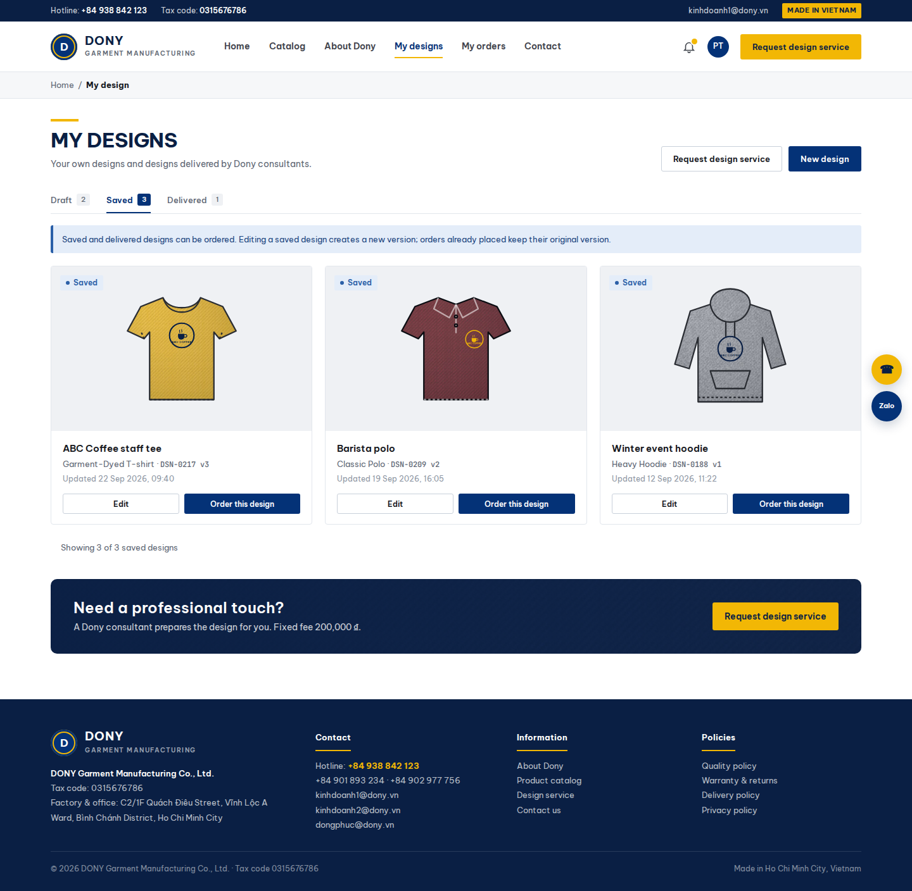

# Screen Spec: S17 Customer Designs

| Field | Value |
|---|---|
| Screen ID | `S17` |
| Screen name | Customer Designs |
| Actor | Customer owner |
| Priority | P1 |
| Belongs to module | [MFG-05](../specs/spec-MFG-05.md) |
| Route | `/designs` |
| Mockup image | img/S17-customer_designs_screen.png (historical reference) |
| Status | Integrated specification 2026-09-27 |

## 1. Purpose

Show the authenticated customer's existing designs as a gallery with product, version, status, preview and authorized actions. S17 contains no feedback form, version thread, request-detail tab, fee acceptance or cancellation controls. Those are in [S52](S52-delivered_designs_and_feedback_screen.md); request navigation remains available as a link. MVP includes saved self-designs only; service collaboration stays Could.

## 2. Mockup

The written contract takes precedence over obsolete mockup controls.

## 3. Element inventory

| # | Element | Type | Content / source | Required | Validation |
|---|---|---|---|---|---|
| 1 | Gallery and filters | Heading / controls | Owned designs, product/status filters, pagination | Yes | Session-derived customer; allowlisted filters; no private staff Draft versions. |
| 2 | Design card | Read-only summary | design_id, current customer-visible version, product, preview, status and updated_at | Per design | Private expiring asset URL; UTC displayed in Asia/Ho_Chi_Minh. |
| 3 | Status | Badge | Draft, Saved, ProofDelivered, Delivered | Yes | Only customer-created drafts appear; a shared proof awaits review and is not orderable. |
| 4 | Edit saved design | Action | Open self-design editor; create a new immutable version | If authorized | S13; ordered snapshots never change. |
| 5 | Open design / feedback | Link | Open exact shared/approved design | If authorized | S52; fresh ownership check. |
| 6 | Order design | Action | Current eligible Saved or Delivered version | If orderable | S22; server applies MFG-05 eligibility and MFG-06 quote rules. |
| 7 | Request design service | Link | Open product-specific request form | If authorized | S15; Reseller Shop support is for supplied artwork, not creative design from scratch. |
| 8 | View design requests | Link | Open owned requests in S52 | Could only | `/design-requests`; legacy S17 request links resolve there. |

## 4. States

Loading disables actions until ownership resolves. Empty shows no matching owned designs and a catalog link. Invalid filters return 400/422; inaccessible designs return safe 404. Recoverable errors retain filters and show request_id; retries do not create new mutations. A stale version returns 409 and reloads the authoritative card. ProofDelivered offers S52 review, not ordering. Private staff drafts and CRM data never appear.

## 5. Interactions and navigation

Open shared designs in S52, edit eligible self-designs in S13, order eligible designs in S22 and request service in S15. View requests opens S52. Legacy `/designs?tab=requests&request_id={id}` resolves to `/design-requests/{request_id}` after reauthorization; the legacy requests list resolves to `/design-requests`. `/designs?tab=delivered` opens the S52 shared-design list. Back preserves validated origin/filters; customer fallback is S26. Customer storefront header/footer apply.

## 6. Screen-level rules and acceptance

1. Only the owner's designs appear; another Customer receives 404 for a design or preview.
2. Saved self-designs and confirmed unchanged imports, or current approved Delivered designs, may order; Draft and ProofDelivered cannot.
3. Editing an ordered design forks immutable work and preserves source_design_request_id.
4. Review/version/feedback and request/fee/cancellation operations are links to S52, never duplicate forms in S17.
5. MVP service links and review controls are hidden until assessed service activation; the saved-design path stays available.

## 7. Linked requirements

MFG-05/F-DES-004 owns the gallery; F-DES-003 owns immutable save; S52 implements F-DES-012/013 and F-DES-017/018/020. Ordering belongs to MFG-06. Screen scope follows README and screen-list.

## 8. Responsive and accessibility notes

Support 360px through desktop, labelled filters, keyboard-operable cards/actions, visible focus, image alternatives, 4.5:1 text contrast, 24px targets and aria-live loading/error states. Preserve filters after errors and distinguish statuses with text rather than colour alone.

## 9. Confirmed decisions

User confirmed on 2026-09-27: S17 is the design gallery; S52 owns full customer design review. No unresolved gallery behavior remains.
