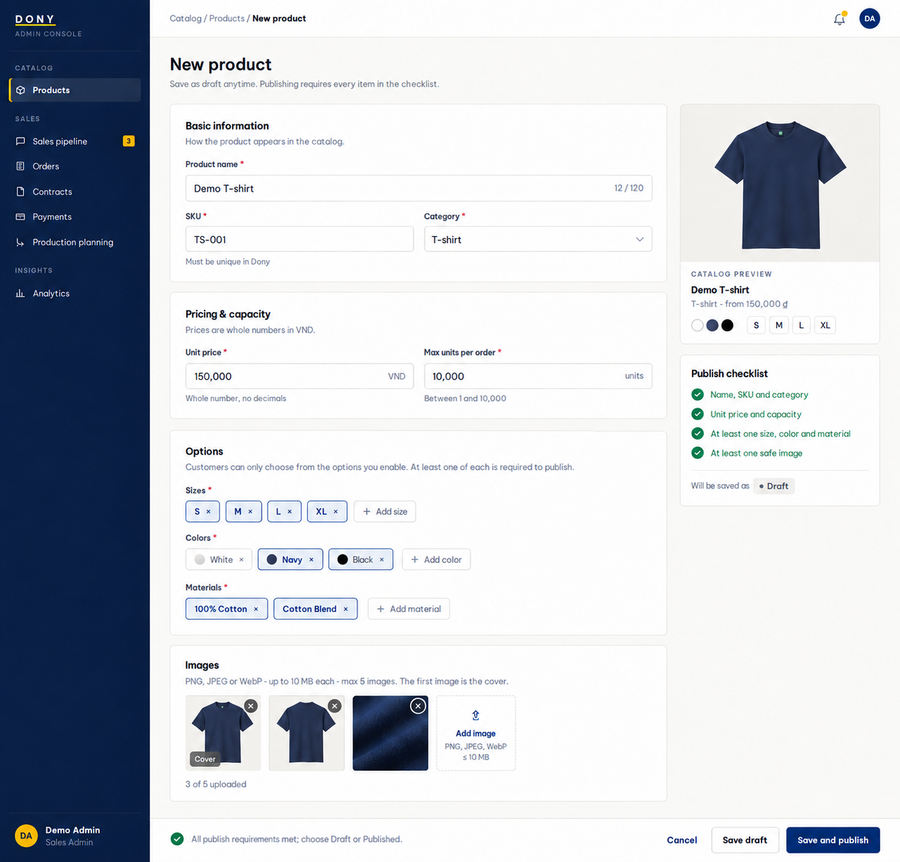

# Screen Spec: S17 Product Create

| Field | Value |
|---|---|
| Screen ID | `S17` |
| Screen name | Product Create |
| Actor | Sales Admin |
| Priority | Should (MVP) |
| Belongs to module | [MFG-04](../specs/spec-MFG-04.md) |
| Route | `/admin/products/new` |
| Mockup image | img/S17-01-product-create.png |
| Status | Resolved implementation specification |

## 1. Purpose

**Shown when:** Product creation validates all fields required for publication; a draft can be saved before publication requirements are complete. All identifiers and permissions come from the server session; list filters are allowlisted and recoverable failures preserve entered values.

**The user leaves this screen when:** An authorized action in section 5 succeeds, the user follows a role-allowed global route, or they return to the validated originating route.

## 2. Mockup

The mockup illustrates the defined workflow. Fictional sample values do not replace the field, lifecycle and release-scope rules below.

## 3. Element inventory

| # | Element | Type | Content / data source | Required | Validation |
|---|---|---|---|---|---|
| 1 | Screen heading | Heading | Product Create | Yes | Static route title. |
| 2 | Route | Navigation target | /admin/products/new | Yes | Access checked on server. |
| 3 | name | Field / control | string, required | As specified | 1..120 trimmed characters. |
| 4 | sku | Field / control | string, required | As specified | Unique across Dony's single product catalogue. |
| 5 | category | Field / control | string, required | As specified | Allowlisted configured category. |
| 6 | unit_price_vnd | Field / control | integer, required | As specified | Nonnegative; never floating point. |
| 7 | supported_sizes/colors/materials | Field / control | arrays, required to publish | As specified | At least one of each; values from configured options. |
| 8 | max_units_per_order | Field / control | integer, required | As specified | 1..10000; quote exceeding capacity returns 422 CAPACITY_EXCEEDED. resolved product rule |
| 9 | image_asset_ids | Field / control | UUID array | As specified | At least one safe image to publish; PNG/JPEG/WebP <=10MiB each, max5. |
| 10 | Save draft | Action | Validate SKU/options/price and create Draft product. | Available when authorized | Destination: S18 |
| 11 | Save and publish | Action | Require all publish fields and safe images then transition to Published. | Available when authorized | Destination: S16 |
| 12 | Cancel | Action | Discard create form. | Available when authorized | Destination: S16 |

## 4. States

**Loading, access, errors and retry:** Show a labelled Loading state while reads resolve. A missing or inaccessible route returns a safe 401/403/404 without disclosing protected records. Error states show the API code, message, field_errors and request_id while preserving safe input. Retry transient reads; retry a mutation only with the original idempotency key and identical payload. Preserve safe user input after recoverable failures.

| State | What the user sees | Trigger |
|---|---|---|
| Empty | Show a blank validated product form with required fields and no fabricated product values. | Screen has no eligible or matching record |
| Success | Refresh the committed Product Create data and show the next action permitted by its lifecycle and actor. | Valid action commits |
| Conflict | The Product Create data or lifecycle changed concurrently; reload authoritative state and do not replay a stale mutation. | Stale version, duplicate or invalid lifecycle transition |
## 5. Interactions and navigation

| # | Element | User action | System response | Goes to screen |
|---|---|---|---|---|
| 1 | Save draft | Activate | Validate SKU/options/price and create Draft product. | S18 |
| 2 | Save and publish | Activate | Require all publish fields and safe images then transition to Published. | S16 |
| 3 | Cancel | Activate | Discard create form. | S16 |

Portal: Sales Admin. Route: /admin/products/new. Back preserves the originating route and filters. 

## 6. Screen-level rules

| Rule ID | Rule | Source |
|---|---|---|
| SR-001 | Check access and ownership on the server; never trust submitted customer, company, role, price, stage or provider status. Apply the documented 401/403/404 behavior and field rules. | Project baseline |
| SR-002 | IDs are UUIDs; timestamps are UTC and displayed in Asia/Ho_Chi_Minh; money and quantities are integers. Mutations use expected versions and idempotency keys where specified. | Project baseline |
| SR-003 | Apply the owning module's lifecycle and validation rules; preserve immutable submitted snapshots and design versions. | Project baseline |
| SR-004 | Use documented project assumptions; do not invent factual company, author, client-approval or course identifiers. | Project baseline |

### Acceptance scenarios

1. Valid product creates Draft with a Dony-catalogue-unique SKU and integer price.
2. Duplicate SKU or invalid image returns field errors; no partial product is saved.

## 7. Linked requirements

| FR ID (from the module spec) | What this screen does for it |
|---|---|
| MFG-04/F-PROD-005 | **Add Product** — Render product creation form and upload constraints. |
| MFG-04/F-PROD-006 | **Add Product** — Save a validated Draft product with idempotency and Dony-scoped SKU uniqueness. |

## 8. Responsive and accessibility notes

Support 360px through desktop; stack columns and use labelled horizontal-scroll tables on narrow screens. Controls are keyboard-operable with visible focus, logical headings, associated form labels, and aria-live status/error announcements. Text contrast is at least 4.5:1 (large text 3:1); pointer targets are at least 24px. Preserve user-entered data after recoverable failures. Confirm destructive actions, disable duplicate submit while pending, and enforce idempotency on the server.

## 9. Open questions

| # | Question | Blocking? | Status |
|---|---|---|---|
| 1 | No unresolved screen behavior questions remain; routes, fields, permissions, and defaults are resolved in this specification and its linked module requirements. | No | Resolved |

## Completion checklist

- [x] Route, actor, module, priority, and mockup status are identified.
- [x] Element fields, actions, validation, and data ownership are documented.
- [x] Loading, empty, forbidden, error, retry, success, and conflict states are documented.
- [x] Navigation and acceptance scenarios are explicit.
- [x] Responsive and accessibility requirements are documented in this screen.
- [x] No unresolved screen-level decisions remain.
