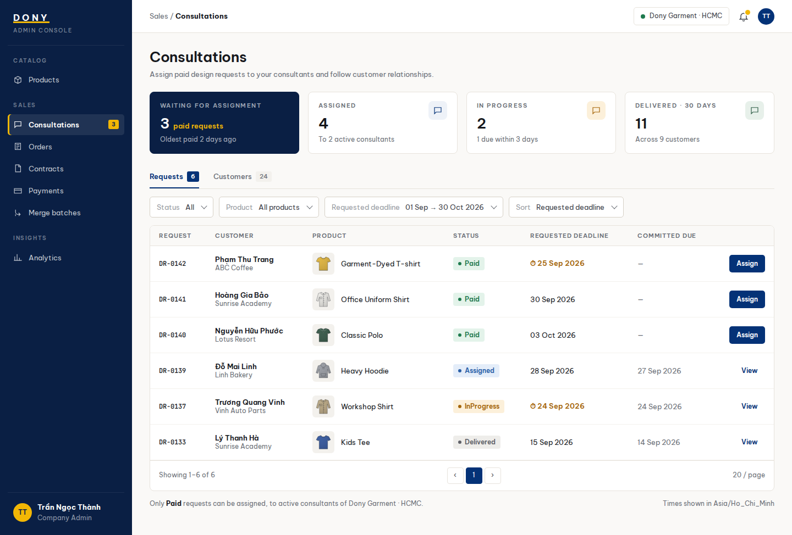

# Screen Spec: S18 Consultation Requests and Customers

| Field | Value |
|---|---|
| Screen ID | `S18` |
| Screen name | Consultation Requests and Customers |
| Actor | Sales Admin |
| Priority | P2 |
| Belongs to module | [MFG-05](../specs/spec-MFG-05.md) |
| Route | `/admin/consultations?tab=requests,customers` |
| Mockup image | img/S18-consultation_requests_and_customers_screen.png |
| Status | Resolved implementation specification |

## 1. Purpose

**Shown when:** The Sales Admin switches between submitted requests awaiting assessment, fee proposals awaiting acceptance and Approved requests awaiting assignment and Dony-scoped consultation/customer records. Only active Dony Sales employees are eligible for assignment. All identifiers and permissions come from the server session; list filters are allowlisted and recoverable failures preserve entered values.

**The user leaves this screen when:** An authorized action in section 5 succeeds, the user follows a role-allowed global route, or they return to the validated originating route.

## 2. Mockup

Written behavior below takes precedence over obsolete sample content.

## 3. Element inventory

| # | Element | Type | Content / data source | Required | Validation |
|---|---|---|---|---|---|
| 1 | Screen heading | Heading | Consultation Requests and Customers | Yes | Static route title. |
| 2 | Route | Navigation target | /admin/consultations?tab=requests,customers | Yes | Access checked on server. |
| 3 | tab | Field / control | enum: requests or customers; default requests | As specified | Requests show DesignRequest id, status, product, customer display name, requested_deadline and committed_due_at; customers show consultation id and CRM status. |
| 4 | status | Field / control | allowlisted request or CRM status enum | As specified | Filter applies to the selected tab lifecycle only; design request and CRM states remain distinct. |
| 5 | product_id | Field / control | optional UUID | As specified | Dony product filter on requests tab; inaccessible IDs return 404. |
| 6 | requested_deadline_from/to | Field / control | optional local dates | As specified | Inclusive start and exclusive end; reject reversed range; display in Asia/Ho_Chi_Minh. |
| 7 | page / page_size / sort | Field / control | integer / integer / enum | As specified | documented pagination bounds; sort allowlist is requested_deadline, created_at or status. |
| 8 | customer_id / buyer_organization_id | Field / control | server-derived UUIDs | As specified | Organization identifies the represented Business Buyer or Reseller Shop; it is never accepted as an authorization scope. |
| 9 | API errors | Field / control | standard API error envelope | As specified | 400 malformed; 422 invalid filters; 403 prohibited action; 404 inaccessible request/customer; 429 rate limit; 503 dependency failure. |
| 10 | Assign approved request | Action | Open assignment only for Approved request with active Dony Sales employees. | Available when authorized | Destination: S19 |
| 11 | Open request | Action | View request assessment/details inline; CRM notes stay in authorized consultation context. | Available when authorized | Destination: S18 request detail |
| 12 | Switch tab | Action | Preserve company filters and route state. | Available when authorized | Destination: S18 tab |
| 13 | Open customer record | Action | Show staff-only Dony-scoped consultation context. | Available when authorized | Destination: S18 customers tab |
| 14 | Start review | Action | Submitted → UnderReview with expected_version and Idempotency-Key | Submitted only | Sales Admin; cancelled/stale request 409. |
| 15 | complexity / rationale / fee_vnd | Assessment fields | Simple or Complex; rationale 1-500 chars; suggested Complex fee from design_service_fee_vnd | UnderReview only | Simple fee 0; Complex integer 1..9999999999, default 200000 at assessment; Admin confirms/overrides. |
| 16 | Complete assessment | Action | Simple → Approved; Complex → FeeProposed; persist assessor/time/proposal version and notify owner | UnderReview only | No assignment until Approved; proposal/approval immutable; no payment. |
| 17 | Reject request | Action | UnderReview → Rejected with customer-visible reason 1-500 chars | UnderReview only | Expected version/key; notify owner; terminal state. |

## 4. States

| State | What the user sees | Trigger |
|---|---|---|
| Loading | Load the S18 Consultation Requests and Customers view model and show labelled progress; keep writes disabled until route data and authorization are resolved. | Request starts |
| Empty | No Consultation Requests and Customers records match the current route/filter; preserve inputs and show only the screen’s authorized next action. | Screen has no eligible or matching record |
| Forbidden/not found | Return a safe 401/403/404 for S18 Consultation Requests and Customers without revealing inaccessible record, customer, staff or payment details. | 401/403/404 |
| Error | For S18 Consultation Requests and Customers, show the API code, message, field_errors and request_id; preserve safe user-entered values. | Request failure |
| Retry | Retry transient reads for S18 Consultation Requests and Customers; retry a mutation only with its original idempotency key and identical payload, never as a new side effect. | Recoverable failure |
| Success | Refresh the committed Consultation Requests and Customers data and show the next action permitted by its lifecycle and actor. | Valid action commits |
| Conflict | The Consultation Requests and Customers data or lifecycle changed concurrently; reload authoritative state and do not replay a stale mutation. | Stale version, duplicate or invalid lifecycle transition |
## 5. Interactions and navigation

| # | Element | User action | System response | Goes to screen |
|---|---|---|---|---|
| 1 | Assign approved request | Activate | Open assignment only for Approved request with active Dony Sales employees. | S19 |
| 2 | Open request | Activate | View request assessment/details inline; CRM notes stay in authorized consultation context. | S18 request detail |
| 3 | Switch tab | Activate | Preserve company filters and route state. | S18 tab |
| 4 | Open customer record | Activate | Show staff-only Dony-scoped consultation context. | S18 customers tab |
| 5 | Start review | Activate | Lock/version-check Submitted and persist UnderReview. | S18 |
| 6 | Complete assessment | Submit classification, rationale and fee | Validate and persist Simple Approved or Complex FeeProposed; notify owner through outbox. | S18 |
| 7 | Reject request | Confirm reason | Lock/version-check UnderReview, persist Rejected and notify owner. | S18 |

Portal: Sales Admin. Route: /admin/consultations?tab=requests,customers. Back preserves the originating route and filters. Fallback: Customer→S26; Sales Admin→S28; Sales→S20; System Admin→S41; Guest→S01. Enforce role, ownership and assignment before rendering.

## 6. Screen-level rules

| Rule ID | Rule | Source |
|---|---|---|
| SR-001 | Access and ownership are checked server-side; do not trust submitted customer, company, role, price, or provider status. Apply 401/403/404 behavior and the field rules above. | Authorization and data ownership requirements |
| SR-002 | IDs are UUIDs; timestamps are UTC and displayed in Asia/Ho_Chi_Minh; money and quantities are integers. Mutations use expected_version; significant create/sign/pay/batch operations use idempotency keys. | Data representation and concurrency requirements |
| SR-003 | Apply the module lifecycle and validation rules linked below; preserve immutable submitted snapshots. | Module specification |
| SR-004 | Selected product and technical defaults are project implementation decisions; do not invent factual company, author, client-approval, or course identifiers. | Project implementation assumptions |

### Acceptance scenarios

1. Submitted/UnderReview/FeeProposed requests are not assignable; Simple approval or accepted Complex fee makes Approved eligible within its company only.
2. Customer tab excludes other companies and internal notes remain staff-only.
3. Simple assessment sets fee 0; Complex proposes the Admin-confirmed fee and notifies the owner; cancellation racing with assessment rejects the losing write.
4. Rejected requests show the customer-visible reason; proposals cannot be edited after publication.

## 7. Linked requirements

| FR ID (from the module spec) | What this screen does for it |
|---|---|
| MFG-08/F-ORD-001 | **Assign Sales** — List Dony customers without an active Sales assignment, with relevant request/order summaries and pagination. |
| MFG-08/F-ORD-002 | **Assign Sales** — Show customer and optional buyer-organization contact data, request/order summaries and current assignment. |
| MFG-08/F-ORD-003 | **Assign Consultant** — Assign/reassign an active Dony Sales employee with version checks, idempotency and atomic paired assignment of affected approved/assigned design requests; `committed_due_at` is Dony's commitment, not the customer's requested deadline. |
| MFG-08/F-ORD-004 | **Assign Consultant** — Notify the newly assigned consultant with authorized customer context after commit; reassignment also notifies affected staff and customer; deduplicate and retry delivery. |
Additional linked modules: [MFG-08](../specs/spec-MFG-08.md).

| MFG-05/F-DES-007 | Assessment queue, committed notifications and authorized request visibility. |
| MFG-05/F-DES-008 | Assessment queue, committed notifications and authorized request visibility. |
| MFG-05/F-DES-009 | Assessment queue, committed notifications and authorized request visibility. |

## 8. Responsive and accessibility notes

Support 360px through desktop; stack columns and use labelled horizontal-scroll tables on narrow screens. Controls are keyboard-operable with visible focus, logical headings, associated form labels, and aria-live status/error announcements. Text contrast is at least 4.5:1 (large text 3:1); pointer targets are at least 24px. Preserve user-entered data after recoverable failures. Confirm destructive actions, disable duplicate submit while pending, and enforce idempotency on the server.

## 9. Open questions

| # | Question | Blocking? | Status |
|---|---|---|---|
| 1 | No unresolved screen behavior questions remain; routes, fields, permissions, and defaults are resolved in this specification and its linked module requirements. | No | Resolved |

## Completion checklist

- [x] Route, actor, module, priority, and mockup status are identified.
- [x] Element fields, actions, validation, and data ownership are documented.
- [x] Loading, empty, forbidden, error, retry, success, and conflict states are documented.
- [x] Navigation and acceptance scenarios are explicit.
- [x] Responsive and accessibility requirements follow the shared baseline.
- [x] No unresolved screen-level decisions remain.
