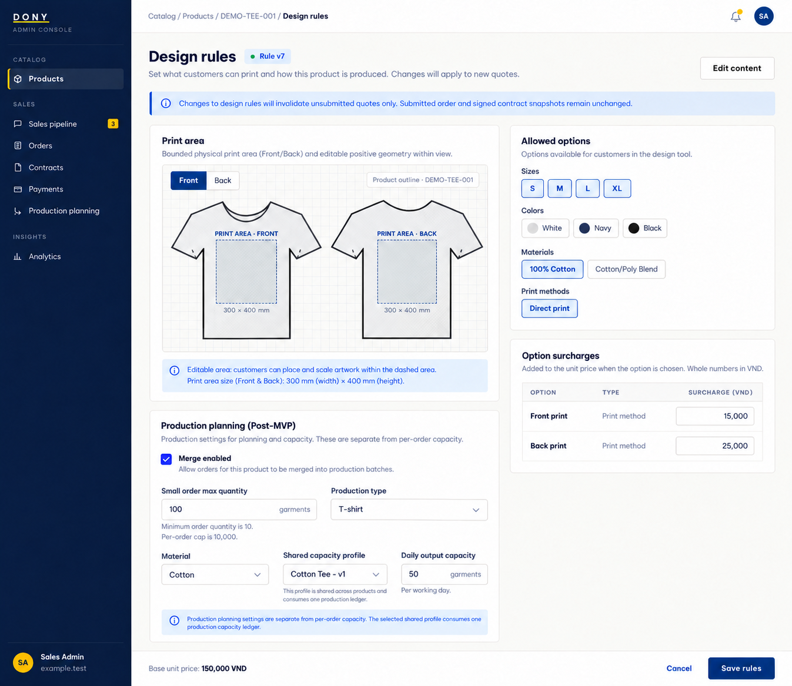

# Screen Spec: S19 Product Design Rules

| Field | Value |
|---|---|
| Screen ID | `S19` |
| Screen name | Product Design Rules |
| Actor | Sales Admin |
| Priority | Could (MVP) |
| Belongs to module | [MFG-04](../specs/spec-MFG-04.md) |
| Route | `/admin/products/{product_id}/design-rules` |
| Mockup image | img/S19-01-product-design-rules.png |
| Status | Resolved implementation specification |

## 1. Purpose

**Shown when:** The Sales Admin edits the selected product’s supported sizes, colors, materials, print methods, bounded 2D print area and option surcharges. Saving versions the rules and invalidates unconsumed quotes for review. All identifiers and permissions come from the server session; list filters are allowlisted and recoverable failures preserve entered values.

**The user leaves this screen when:** An authorized action in section 5 succeeds, the user follows a role-allowed global route, or they return to the validated originating route.

## 2. Mockup

The mockup illustrates the defined workflow. Fictional sample values do not replace the field, lifecycle and release-scope rules below.

## 3. Element inventory

| # | Element | Type | Content / data source | Required | Validation |
|---|---|---|---|---|---|
| 1 | Screen heading | Heading | Product Design Rules | Yes | Static route title. |
| 2 | Route | Navigation target | /admin/products/{product_id}/design-rules | Yes | Access checked on server. |
| 3 | product_id | Field / control | UUID path | As specified | product_id: UUID path; expected_version required. |
| 4 | supported_sizes/colors/materials/print_method | Field / control | nonempty allowlisted product-rule options. | As specified | supported_sizes/colors/materials/print_method: nonempty allowlisted product-rule options. |
| 5 | print_area | Field / control | bounded 2D coordinates | As specified | print_area: bounded 2D coordinates; reject nonpositive/out-of-bounds geometry. |
| 6 | option_surcharge_vnd | Field / control | integer >=0 for each supported option | As specified | option_surcharge_vnd: integer >=0 for each supported option; saved rules version new quote policy. |
| 7 | API errors | Field / control | standard API error envelope | As specified | 400 malformed; 422 invalid fields; 409 stale/duplicate; 429 rate limit; 503 dependency failure |
| 8 | Save rules | Action | Validate supported options/area/surcharges, increment product version; old quotes require review. | Available when authorized | Destination: S16 |
| 9 | Cancel | Action | Discard changes. | Available when authorized | Destination: S16 |

### Deferred production-flexibility fields

After MFG-10 activation, this existing rules editor also exposes:

| Field | Validation / behavior |
| --- | --- |
| merge_enabled | Explicit Sales Admin boolean for this product; when disabled do not offer flexible quotes. |
| small_order_max_quantity | Inclusive maximum aggregate quantity for a small flexible order; integer from the existing product MOQ through per-order capacity, required when merge_enabled. |
| production_type_key / material identity | Saved garment type and supported material identities used to share sewing production; retain print/embroidery rules per individual order. |
| capacity_profile_id / daily_output_capacity | Select the shared production-type/material profile and enter a positive integer garments per working day. Same-profile products consume one shared capacity ledger. Distinct from per-order quantity bounds and the small-order threshold; stale profile version 409, zero/missing value 422 for an enabled flexible setup. |

Save atomically with the other product rules and expected_version. Rule changes invalidate unsubmitted quotes for eligibility review, never alter already accepted price/incentive snapshots. Show per-order quantity capacity, small-order threshold and garments-per-working-day capacity as separately labeled fields. S46 derives workdays and residual daily slots from the saved profile; do not label a daily throughput as a maximum batch quantity. Profile edits require revalidation of unstarted allocations while preserving accepted due dates and started audit snapshots. Use the same form/error/version conventions as [S18 Product Edit](S18-product-edit.md). [S31 Merge Option](S31-production-option.md) consumes eligibility and [S46 Merge Console](S46-production-planning.md) consumes saved matching rules; scheduling/production approvals remain in S46.

## 4. States

**Loading, access, errors and retry:** Show a labelled Loading state while reads resolve. A missing or inaccessible route returns a safe 401/403/404 without disclosing protected records. Error states show the API code, message, field_errors and request_id while preserving safe input. Retry transient reads; retry a mutation only with the original idempotency key and identical payload. Preserve safe user input after recoverable failures.

| State | What the user sees | Trigger |
|---|---|---|
| Empty | No Product Design Rules records match the current route/filter; preserve inputs and show only the screen’s authorized next action. | Screen has no eligible or matching record |
| Success | Refresh the committed Product Design Rules data and show the next action permitted by its lifecycle and actor. | Valid action commits |
| Conflict | The Product Design Rules data or lifecycle changed concurrently; reload authoritative state and do not replay a stale mutation. | Stale version, duplicate or invalid lifecycle transition |
## 5. Interactions and navigation

| # | Element | User action | System response | Goes to screen |
|---|---|---|---|---|
| 1 | Save rules | Activate | Validate supported options/area/surcharges, increment product version; old quotes require review. | S16 |
| 2 | Cancel | Activate | Discard changes. | S16 |

Portal: Sales Admin. Route: /admin/products/{product_id}/design-rules. Back preserves the originating route and filters. 

## 6. Screen-level rules

| Rule ID | Rule | Source |
|---|---|---|
| SR-001 | Check access and ownership on the server; never trust submitted customer, company, role, price, stage or provider status. Apply the documented 401/403/404 behavior and field rules. | Project baseline |
| SR-002 | IDs are UUIDs; timestamps are UTC and displayed in Asia/Ho_Chi_Minh; money and quantities are integers. Mutations use expected versions and idempotency keys where specified. | Project baseline |
| SR-003 | Apply the owning module's lifecycle and validation rules; preserve immutable submitted snapshots and design versions. | Project baseline |
| SR-004 | Use documented project assumptions; do not invent factual company, author, client-approval or course identifiers. | Project baseline |

### Acceptance scenarios

1. Valid rule change increments product version and requires review of an earlier quote.
2. Out-of-bounds print area, unsupported option or negative/noninteger surcharge is rejected.

## 7. Linked requirements

| FR ID (from the module spec) | What this screen does for it |
|---|---|
| MFG-04/F-PROD-007 | **Update Product** — Render an authorized product edit model with current version. |
| MFG-04/F-PROD-008 | **Update Product** — Update allowlisted product fields atomically with expected-version checks. |
| MFG-04/F-PROD-011 | **Publish Product** — Change product visibility to an explicitly requested valid state. |

## 8. Responsive and accessibility notes

Support 360px through desktop; stack columns and use labelled horizontal-scroll tables on narrow screens. Controls are keyboard-operable with visible focus, logical headings, associated form labels, and aria-live status/error announcements. Text contrast is at least 4.5:1 (large text 3:1); pointer targets are at least 24px. Preserve user-entered data after recoverable failures. Confirm destructive actions, disable duplicate submit while pending, and enforce idempotency on the server.

## 9. Open questions

| # | Question | Blocking? | Status |
|---|---|---|---|
| 1 | No unresolved screen behavior questions remain; routes, fields, permissions, and defaults are resolved in this specification and its linked module requirements. | No | Resolved |

## Completion checklist

- [x] Route, actor, module, priority, and mockup status are identified.
- [x] Element fields, actions, validation, and data ownership are documented.
- [x] Loading, empty, forbidden, error, retry, success, and conflict states are documented.
- [x] Navigation and acceptance scenarios are explicit.
- [x] Responsive and accessibility requirements are documented in this screen.
- [x] No unresolved screen-level decisions remain.
