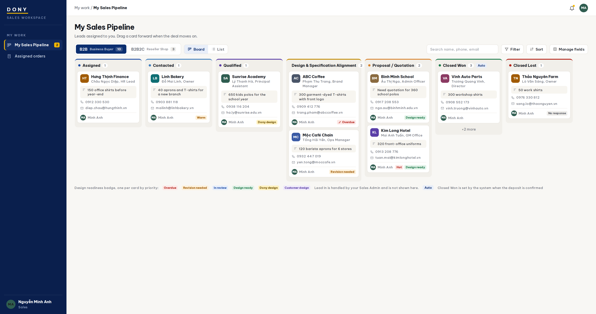
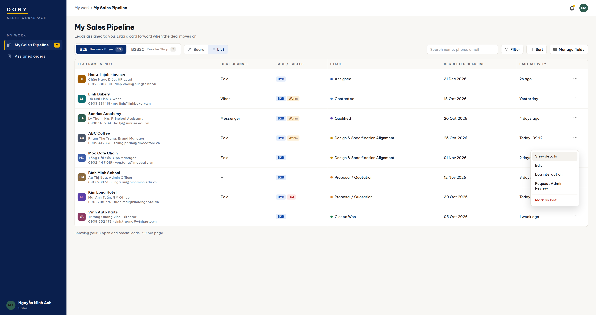
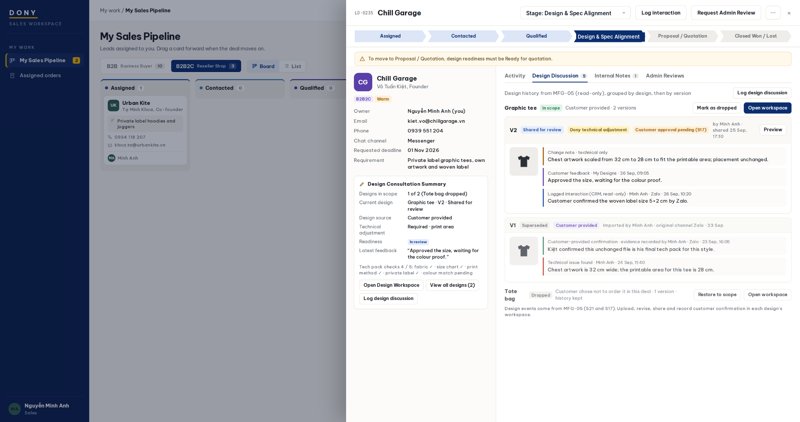

# Screen Spec: S20 My Sales Pipeline (Sales)

| Field | Value |
|---|---|
| Screen ID | `S20` |
| Screen name | My Sales Pipeline (Sales) |
| Actor | Sales |
| Priority | P2 |
| Belongs to module | [MFG-08](../specs/spec-MFG-08.md); MFG-05 design data is projected here read-only and actual staff design asset/version work is performed in S21 |
| Route | `/consultant/pipeline?model={b2b\|b2b2c}&view={board\|list}`. Detail panel adds `&lead={consultation_id}&tab={activity\|design\|notes\|reviews}`. Former routes resolve to this authorized pipeline as specified in S19 section 10. |
| Mockup image | img/S20-consultant_tasks_and_customers_screen.png (Board); img/S20-my_pipeline_list_view.png (List); img/S20-lead_detail_panel.png (Detail panel, Design Discussion) |
| Status | Revised specification 2026-09-27. S19 is the canonical definition of stages, gates, badges, the detail panel and the design boundary; this file describes only what differs for the Sales role. Decisions D-01 to D-08 (S19 section 1.1) apply; optional follow-ups in S19 section 9 remain disabled; integrated contracts are in S19 section 10 and MFG-05 section 5.4. |

## 1. Purpose

**Shown when:** A Sales employee works the leads assigned to them: moves them through the pipeline, validates or prepares the design with the customer, records interactions, keeps internal notes and asks the Sales Admin for decisions. The screen uses the same pipeline, lead records, cards, List view and detail panel as [S19](S19-consultation_assignment_screen.md), limited to the Sales' own leads. Actual design work happens in the S21 Design Workspace of each design, opened from the detail panel; this screen only reads and summarizes it. **Lead In is not shown.** A change made here is immediately visible to the Sales Admin in S19. All identifiers and permissions come from the server session; list filters are allowlisted and recoverable failures preserve entered values.

**The user leaves this screen when:** They open the Design Workspace (S21), a linked order (S29) within their assignment scope, follow a role-allowed global route, or return to the validated originating route.

## 2. Mockup

Sample names, companies and contact data are synthetic. Written behavior below takes precedence over mockup content; customer-feedback labels that still name S17 resolve to S52.

## 3. Element inventory

### 3.1 Data scope

| Rule | Detail |
|---|---|
| Visible leads | Only leads whose customer is actively assigned to the current Sales, in Assigned to Closed Lost. |
| Hidden | Lead In, Unclassified leads and every lead owned by another Sales; requests for them return 404. |
| Same data as S19 | `pipeline_stage`, lead fields, design data, Activity, interactions, notes and reviews are shared. After a reassignment the lead and its history move to the new owner. |

### 3.2 Stages and permissions

Columns in both tabs (canonical definitions in [S19 section 3.3](S19-consultation_assignment_screen.md#33-sales-stages)):

Assigned → Contacted → Qualified → Design Consultation (B2B: Design & Specification Alignment; B2B2C: Design & Spec Alignment) → Proposal / Quotation → Closed Won → Closed Lost

| Action | Sales in S20 |
|---|---|
| Move own lead forward | Allowed up to Proposal / Quotation when the S19 exit gates are met; skipping only if every skipped gate is met. Closed Won is set only by the system when a linked order's deposit is confirmed (D-05). |
| Move backward | Not allowed. |
| Close as lost | Allowed from any open stage with a reason (S19 TR-06). |
| Reopen, assign, reassign, bulk assign, change `customer_model` | Not allowed. |
| Edit own lead fields | Contact title, phone, email, chat channel, labels, requirement summary, product interest, estimated quantity, requested deadline. Version-checked. |
| Design source, technical adjustment flag, checklist, **Mark ready for quotation** | Allowed on own leads, with the S19 section 3.11 rules; design source is editable for B2B only (B2B2C is always Customer provided). |
| Design Discussion: log design discussion, mark a design as dropped or restore it to scope, open workspace of a design | Allowed on own leads. The MFG-05 projection is read-only; the tab is grouped by design, then version, and shows each design's scope (D-07). |
| Add customer-provided design, record customer confirmation, upload technical adjustment, upload new version, share with customer | Done in S21, not here (D-06). Existing designs open by `design_id`; if the lead has no design yet, the summary opens S21 creation mode with the lead context (and `request_id` when applicable). An unchanged imported file becomes eligible with customer-source evidence; any version Dony changed needs customer approval in S52. |
| Request due date change | Allowed: creates an Admin Review of type Committed due date change; only the Sales Admin changes `committed_due_at`. |
| Design service assessment (Simple/Complex, proposed fee, reject) and **Set committed due date** | Not allowed (Sales Admin only). `committed_due_at` is read-only for Sales. |
| Log interaction, add and pin Internal Notes | Allowed on own leads. |
| Request Admin Review | Allowed on own leads. Deciding a review is not allowed. |

### 3.3 Top bar, Board and List

| Part | S20 behavior |
|---|---|
| Header | Title "My Sales Pipeline" and helper text; no **+ Add lead**. |
| Model tabs, view switch, tools | As S19, with the Sales' own counts; Filter offers stage, label, source, product, design readiness and requested deadline range (no owner, no assessment filter). |
| Board | Seven columns above. Card as S19 (avatar, name, title, requirement summary, phone, email, owner, optional temperature label, one design readiness badge by the S19 priority); no **Assign** button. |
| List | Columns: Lead name & info · Chat channel · Tags / labels · Stage · Requested deadline · Last activity · Action (⋯: View details, Edit, Log interaction, Request Admin Review, Mark as lost). No checkbox and no Assignee column. Sort allowlist and page size as S19. |

### 3.4 Detail panel

Same panel as [S19 section 3.10](S19-consultation_assignment_screen.md#310-detail-panel), with the Design Consultation Summary and Design Discussion of [S19 section 3.11](S19-consultation_assignment_screen.md#311-design-consultation) and the tabs of [S19 section 3.12](S19-consultation_assignment_screen.md#312-activity-log-interaction-internal-notes-and-admin-reviews). Differences:

| Area | S20 behavior |
|---|---|
| Header | Stage menu lists only allowed forward moves and Closed Lost (never Closed Won); **Log interaction**; **Request Admin Review**; ⋯ (Edit, Mark as lost). No Reassign or Reopen. In Proposal / Quotation the current milestone is shown beside the stage path. |
| Design Consultation Summary | Owner shows "(you)"; `customer_model` read-only; no design service assessment controls. |
| Admin Reviews tab | Shows the lead's reviews and **Request Admin Review**; no Approve/Reject. The Sales is notified when a decision is made. |

### 3.5 Fields and controls

| # | Element | Type | Content / data source | Required | Validation |
|---|---|---|---|---|---|
| 1 | Screen heading | Heading | My Sales Pipeline | Yes | Static route title. |
| 2 | Route | Navigation target | /consultant/pipeline | Yes | Sales role checked on server. |
| 3 | model | Filter | `b2b`, `b2b2c` | Yes | Allowlisted; default the model with more of the Sales' open leads. |
| 4 | view | Control | `board`, `list` | Yes | Allowlisted; default `board`. |
| 5 | q, stage, label, source, product_id, design_readiness, requested_deadline_from/to | Filters | allowlisted values | No | Invalid filter 400/422. |
| 6 | consultation_id / customer_id / request_id / order_id | Read-only UUIDs | derived from the Sales' active assignment | — | Another Sales' or unassigned ID returns 404. |
| 7 | Stage move | Drag and drop, Stage menu | target `pipeline_stage`, `expected_version`, `Idempotency-Key` | — | Section 3.2. |
| 8 | Lost reason / note | Popup | S19 TR-06 | Reason yes | Note required for Other; 0–500 characters. |
| 9 | Design controls and Design Discussion actions | Panel | S19 section 3.11 | Per action | S19 section 3.11; 403 for Admin-only actions. |
| 10 | Log interaction, Internal note, Request Admin Review | Forms | S19 section 3.12 | Per form | S19 section 3.12. |
| 11 | API errors | Envelope | standard API error envelope | — | 400 malformed; 403 prohibited action; 404 inaccessible lead; 409 stale version/state; 422 failed gate or invalid field; 503 dependency failure. |

## 4. States

| State | What the user sees | Trigger |
|---|---|---|
| Loading | Column, table or panel skeletons with labelled progress; actions disabled until data and authorization are resolved. | Request starts |
| Empty | "No leads assigned to you in this tab yet. New assignments appear in Assigned." Empty tabs as S19. | No matching record |
| Forbidden/not found | Safe 401/403/404 without revealing another Sales' or unassigned lead, customer, design or payment details. | 401/403/404 |
| Error | API code, message, field_errors and request_id; forms keep entered values. | Request failure |
| Retry | Transient reads retry; a mutation retries only with its original idempotency key and identical payload. | Recoverable failure |
| Move rejected | The card returns with the reason, e.g. "Design readiness must be Ready for quotation", "Leads cannot be moved back to an earlier stage". | Failed gate or prohibited move |
| Reassigned away | A lead reassigned by the Sales Admin disappears on refresh with the notice "{lead} was reassigned by your Sales Admin". | Owner changed |
| Success | Updated card, counts, badge and tab content; toast naming the action. | Valid action commits |
| Conflict | "This lead changed since you opened it"; data reloads without replaying the stale action. | Stale version, duplicate or invalid transition |

## 5. Interactions and navigation

| # | Element | User action | System response | Goes to screen |
|---|---|---|---|---|
| 1 | Model tab / view switch | Activate | Reload with the same filters. | S20 |
| 2 | Card | Drag forward, or Stage menu | Apply section 3.2 and S19 gates. | S20 |
| 3 | Card | Drop on Closed Lost | Lost reason popup; commit on confirm. | S20 |
| 4 | Card or row | Single click / View details | Open detail panel. | S20 panel |
| 5 | Summary controls | Set source, confirm checklist, Mark ready for quotation | Save with gates. | S20 panel |
| 6 | Design Discussion | Log design discussion / Mark as dropped / Restore to scope / Open workspace | Append the MFG-08 interaction, update lead–design commercial scope, or open S21 for the selected design. If no design exists yet, the summary starts S21 creation mode. | S20 panel / S21 |
| 7 | Log interaction / Internal note / Request Admin Review | Save | Append entry or create Pending review; Activity event; Sales Admin notified of the review. | S20 panel |
| 8 | Order link | Activate | Open the order within assignment scope. | S29 |

Portal: Sales. Route: /consultant/pipeline. Back preserves the originating route, model, view, filters and open lead. Fallback: Customer→S26; Sales Admin→S28; Sales→S20; System Admin→S41; Guest→S01. Enforce role, ownership and assignment before rendering.

## 6. Screen-level rules

| Rule ID | Rule | Source |
|---|---|---|
| SR-001 | Access and ownership are checked server-side; do not trust submitted customer, company, role, price, stage or provider status. Apply 401/403/404 behavior and the field rules above. | Authorization and data ownership requirements |
| SR-002 | IDs are UUIDs; timestamps are UTC and displayed in Asia/Ho_Chi_Minh; money and quantities are integers. Mutations use expected_version; moves, uploads, interactions, notes and review requests use idempotency keys. | Data representation and concurrency requirements |
| SR-003 | Apply the module lifecycle and validation rules linked below; preserve immutable submitted snapshots and design versions. | Module specification |
| SR-004 | Selected product and technical defaults are project implementation decisions; do not invent factual company, author, client-approval, or course identifiers. | Project implementation assumptions |
| SR-005 | The Sales sees and changes only leads actively assigned to them; Lead In and other Sales' leads are never returned. | MFG-08 BR-001, F-ORD-005 |
| SR-006 | Stages, gates, lifecycle separation and the MFG-05/MFG-08 boundary follow S19 sections 3.1–3.4, 3.11 and SR-006. | S19 |
| SR-007 | Visibility follows S19 SR-008: Activity, interactions, Internal Notes and Admin Reviews are staff-only and visible to the current owner and Sales Admins; the customer sees only shared design versions and their own feedback in S52. Interactions, notes and review records are append-only; a Sales cannot decide an Admin Review. | S19 SR-008, MFG-08 BR-003/BR-004 |

### Acceptance scenarios

1. Given a Sales user, then the board shows the seven columns Assigned to Closed Lost with their own leads only; an unassigned or another Sales' lead returns 404.
2. Given the Sales Admin assigns a lead to this Sales in S19, then it appears in Assigned here; moving it to Contacted here shows Contacted in S19.
3. Given the B2B2C tab, then the fifth column reads "Design & Spec Alignment"; in B2B it reads "Design & Specification Alignment".
4. Given a lead in Design Consultation, when the Sales opens S21, uploads V2 and shares it, then the customer sees V2 in S52; the customer's feedback appears under V2 in Design Discussion without being logged by the Sales.
5. Given a lead in Design Consultation without `ReadyForQuotation`, when moved to Proposal / Quotation, then it is rejected with the reason.
6. Given a lead in Proposal / Quotation, when dragged back, then it is rejected.
7. Given the Sales requests a Deadline exception, then it is Pending, the Sales cannot approve it, and the Sales is notified when the Sales Admin decides.
8. Given the Sales tries Start review, Complete assessment, Reject request or Set committed due date, then the server returns 403.
9. Given a B2B2C lead, then the design source is Customer provided and cannot be changed; from the detail panel the Sales opens S21 to add the customer's tech pack received by Zalo as a Customer provided version and to upload a technical adjustment that the customer must approve in S52, and records the customer's confirmation there; the Design Discussion tab itself has no upload, share or confirmation action.
10. Given a linked order whose contract is signed, then the lead stays in Proposal / Quotation with milestone Contract signed; a drop on Closed Won is rejected; when the deposit is confirmed the lead moves to Closed Won automatically.
11. Given a lead with two designs, when the Sales marks one as dropped, then it stays visible (collapsed) with its history, is ignored by the readiness gate, and can be restored to scope.
12. Given keyboard-only use, then the Stage menu, panel actions and row actions achieve every drag-and-drop result.

## 7. Linked requirements

| FR ID (from the module spec) | What this screen does for it |
|---|---|
| MFG-08/F-ORD-005 | **View Assignment** — Only the Sales' active assigned leads, as a board or a list. |
| MFG-08/F-ORD-006 | **View Assignment** — Detail panel context and chronological Activity. |
| MFG-08/F-ORD-007 | **View Consultation** — Stage, notes, design readiness and linked records. |
| MFG-08/F-ORD-008 | **Update Consultation** — Forward moves with gates, Lost with reason, interactions and notes, version checks and idempotency. |
| MFG-05 design versions and feedback | Read-only summary and Design Discussion; written in S21 and S52. |

## 8. Responsive and accessibility notes

Support 360px through desktop. Below 1024px the Board shows one column at a time with a stage selector; List view uses labelled horizontal scroll; the detail panel becomes full screen. Every drag action has a keyboard and screen-reader alternative, and moves are announced through aria-live. Badges and overdue states carry text, not only colour. Text contrast is at least 4.5:1 (large text 3:1); pointer targets are at least 24px. Design previews shown from the MFG-05 projection have text alternatives. Preserve user-entered data after recoverable failures. Confirm Lost; disable duplicate submit while pending; enforce idempotency on the server.

## 9. Open questions

| # | Question | Blocking? | Status |
|---|---|---|---|
| 1 | Optional S19 follow-ups remain disabled; Unclassified leads are Admin-only and cannot enter S20. | No | Deferred |
| 2 | MFG-05 section 5.4 and S52 resolve the version lifecycle and customer feedback/approval. | No | Resolved |

## Completion checklist

- [x] Route, actor, module, priority, and mockup status are identified.
- [x] Data scope, stages and role-specific permissions are documented; canonical rules stay in S19.
- [x] Board, List and detail panel differences from S19 are documented.
- [x] Loading, empty, forbidden, error, retry, move-rejected, reassigned, success, and conflict states are documented.
- [x] Navigation and acceptance scenarios are explicit.
- [x] Responsive and accessibility requirements follow the shared baseline.
- [x] Decisions D-01 to D-08 are applied.
- [x] Required MFG-05/S52 integration is complete; optional follow-ups stay disabled.
