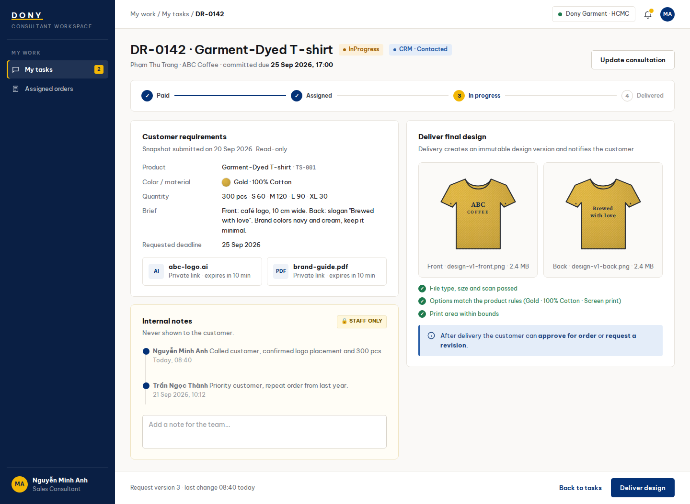

# Screen Spec: S21 Consultation Detail

| Field | Value |
|---|---|
| Screen ID | `S21` |
| Screen name | Consultation Detail |
| Actor | Assigned Consultant/Sales Admin |
| Priority | P2 |
| Belongs to module | [MFG-08](../specs/spec-MFG-08.md) |
| Route | `/consultant/design-requests/{request_id}` |
| Mockup image | img/S21-consultation_detail_screen.png |
| Status | Resolved implementation specification |

## 1. Purpose

**Shown when:** The Sales Admin or currently assigned consultant sees one authorized consultation, its customer requirements, internal notes, deadline and design delivery controls. All identifiers and permissions come from the server session; list filters are allowlisted and recoverable failures preserve entered values.

**The user leaves this screen when:** An authorized action in section 5 succeeds, the user follows a role-allowed global route, or they return to the validated originating route.

## 2. Mockup

Written behavior below takes precedence over obsolete sample content.

## 3. Element inventory

| # | Element | Type | Content / data source | Required | Validation |
|---|---|---|---|---|---|
| 1 | Screen heading | Heading | Consultation Detail | Yes | Static route title. |
| 2 | Route | Navigation target | /consultant/design-requests/{request_id} | Yes | Access checked on server. |
| 3 | request_id | Field / control | UUID | As specified | The current Sales employee must be assigned to the Customer/request, or the actor must be Sales Admin. |
| 4 | requirements / attachment_ids | Field / control | read-only request snapshot | As specified | Show requirements and authorized 10-minute private asset links; do not expose public URLs. |
| 5 | internal_notes | Field / control | staff-only text | As specified | internal_notes: staff-only text; never returned to customer APIs. |
| 6 | final_design | Field / control | validated product options and safe private assets | As specified | final_design: validated product options and safe private assets; validate file type, size, scan result, ownership, and compatibility before private storage. |
| 7 | expected_version / delivery payload | Field / control | version plus validated design | As specified | Delivery requires the current request version and creates an immutable design version. |
| 8 | API errors | Field / control | standard API error envelope | As specified | 400 malformed; 422 invalid fields; 409 stale/duplicate; 429 rate limit; 503 dependency failure |
| 9 | Update consultation | Action | Apply permitted CRM transition with version check; notes remain staff-only. | Available when authorized | Destination: S21 |
| 10 | Deliver design | Action | Validate assets/options; create immutable version; notify owner after commit. | Available when authorized | Destination: S20 |
| 11 | Reopen closed CRM | Action | Sales Admin only; set InProgress with audit. | Available when authorized | Destination: S21 |

## 4. States

| State | What the user sees | Trigger |
|---|---|---|
| Loading | Load the S21 Consultation Detail view model and show labelled progress; keep writes disabled until route data and authorization are resolved. | Request starts |
| Empty | No Consultation Detail records match the current route/filter; preserve inputs and show only the screen’s authorized next action. | Screen has no eligible or matching record |
| Forbidden/not found | Return a safe 401/403/404 for S21 Consultation Detail without revealing inaccessible record, customer, staff or payment details. | 401/403/404 |
| Error | For S21 Consultation Detail, show the API code, message, field_errors and request_id; preserve safe user-entered values. | Request failure |
| Retry | Retry transient reads for S21 Consultation Detail; retry a mutation only with its original idempotency key and identical payload, never as a new side effect. | Recoverable failure |
| Success | Refresh the committed Consultation Detail data and show the next action permitted by its lifecycle and actor. | Valid action commits |
| Conflict | The Consultation Detail data or lifecycle changed concurrently; reload authoritative state and do not replay a stale mutation. | Stale version, duplicate or invalid lifecycle transition |
## 5. Interactions and navigation

| # | Element | User action | System response | Goes to screen |
|---|---|---|---|---|
| 1 | Update consultation | Activate | Apply permitted CRM transition with version check; notes remain staff-only. | S21 |
| 2 | Deliver design | Activate | Validate assets/options; create immutable version; notify owner after commit. | S20 |
| 3 | Reopen closed CRM | Activate | Sales Admin only; set InProgress with audit. | S21 |

Portal: Assigned Consultant/Sales Admin. Route: /consultant/design-requests/{request_id}. Back preserves the originating route and filters. Fallback: Customer→S26; Sales Admin→S28; Sales→S20; System Admin→S41; Guest→S01. Enforce role, ownership and assignment before rendering.

## 6. Screen-level rules

| Rule ID | Rule | Source |
|---|---|---|
| SR-001 | Access and ownership are checked server-side; do not trust submitted customer, company, role, price, or provider status. Apply 401/403/404 behavior and the field rules above. | Authorization and data ownership requirements |
| SR-002 | IDs are UUIDs; timestamps are UTC and displayed in Asia/Ho_Chi_Minh; money and quantities are integers. Mutations use expected_version; significant create/sign/pay/batch operations use idempotency keys. | Data representation and concurrency requirements |
| SR-003 | Apply the module lifecycle and validation rules linked below; preserve immutable submitted snapshots. | Module specification |
| SR-004 | Selected product and technical defaults are project implementation decisions; do not invent factual company, author, client-approval, or course identifiers. | Project implementation assumptions |

### Acceptance scenarios

1. Assigned consultant may deliver validated design, creating immutable version and notifying customer after commit.
2. Unassigned consultant cannot retrieve private attachments or internal notes.

## 7. Linked requirements

| FR ID (from the module spec) | What this screen does for it |
|---|---|
| MFG-08/F-ORD-007 | **Update Consult** — Show consultation status, notes and linked record summaries to assigned consultant or Sales Admin. |
| MFG-08/F-ORD-008 | **Update Consult** — Advance valid consultation status with trimmed 1–5000 character notes, version checks and idempotency; only Admin may reopen a closed consultation. |
| MFG-05/F-DES-010 | **Send Design** — Deliver an immutable validated design for an Assigned/InProgress request atomically, recording source_design_request_id. |
| MFG-05/F-DES-011 | **Send Design** — Notify the owning customer after design delivery. |
Additional linked modules: [MFG-05](../specs/spec-MFG-05.md).

## 8. Responsive and accessibility notes

Support 360px through desktop; stack columns and use labelled horizontal-scroll tables on narrow screens. Controls are keyboard-operable with visible focus, logical headings, associated form labels, and aria-live status/error announcements. Text contrast is at least 4.5:1 (large text 3:1); pointer targets are at least 24px. Preserve user-entered data after recoverable failures. Confirm destructive actions, disable duplicate submit while pending, and enforce idempotency on the server.

## 9. Open questions

| # | Question | Blocking? | Status |
|---|---|---|---|
| 1 | No unresolved screen behavior questions remain; routes, fields, permissions, and defaults are resolved in this specification and its linked module requirements. | No | Resolved |

## Completion checklist

- [x] Route, actor, module, priority, and mockup status are identified.
- [x] Element fields, actions, validation, and data ownership are documented.
- [x] Loading, empty, forbidden, error, retry, success, and conflict states are documented.
- [x] Navigation and acceptance scenarios are explicit.
- [x] Responsive and accessibility requirements follow the shared baseline.
- [x] No unresolved screen-level decisions remain.
