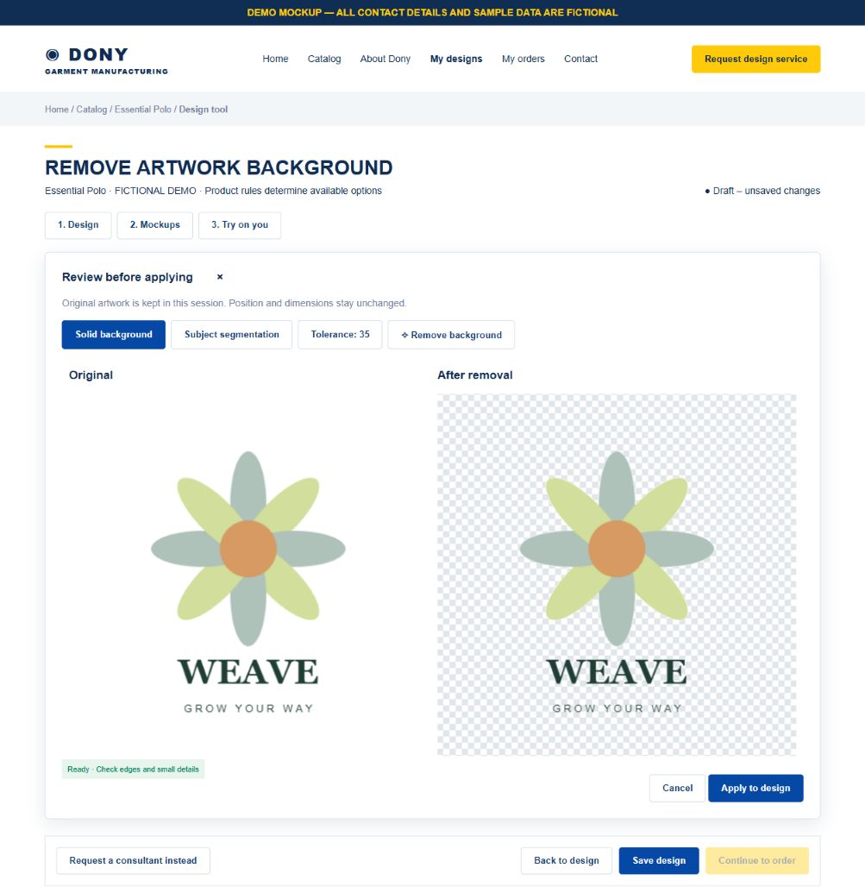

# Screen Spec: S21 Remove Background

| Field | Value |
|---|---|
| Screen ID | `S21` |
| Screen name | Remove Background |
| Actor | Customer owner |
| Priority | Should (MVP) |
| Belongs to module | [MFG-05](../specs/spec-MFG-05.md) |
| Route | S20 modal; `/designs/new?product_id={id}&mode=design&dialog=remove-background&asset_id={asset_id}` |
| Mockup image | img/S21-01-remove-background.png |
| Status | Resolved implementation specification |

## 1. Purpose

**Shown when:** Customer reviews removal on a selected owned draft artwork. Does not save a design. Returning to S20 applies only an explicitly reviewed result; cancel/close leaves artwork unchanged. Modal may be opened only for an eligible selected asset. Direct links reconstruct authorization/draft selection before opening.

**The user leaves this screen when:** They return to S20/S22/S23 within the same draft or follow the existing authorized save/order navigation. Exiting the workspace destroys personal try-on buffers; unsaved design warnings follow S20.

## 2. Mockup

Illustrative synthetic sample, using S20's Dony storefront style. Fictional polo/artwork do not add a Published catalogue product. Written requirements govern behavior; no personal photo or actual customer information appears in the PNG.

### Mockup deviations

- Hide “Request design service” in the header and “Request a consultant instead” in MVP; S24 is post-MVP.

## 3. Element inventory

| # | Element | Type | Content / data source | Required | Validation |
|---|---|---|---|---|---|
| 1 | Original/result comparison | Two labelled image panels | Selected artwork and transparent result on checkerboard | Yes | Original remains immutable in session. |
| 2 | Removal method | Select | Subject segmentation / Solid background | Yes | Solid mode removes border-connected colours only; subject failures offer solid fallback. |
| 3 | Tolerance | Slider/numeric | Integer 5–100, default 35 | Solid only | Larger tolerance expands eligible background; no internal disconnected colour removal. |
| 4 | Remove background | Button | Start transient processing | Yes | Disabled while pending; validate actual PNG/JPEG/WebP, <=10 MiB, <=16M pixels. |
| 5 | Apply / Cancel / Close | Buttons | Confirm result or dismiss | Yes | Apply only current successful output; preserve X/Y/width/height, side, selected asset; increment draft revision. |
| 6 | Restore original | S20 action | Original image from this draft session | After apply | Restores pixels, retains physical placement; no persistent undo guarantee after session ends. |

## 4. States

**Loading, access, errors and retry:** Show a labelled Loading state while reads resolve. A missing or inaccessible route returns a safe 401/403/404 without disclosing protected records. Error states show the API code, message, field_errors and request_id while preserving safe input. Retry transient reads; retry a mutation only with the original idempotency key and identical payload. Preserve safe user input after recoverable failures.

| State | What the user sees | Trigger |
|---|---|---|
| Loading/processing | Original visible, result progress; Apply disabled | Processing request starts |
| Ready | Method/tolerance controls, checkerboard result slot | Eligible selection |
| Success | Current original/result comparison; Apply enabled | Processing completes for matching asset/session |
| Conflict | Discard late result; ask to process current artwork | Asset removed/replaced, revision/session changes |

## 5. Interactions and navigation

| # | User action | System response | Goes to screen |
|---|---|---|---|
| 1 | Remove | Validate and process; never save automatically | S21 |
| 2 | Apply | Replace draft pixels, retain geometry, invalidate try-on | S20 |
| 3 | Cancel/Close/Escape | Discard review; restore focus to trigger | S20 |
| 4 | Restore original (S20) | Restore original within current session | S20 |

## 6. Screen-level rules

| Rule ID | Rule | Source |
|---|---|---|
| SR-001 | Check access and ownership on the server; never trust submitted customer, company, role, price, stage or provider status. Apply the documented 401/403/404 behavior and field rules. | Project baseline |
| SR-002 | IDs are UUIDs; timestamps are UTC and displayed in Asia/Ho_Chi_Minh; money and quantities are integers. Mutations use expected versions and idempotency keys where specified. | Project baseline |
| SR-003 | Apply the owning module's lifecycle and validation rules; preserve immutable submitted snapshots and design versions. | Project baseline |
| SR-004 | Use documented project assumptions; do not invent factual company, author, client-approval or course identifiers. | Project baseline |

### Acceptance scenarios

1. White background around an illustration disappears while disconnected white details inside remain.
2. Apply on a chest logo retains exact side and X/Y/width/height; transparent edges have no dark halo.
3. Cancel, error and late output never mutate the draft; successful apply can be restored in-session.
4. A processed artwork is persisted only through S20 explicit validated save; review buffers are transient.

## 7. Linked requirements

| FR ID (from the module spec) | What this screen does for it |
|---|---|
| MFG-05/F-DES-014 | Implements the remove background flow and its validation/session rules. |
| MFG-05/F-DES-001..003 | Shares the validated S20 draft; preserves explicit immutable save/order boundaries. |

## 8. Responsive and accessibility notes

Follow S20: 360px through desktop, navy/gold Dony storefront shell, labelled keyboard-operable tabs/buttons, visible focus and aria-live progress/errors. On narrow screens stack panels; make thumbnails horizontally scrollable and keep primary controls reachable. Text contrast >=4.5:1; controls >=24px. Images have descriptive alt text; alpha comparisons use a labelled checkerboard. Modal focus is trapped and restored to its trigger. Do not use colour alone for status.

## 9. Open questions

| # | Question | Blocking? | Status |
|---|---|---|---|
| 1 | Remaining screen behavior decisions? | No | Resolved by MFG-05 and the user-approved add-on scope. |

## Completion checklist

- [x] Route, actor, module, priority and illustrative image identified.
- [x] Fields, actions, ownership, validation and session boundaries defined.
- [x] Loading/error/retry/conflict/success states and navigation defined.
- [x] Acceptance scenarios and accessibility requirements defined.
