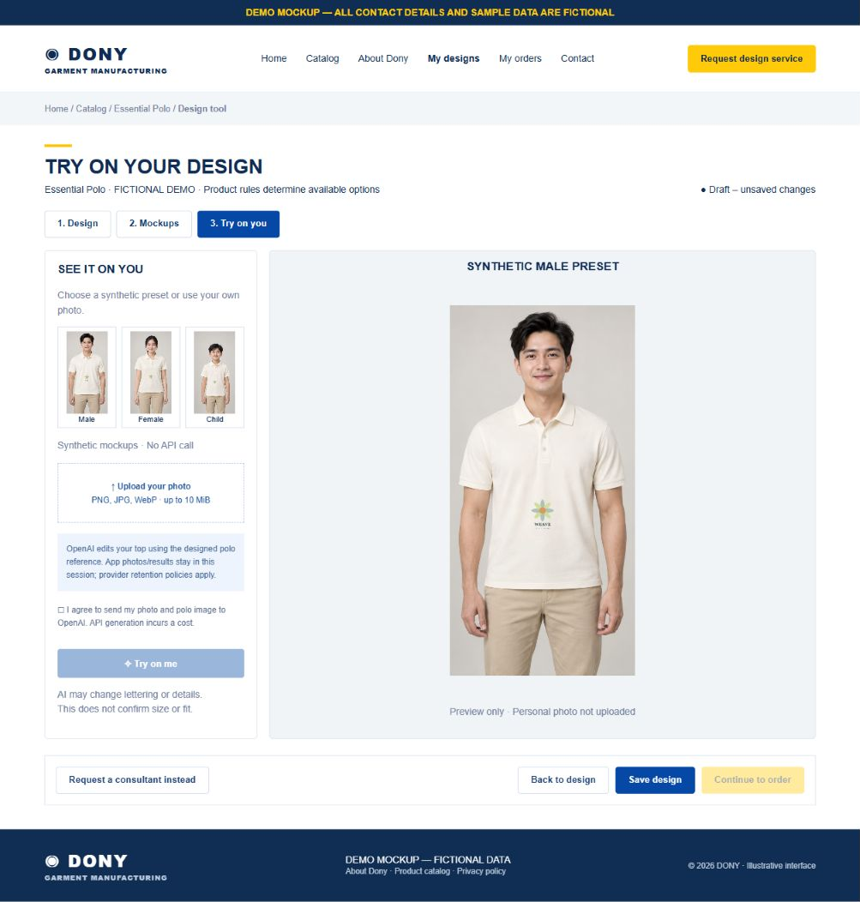

# Screen Spec: S23 Virtual Try On

| Field | Value |
|---|---|
| Screen ID | `S23` |
| Screen name | Virtual Try On |
| Actor | Customer owner |
| Priority | Should (MVP) |
| Belongs to module | [MFG-05](../specs/spec-MFG-05.md) |
| Route | `/designs/new?product_id={id}&mode=try-on` |
| Mockup image | img/S23-01-virtual-try-on.png |
| Status | Resolved implementation specification |

## 1. Purpose

**Shown when:** Customer sees synthetic male/female/child mockups of the current designed polo and may upload their own photo for AI image editing. Presets work without an API call. Uploading a photo never automatically transmits it. The customer explicitly consents and starts generation. Preview is illustrative, not a size/fit guarantee or production asset.

**The user leaves this screen when:** They return to S20/S22/S23 within the same draft or follow the existing authorized save/order navigation. Exiting the workspace destroys personal try-on buffers; unsaved design warnings follow S20.

## 2. Mockup

Illustrative synthetic sample, using S20's Dony storefront style. Fictional polo/artwork do not add a Published catalogue product. Written requirements govern behavior; no personal photo or actual customer information appears in the PNG.

## 3. Element inventory

| # | Element | Type | Content / data source | Required | Validation |
|---|---|---|---|---|---|
| 1 | Preset gallery | Three labelled cards | Synthetic male, female, child | Yes | Immediately show designed polo; clearly label deterministic mockup, not AI output. |
| 2 | Personal upload | File chooser | One PNG/JPEG/WebP photo | Optional | <=10 MiB, <=16M pixels, actual MIME/scan; recommend one person and visible torso. |
| 3 | Photo card / Remove | Thumbnail and button | Current photo, session-only label | After upload | Replacement/removal revokes consent and discards previous/pending result. |
| 4 | Provider disclosure / consent | Text + unchecked checkbox | Photo and polo sent to the external AI image provider; provider retention and API cost | Before generation | Explicit opt-in per photo; provider policies separate from application session-only storage. |
| 5 | Try on me | Primary button | Backend AI image edit | Photo + valid design + consent + available engine | Disable duplicate generation; no automatic retry; API key never in browser. |
| 6 | Progress / Cancel | Overlay/status and action | Current job progress | Pending | Cancel discards application result; provider processing/billing may continue. |
| 7 | Original/result comparison | Toggle and image | Current session photo/generated result | Result available | Reject mismatched revision/photo/session; never save/download as manufacturing design. |
| 8 | Back to design / Mockups | Mode tabs | Shared draft | Yes | Design retained; leaving destroyed session clears personal buffers. |

## 4. States

**Loading, access, errors and retry:** Show a labelled Loading state while reads resolve. A missing or inaccessible route returns a safe 401/403/404 without disclosing protected records. Error states show the API code, message, field_errors and request_id while preserving safe input. Retry transient reads; retry a mutation only with the original idempotency key and identical payload. Preserve safe user input after recoverable failures.

| State | What the user sees | Trigger |
|---|---|---|
| Preset/empty | Synthetic model preview and upload prompt | No personal photo |
| Photo ready | Input photo; consent unchecked; generation disabled until consent | Valid upload |
| Generating | Progress and cancellation; no duplicate submit | Consent-gated explicit generation |
| Success | Generated preview and original toggle | Matching current job/revision/photo/session |
| Unavailable | AI provider not configured; presets and design remain usable | Backend reports unavailable |
| Stale/cancelled | Ignore result; show current draft/input | Design/photo/session changed or cancel |

## 5. Interactions and navigation

| # | User action | System response | Goes to screen |
|---|---|---|---|
| 1 | Select preset | Show current polo on labelled synthetic person | S23 |
| 2 | Upload/replace photo | Validate in session, reset consent/result | S23 |
| 3 | Consent + Try on me | Backend sends two images to the AI image provider; no client credential | S23 |
| 4 | Compare original/result | Toggle images without another API call | S23 |
| 5 | Remove/cancel/end session | Clear personal state, invalidate job | S23 / originating route |
| 6 | Design/Mockups | Return to shared draft | S20 / S22 |

## 6. Screen-level rules

| Rule ID | Rule | Source |
|---|---|---|
| SR-001 | Check access and ownership on the server; never trust submitted customer, company, role, price, stage or provider status. Apply the documented 401/403/404 behavior and field rules. | Project baseline |
| SR-002 | IDs are UUIDs; timestamps are UTC and displayed in Asia/Ho_Chi_Minh; money and quantities are integers. Mutations use expected versions and idempotency keys where specified. | Project baseline |
| SR-003 | Apply the owning module's lifecycle and validation rules; preserve immutable submitted snapshots and design versions. | Project baseline |
| SR-004 | Use documented project assumptions; do not invent factual company, author, client-approval or course identifiers. | Project baseline |

### Acceptance scenarios

1. Upload alone makes no provider request; unchecked consent blocks generation on client and server.
2. AI input order is person first and designed polo second; backend returns a result with the matching design revision.
3. Photo replacement or design edit invalidates a pending reply; a cancelled session cannot receive an old result.
4. Personal photo/result never enters save/order payloads, browser storage, application image files or logs.
5. Missing key, connection failure, invalid request, quota and timeout give actionable safe errors without raw provider data/secret leakage.
6. Original comparison and presets cost no API call; failed generation leaves S20 draft usable.

## 7. Linked requirements

| FR ID (from the module spec) | What this screen does for it |
|---|---|
| MFG-05/F-DES-016 | Implements the virtual try on flow and its validation/session rules. |
| MFG-05/F-DES-001..003 | Shares the validated S20 draft; preserves explicit immutable save/order boundaries. |

## 8. Responsive and accessibility notes

Follow S20: 360px through desktop, navy/gold Dony storefront shell, labelled keyboard-operable tabs/buttons, visible focus and aria-live progress/errors. On narrow screens stack panels; make thumbnails horizontally scrollable and keep primary controls reachable. Text contrast >=4.5:1; controls >=24px. Images have descriptive alt text; alpha comparisons use a labelled checkerboard. Modal focus is trapped and restored to its trigger. Do not use colour alone for status.

## 9. Open questions

| # | Question | Blocking? | Status |
|---|---|---|---|
| 1 | Remaining screen behavior decisions? | No | Resolved by MFG-05 and the user-approved add-on scope. |

## Completion checklist

- [x] Route, actor, module, priority and illustrative image identified.
- [x] Fields, actions, ownership, validation and session boundaries defined.
- [x] Loading/error/retry/conflict/success states and navigation defined.
- [x] Acceptance scenarios and accessibility requirements defined.
