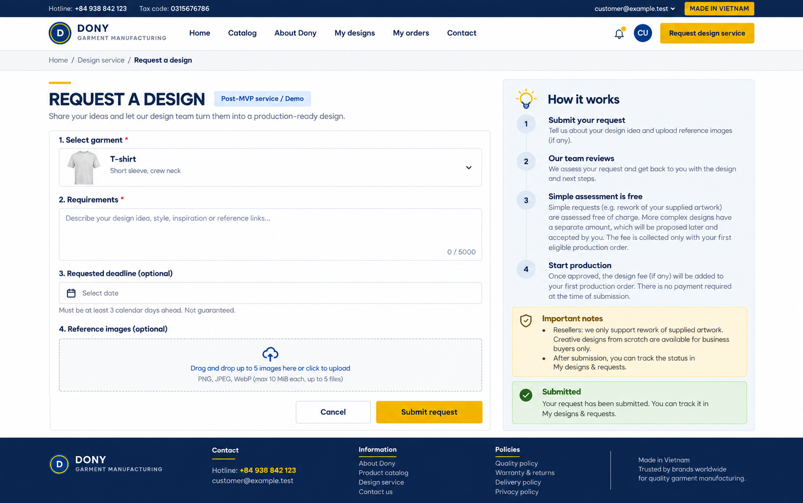

# Screen Spec: S24 Design Service Request

| Field | Value |
|---|---|
| Screen ID | `S24` |
| Screen name | Design Service Request |
| Actor | Customer owner |
| Priority | Could (MVP) |
| Belongs to module | [MFG-05](../specs/spec-MFG-05.md) |
| Route | `/design-requests/new?product_id={id}` |
| Mockup image | img/S24-01-design-service-request.png |
| Status | Resolved implementation specification |

## 1. Purpose

**Shown when:** The customer submits a DesignRequest against a Published Dony garment base, with the Business Buyer's uniform requirements or the Reseller Shop's own artwork, branding and specifications, optional safe attachments and a deadline at least three calendar days ahead. Dony will manufacture only after design, sample and order approval; this is not a ready-made-stock request. No fee is displayed or snapshotted at submission; Sales Admin assesses complexity afterward. All identifiers and permissions come from the server session; list filters are allowlisted and recoverable failures preserve entered values.

**The user leaves this screen when:** An authorized action in section 5 succeeds, the user follows a role-allowed global route, or they return to the validated originating route.

## 2. Mockup

The mockup illustrates the defined workflow. Fictional sample values do not replace the field, lifecycle and release-scope rules below.

## 3. Element inventory

| # | Element | Type | Content / data source | Required | Validation |
|---|---|---|---|---|---|
| 1 | Screen heading | Heading | Design Service Request | Yes | Static route title. |
| 2 | Route | Navigation target | /design-requests/new?product_id={id} | Yes | Access checked on server. |
| 3 | product_id | Field / control | UUID of a Published Dony garment base. | As specified | The product supplies configurable production rules; it is not ready-made stock. |
| 4 | requirements | Field / control | required string 20..5000 trimmed chars. | As specified | requirements: required string 20..5000 trimmed chars. |
| 5 | attachment_ids | Field / control | optional private image UUIDs | As specified | attachment_ids: optional private image UUIDs; max5, MIME PNG/JPEG/WebP <=10MiB each, access checked. |
| 6 | requested_deadline | Field / control | optional ISO date >=3 calendar days from submission | As specified | requested_deadline: optional ISO date >=3 calendar days from submission; not guaranteed. |
| 7 | assessment_notice | Read-only text | Simple work is free; Complex fee requires acceptance and is collected only with an eventual order. | Yes | Do not display a fee amount or initiate payment at submission. |
| 8 | API errors | Field / control | standard API error envelope | As specified | 400 malformed; 422 invalid fields; 409 stale/duplicate; 429 rate limit; 503 dependency failure |
| 9 | Submit request | Action | Create Submitted with fee null and requested deadline; persist admin notice and open the owned request in S26. | Available when authorized | Destination: S26 /design-requests/{request_id} |
| 10 | Cancel | Action | Discard unsubmitted request. | Available when authorized | Destination: S15 |

## 4. States

**Loading, access, errors and retry:** Show a labelled Loading state while reads resolve. A missing or inaccessible route returns a safe 401/403/404 without disclosing protected records. Error states show the API code, message, field_errors and request_id while preserving safe input. Retry transient reads; retry a mutation only with the original idempotency key and identical payload. Preserve safe user input after recoverable failures.

| State | What the user sees | Trigger |
|---|---|---|
| Empty | No Design Service Request records match the current route/filter; preserve inputs and show only the screen’s authorized next action. | Screen has no eligible or matching record |
| Success | Refresh the committed Design Service Request data and show the next action permitted by its lifecycle and actor. | Valid action commits |
| Conflict | The Design Service Request data or lifecycle changed concurrently; reload authoritative state and do not replay a stale mutation. | Stale version, duplicate or invalid lifecycle transition |
## 5. Interactions and navigation

| # | Element | User action | System response | Goes to screen |
|---|---|---|---|---|
| 1 | Submit request | Activate | Create Submitted with fee null and requested deadline; persist admin notice and open the owned request in S26. | S26 /design-requests/{request_id} |
| 2 | Cancel | Activate | Discard unsubmitted request. | S15 |

Portal: Customer owner. Route: /design-requests/new?product_id={id}. Back preserves the originating route and filters. 

## 6. Screen-level rules

| Rule ID | Rule | Source |
|---|---|---|
| SR-001 | Check access and ownership on the server; never trust submitted customer, company, role, price, stage or provider status. Apply the documented 401/403/404 behavior and field rules. | Project baseline |
| SR-002 | IDs are UUIDs; timestamps are UTC and displayed in Asia/Ho_Chi_Minh; money and quantities are integers. Mutations use expected versions and idempotency keys where specified. | Project baseline |
| SR-003 | Apply the owning module's lifecycle and validation rules; preserve immutable submitted snapshots and design versions. | Project baseline |
| SR-004 | Use documented project assumptions; do not invent factual company, author, client-approval or course identifiers. | Project baseline |

### Acceptance scenarios

1. Valid request creates Submitted with fee null, no payment/assignment and one admin notice; opens the S26 request view. Duplicate submission replays the same request.
2. Deadline less than 3 calendar days or requirements outside 20..5000 chars is rejected.

## 7. Linked requirements

| FR ID (from the module spec) | What this screen does for it |
|---|---|
| MFG-05/F-DES-005 | **Request Service** — Render the design-service request form without a submission fee or payment step. |
| MFG-05/F-DES-006 | **Request Service** — Create a validated Submitted request with idempotency and return S26 request navigation; no submission fee/payment. |

## 8. Responsive and accessibility notes

Support 360px through desktop; stack columns and use labelled horizontal-scroll tables on narrow screens. Controls are keyboard-operable with visible focus, logical headings, associated form labels, and aria-live status/error announcements. Text contrast is at least 4.5:1 (large text 3:1); pointer targets are at least 24px. Preserve user-entered data after recoverable failures. Confirm destructive actions, disable duplicate submit while pending, and enforce idempotency on the server.

## 9. Open questions

| # | Question | Blocking? | Status |
|---|---|---|---|
| 1 | No unresolved screen behavior questions remain; routes, fields, permissions, and defaults are resolved in this specification and its linked module requirements. | No | Resolved |

## Completion checklist

- [x] Route, actor, module, priority, and mockup status are identified.
- [x] Element fields, actions, validation, and data ownership are documented.
- [x] Loading, empty, forbidden, error, retry, success, and conflict states are documented.
- [x] Navigation and acceptance scenarios are explicit.
- [x] Responsive and accessibility requirements are documented in this screen.
- [x] No unresolved screen-level decisions remain.

## 10. Customer-model service boundary

Business Buyers may request creative Dony design support. Reseller Shops submit their own artwork/specifications for production validation or larger rebuilding/rework; full creative design from scratch is not offered. Ordinary technical adjustments use S29 without a DesignRequest. Unknown-model submissions remain Submitted in Admin-only Unclassified lead triage; Sales Admin must classify before service assessment or assignment. Existing optional reference attachments and requirements/MIME/deadline validation remain unchanged; the submission never creates a fee or assignment.
