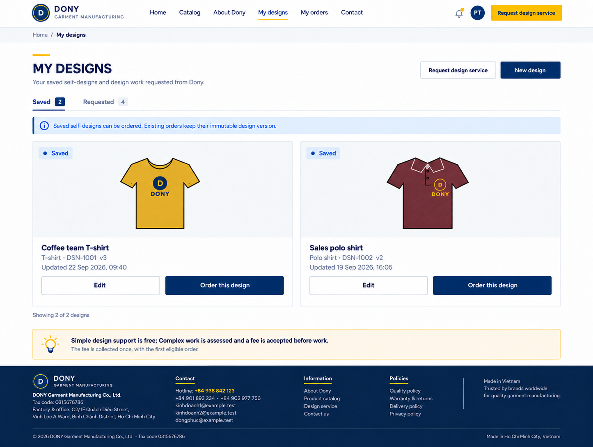
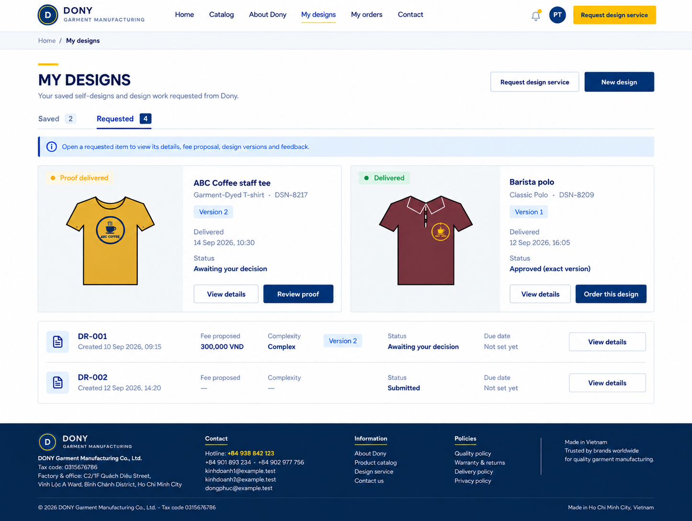

# Screen Spec: S25 Design Gallery

| Field | Value |
|---|---|
| Screen ID | `S25` |
| Screen name | Design Gallery |
| Actor | Customer owner |
| Priority | Must (MVP) for the Saved tab; the Requested tab is Could |
| Belongs to module | [MFG-05](../specs/spec-MFG-05.md) |
| Route | `/designs?tab=saved`, `/designs?tab=requested`; `/designs` defaults to Saved |
| Mockup images | img/S25-01-saved-designs.png, img/S25-02-requested-designs.png |
| Status | Final user revision 2026-09-28 |

## 1. Purpose

One owned-design gallery with exactly two top-level tabs: **Saved** and **Requested**. Saved contains designs the Customer created and saved themselves. Requested contains designs and work the Customer has asked Dony to help with, whether in progress or historical, and requests that do not yet have a delivered design. [S26](S26-design-request-detail.md) is the separate detail screen for request status, exact fee acceptance/cancellation, versions, feedback and owner approval.

Tab classification uses the source/lineage, not whether a design happens to be Saved, ProofDelivered or Delivered. A Dony-assisted imported design or a copy retaining source_design_request_id stays Requested; an import without a DesignRequest must not fabricate a request record. Private staff drafts never appear. Removing the Draft tab does not remove draft recovery/editing in S20 or make Draft versions orderable.

MVP keeps the saved self-design path. Requested remains the existing Could service subset; when unavailable, show the tab disabled with an availability explanation, without introducing service APIs or fake empty results.

## 2. Mockups

### View 01 — Saved selected

### View 02 — Requested selected

These are two states of the same screen and use the same heading, header/footer and Saved / Requested bar. Lifecycle/status badges remain distinct from the tab labels.

### Mockup deviations

- In MVP, show only the Saved tab. Hide the Requested tab, “Request design service” actions and requested-work examples because the design-service workflow is Could/post-MVP.

## 3. Element inventory

| # | Element | Content / behavior | Validation |
|---|---|---|---|
| 1 | Gallery heading and tabs | My designs; Saved and Requested only | Session-derived Customer; no Draft, Shared or Requests third tab |
| 2 | Saved cards | Owned self-created saved design, product, current version, preview, update time; Edit and Order | S20 creates immutable versions; S30 rechecks current Saved eligibility, rules and ownership |
| 3 | Requested cards / pending requests | Dony-assisted design/request history, current state, linked request, version, assessed fee and commitment summary when present | No invented design/fee/deadline before available; no private staff Draft or CRM information; group linked request/design to avoid duplicate gallery items |
| 4 | Open requested item | View details for a current or historical request/design | S26 reauthorizes exact request/design ID; before a design exists, open request detail |
| 5 | Order requested design | Current Delivered design or confirmed unchanged imported Saved version only | S30 independently rechecks eligibility; pending ProofDelivered has no order action |
| 6 | New design / Request design service | S20 via an eligible product / S24 | Existing product, login and source restrictions; service availability gate remains |
| 7 | Filters and pagination | Allowlisted product/status filters and bounded pages within selected tab | Preserve tab/filters on detail/back; statuses do not move records between tabs |

## 4. States

**Loading, access, errors and retry:** Show a labelled Loading state while reads resolve. A missing or inaccessible route returns a safe 401/403/404 without disclosing protected records. Error states show the API code, message, field_errors and request_id while preserving safe input. Retry transient reads; retry a mutation only with the original idempotency key and identical payload. Preserve safe user input after recoverable failures.

Loading disables actions until authorization resolves. Empty Saved offers the catalogue/self-design path; empty Requested explains no matching Dony request or design work. An unavailable service tab is not an empty history. Invalid filters return 400/422; inaccessible records/assets return safe 404. Recoverable errors retain tab/filters and show request_id. Stale versions reload authoritative cards. ProofDelivered opens S26 for review and cannot order; terminal request history remains readable.

## 5. Interactions and navigation

Saved opens S20 for editing and S30 for an eligible order. Clicking a Requested item opens S26 at `/design-requests/{request_id}` or `/designs/{design_id}?tab=feedback`; the latter supports assisted designs without a request. Review fee and Cancel request links also open S26, where the actual confirmed mutation occurs. S24 submission continues to S26 request detail; back returns to S25 Requested with filters preserved.

There is no independent S26 list or a third gallery tab. The shared Customer storefront shell applies.

## 6. Rules and acceptance scenarios

| Rule ID | Rule | Source |
|---|---|---|
| SR-001 | Check access and ownership on the server; never trust submitted customer, company, role, price, stage or provider status. Apply the documented 401/403/404 behavior and field rules. | Project baseline |
| SR-002 | IDs are UUIDs; timestamps are UTC and displayed in Asia/Ho_Chi_Minh; money and quantities are integers. Mutations use expected versions and idempotency keys where specified. | Project baseline |
| SR-003 | Apply the owning module's lifecycle and validation rules; preserve immutable submitted snapshots and design versions. | Project baseline |
| SR-004 | Use documented project assumptions; do not invent factual company, author, client-approval or course identifiers. | Project baseline |
1. Saved and Requested are mutually exclusive provenance groups; Dony-assisted history never disappears merely because the request is completed or cancelled.
2. Current self-saved designs and confirmed unchanged imports, or owner-approved Delivered work, retain MFG-05 ordering eligibility; Draft, ProofDelivered and Superseded do not become orderable through the new tabs.
3. Editing an ordered design forks immutable work and retains lineage/fee-allocation evidence.
4. S25 shows summaries only. S26 owns request fee acceptance/cancellation, exact-version review/approval, source confirmation and feedback threads.
5. Every read/action rechecks ownership; another Customer receives 404. No private staff versions or CRM notes are exposed.
6. Both illustrated list states have exactly Saved / Requested; opening details and returning preserves Requested and the applied filters.

## 7. Linked requirements

MFG-05/F-DES-004 owns this unified gallery; F-DES-003 owns immutable save. S26 implements F-DES-012/013 and F-DES-017/018/020; ordering remains MFG-06. Scope follows README and screen-list.

## 8. Responsive and accessibility notes

Support 360px through desktop with labelled tabs, keyboard-operable cards/actions, visible focus, image alternatives, 4.5:1 contrast, 24px targets and aria-live states. Announce disabled Requested availability and distinguish lifecycle badges with text. Preserve tab/filters after recoverable errors.

## 9. Confirmed decisions

S25 holds both list states (Saved / Requested); S26 is the separate detail screen.
