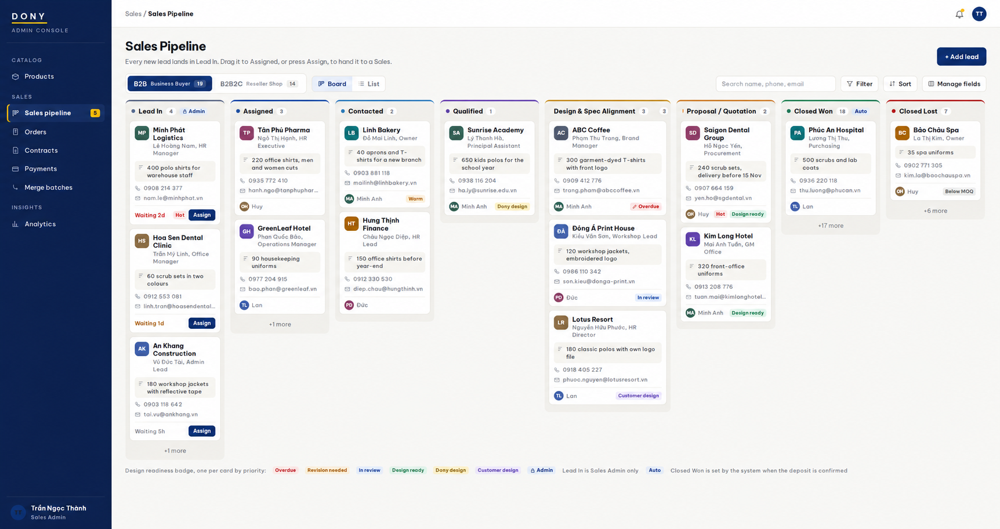
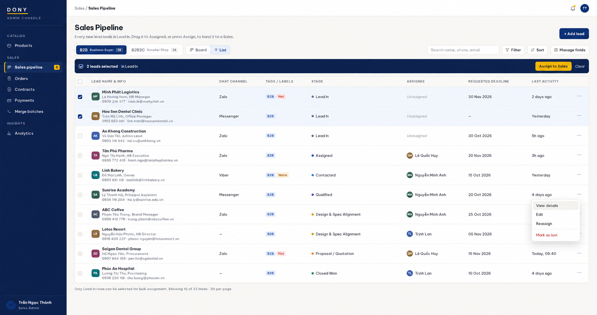
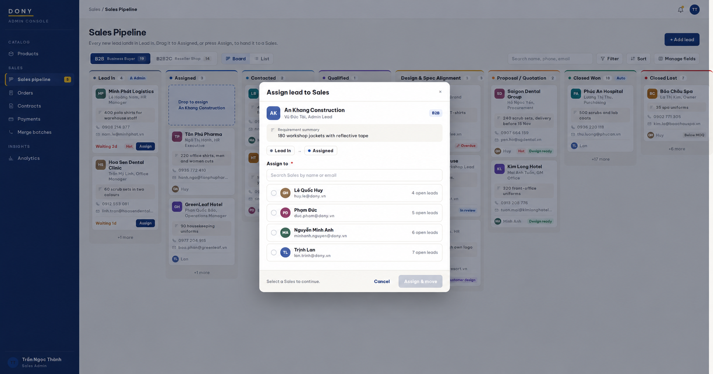
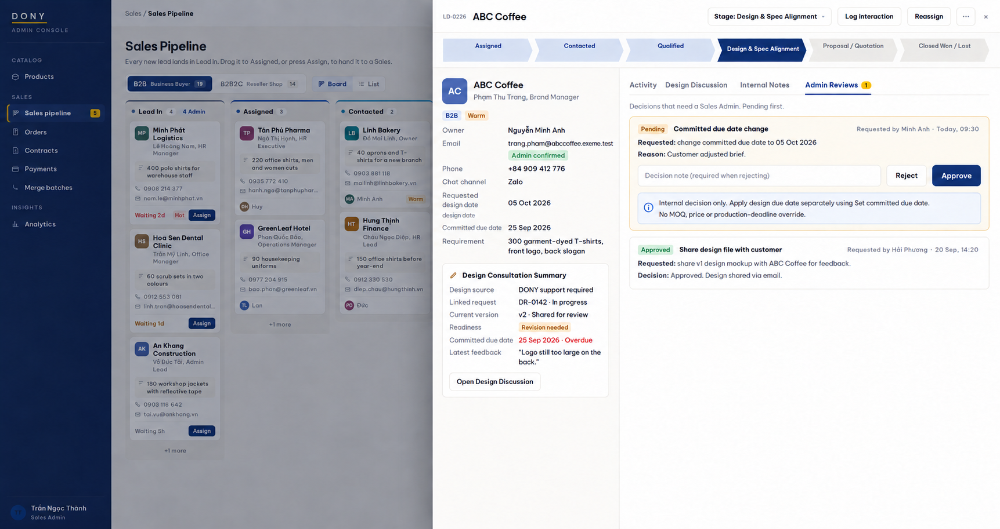
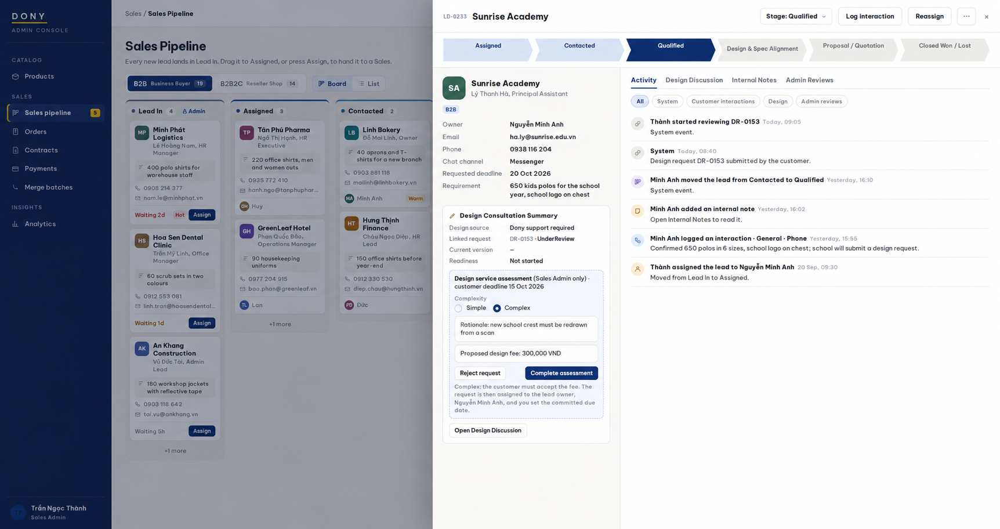

# Screen Spec: S27 Sales Pipeline (Sales Admin)

| Field | Value |
|---|---|
| Screen ID | `S27` |
| Screen name | Sales Pipeline (Sales Admin) |
| Actor | Sales Admin |
| Priority | Could (MVP) |
| Belongs to module | [MFG-08](../specs/spec-MFG-08.md) (Sales pipeline, CRM). MFG-05 design data is projected here read-only; the Sales Admin may execute the MFG-05 DesignRequest assessment and committed-due administrative actions explicitly listed in section 3.11. Actual design asset/version work stays in S29. |
| Route | `/admin/pipeline?model={b2b\|b2b2c\|unclassified}&view={board\|list}`. Detail panel adds `&lead={consultation_id}&tab={activity\|design\|notes\|reviews}`; assign popup adds `&assign={consultation_id}`. Inaccessible targets return 404. |
| Mockup image | img/S27-01-admin-sales-pipeline.png (Board); img/S27-02-pipeline-list.png (List); img/S27-03-assign-lead.png (Assign popup); img/S27-04-lead-admin-review.png (Detail panel, Admin Reviews); img/S27-05-design-assessment.png (Detail panel, design request assessment) |
| Status | Resolved specification with decisions D-01 to D-08 (D-03 revised) applied (section 1.1). S29 remains as the Design Workspace for design execution. Final decisions in section 9 define the out-of-scope actions; the approved pipeline and design integration are defined below. |

## 1. Purpose

**Shown when:** The Sales Admin runs the whole Dony sales pipeline in one workspace. There is **one** canonical pipeline for both customer models; the tabs **B2B – Business Buyer** and **B2B2C – Reseller Shop** filter leads by `customer_model` and change only the label and validation criteria of the Design Consultation stage. The Sales Admin sees every lead, including unassigned leads in **Lead In** (only in this view), assigns and reassigns Sales owners, assesses design requests, sets committed due dates, decides Admin Reviews, and sees the full lead detail panel. Actual design work (uploading, revising and sharing versions) happens in S29 Design Workspace; this screen only reads and summarizes it. Each Sales works the same records in [S28](S28-sales-pipeline.md), so a change in either screen is visible in both. All identifiers and permissions come from the server session; list filters are allowlisted and recoverable failures preserve entered values.

**The user leaves this screen when:** They open the Design Workspace (S29), a linked order (S37) or contract (S39), follow a role-allowed global route, or return to the validated originating route.

### 1.1 Decisions applied

| ID | Decision |
|---|---|
| D-01 | `ReadyForQuotation` requires an immutable, orderable MFG-05 DesignVersion. Customer-provided assets received outside WeaveLink may be uploaded by the authorized Sales; the customer does not have to upload them personally. |
| D-02 | B2B2C uses `CustomerProvided` only. Dony may perform or propose limited production-oriented technical adjustments, recorded as new versions; full creative design service is not offered to B2B2C. `technical_adjustment_required` is a processing state, not a design source. |
| D-03 (revised) | Keep the existing Simple / Complex assessment model for compatibility with MFG-05, MFG-06, MFG-08, MFG-11, MFG-12 and related screens: Simple → Approved with `design_fee_vnd = 0`; Complex → FeeProposed with a positive fee → explicit customer acceptance → Approved; Reject stays a separate outcome. `design_fee_vnd`, fee acceptance and first-order fee allocation are unchanged. Simple/Complex is not renamed or removed. |
| D-04 | The accountable owner of a DesignRequest is always the current Sales owner of the lead. An Approved request is assigned to that owner automatically; reassigning the lead transfers active requests atomically with their committed due dates. There is no separate design-owner selection. `committed_due_at` stays an absolute date and time, set at or after assignment/eligibility by the Sales Admin; a Sales can only request a change (section 3.11). |
| D-05 | Closed Won is triggered only by deposit settlement: a linked order moves `AwaitingDeposit → Confirmed`. Contract signing is a milestone, not Closed Won. |
| D-06 | Screen architecture: S27/S28 = Sales/CRM orchestration (pipeline, readiness, summary, Activity, notes, Admin Reviews); S29 = Design Workspace (staff design asset/version execution); S25 = customer design gallery; S26 = customer-side design collaboration. MFG-05 is the source of truth for design data, MFG-08 for the sales pipeline. S29 is scoped to **one design** (`design_id`) after creation; a lead can have several designs. Staff design asset/version writes happen in S29, customer feedback/approval happens in S26, and the MFG-05 DesignRequest assessment/committed-due administrative actions are exposed to Sales Admin in S27. Design events project from MFG-05 → S27/S28; CRM interactions project from MFG-08 → S29 read-only. |
| D-07 | Design scope: each lead–design link carries `design_scope` = In scope or Dropped (a CRM / commercial-scope fact, not an MFG-05 lifecycle state). A single design defaults to In scope; with several designs the Sales can mark one as dropped or restore it; the design and its history stay in MFG-05. The readiness gate needs at least one In scope design and ignores Dropped ones. |
| D-09 | S25 is the gallery; S26 owns customer review and request operations. Unclassified triage, assignment-before-commitment and main’s no-cap/no-separate-sample-fee policy follow user confirmation in section 10. |
| D-08 | `CustomerProvidedConfirmation` and `CustomerApproval` are different facts. The first is evidence, recorded by staff in S29, that an **unchanged** customer-provided import is the customer's file. The second is the customer's own action in S26 on a version Dony shared or changed. They are never merged into one confirmed flag, and staff can never approve on behalf of the customer. |

## 2. Mockup

Layout and interaction patterns follow the Rework reference (board, list, slide-over detail); Rework stage names are not used. Sample names, companies and contact data are synthetic. Written behavior below takes precedence over mockup content; mockup references to S25 customer review resolve to S26, and Unclassified triage follows section 10.

## 3. Element inventory

### 3.1 Lead record

A lead is one MFG-08 **Consultation** record for one Customer or prospective customer.

| Field | Meaning | Status |
|---|---|---|
| `pipeline_stage` | **Canonical Sales stage** and the only source of truth for the Kanban column; values in section 3.3. | New field |
| `customer_model` | `B2B` (Business Buyer), `B2B2C` (Reseller Shop), or `Unclassified` (Admin triage only). | New field |
| Owner | Active Sales from the MFG-08 CustomerAssignment; empty only in Lead In. | Existing |
| `organization_name`, `contact_name`, `contact_title`, `phone`, `email` | Lead identity and contact data. | Existing data; `contact_title` new |
| `requirement_summary` | One short line describing the need. 10–200 characters. | New field |
| `product_interest`, `estimated_quantity` | Published product(s) of interest; positive integer. | New fields |
| `requested_deadline` | Date the customer wants the goods; not `DesignRequest.requested_deadline`. | New field |
| `preferred_chat_channel` | Zalo, Messenger, Viber or none. Optional, configurable. | New field |
| `labels` | Optional temperature label: Hot, Warm or Cold. | New field |
| `source` | Website sign-up, Design request, Order, Manual (Hotline, Zalo, Facebook, Referral, Walk-in, Other). | New field |
| `design_source` | `CustomerProvided` or `DonySupportRequired` (B2B only); empty until set. B2B2C leads are always `CustomerProvided` (D-02, section 3.11). | New field |
| `technical_adjustment_required` | Flag set by the Sales when a customer-provided design needs a production-oriented technical adjustment. A processing state, not a design source. | New field |
| `design_readiness` | `NotStarted`, `InProgress`, `InReview`, `RevisionNeeded`, `ReadyForQuotation` (section 3.11). | New field |
| `design_checklist` | Model-specific validation items confirmed by the Sales (section 3.11). | New field |
| Linked designs | The lead's designs (MFG-05 `design_id`), for example Polo uniform and Jacket. Each design has its versions and feedback and may come from a DesignRequest (optional association). Stored as links only; version, status and feedback are read from MFG-05, never copied. Each link has `design_scope` (In scope by default, or Dropped; D-07). | New reference |
| Linked orders | Orders created by the lead's customer while the lead is open. Their MFG-06 events drive the Proposal / Quotation milestone and Closed Won. | Derived |
| `proposal_milestone` | Latest of: Quote sent, Digital design approved, Sample approved, Contract signed, Awaiting deposit — derived from linked order events; shown in the detail panel only. | Derived |
| `lost_reason`, `lost_note` | Required when closed as lost (TR-06). | New fields |
| `stage_entered_at`, `version`, timestamps | Audit and concurrency. | New / existing |

**Stage field.** `pipeline_stage` identifies the board column, enforces the gates and records stage history. Every pipeline read and write uses `pipeline_stage`; there is no second status field.

`committed_due_at` is **not** a lead field. It stays Dony's committed design due date on a DesignRequest (MFG-05).

### 3.2 Customer model

1. B2B and B2B2C share one pipeline, one stage enum, one transition rule set and one data model. A tab only applies the filter `customer_model = B2B` or `B2B2C`. There are no separate state machines.
2. `customer_model` changes three things in the Design Consultation stage only: its **label**, the **allowed design sources** and the **validation checklist** (section 3.11).
3. The model is shown as a badge on the card and assign popup; only Sales Admin may classify Unclassified leads in the detail panel. The assign popup offers no model choice.
4. Known sources of the value: the Business Buyer / Reseller Shop choice on an order (S30 `buyer_type`) and **+ Add lead**. Unknown models use `Unclassified` and appear in the Sales-Admin-only Unclassified view. The Admin explicitly classifies them before assignment or design-service assessment; no model is guessed.

### 3.3 Sales stages

| # | `pipeline_stage` | UI label | Meaning | Exit gate (checked by the server) |
|---|---|---|---|---|
| 1 | `LEAD_IN` | Lead In | New lead without a Sales owner. Sales Admin only. | Leaves only through the assign popup (section 3.8). |
| 2 | `ASSIGNED` | Assigned | An active Sales owns the lead and has not reached the customer yet. | At least one logged interaction with the customer dated after the assignment. |
| 3 | `CONTACTED` | Contacted | The Sales has reached the customer. | `requirement_summary`, `product_interest`, `estimated_quantity` and `requested_deadline` are filled, and the need is a made-to-order garment job Dony can take. |
| 4 | `QUALIFIED` | Qualified | A real opportunity with basic requirements. | `design_source` is set to a value allowed for the customer model. |
| 5 | `DESIGN_CONSULTATION` | B2B: **Design & Spec Alignment**; B2B2C: **Design & Spec Alignment** | Sales checkpoint: is the design/specification clear enough to quote? Contains the collaboration loop: determine source → prepare or receive design → share and review versions → feedback and revision → readiness. | `design_readiness = ReadyForQuotation` (section 3.11). |
| 6 | `PROPOSAL_QUOTATION` | Proposal / Quotation | Quotation is created and sent, and all commercial discussion after it happens here: quantity, commercial scope, delivery expectation, terms and adjustments the system allows. Sales cannot override system prices; exceptions go through Admin Reviews. | Closed Won event (below). |
| 7 | `CLOSED_WON` | Closed Won | The deal is won: a linked order has a settled deposit. | Set only by the system when a linked order moves `AwaitingDeposit → Confirmed` (D-05). |
| 8 | `CLOSED_LOST` | Closed Lost | The deal is lost. | Reason required. |

S27 shows all 8 columns; S28 shows 7 (no Lead In). There is no Negotiation stage.

**Proposal / Quotation milestones.** Because Closed Won waits for the deposit, a lead can stay in Proposal / Quotation through digital approval, sample, contract and deposit. Progress is shown as the derived `proposal_milestone` (Quote sent → Digital design approved → Sample approved → Contract signed → Awaiting deposit) in the detail panel and as Activity events; these are not stages.

**Design Consultation is a Sales stage, Sampling is not.** Design Consultation only answers "is the design/specification ready for quotation?". It does not replace or mirror the DesignRequest lifecycle: `pipeline_stage = DESIGN_CONSULTATION` is never equated with any DesignRequest status, and the pipeline never changes DesignRequest or DesignVersion state except through the MFG-05 actions exposed in section 3.11. Sampling, order, contract and payment keep their own lifecycles (MFG-06, MFG-09) and run in parallel while the lead is in Proposal / Quotation; a sample revision creates new design and quote versions without changing `pipeline_stage`.

### 3.4 Transition rules

| ID | Rule |
|---|---|
| TR-01 | Only the Sales Admin can assign a lead out of Lead In to Assigned, through the assign popup; classification must be B2B or B2B2C; nothing is saved until **Assign & move** succeeds. |
| TR-02 | No one can move a lead into Lead In. **Unassign** is outside this version and not implemented. |
| TR-03 | Forward moves from Assigned to Proposal / Quotation are allowed for the lead owner and the Sales Admin. A move may skip stages only if the exit gate of every skipped stage is met; the stage history records each stage passed. |
| TR-04 | Backward moves between open stages are not allowed for any role in this version (including Sales Admin). Readiness changes after quotation (for example a new version shared for review) update the badge but never move the lead back. |
| TR-05 | Closed Won is system-only (D-05): when a linked order moves `AwaitingDeposit → Confirmed`, the lead moves to Closed Won in the same event handling, from any open stage, with a stage-history entry and Activity event. Manual drops on Closed Won are rejected. Contract signing only updates `proposal_milestone`. If a Confirmed order is later cancelled before production and the deposit refunded, the lead **stays Closed Won**: the sales outcome at the time of deposit was Won. The system records the Activity events "Order cancelled after confirmation" and "Deposit refunded"; the order outcome is kept separately in MFG-06/MFG-07 and is never written back as a pipeline stage. |
| TR-06 | Closed Lost can be set from any open stage, including Lead In (Sales Admin only for Lead In). Reason required: `PriceNotAccepted`, `BelowMOQ`, `DeadlineNotFeasible`, `ChoseAnotherSupplier`, `NoResponse`, `RequirementsChanged`, `Duplicate`, `Other` (note required for Other, 0–500 characters otherwise). Rejected while a linked order is active and not cancelled. |
| TR-07 | Only the Sales Admin reopens a Closed Won or Closed Lost lead, to Qualified, Design Consultation or Proposal / Quotation (MFG-08 BR-010: controlled reopen), with an audit entry. The target's entry conditions must hold (for example Proposal / Quotation needs `ReadyForQuotation`). |
| TR-08 | **Reassign** (Sales Admin) changes the owner of a lead in Assigned to Proposal / Quotation without changing `pipeline_stage`. As required by MFG-08 BR-002 and D-04, the customer's active design requests move to the new owner in the same transaction, keeping their state and `committed_due_at`. Pending Admin Reviews stay on the lead. |
| TR-09 | Every move uses `expected_version` and an `Idempotency-Key`; a stale move returns 409 and the board reloads. |

### 3.5 Lead sources

| Source | Result |
|---|---|
| Customer verifies a new account (S04) and has no Sales assignment | Lead In with `customer_model = Unclassified` when no verified model is known; visible in Admin triage (section 3.2). |
| First design request (S24) or first quote/order (S30) from a customer without an open lead | Lead In; S30 `buyer_type` sets `customer_model`; its design request and any resulting design are linked to the lead. If an open lead exists, the event is added to it instead. |
| **+ Add lead** by the Sales Admin | Lead In; `customer_model` required. Link only after verified Customer email and explicit audited Sales Admin confirmation; never auto-match names/phones. Reject conflicting links and duplicate open leads. |

A customer has at most one open lead (any stage except Closed Won and Closed Lost).

### 3.6 Top bar and Board view

| Part | Content |
|---|---|
| Header | Title "Sales Pipeline", helper text, **+ Add lead**. |
| Model tabs | **B2B – Business Buyer** and **B2B2C – Reseller Shop** with open-lead counts, plus Admin-only **Unclassified** with a triage count. |
| View switch | **Board** / **List**. |
| Tools | Search (name, phone, email; 0–100 characters), **Filter** (owner, stage, label, source, product, design readiness, design request awaiting assessment, committed due date missing, requested deadline range), **Sort**, **Manage fields**. |
| Columns | Lead In, Assigned, Contacted, Qualified, Design Consultation (model label), Proposal / Quotation, Closed Won, Closed Lost, each with a card count; Lead In shows an "Admin" lock and Closed Won an "Auto" chip (system-only, TR-05). 20 cards per column with "+N more"; closed columns show the current month by default. |

**Kanban card** (compact, scan-first): avatar/initials; lead/company name; contact name and title; requirement summary; phone; email; owner at the bottom (Lead In: waiting time and an **Assign** button); optional temperature label; **one design readiness badge**.

**Design readiness badge** — at most one per card, the first that applies:

| Priority | Badge | Condition |
|---|---|---|
| 1 | **Overdue** (red) | A linked DesignRequest in Assigned/InProgress is past its `committed_due_at`. |
| 2 | **Revision needed** | `design_readiness = RevisionNeeded`. |
| 3 | **In review** | `design_readiness = InReview`. |
| 4 | **Design ready** | `design_readiness = ReadyForQuotation`. |
| 5 | **Dony design** | `design_source = DonySupportRequired`, none of the above. |
| 6 | **Customer design** | `design_source = CustomerProvided`, none of the above. |

No badge when `design_source` is empty. Requested deadline, committed dates and long tag lists are not shown on the card.

### 3.7 List view

Same dataset and filters as the Board. Columns: Checkbox (Lead In rows only, for bulk assignment) · Lead name & info · Chat channel · Tags / labels · Stage (model label for Design Consultation) · Assignee · Requested deadline · Last activity · Action (⋯: View details, Edit, Reassign, Mark as lost; Reopen for closed leads). Design readiness, Design Consultation Summary data and Committed Due Date are not default columns. **Manage fields** can add Source, Customer model, Estimated quantity, Days in stage and Created. Unassign, Archive and deletion are outside this version and are not offered. Sort allowlist: `pipeline_stage`, `last_activity_at`, `requested_deadline`, `created_at`, `organization_name`. Page size 20–100.

**Bulk assign:** Select Lead In rows → **Assign to Sales** → assign popup with the selected count. One Sales for all; each lead commits separately with its own version and key; per-lead results are shown. No bulk reassign.

### 3.8 Assign lead to Sales popup

Opened by dropping a Lead In card on Assigned, by the card's **Assign** button, or by bulk assignment. Its only job is to set the Sales owner and move the lead from Lead In to Assigned; it contains no Design Consultation or DesignRequest fields.

| # | Element | Rule |
|---|---|---|
| 1 | Title | "Assign lead to Sales". |
| 2 | Lead | Avatar/initials, name, contact name and title; read-only. |
| 3 | Customer model badge | Read-only; no model choice. |
| 4 | Requirement summary | Read-only. |
| 5 | Stage change | "Lead In → Assigned", read-only. |
| 6 | **Assign to** \* | Search and radio list of active Dony StaffAccounts with the Sales role, with number of open leads as a hint; nothing preselected. |
| 7 | **Cancel** | Closes the popup without writing. |
| 8 | **Assign & move** | Disabled until an eligible Sales is selected. On success, in one transaction: set owner, set `pipeline_stage = ASSIGNED`, assign any of the customer's Approved design requests still waiting for an owner to the same Sales (D-04, section 3.11), append Activity events, write the notification outbox event. The popup itself shows no DesignRequest field. |

On Cancel or any failure (validation, 403, 404, 409, 422, network): no owner, no stage change, the card stays in Lead In, and the error is shown in the popup. No first-contact SLA/timer is included or shown.

### 3.9 Reassign

From the card menu, row action or detail panel: popup with the same layout titled "Reassign lead", showing the current owner and **Assign to**; **Reassign** is disabled until a different eligible Sales is selected. Follows TR-08 and notifies the previous Sales, the new Sales and the customer after commit (MFG-08 F-SALES-004). Cancel or failure changes nothing.

### 3.10 Detail panel

Single click on a card or row (or **View details**) opens a panel sliding in from the right; double click is not used. The panel is the CRM workspace for one lead; design execution stays in S29.

| Area | Content |
|---|---|
| Header | Lead code and name; **Stage** menu (allowed forward moves and Closed Lost; never Closed Won); **Log interaction**; **Reassign**; ⋯ (Edit, Mark as lost, Reopen when closed); Close. |
| Stage path | Assigned → Contacted → Qualified → Design Consultation (model label) → Proposal / Quotation → Closed Won / Lost, current stage highlighted; in Proposal / Quotation the current `proposal_milestone` is shown beside it. When the next move is blocked, a message names what is missing, e.g. "To move to Proposal / Quotation, design readiness must be Ready for quotation." |
| Left column | Avatar, name, title, model badge and labels; lead fields (owner, email, phone, chat channel, requested deadline, estimated quantity, source, requirement summary, created); **Design Consultation Summary** (section 3.11); **Associations** (designs → S29 of that design, quotes and orders → S37, contracts → S39). |
| Right column | Four tabs: **Activity** · **Design Discussion** · **Internal Notes** · **Admin Reviews** (section 3.12). There is no Comments tab or entity. |

On narrow screens and for design work, the panel can be expanded to full width.

### 3.11 Design Consultation

**Domain boundary.** MFG-05 owns actual design data: DesignRequest, design assets, DesignVersion and version history, versions shared with the customer, customer feedback, revision and final approval. Staff design asset/version execution happens in **S29 Design Workspace**; customer feedback/approval happens in S26. The Sales Admin may perform only the MFG-05 DesignRequest administrative actions explicitly exposed in this section: assessment, reject and set/change `committed_due_at`. MFG-08 owns the Sales side: `pipeline_stage`, `customer_model`, assignment, `design_source`, `technical_adjustment_required`, `design_readiness`, `design_checklist`, Activity, external interactions, Internal Notes, Admin Reviews and lead–design commercial scope. S27/S28 never upload, revise, validate, share, or record confirmation/approval on DesignVersions.

**Projection, not copy.** Every important design event or state in S29 is reflected in S27/S28, but S29's detailed data is not copied into the CRM. S27/S28 read this projection from MFG-05 and do not store their own `current_version`:

| Projected to S27/S28 | Stays in S29 only |
|---|---|
| Current version, design source, design status, committed due date, latest feedback, latest design activity, customer confirmation or approval status, and a timeline of important events (version shared, feedback received, version approved or superseded, confirmation recorded, due date changed) | Original files, asset metadata, upload validation, MIME type and file size, technical layer/file details, full version comparison, internal validation errors |

Two flows only: design events **S29/MFG-05 → S27/S28** (summary, Design Discussion, badge, Activity, readiness check); CRM interactions **S27/S28/MFG-08 → S29** (read-only there).

**Opening S29 before a Design exists.** `design_id` is the canonical identifier once a Design exists, but the first DesignVersion still needs an entry path. When a lead has no linked Design yet, **Open/Start Design Workspace** opens S29 creation mode at `/consultant/design-workspace/new?lead={consultation_id}`; an eligible design-service request may also pass `request_id`. The first successful customer-provided import or request-version upload creates the Design and redirects to `/consultant/design-workspace/{design_id}`. This is navigation/bootstrap behavior only; S27/S28 still do not write DesignVersion data.

**Model-specific rules**

| | B2B – Design & Spec Alignment | B2B2C – Design & Spec Alignment |
|---|---|---|
| Goal | Confirm Dony understands the use, garment type, colours, material, logo/artwork, size mix and specification. | Validate the reseller's own design, artwork or tech pack for production. |
| `design_source` | `CustomerProvided` or `DonySupportRequired` (Dony design service through a DesignRequest). | Always `CustomerProvided` (set automatically, not editable). Full creative design service is not offered (D-02). |
| Technical adjustment | Allowed for `CustomerProvided`, same rules as B2B2C. | Ordinary production validation only: fitting artwork to the printable area, normalizing technical dimensions, preparing production-compatible artwork, print/embroidery specifications. Done in S29 as a new DesignVersion **without** a DesignRequest. |
| Work beyond ordinary technical validation | Uses the existing Simple/Complex DesignRequest workflow. | Uses the existing Simple/Complex DesignRequest workflow (for example rebuilding artwork or reworking several layouts); `design_source` stays `CustomerProvided`. |
| Not allowed without customer confirmation | Changes to logo appearance, branding, main colours, fabric/material, product style, or anything that affects price or the finished product. Such changes are proposed to the customer, never applied silently. | Same. |
| `design_checklist` | Garment type · colours · material · logo/artwork placement · size mix · specification notes | Artwork/tech pack received · fabric · size chart · printing/embroidery method · private label / brand label |

This spec does not declare whether ordinary technical adjustments are charged; it only states that they do not need a DesignRequest.

**Version sources and eligibility** (versions are created in S20 or S29, never here):

| Version source | Created in | Eligible for quotation when |
|---|---|---|
| Customer provided, uploaded by the customer | S20, by the customer. | Saved by the customer (existing MFG-05 rule). |
| Customer provided, imported unchanged | S29 **Add customer-provided design**, by the owner Sales or Sales Admin (D-01), with uploader and original channel. | There is evidence that the customer provided or confirmed this exact version: a confirmation in S26, **or** a `CustomerProvidedConfirmation` recorded in S29 with **Record customer confirmation** (evidence of the file's origin; MFG-05 data). A second in-app approval is not required. |
| Dony technical adjustment | S29 **Upload technical adjustment**, on a customer-provided lineage, with a change note. | `CustomerApproval` by the customer in S26. |
| Dony design (design service) | S29 **Upload new version**, while the DesignRequest is Assigned or InProgress, on either model. | `CustomerApproval` by the customer in S26. |

`CustomerProvidedConfirmation` applies only to an unchanged import and cannot be recorded on a version Dony created or changed; such versions need `CustomerApproval` in S26 (D-08).

**Design readiness.** `NotStarted` when the source is first set; `InProgress` while design work or intake is under way; the system sets `InReview` when a version is shared for review and `RevisionNeeded` when the customer requests a revision on the current version (MFG-05 events); a newly shared version after readiness returns it to `InReview`. The owner or Sales Admin sets `ReadyForQuotation` with **Mark ready for quotation**; the server accepts it only when (D-01):
- at least one linked design is **In scope**, and the current version of every In scope design is immutable and eligible under the table above, which MFG-08 checks against the existing MFG-05/S30 orderable-design rule; Dropped designs are ignored (D-07);
- `technical_adjustment_required` is cleared; and
- every `design_checklist` item for the model is confirmed.

S30 does not read `design_readiness`; it keeps its own orderable-design rule, so there is no dependency from ordering back to the CRM. Once a quotation is created, the design and version selected in it are the commercial source of truth; `design_scope` mainly serves the stage before quotation. A file held only outside WeaveLink is never enough.

**Design Consultation Summary** (left column; answers "where is the design now?"):

| Field / action | Rule |
|---|---|
| Design source | Editable by owner and Sales Admin for B2B; fixed to Customer provided for B2B2C. |
| Technical adjustment | Required / Not required, with a short reason; set by owner or Sales Admin. |
| Designs in scope | In scope count out of all linked designs. **Mark as dropped** / **Restore to scope** per design (also in Design Discussion): owner or Sales Admin; an MFG-08 write on the lead–design link; the design and its history stay in MFG-05. |
| Current design | The primary In scope design (the most recently active one): name, current version, source, MFG-05 status, linked DesignRequest if any and, for an unchanged import, whether customer confirmation is recorded. **View all designs (n)** when the lead has several. |
| Design readiness | Value and badge; **Mark ready for quotation** when the gate is met. |
| Committed due | The DesignRequest's `committed_due_at`, red when overdue; "Missing" when an eligible request has none yet. The Sales Admin sets and changes it directly; a Sales can only ask for a change with **Request due date change** (an Admin Review of type Committed due date change). |
| Latest customer feedback | Most recent MFG-05 feedback on the current version. |
| Checklist | Model-specific items with confirm toggles. |
| **Open Design Workspace** | If a design exists, opens S29 for that `design_id`. If no design exists yet, opens S29 creation mode at `/consultant/design-workspace/new?lead={consultation_id}`; when an eligible DesignRequest is the source it also carries `request_id`. The first successful version creates the Design and redirects to the canonical `/consultant/design-workspace/{design_id}` route. From **View all designs** or Design Discussion, each existing design opens its own S29. S29 is the staff path for upload, revise, share and customer-provided confirmation. |
| **Log design discussion** | Shortcut to the Log interaction form with Interaction type = Design discussion; no separate mechanism. |
| **Guide Customer to create request** | Customer creates the request at S24; staff cannot submit or accept a fee on behalf of the Customer. |

**Design service assessment (Sales Admin only; D-03 revised).** Shown in the summary when the linked request needs it; the rules are the existing MFG-05 rules:

| Action | Rule |
|---|---|
| **Start review** | Submitted → UnderReview, with `expected_version` and `Idempotency-Key`. |
| **Complete assessment** | UnderReview only. **Complexity**: Simple or Complex. **Rationale** 1–500 characters. If Complex: **Proposed design fee** `design_fee_vnd`, integer 1–9 999 999 999 VND (suggested from `design_service_fee_vnd`). Simple → Approved with fee 0; Complex → FeeProposed, becoming Approved only when the customer accepts the fee in S26. Stores assessor, time and proposal version; notifies the customer. |
| **Reject request** | UnderReview → Rejected with a customer-visible reason 1–500 characters; terminal; notifies the customer. |
| **Set / Change committed due date** | `committed_due_at`, an absolute date and time later than now. Sales Admin only. |

**Assignment and committed due date (D-04).** A request becomes eligible for activation when it is Approved **and** the lead has a Sales owner. At that moment the system assigns it to the lead's current owner automatically; there is no design-owner selection and no separate assign button. `committed_due_at` stays Dony's absolute committed due date, set by the Sales Admin only when the request is eligible:
- **Simple, lead already owned:** approval and eligibility happen together, the Admin may set **Committed due date** in the assessment form or afterward; a missing date does not block automatic assignment.
- **Complex:** the request becomes Approved when the customer accepts the fee; the Sales Admin then uses **Set committed due date**; assignment does not wait for it.
- **Lead still in Lead In:** the Approved request waits without an owner; **Assign & move** (section 3.8) assigns it to the new owner, and the Sales Admin then uses **Set committed due date**; assignment does not wait for it.

Until `committed_due_at` is set, the summary shows "Committed due: Missing" and the Board/List filter **Committed due date missing** lists the lead; no Overdue badge is computed. Reassigning the lead transfers active requests with their committed due dates (TR-08). The filter **Design request awaiting assessment** lists leads whose linked request is Submitted or UnderReview.

**Design Discussion tab** (right column; answers "what has happened to the designs?"). The MFG-05 projection is read-only. It is grouped **by design, then by version**, newest first; each design group shows its scope and has **Open workspace** (its S29) and **Mark as dropped** / **Restore to scope**; Dropped groups stay visible, collapsed:

| Content | Source |
|---|---|
| Version events: uploaded, imported, shared for review, approved, superseded, customer confirmation recorded, with version source and change notes | MFG-05 DesignVersion (written in S20/S29) |
| Technical issues found and customer feedback, each tied to a `design_version_id` | MFG-05 (customer feedback from S26; never re-logged by Sales) |
| External design discussions and customer confirmations (phone, Zalo, email, meeting) | MFG-08 interactions of type Design discussion, shown under the referenced version, or the version current at `occurred_at` |

Writes here are CRM writes only: **Log design discussion** (an MFG-08 interaction) and **Mark as dropped / Restore to scope** (the MFG-08 lead–design link). **Open workspace** opens S29 of a design. There is no upload, revise, share, deliver or record-confirmation action in S27/S28. This is not a chat: no message entity, read state, typing state or realtime delivery.

### 3.12 Activity, Log interaction, Internal Notes and Admin Reviews

| Tab / action | Behavior |
|---|---|
| **Activity** | The lead timeline, newest first, with filters **All · System · Customer interactions · Design · Admin reviews**. System events are recorded automatically and never re-entered: lead created, assigned, reassigned, stage changed, design request created/linked/assessed/assigned, version shared/approved, customer feedback received, quote created, order created, contract/deposit state changes, closed won/lost, Admin Review requested/decided, internal note added. Customer interactions are the entries created with Log interaction. Activity shows events and short summaries only; the full note text lives in Internal Notes and full design history in Design Discussion. |
| **Log interaction** | The only way to record contact with the customer that happened outside WeaveLink. Fields: Interaction type (General, Design discussion), Channel (Phone, Email, Zalo, Messenger, Meeting, Other), Date/time `occurred_at` (not in the future), Summary 1–5000 characters. Author and time are stored; entries are append-only and staff-only. Nothing is sent to the customer. |
| **Internal Notes** | Durable staff knowledge about the lead (for example "price-sensitive", "real decision maker is the CFO", "do not promise a deadline before Production confirms"). Note text 1–5000 characters; append-only; up to 3 notes can be pinned at the top. Not for customer interactions and not for asking the Sales Admin to decide. Activity only records "{name} added an internal note". |
| **Admin Reviews** | The only structured way for a Sales to ask the Sales Admin for a decision. **Request Admin Review**: type (Committed due date change, Other — internal decision), requested value or proposal 1–500 characters, reason 1–1000 characters. Lifecycle Pending → Approved or Rejected (terminal); stores requester, request time, decider, decision time and decision note (required when rejecting, 0–1000 characters). The Sales Admin sees a pending count on the tab and in navigation and decides here with **Approve** / **Reject**; the requester is notified. A decision is a record only: it does not change prices, MOQ settings, quotes or orders by itself (commercial overrides are outside this version; committed due date changes require the separate authorized action). |

### 3.13 Fields and controls

| # | Element | Type | Content / data source | Required | Validation |
|---|---|---|---|---|---|
| 1 | Screen heading | Heading | Sales Pipeline | Yes | Static route title. |
| 2 | Route | Navigation target | /admin/pipeline | Yes | Sales Admin role checked on server. |
| 3 | model | Filter | `b2b`, `b2b2c` | Yes | Allowlisted; default `b2b`. |
| 4 | view | Control | `board`, `list` | Yes | Allowlisted; default `board`. |
| 5 | q, owner, stage, label, source, product_id, design_readiness, awaiting_assessment, committed_due_missing, requested_deadline_from/to | Filters | allowlisted values | No | Invalid filter 400/422; inaccessible IDs 404; reversed range rejected. |
| 6 | Stage move | Drag and drop, Stage menu, row action | target `pipeline_stage`, `expected_version`, `Idempotency-Key` | — | Sections 3.3–3.4. |
| 7 | Assign / Reassign | Popup | `sales_user_id`, `expected_version`, `Idempotency-Key` | Yes | Active Dony StaffAccount with the Sales role; stale version 409. |
| 8 | Design source, technical adjustment, checklist, readiness | Summary controls | enums and booleans | — | Section 3.11 gates; B2B2C source fixed; version-checked. |
| 9 | Design service assessment and committed due date | Admin-only summary actions | complexity (Simple, Complex), rationale, `design_fee_vnd` (Complex), reject reason, `committed_due_at` | Per action | Section 3.11; `committed_due_at` absolute and later than now; stale or cancelled request 409. |
| 10 | Log design discussion / Mark as dropped / Restore to scope / Open Design Workspace | Design Discussion actions | interaction fields, optional referenced `design_version_id`; existing `design_id`, or lead/request context when starting the first workspace | Yes | MFG-08 interaction/scope rules; no DesignVersion write here. Existing designs open S29 by `design_id`; first-design creation opens S29 creation mode. |
| 11 | Log interaction | Form | type, channel, `occurred_at`, summary | Yes | Section 3.12. |
| 12 | Internal note / pin | Form | text, pinned flag | Text yes | 1–5000 characters; at most 3 pinned. |
| 13 | Admin Review decision | Form | decision, note | Decision yes | Pending only; note required for Reject. |
| 14 | Add / Edit lead | Drawer | lead fields of section 3.1 (model on Add only) | Model, contact name, phone or email | Phone 8–15 digits with optional leading +; email format; summary 10–200. |
| 15 | API errors | Envelope | standard API error envelope | — | 400 malformed; 403 prohibited; 404 inaccessible; 409 stale/duplicate; 422 failed gate or invalid field; 429 rate limit; 503 dependency failure. |

## 4. States

**Loading, access, errors and retry:** Show a labelled Loading state while reads resolve. A missing or inaccessible route returns a safe 401/403/404 without disclosing protected records. Error states show the API code, message, field_errors and request_id while preserving safe input. Retry transient reads; retry a mutation only with the original idempotency key and identical payload. Preserve safe user input after recoverable failures.

| State | What the user sees | Trigger |
|---|---|---|
| Empty | Empty column: "No leads in this stage". Empty Lead In: "All leads are assigned" with **+ Add lead**. Empty tab: "No activity yet", "No design versions yet", "No internal notes", "No admin reviews". | No matching record |
| Move rejected | The card returns with the reason, e.g. "Set the design source before moving to Design Consultation", "Design readiness must be Ready for quotation", "Leads cannot be moved back to an earlier stage", "Closed Won is set automatically when the deposit is confirmed". | Failed gate or prohibited move |
| Pending | The moved card or submitted form shows progress and cannot be submitted again until the server answers. | Mutation submitted |
| Success | Updated card, counts, badge and tab content; toast naming the action. | Valid action commits |
| Conflict | "This lead changed since you opened it"; data reloads without replaying the stale action. | Stale version, duplicate or invalid transition |

## 5. Interactions and navigation

| # | Element | User action | System response | Goes to screen |
|---|---|---|---|---|
| 1 | Model tab / view switch | Activate | Reload with the same filters. | S27 |
| 2 | Lead In card | Drag to Assigned, or press **Assign** | Open the assign popup; drops elsewhere are rejected. | S27 popup |
| 3 | Assign & move / Cancel | Activate | Commit per section 3.8, or close without writing. | S27 |
| 4 | Card in open stages | Drag forward, or Stage menu | Apply sections 3.3–3.4. | S27 |
| 5 | Card | Drop on Closed Lost | Lost reason popup; commit on confirm. | S27 |
| 6 | Card or row | Single click / View details | Open detail panel. | S27 panel |
| 7 | Summary actions | Activate | Set source/checklist/readiness; assess/reject a DesignRequest or set/change its committed due date (Sales Admin). | S27 panel |
| 8 | Design Discussion | Log design discussion / Mark as dropped / Restore to scope / Open workspace | Write only the MFG-08 interaction or lead–design scope change, or navigate to S29; no design-version write occurs here. | S27 panel / S29 |
| 9 | Log interaction / Internal note / Admin Review | Save or decide | Append entry or record decision; Activity event. | S27 panel |
| 10 | Reassign / Reopen | Menu | Popup; commit with audit and notifications. | S27 |
| 11 | Bulk assign | Selection bar | Assign popup; per-lead results. | S27 |
| 12 | Association link | Activate | Open the linked order or contract. | S37 / S39 |

Portal: Sales Admin. Route: /admin/pipeline. Back preserves the originating route, model, view, filters and open lead. 

## 6. Screen-level rules

| Rule ID | Rule | Source |
|---|---|---|
| SR-001 | Check access and ownership on the server; never trust submitted customer, company, role, price, stage or provider status. Apply the documented 401/403/404 behavior and field rules. | Project baseline |
| SR-002 | IDs are UUIDs; timestamps are UTC and displayed in Asia/Ho_Chi_Minh; money and quantities are integers. Mutations use expected versions and idempotency keys where specified. | Project baseline |
| SR-003 | Apply the owning module's lifecycle and validation rules; preserve immutable submitted snapshots and design versions. | Project baseline |
| SR-004 | Use documented project assumptions; do not invent factual company, author, client-approval or course identifiers. | Project baseline |
| SR-005 | S27 and S28 read and write the same lead records; they differ only in data scope, permissions and visible controls. | Single pipeline decision |
| SR-006 | `pipeline_stage` is the only stage field and is written only by the pipeline. DesignRequest and DesignVersion state change only through MFG-05 actions; order, sample, contract and payment lifecycles are never changed by the pipeline. | Lifecycle separation |
| SR-007 | One active Sales assignment per customer and at most one open lead per customer; assignment and stage change commit in one transaction; notifications are written after commit and deduplicated. | MFG-08 BR-001 |
| SR-008 | Visibility: Activity, logged interactions, Internal Notes and Admin Reviews are staff-only and never returned to customer APIs; the Sales Admin sees them for every lead, a Sales only for leads they currently own (history stays with the lead after reassignment). Design Discussion shows MFG-05 data under MFG-05 rules: the customer sees only shared versions and their own feedback in S26, never staff interactions. Interactions, notes and Admin Review decisions are append-only; only the Sales Admin decides Admin Reviews; lost notes and reasons are staff-only. | MFG-08 BR-003/BR-004, MFG-05 |

### Acceptance scenarios

1. Given a Lead In card dropped on Assigned, then the popup opens and nothing is saved; **Assign & move** is disabled until a Sales is selected; on success owner and `pipeline_stage = ASSIGNED` are saved together and the Sales is notified once.
2. Given Cancel or a 403/404/409/422 failure in the popup, then no owner, no stage change, and the card is in Lead In.
3. Given the popup, then it shows no model choice, no first contact due and no DesignRequest or `committed_due_at` field.
4. Given a customer with an Approved design request and no owner, when the lead is assigned, then the request is assigned to the same Sales in the same transaction and shows "Committed due: Missing" until the Sales Admin sets an absolute `committed_due_at`.
5. Given the B2B and B2B2C tabs, then both show the same eight columns and the fifth is labelled "Design & Spec Alignment" or "Design & Spec Alignment" respectively, with the same canonical value.
6. Given a B2B2C lead, then `design_source` is Customer provided and cannot be changed; resizing artwork to the printable area is a technical-adjustment version without a DesignRequest, while rebuilding the artwork goes through a Simple/Complex DesignRequest and the source stays Customer provided.
7. Given a lead in Qualified without `design_source`, when moved to Design Consultation, then it is rejected.
8. Given a customer who sent a tech pack by Zalo, when the Sales uses Add customer-provided design in S29, then a version with source Customer provided, uploader and original channel is created; after the Sales records the customer's confirmation in S29 (or the customer confirms in S26), readiness can become Ready for quotation without a second in-app approval.
9. Given V1 customer provided with a technical issue, when the Sales uploads a technical adjustment V2 in S29 and shares it, then V1 becomes Superseded and V2 becomes orderable only after the customer approves it in S26.
10. Given `technical_adjustment_required` is set, or any checklist item is unconfirmed, then **Mark ready for quotation** is rejected.
11. Given a lead in Design Consultation without `ReadyForQuotation`, when moved to Proposal / Quotation, then it is rejected.
12. Given a linked request past `committed_due_at` and a lead also in `InReview`, then the card shows only **Overdue**.
13. Given customer feedback on V2 in S26, then it appears under V2 in Design Discussion and in Activity (filter Design), and the Sales did not log it.
14. Given the Design Discussion tab, then its only writes are Log design discussion and Mark as dropped / Restore to scope, plus Open workspace; there is no upload, revise, share, deliver or record-confirmation action.
15. Given a lead with two designs (Polo uniform and Jacket), then Design Discussion shows two groups and **Open workspace** on each opens the S29 of that design, not a shared lead workspace.
16. Given Graphic Tee (Dropped, revision needed), Tote Bag (In scope, eligible) and Polo Shirt (In scope, eligible), then **Mark ready for quotation** succeeds; if every design is Dropped, it is rejected; dropping a design keeps it and its history in MFG-05 and Design Discussion.
17. Given V2 is a Dony technical adjustment, then Record customer confirmation is not available for V2 and V2 counts as eligible only after the customer approves it in S26; given V1 is an unchanged import, a recorded confirmation makes it eligible without a second approval.
18. Given the Sales uploads V4 in S29 and the customer gives feedback in S26, then the S27/S28 summary shows V4 and the new feedback, Design Discussion shows both events and the badge updates, without any copy stored in MFG-08.
19. Given a Sales asks to move a committed due date, then it is an Admin Review of type Committed due date change, and only the Sales Admin can change `committed_due_at`.
20. Given the Sales Admin completes an assessment as Simple with a rationale and a committed due date on a lead owned by Sales X, then the request becomes Approved with fee 0 and is assigned to X automatically with that `committed_due_at`; no design-owner choice is shown.
21. Given an assessment as Complex with a proposed fee of 300 000 VND, then the request is FeeProposed; when the customer accepts the fee in S26 it becomes Approved and is assigned to the lead owner, and the Sales Admin sets `committed_due_at`; the fee follows the existing first-order mechanism. A rejected request becomes Rejected with a customer-visible reason.
22. Given a linked order whose contract is signed, then the lead stays in Proposal / Quotation with milestone Contract signed; when the deposit is verified and the order becomes Confirmed, the lead moves to Closed Won automatically. If that order is later cancelled before production and the deposit refunded, the lead stays Closed Won and Activity shows "Order cancelled after confirmation" and "Deposit refunded".
23. Given any user drops a card on Closed Won, then it is rejected.
24. Given a Sales requests an internal review, then the Sales Admin sees a pending badge, approves or rejects it (note required for Reject), the requester is notified, Activity records both events, and no price or MOQ setting changes.
25. Given an internal note is added, then Activity shows only the event and the full text is in Internal Notes; a fourth pin is rejected.
26. Given a lead in Proposal / Quotation, when any user drags it back to Design Consultation, then it is rejected; a new version shared for review changes the badge only.
27. Given two leads in Qualified and Proposal / Quotation, then they appear in different columns according to `pipeline_stage`.
28. Given keyboard-only use, then **Assign**, the Stage menu, panel actions and row actions achieve every drag-and-drop result.

## 7. Linked requirements

| FR ID (from the module spec) | What this screen does for it |
|---|---|
| MFG-08/F-SALES-001 | **Assign Sales** — Lead In lists customers without an active Sales assignment. |
| MFG-08/F-SALES-002 | **Assign Sales** — Card, popup and detail panel show customer and buyer-organization data, related summaries and current owner. |
| MFG-08/F-SALES-003 | **Assign Consultant** — Assign/reassign an active Dony Sales employee with version checks and idempotency; Approved design requests are assigned automatically to the lead owner and active ones transfer on reassignment (BR-002, D-04). |
| MFG-08/F-SALES-004 | **Assign Consultant** — Notify after commit; reassignment also notifies the previous Sales and the customer. |
| MFG-08/F-SALES-005 | **View Assignment** — Dony-wide pipeline by stage, owner and customer model. |
| MFG-08/F-SALES-006 | **View Assignment** — Detail panel context and chronological Activity. |
| MFG-08/F-SALES-007 | **View Consultation** — Stage, owner, notes, design readiness and linked records. |
| MFG-08/F-SALES-008 | **Update Consultation** — Forward moves with gates, Lost with reason, Admin-only reopen, interactions and notes, version checks and idempotency. |
| MFG-05 assessment functions | Start review, complete assessment as Simple or Complex (with proposed fee), reject request, set committed due date (section 3.11). |
| MFG-05 design versions and feedback | Read-only summary and Design Discussion; written in S29 and S26 (section 3.11). |

Additional linked modules: [MFG-06](../specs/spec-MFG-06.md), [MFG-09](../specs/spec-MFG-09.md).

## 8. Responsive and accessibility notes

Support 360px through desktop. Below 1024px the Board shows one column at a time with a stage selector; List view uses labelled horizontal scroll; the detail panel becomes full screen and the left column stacks above the tabs. Every drag action has a keyboard and screen-reader alternative, and moves are announced through aria-live. Badges and overdue states carry text, not only colour. Text contrast is at least 4.5:1 (large text 3:1); pointer targets are at least 24px. Uploaded design previews have text alternatives. Preserve user-entered data after recoverable failures. Confirm Lost, Reassign and Reject; disable duplicate submit while pending; enforce idempotency on the server.

## 9. Open questions and follow-ups

### Confirmed decisions

| # | Question | Blocking? | Status |
|---|---|---|---|
| 1 | No first-contact SLA/timer; assignment and interaction history only. | No | Resolved |
| 2 | Unknown-model leads use the Admin-only Unclassified view; classify before assignment/assessment. | No | Resolved |
| 3 | Customer-only request creation at S24 and fee acceptance at S26; staff guide or import artwork. | No | Resolved |
| 4 | No commercial overrides. Committed due date change / Other are internal review types; a due-date change requires a separate authorized action. | No | Resolved |
| 5 | Reassign only; no Unassign, backward moves, Archive or deletion. Closed records remain readable/filterable; guarded Admin reopening remains. | No | Resolved |
| 6 | Verified Customer email plus explicit audited Sales Admin confirmation; never automatic name/phone matching. | No | Resolved |

## Completion checklist

- [x] Route, actor, module, priority, and mockup status are identified.
- [x] Canonical pipeline with Design Consultation, model-specific labels and criteria, gates, and permissions are documented.
- [x] Board card with readiness badge, List columns, bulk assignment, assign popup and detail panel are documented.
- [x] MFG-05/MFG-08 boundary, MFG-05 assessment and S29 functions, and the four right-column tabs are documented.
- [x] Loading, empty, forbidden, error, retry, move-rejected, pending, success, and conflict states are documented.
- [x] Navigation and acceptance scenarios are explicit.
- [x] Decisions D-01 to D-08 (D-03 revised) are applied.
- [x] Customer collaboration, classification, version lifecycle, assignment timing and route contracts are reconciled; optional follow-ups remain disabled.

## Confirmed integration decisions

- S25 is the owned design gallery. Customer feedback, approval, unchanged-import confirmation, request status, exact fee acceptance and cancellation are in S26. Staff replies and version work are in S29; staff-only CRM discussions stay in S27/S28.
- Unclassified is a customer-model triage filter, not a ninth pipeline stage. Unknown leads stay unowned in Lead In; they are excluded from B2B/B2B2C counts and from S28. Sales Admin selects Business Buyer or Reseller Shop with expected_version and an audited classification event before assignment or assessment. A known S30 buyer_type can supply the classification; contradictory known evidence requires Admin resolution, never silent overwrite. Closed Lost remains available in triage. Bulk assignment must reject unclassified records.
- An Approved request follows the current lead owner atomically when eligibility is reached, even if committed_due_at is null. Only Sales Admin sets/changes the future absolute commitment. Missing is not Overdue; Sales requests changes through Admin Review.
- MFG-05 section 5.4 defines the version/feedback lifecycle and S26 integration. No shared free-round cap, revision surcharge or sample fee is added. MFG-06 sample and quote-revision rules remain unchanged.
- B2B2C stays CustomerProvided. Ordinary technical adjustments need no DesignRequest; larger rework of supplied artwork uses Simple/Complex assessment. Full creative design from scratch is not offered to Reseller Shops.
- No SLA, staff-created request, commercial override, Unassign, backward move, Archive or deletion is enabled. Manual-lead linkage uses verified Customer email plus audited Sales Admin confirmation. Closed records retain history and guarded reopening.

### Stage-label presentation

Display `Design & Spec Alignment` as a single unbroken line in board headers, list cells, stage selectors and lead-detail progress bars. Use sufficient column/step width and horizontal scrolling where needed; do not insert a line break or change the canonical `DESIGN_CONSULTATION` stage, transition gates or B2B/B2B2C validation.
