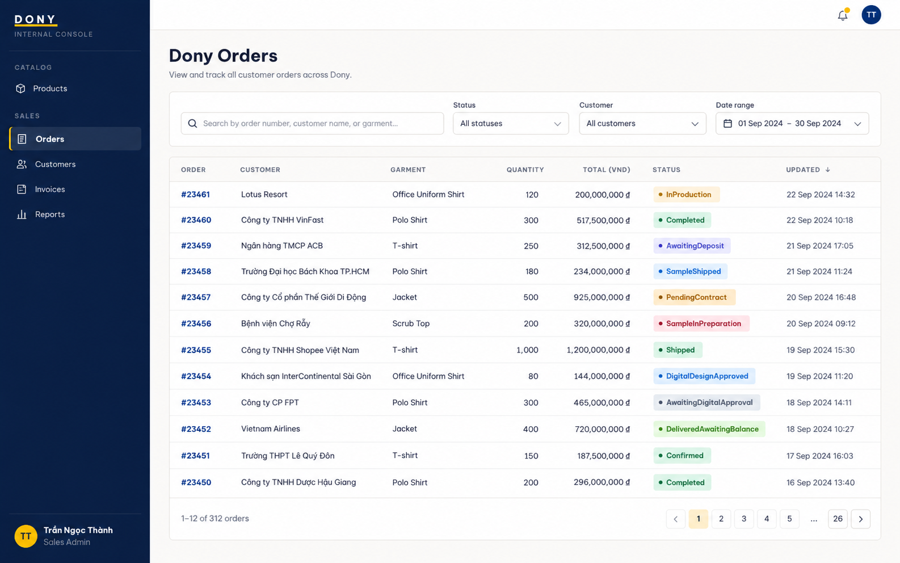

# Screen Spec: S28 Order List (Admin)

| Field | Value |
|---|---|
| Screen ID | `S28` |
| Screen name | Order List (Admin) |
| Actor | Sales Admin / Assigned Sales |
| Priority | P1 |
| Belongs to module | [MFG-07](../specs/spec-MFG-07.md) |
| Route | `/admin/orders` |
| Mockup image | img/S28-order_list_admin_screen.png |
| Status | Resolved implementation specification |

## 1. Purpose

**Shown when:** The Sales Admin sees Dony orders and may filter by status, date, product and assigned Sales employee. Assigned Sales has access only to assigned-customer orders and permitted actions. All identifiers and permissions come from the server session.

**The user leaves this screen when:** An authorized action in section 5 succeeds, the user follows a role-allowed global route, or they return to the validated originating route.

## 2. Mockup

Written behavior below takes precedence over obsolete sample content.

## 3. Element inventory

| # | Element | Type | Content / data source | Required | Validation |
|---|---|---|---|---|---|
| 1 | Screen heading | Heading | Order List (Admin) | Yes | Static route title. |
| 2 | Route | Navigation target | /admin/orders | Yes | Access checked on server. |
| 3 | page / page_size / filters | Field / control | paginated query | As specified | Use positive bounded paging; allow only canonical design/sample/contract/payment/production status, date, product and customer filters. |
| 4 | Rows Dony-scoped | Field / control | order_id, customer display name, status, total_vnd, created_at, version. | As specified | Rows Dony-scoped: order_id, customer display name, status, total_vnd, created_at, version. |
| 5 | staff_or_assignment_scope | Field / control | server-derived | As specified | Sales Admin sees Dony rows; Sales sees assigned-customer rows; System Admin has no implicit operational access. |
| 6 | API errors | Field / control | standard API error envelope | As specified | 400 malformed; 422 invalid fields; 409 stale/duplicate; 429 rate limit; 503 dependency failure |
| 7 | Open order | Action | Sales Admin opens any Dony order; Sales opens an assigned-customer order only. | Available when authorized | Destination: S29 |
| 8 | Manage next lifecycle action | Action | Sales Admin or assigned Sales may perform the allowed sample/production/shipping action; neither role may fake Customer approval, receipt, deposit or balance settlement. | Available when authorized | Destination: S29 |
| 9 | Merge console | Action | Sales Admin only; open eligible merge candidates. | Available when authorized | Destination: S42 |

## 4. States

| State | What the user sees | Trigger |
|---|---|---|
| Loading | Load the S28 Order List (Admin) view model and show labelled progress; keep writes disabled until route data and authorization are resolved. | Request starts |
| Empty | Show an empty filtered order queue and retain status/date filters. | Screen has no eligible or matching record |
| Forbidden/not found | Return a safe 401/403/404 for S28 Order List (Admin) without revealing inaccessible record, customer, staff or payment details. | 401/403/404 |
| Error | For S28 Order List (Admin), show the API code, message, field_errors and request_id; preserve safe user-entered values. | Request failure |
| Retry | Retry transient reads for S28 Order List (Admin); retry a mutation only with its original idempotency key and identical payload, never as a new side effect. | Recoverable failure |
| Success | Refresh the committed Order List (Admin) data and show the next action permitted by its lifecycle and actor. | Valid action commits |
| Conflict | The Order List (Admin) data or lifecycle changed concurrently; reload authoritative state and do not replay a stale mutation. | Stale version, duplicate or invalid lifecycle transition |
## 5. Interactions and navigation

| # | Element | User action | System response | Goes to screen |
|---|---|---|---|---|
| 1 | Open order | Activate | Sales Admin opens any Dony order; Sales opens an assigned-customer order only. | S29 |
| 2 | Manage next lifecycle action | Activate | Open the order with server-derived allowed actions. | S29 |
| 3 | Merge console | Activate | Sales Admin only; open eligible merge candidates. | S42 |

Portal: Sales Admin / Assigned Sales. Route: /admin/orders. Back preserves the originating route and filters. Fallback: Customer→S26; Sales Admin→S28; Sales→S20; System Admin→S41; Guest→S01. Enforce role, ownership and assignment before rendering.

## 6. Screen-level rules

| Rule ID | Rule | Source |
|---|---|---|
| SR-001 | Access and ownership are checked server-side; do not trust submitted customer, company, role, price, or provider status. Apply 401/403/404 behavior and the field rules above. | Authorization and data ownership requirements |
| SR-002 | IDs are UUIDs; timestamps are UTC and displayed in Asia/Ho_Chi_Minh; money and quantities are integers. Mutations use expected_version; significant create/sign/pay/batch operations use idempotency keys. | Data representation and concurrency requirements |
| SR-003 | Apply the module lifecycle and validation rules linked below; preserve immutable submitted snapshots. | Module specification |
| SR-004 | Selected product and technical defaults are project implementation decisions; do not invent factual company, author, client-approval, or course identifiers. | Project implementation assumptions |

### Acceptance scenarios

1. Sales Admin list filters cannot return a different system operator's order or financial data.
2. Allowlisted status/date filter returns stable pagination and preserves filter state on detail/back.
3. Assigned Sales sees only assigned-customer orders and fulfillment actions; merge, cancellation, contract and financial-administration actions stay hidden and are rejected server-side.

## 7. Linked requirements

| FR ID (from the module spec) | What this screen does for it |
|---|---|
| MFG-07/F-ORD-005 | **Admin Order Dashboard** — Provide Sales Admin with a paginated Dony-wide order queue, status/date/customer filters and counts. |

## 8. Responsive and accessibility notes

Support 360px through desktop; stack columns and use labelled horizontal-scroll tables on narrow screens. Controls are keyboard-operable with visible focus, logical headings, associated form labels, and aria-live status/error announcements. Text contrast is at least 4.5:1 (large text 3:1); pointer targets are at least 24px. Preserve user-entered data after recoverable failures. Confirm destructive actions, disable duplicate submit while pending, and enforce idempotency on the server.

## 9. Open questions

| # | Question | Blocking? | Status |
|---|---|---|---|
| 1 | No unresolved screen behavior questions remain; routes, fields, permissions, and defaults are resolved in this specification and its linked module requirements. | No | Resolved |

## Completion checklist

- [x] Route, actor, module, priority, and mockup status are identified.
- [x] Element fields, actions, validation, and data ownership are documented.
- [x] Loading, empty, forbidden, error, retry, success, and conflict states are documented.
- [x] Navigation and acceptance scenarios are explicit.
- [x] Responsive and accessibility requirements follow the shared baseline.
- [x] No unresolved screen-level decisions remain.
