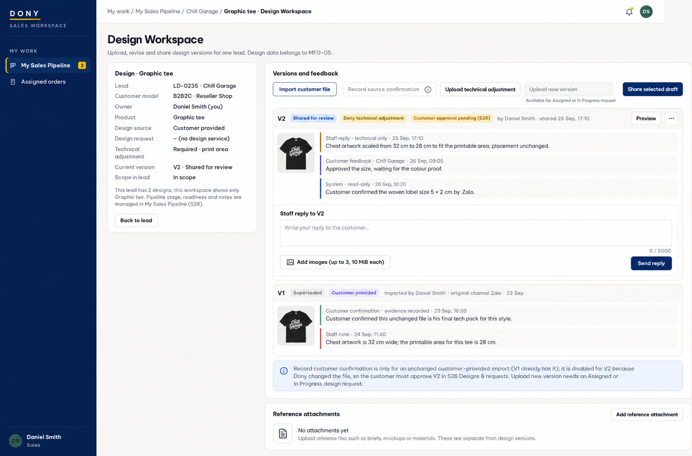

# Screen Spec: S29 Design Workspace

| Field | Value |
|---|---|
| Screen ID | `S29` |
| Screen name | Design Workspace |
| Actor | Lead owner (Sales) / Sales Admin |
| Priority | Could (MVP) |
| Belongs to module | [MFG-05](../specs/spec-MFG-05.md) (design data and its write path); opened from [S27](S27-admin-sales-pipeline.md) and [S28](S28-sales-pipeline.md) (MFG-08) |
| Route | Canonical: `/consultant/design-workspace/{design_id}`. Creation mode before a Design exists: `/consultant/design-workspace/new?lead={consultation_id}` with optional `&request_id={request_id}` for an eligible DesignRequest. The first successful version creation redirects to the canonical `design_id` route. |
| Mockup image | img/S29-01-staff-design-workspace.png |
| Status | Revised specification 2026-09-27 (decision D-06 in S27). Narrowed from Consultation Detail to Design Workspace; CRM status, notes and reopen moved to S27/S28. Integrated with MFG-05 section 5.4 and S26. |

## 1. Purpose

**Shown when:** The Sales who owns the lead a design belongs to, or the Sales Admin, does the actual design work for **one specific design** (for example Polo uniform; a Jacket on the same lead has its own workspace): imports a design the customer provided outside WeaveLink, records the customer's confirmation of an imported version, uploads a technical adjustment, uploads new versions for a design service request, shares versions with the customer and reads the customer's feedback per version. This is the only staff screen that writes design assets, DesignVersions, customer-visible replies and staff-recorded version confirmation data (MFG-05); Sales Admin DesignRequest assessment/reject/committed-due administration remains in S27. Every important event here (version shared, feedback received, version approved or superseded, confirmation recorded) is projected to S27/S28; detailed file data stays here. Pipeline stage, design readiness, interactions, internal notes and Admin Reviews stay in S27/S28; logged CRM interactions are shown here read-only. All identifiers and permissions come from the server session; recoverable failures preserve entered values and selected files.

**The user leaves this screen when:** They return to the lead detail panel (S27 for Sales Admin, S28 for Sales), follow a role-allowed global route, or return to the validated originating route.

## 2. Mockup

Sample names, companies and design data are synthetic. Written behavior below takes precedence over mockup content; customer-review labels that still name S25 in the mockup resolve to S26.

## 3. Element inventory

| # | Element | Type | Content / data source | Required | Validation |
|---|---|---|---|---|---|
| 1 | Screen heading | Heading | Design Workspace | Yes | Static route title. |
| 2 | Route | Navigation target | `/consultant/design-workspace/{design_id}` or creation mode `/consultant/design-workspace/new?lead={consultation_id}[&request_id={request_id}]` | Yes | Existing workspace: actor must be the current owner of the linked lead or a Sales Admin. Creation mode: actor must be the current owner of the lead or a Sales Admin, and any `request_id` must belong to that lead and be eligible for design work. Otherwise 404/422. |
| 3 | Design summary | Read-only | Existing mode: design name/product, lead code/name, customer model, owner, design source, technical adjustment flag, optional linked DesignRequest/status, current version, scope in lead, number of other designs. Creation mode: lead context plus optional DesignRequest snapshot; design/version fields show empty state until first successful create. | — | From MFG-05 and MFG-08; not editable here. |
| 4 | Request snapshot | Read-only | requirements and attachment_ids of the linked DesignRequest | When a request exists | Authorized 10-minute private asset links; no public URLs. |
| 5 | Versions and feedback | Read-only list | DesignVersions of this design only, newest first, with state (Draft, Shared for review, Approved, Superseded), source, uploader, original channel, change note, customer feedback per `design_version_id`, and logged design interactions shown read-only | — | Grouped by version. |
| 6 | Add customer-provided design | Action with form | design file(s) and product options, original channel (Zalo, Email, Messenger, Meeting, Other); uploader and time recorded automatically | Files, product options, channel | Validate file type, size, scan result, ownership and product compatibility. In creation mode it creates the Design plus immutable V1; in an existing customer-provided lineage it creates the next immutable imported version only when the MFG-05 rule allows it. |
| 6a | Record customer confirmation | Action with form | imported version, channel (Zalo, Email, Messenger, Phone, Meeting, Other), confirmed at (not in the future), note 1–500 characters, optional reference to a logged MFG-08 interaction | Version, channel, time | Records `CustomerProvidedConfirmation`: evidence that an **unchanged** imported version is the customer's own file. Not available for any version Dony created or changed, and never sets `CustomerApproval` (D-08). Stores who recorded it; makes the unchanged import eligible for quotation (S27 section 3.11); MFG-05 data, projected to S27/S28. |
| 7 | Upload technical adjustment | Action with form | base version, file(s), change note 1–500 characters | Yes | Only on a customer-provided lineage; only ordinary production validation (S27 section 3.11); same file validation; creates an immutable version with source Dony technical adjustment. |
| 8 | Upload new version | Action with form | file(s) and product options for the linked DesignRequest | Yes | Only while the request is Assigned or InProgress; same file validation. In creation mode for a request with no Design, the first successful upload creates the Design plus V1 and records `source_design_request_id`; later uploads create immutable versions on that design. |
| 9 | Share with customer | Action | selected Draft version | — | Draft → Shared for review; the previously shared version becomes Superseded; the customer is notified after commit. |
| 10 | expected_version / Idempotency-Key | Hidden | version plus key | Yes | Stale version 409; duplicate submit replays the original result. |
| 11 | API errors | Field / control | standard API error envelope | — | 400 malformed; 403 prohibited; 404 inaccessible lead or request; 409 stale/duplicate; 413 file too large; 422 invalid file, options or state; 429 rate limit; 503 dependency failure. |
| 12 | Reply to customer feedback | Action with form | Shared design_version_id, reply 1–5000 chars, 0–3 scanned image attachments <=10 MiB each | Text and version | Current owner/Admin; expected_version and key; append-only customer-visible S26 reply; no lifecycle or fee change. |

Not on this screen: pipeline stage changes, design readiness, design checklist, Log interaction, Internal Notes, Admin Reviews, design service assessment, `committed_due_at` (all in S27/S28). Version-bound feedback and staff replies are supported; no realtime chat, typing indicators or external inbox is introduced.

**Creation mode before `design_id` exists.** A Sales may need to start work before there is a Design record: (a) a customer-provided file received outside WeaveLink, or (b) an eligible DesignRequest whose first Dony version has not been uploaded yet. S27/S28 therefore open `/consultant/design-workspace/new?lead={consultation_id}` and optionally pass `request_id`. Creation mode shows the same workspace shell with no version history. `Add customer-provided design` or the first eligible `Upload new version` creates the Design and immutable V1 atomically; after commit the browser replaces the URL with `/consultant/design-workspace/{design_id}`. A failed create leaves no partial Design or DesignVersion.

## 4. States

**Loading, access, errors and retry:** Show a labelled Loading state while reads resolve. A missing or inaccessible route returns a safe 401/403/404 without disclosing protected records. Error states show the API code, message, field_errors and request_id while preserving safe input. Retry transient reads; retry a mutation only with the original idempotency key and identical payload. Preserve safe user input after recoverable failures.

| State | What the user sees | Trigger |
|---|---|---|
| Empty | "No design versions yet." with the actions allowed for this design. | No version |
| Uploading | Per-file progress; the form keeps entered values and selected files. | Upload in progress |
| Success | New version at the top of the list; toast names the action ("V3 shared with the customer"). | Valid action commits |
| Conflict | "This design changed since you opened it"; data reloads without replaying the stale action. | Stale version or invalid state |

## 5. Interactions and navigation

| # | Element | User action | System response | Goes to screen |
|---|---|---|---|---|
| 1 | Add customer-provided design | Submit | Validate and create an imported version; event projected to S27/S28. | S29 |
| 1a | Record customer confirmation | Submit | Store the confirmation on the version; event projected to S27/S28. | S29 |
| 2 | Upload technical adjustment | Submit | Validate and create an adjustment version. | S29 |
| 3 | Upload new version | Submit | Validate and create a request version. | S29 |
| 4 | Share with customer | Confirm | Share the version; notify the customer; S27/S28 show the event. | S29 |
| 5 | Back to lead | Activate | Open the lead detail panel. | S27 / S28 |

Portal: Sales / Sales Admin. Back preserves the originating lead panel. 

## 6. Screen-level rules

| Rule ID | Rule | Source |
|---|---|---|
| SR-001 | Check access and ownership on the server; never trust submitted customer, company, role, price, stage or provider status. Apply the documented 401/403/404 behavior and field rules. | Project baseline |
| SR-002 | IDs are UUIDs; timestamps are UTC and displayed in Asia/Ho_Chi_Minh; money and quantities are integers. Mutations use expected versions and idempotency keys where specified. | Project baseline |
| SR-003 | Apply the owning module's lifecycle and validation rules; preserve immutable submitted snapshots and design versions. | Project baseline |
| SR-004 | Use documented project assumptions; do not invent factual company, author, client-approval or course identifiers. | Project baseline |
| SR-005 | Technical adjustments are limited to ordinary production validation and never change logo appearance, branding, main colours, fabric/material, product style or price-affecting elements without customer confirmation; larger work uses the Simple/Complex DesignRequest workflow. | S27 D-02, D-03 |
| SR-006 | The customer sees only shared versions and their own feedback (S26); staff interactions are never returned to customer APIs. | MFG-05, MFG-08 BR-003 |
| SR-007 | MFG-05 section 5.4 governs the integrated review loop; share is not terminal Delivered. S26 records owner decisions and S29 records staff replies. | Integrated module contract |
| SR-008 | The workspace shows one design. S27/S28 read a projection of its events and state from MFG-05 and never store a copy; logged CRM interactions appear here read-only and cannot be edited or deleted here. | S27 D-06 |

### Acceptance scenarios

1. Given a Sales who is not the lead owner, when they open the workspace, then 404 is returned.
2. Given a tech pack received by Zalo, when the Sales adds it as a customer-provided design and records the customer's confirmation, then an immutable, confirmed version with uploader and channel Zalo is created and both events appear in S27/S28 Design Discussion.
3. Given V2 is a Dony technical adjustment, then Record customer confirmation is not available for V2; V2 becomes eligible only when the customer approves it in S26, which MFG-05 records as `CustomerApproval`.
4. Given a lead with Polo uniform and Jacket designs, then each opens its own workspace and shows only its own versions.
5. Given a technical adjustment uploaded and shared, then the previous shared version becomes Superseded and the customer sees the new version in S26.
6. Given the linked request is Approved but not yet Assigned, then Upload new version is disabled.
7. Given an invalid or infected file, then the upload is rejected with the reason and no version is created.
8. Given the screen, then it offers no stage change, readiness, note, Admin Review, assessment or committed due date control.
9. Given a lead with no Design yet, when S27/S28 opens S29 creation mode and the Sales successfully imports the customer's first file or uploads the first eligible DesignRequest version, then Design + V1 are created atomically and the route becomes `/consultant/design-workspace/{design_id}`; on failure no partial Design exists.

## 7. Linked requirements

| FR ID (from the module spec) | What this screen does for it |
|---|---|
| MFG-05/F-DES-010 | **Send Design** — Create immutable validated design versions for an Assigned/InProgress request, recording source_design_request_id; also technical-adjustment versions under MFG-05 section 5.4; unchanged imports use F-DES-019. |
| MFG-05/F-DES-011 | **Send Design** — Notify the owning customer after a version is shared. |
| MFG-05/F-DES-019 | Import unchanged customer-provided artwork with uploader/channel provenance. |
| MFG-05/F-DES-020 | Record exact unchanged-source confirmation; never approve Dony changes for the Customer. |
| MFG-05/F-DES-021 | Append a customer-visible reply bound to a shared design version. |

## 8. Responsive and accessibility notes

Support 360px through desktop; below 1024px the summary stacks above the version list. File inputs have visible labels and keyboard access; upload progress and results are announced through aria-live; design previews have text alternatives. Text contrast is at least 4.5:1 (large text 3:1); pointer targets are at least 24px. Confirm Share with customer and disable duplicate submit while pending.

## 9. Open questions

| # | Question | Blocking? | Status |
|---|---|---|---|
| 1 | MFG-05 section 5.4 and S26 define the version lifecycle, feedback and approval. | No | Resolved |

## Completion checklist

- [x] Route, actor, module, priority, and mockup status are identified.
- [x] Narrowed responsibility (design execution only) and removed CRM functions are documented.
- [x] Loading, empty, forbidden, uploading, error, retry, success, and conflict states are documented.
- [x] Navigation and acceptance scenarios are explicit.
- [x] MFG-05 version contracts and S26 feedback/approval are integrated.

## 10. Integrated version and reply contract

MFG-05 section 5.4 is authoritative. Imported originals retain source evidence without being relabelled as a customer's authored version; reference attachments are not automatically promoted to versions. An unchanged import is Saved/orderable only after exact customer-source confirmation. Dony changes remain ProofDelivered/non-orderable until the customer approves in S26. A newer Draft does not replace the current accepted/shared version until explicitly shared or confirmed. Staff cannot approve a changed version.

The current owner or Sales Admin may append a customer-visible reply to a selected shared design_version_id (1–5000 trimmed characters; up to three scanned PNG/JPEG/WebP attachments, 10 MiB each), using expected_version and Idempotency-Key. S26 shows the same immutable reply; a reply alone does not change design, request, fee or approval state. Customer APIs never receive private Draft versions, internal CRM interactions or notes. Existing DesignRequest cancellation restrictions still apply while the request remains InProgress through review.

Creation mode requires a linked registered Customer and a classified lead; a prospective/unclassified lead cannot create an owned design. MFG-05/F-DES-019 imports unchanged files; F-DES-020 records source evidence; F-DES-021 records staff replies. F-DES-010 covers upload/share and technical versions.
