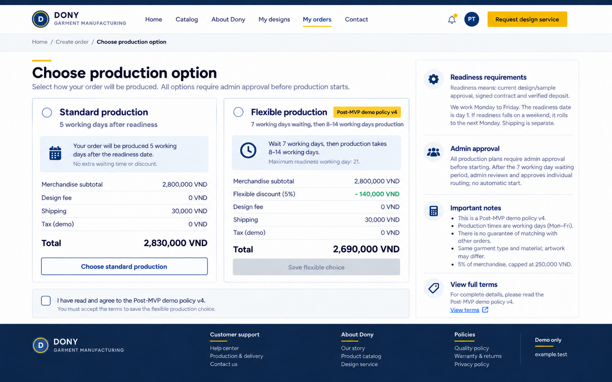

# Screen Spec: S31 Merge Option

| Field | Value |
|---|---|
| Screen ID | `S31` |
| Screen name | Merge Option |
| Actor | Customer owner |
| Priority | Could (MVP) |
| Belongs to module | [MFG-10](../specs/spec-MFG-10.md) |
| Route | `/orders/merge?design_id={id}` |
| Mockup image | `img/S31-01-production-option.png` |
| Status | Final demo specification aligned with MFG-10 v4; Could/post-MVP |

## 1. Purpose

**Shown when:** After MFG-10 activation, offer flexibility only for a merge-enabled product within the saved small-order threshold, with valid daily capacity and no fitting open sewing run at quote/requote. Compare standard terms with a 5% merchandise incentive capped at 250000 VND and 7 Monday–Friday waiting days followed by a separate 8–14-working-day production range; maximum completion is readiness working day 21. Readiness requires design/sample approval, signed contract and verified deposit; its working date is day 1, weekend readiness rolls forward. Show relative terms before readiness, calculated dates afterward. Early matches may finish earlier with the accepted incentive; any production needs human approval/start. Shipping is separate; other customer data is private.

**The user leaves this screen when:** An authorized action in section 5 succeeds, the user follows a role-allowed global route, or they return to the validated originating route.

## 2. Mockup

The mockup illustrates the defined workflow. Fictional sample values do not replace the field, lifecycle and release-scope rules below.

## 3. Element inventory

| # | Element | Type | Content / data source | Required | Validation |
|---|---|---|---|---|---|
| 1 | Screen heading | Heading | Merge Option | Yes | Static route title. |
| 2 | Route | Navigation target | /orders/merge?design_id={id} | Yes | Access checked on server. |
| 3 | merge_opt_in | Field / control | explicit boolean | As specified | merge_opt_in: explicit boolean; default false; acceptance stores merge policy_version. |
| 4 | flexible_eligible / merge_eligible | Server-derived boolean | Saved MFG-04/S19 product version, quantity, open-run feasibility | Yes | Product merge_enabled; normal MOQ ≤ aggregate quantity ≤ saved small_order_max_quantity; no fitting open sewing run at quote/requote. Revalidate server-side; retain submitted snapshots. |
| 5 | merge_discount_vnd | Read-only flexible incentive | MFG-10 versioned trial amount | Yes | min(floor(subtotal_vnd*5/100),250000) for accepted eligible flexible terms; zero for standard even when internally batched. Retain incentive for immediate match or fallback; no merge fee. |
| 6 | checkout_effect | Field / control | read-only explanation | As specified | Saving preference issues a replacement quote; it creates no batch and applies no merge fee. |
| 7 | API errors | Field / control | standard API error envelope | As specified | 400 malformed; 422 invalid fields; 409 stale/duplicate; 429 rate limit; 503 dependency failure |
| 8 | Accept merge policy | Action | Persist explicit opt-in/version then request server quote. | Available when authorized | Destination: S33 |
| 9 | Decline | Action | Persist false and request standard quote. | Available when authorized | Destination: S33 |
| 10 | Read terms | Action | Show versioned conditions without silently accepting. | Available when authorized | Destination: S32 |

## 4. States

**Loading, access, errors and retry:** Show a labelled Loading state while reads resolve. A missing or inaccessible route returns a safe 401/403/404 without disclosing protected records. Error states show the API code, message, field_errors and request_id while preserving safe input. Retry transient reads; retry a mutation only with the original idempotency key and identical payload. Preserve safe user input after recoverable failures.

| State | What the user sees | Trigger |
|---|---|---|
| Empty | No Merge Option records match the current route/filter; preserve inputs and show only the screen’s authorized next action. | Screen has no eligible or matching record |
| Success | Refresh the committed Merge Option data and show the next action permitted by its lifecycle and actor. | Valid action commits |
| Conflict | The Merge Option data or lifecycle changed concurrently; reload authoritative state and do not replay a stale mutation. | Stale version, duplicate or invalid lifecycle transition |
## 5. Interactions and navigation

| # | Element | User action | System response | Goes to screen |
|---|---|---|---|---|
| 1 | Accept merge policy | Activate | Persist explicit opt-in/version then request server quote. | S33 |
| 2 | Decline | Activate | Persist false and request standard quote. | S33 |
| 3 | Read terms | Activate | Show versioned conditions without silently accepting. | S32 |

Portal: Customer owner. Route: /orders/merge?design_id={id}. Back preserves the originating route and filters. 

### 5.1 Interface consistency

Reuse the customer navigation, owned-design summary, quantity/address context and form/error conventions from [S30 Create Order](S30-create-order.md). Present standard/flexible choices with the same VND labels, merchandise subtotal and separate fee rows as [S33 Order Summary](S33-order-summary.md). Show the accepted policy version and readiness-based completion/wait terms consistently with [S32 Merge Terms](S32-production-terms.md). Reading terms preserves the current quote choice; only explicit acceptance on S31 records consent. Returning from terms or a recoverable error preserves safe inputs; saving either production choice requests a replacement quote before navigation to S33.

## 6. Screen-level rules

| Rule ID | Rule | Source |
|---|---|---|
| SR-001 | Check access and ownership on the server; never trust submitted customer, company, role, price, stage or provider status. Apply the documented 401/403/404 behavior and field rules. | Project baseline |
| SR-002 | IDs are UUIDs; timestamps are UTC and displayed in Asia/Ho_Chi_Minh; money and quantities are integers. Mutations use expected versions and idempotency keys where specified. | Project baseline |
| SR-003 | Apply the owning module's lifecycle and validation rules; preserve immutable submitted snapshots and design versions. | Project baseline |
| SR-004 | Use documented project assumptions; do not invent factual company, author, client-approval or course identifiers. | Project baseline |

### Acceptance scenarios

1. Explicit eligible flexible acceptance snapshots the policy and incentive; saving creates a replacement quote, not a batch. Immediate matching or fallback retains the incentive.
2. Standard choice has no flexible incentive and no additional batching wait. Internal assignment keeps standard terms and private order tracking.

## 7. Linked requirements

| FR ID (from the module spec) | What this screen does for it |
|---|---|
| MFG-10/F-MER-001 | **Select Merge** — Compare standard/flexible terms only when offered; internal standard assignment creates no incentive. |
| MFG-10/F-MER-002 | **Select Merge** — Display versioned merge policy text and record accepted policy version. |
| MFG-10/F-MER-003 | **Select Merge** — Save flexible acceptance/version and issue an immutable replacement 30-minute quote with the MFG-10 incentive, duration/calendar/readiness basis and fallback terms. |

## 8. Responsive and accessibility notes

Support 360px through desktop; stack columns and use labelled horizontal-scroll tables on narrow screens. Controls are keyboard-operable with visible focus, logical headings, associated form labels, and aria-live status/error announcements. Text contrast is at least 4.5:1 (large text 3:1); pointer targets are at least 24px. Preserve user-entered data after recoverable failures. Confirm destructive actions, disable duplicate submit while pending, and enforce idempotency on the server.

## 9. Specification status

The screen follows MFG-10's final demo policy. The user confirmed v4 as the final demo policy. It remains Could/post-MVP; saved factory capacity and costs remain operational inputs and the policy is not a real Dony commitment.

## Completion checklist

- [x] Route, actor, module, priority, and mockup status are identified.
- [x] Element fields, actions, validation, and data ownership are documented.
- [x] Loading, empty, forbidden, error, retry, success, and conflict states are documented.
- [x] Navigation and acceptance scenarios are explicit.
- [x] Responsive and accessibility requirements are documented in this screen.
- [x] User-confirmed commercial terms, separate waiting/production clocks and Monday–Friday counting are documented; factory capacity/cost values remain operational inputs.
