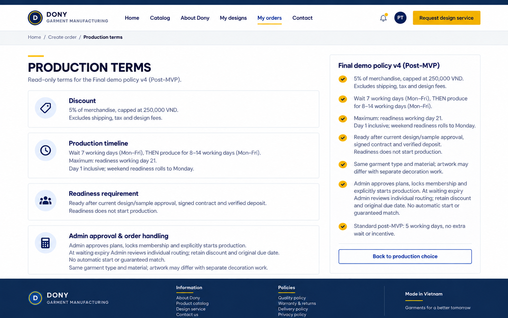

# Screen Spec: S32 Merge Terms

| Field | Value |
|---|---|
| Screen ID | `S32` |
| Screen name | Merge Terms |
| Actor | Guest/Customer |
| Priority | Could (MVP) |
| Belongs to module | [MFG-10](../specs/spec-MFG-10.md) |
| Route | `/merge-terms` |
| Mockup image | img/S32-01-production-terms.png |
| Status | Final demo specification aligned with MFG-10 v4; Could/post-MVP |

## 1. Purpose

**Shown when:** This read-only public/customer page explains merge eligibility, timing, price and production effects from the current merge policy. All identifiers and permissions come from the server session; list filters are allowlisted and recoverable failures preserve entered values.

**The user leaves this screen when:** An authorized action in section 5 succeeds, the user follows a role-allowed global route, or they return to the validated originating route.

## 2. Mockup

The mockup illustrates the defined workflow. Fictional sample values do not replace the field, lifecycle and release-scope rules below.

## 3. Element inventory

| # | Element | Type | Content / data source | Required | Validation |
|---|---|---|---|---|---|
| 1 | Screen heading | Heading | Merge Terms | Yes | Static route title. |
| 2 | Route | Navigation target | /merge-terms | Yes | Access checked on server. |
| 3 | policy_version | Field / control | immutable terms version shown and included in order quote on explicit opt-in. | As specified | policy_version: immutable terms version shown and included in order quote on explicit opt-in. |
| 4 | policy_terms | Read-only terms | MFG-10 policy/version | Yes | 5% merchandise discount capped at 250000 VND, floor rounding; exclude shipping/tax/design fee. Explain 7 Monday–Friday waiting days then 8–14 separate production days, maximum completion at readiness working day 21, inclusive day 1 and weekend roll-forward. Early approved production may finish sooner; late approval never resets the accepted promise. Shared sewing only, separate decoration, no guaranteed match. Waiting expiry alerts Admin; individual routing/start requires human approval; retain incentive with no surcharge. Page view is not consent. |
| 5 | acceptance_effect | Field / control | read-only explanation | As specified | Opening terms records no consent; acceptance occurs only on S31 with the displayed policy version. |
| 6 | API errors | Field / control | standard API error envelope | As specified | 400 malformed; 422 invalid fields; 409 stale/duplicate; 429 rate limit; 503 dependency failure |
| 7 | Return to order choice | Action | Preserve validated origin; no preference is recorded by page view. | Available when authorized | Destination: S31 |

## 4. States

**Loading, access, errors and retry:** Show a labelled Loading state while reads resolve. A missing or inaccessible route returns a safe 401/403/404 without disclosing protected records. Error states show the API code, message, field_errors and request_id while preserving safe input. Retry transient reads; retry a mutation only with the original idempotency key and identical payload. Preserve safe user input after recoverable failures.

| State | What the user sees | Trigger |
|---|---|---|
| Empty | No Merge Terms records match the current route/filter; preserve inputs and show only the screen’s authorized next action. | Screen has no eligible or matching record |
| Success | Refresh the committed Merge Terms data and show the next action permitted by its lifecycle and actor. | Valid action commits |
| Conflict | The Merge Terms data or lifecycle changed concurrently; reload authoritative state and do not replay a stale mutation. | Stale version, duplicate or invalid lifecycle transition |
## 5. Interactions and navigation

| # | Element | User action | System response | Goes to screen |
|---|---|---|---|---|
| 1 | Return to order choice | Activate | Preserve validated origin; no preference is recorded by page view. | S31 |

Portal: Guest/Customer. Route: /merge-terms. Back preserves the originating route and filters. 

### 5.1 Interface consistency

Reuse the customer navigation and readable terms layout from the existing customer screens. Use exactly the production-choice labels and policy version shown by [S31 Merge Option](S31-production-option.md), and the same incentive/fee terminology as [S33 Order Summary](S33-order-summary.md). The return action preserves S31's safe context and does not accept policy or change the quote. Public terms contain no internal batch membership or other customers' information.

## 6. Screen-level rules

| Rule ID | Rule | Source |
|---|---|---|
| SR-001 | Check access and ownership on the server; never trust submitted customer, company, role, price, stage or provider status. Apply the documented 401/403/404 behavior and field rules. | Project baseline |
| SR-002 | IDs are UUIDs; timestamps are UTC and displayed in Asia/Ho_Chi_Minh; money and quantities are integers. Mutations use expected versions and idempotency keys where specified. | Project baseline |
| SR-003 | Apply the owning module's lifecycle and validation rules; preserve immutable submitted snapshots and design versions. | Project baseline |
| SR-004 | Use documented project assumptions; do not invent factual company, author, client-approval or course identifiers. | Project baseline |

### Acceptance scenarios

1. Opening terms alone does not set merge_opt_in; only return action preserves source route.
2. Terms distinguish standard internal assignment from flexible consent and explain the readiness trigger, calendar basis, waiting limit, completion promise, private order tracking and retained fallback incentive.

## 7. Linked requirements

| FR ID (from the module spec) | What this screen does for it |
|---|---|
| MFG-10/F-MER-002 | **Select Merge** — Display versioned merge policy text and record accepted policy version. |

## 8. Responsive and accessibility notes

Support 360px through desktop; stack columns and use labelled horizontal-scroll tables on narrow screens. Controls are keyboard-operable with visible focus, logical headings, associated form labels, and aria-live status/error announcements. Text contrast is at least 4.5:1 (large text 3:1); pointer targets are at least 24px. Preserve user-entered data after recoverable failures. Confirm destructive actions, disable duplicate submit while pending, and enforce idempotency on the server.

## 9. Specification status

The screen follows MFG-10's final demo policy. The user confirmed v4 as the final demo policy. It remains Could/post-MVP; saved factory capacity and costs remain operational inputs and the policy is not a real Dony commitment.

## Completion checklist

- [x] Route, actor, module, priority, and mockup status are identified.
- [x] Element fields, actions, validation, and data ownership are documented.
- [x] Loading, empty, forbidden, error, retry, success, and conflict states are documented.
- [x] Navigation and acceptance scenarios are explicit.
- [x] Responsive and accessibility requirements are documented in this screen.
- [x] User-confirmed commercial terms, separate waiting/production clocks and Monday–Friday counting are documented; factory capacity/cost values remain operational inputs.
