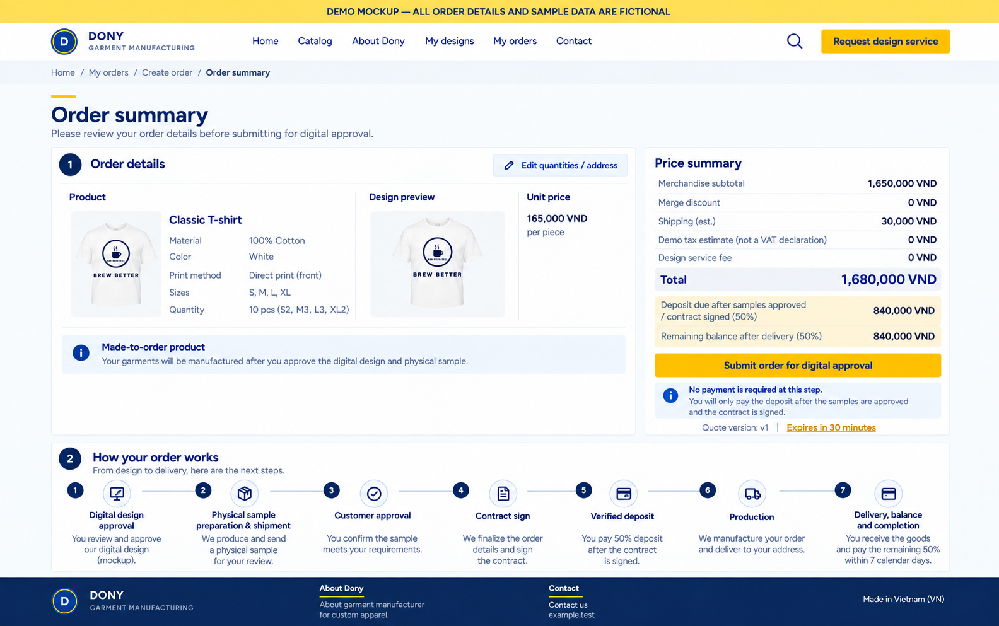

# Screen Spec: S33 Order Summary

| Field | Value |
|---|---|
| Screen ID | `S33` |
| Screen name | Order Summary |
| Actor | Customer owner |
| Priority | Must (MVP) |
| Belongs to module | [MFG-06](../specs/spec-MFG-06.md) |
| Route | `/orders/summary?quote_id={id}` |
| Mockup image | `img/S33-01-order-summary.png` |
| Status | Resolved implementation specification |

## 1. Purpose

**Shown when:** The customer reviews an unexpired server quote with integer VND line amounts, delivery address and expiry before submitting the order. In MVP this is a standard quote with no merge choice and zero merge discount; the merge rows/actions below are post-MFG-10 only. All identifiers and permissions come from the server session; list filters are allowlisted and recoverable failures preserve entered values.

**The user leaves this screen when:** An authorized action in section 5 succeeds, the user follows a role-allowed global route, or they return to the validated originating route.

## 2. Mockup

The mockup illustrates the defined workflow. Fictional sample values do not replace the field, lifecycle and release-scope rules below. MVP omits merge preference controls and always displays merge discount as zero, as shown in this standard-order example.

### Mockup deviations

- Hide the header “Request design service” action in MVP; S24 is post-MVP.

## 3. Element inventory

| # | Element | Type | Content / data source | Required | Validation |
|---|---|---|---|---|---|
| 1 | Screen heading | Heading | Order Summary | Yes | Static route title. |
| 2 | Route | Navigation target | /orders/summary?quote_id={id} | Yes | Access checked on server. |
| 3 | quote_id | Field / control | UUID | As specified | quote_id: UUID; server quote lasts 30 minutes and binds product/design/policy versions. |
| 4 | subtotal_vnd | Field / control | sum(quantity*(unit_price_vnd+option_surcharge_vnd)), integer. | As specified | subtotal_vnd: sum(quantity*(unit_price_vnd+option_surcharge_vnd)), integer. |
| 5 | merge_discount_vnd | Post-MVP field | MFG-10 v4 final demo policy amount | No | MVP always displays 0 and has no opt-in control; after MFG-10 activation show `min(floor(subtotal_vnd*5/100),250000)` when eligible flexible terms are accepted, otherwise 0; standard internal batching never creates a discount. |
| 6 | price_breakdown | Read-only quote breakdown | integer VND | Yes | MVP shows subtotal, zero merge discount, shipping, tax, separate design_fee_vnd and total; merge fee is 0. Design fee is outside subtotal and never discounted or quantity-multiplied. |
| 7 | quote_id / expected_version / Idempotency-Key | Field / control | required submission contract | As specified | Never submit a client total; an expired/superseded quote returns to requote and explicit review. |
| 8 | API errors | Field / control | standard API error envelope | As specified | 400 malformed; 422 invalid fields; 409 stale/duplicate; 429 rate limit; 503 dependency failure |
| 9 | Submit order | Action | Revalidate quote and fee-allocation versions; atomically claim any fee allocation and create an `AwaitingDigitalApproval` order with immutable snapshots and idempotency. The success confirmation shows the new `order_number` (MFG-06 BR-017); an idempotent replay shows the same number. | Available when authorized | Destination: S35 |
| 10 | Edit quantities/address | Action | Requote and show changed breakdown before submit. | Available when authorized | Destination: S30 |
| 11 | Change merge preference | Post-MVP action | Requote with explicit preference only after MFG-10 activation. | Post-MVP only | Destination: S31; omit from MVP UI and API input. |

### Production terms after MFG-10 activation

Render the chosen policy/version next to the immutable price breakdown: standard versus accepted flexible choice, incentive, readiness trigger and calendar/counting basis. Flexible terms are 7 Monday–Friday waiting days plus a separate 8–14-working-day production range; full-wait maximum is readiness working day 21. Before readiness, show this relative rule and keep absolute production_due_at unavailable rather than deriving it from quote creation or an unverified deposit. Once readiness exists, [S35](S35-customer-order-detail.md) displays the calculated waiting and maximum due dates. Distinguish a quantity-based operational estimate from the accepted maximum commitment. Match [S31](S31-production-option.md), [S32](S32-production-terms.md) and [S38](S38-customer-contract.md); none of these screens approves production.

## 4. States

**Loading, access, errors and retry:** Show a labelled Loading state while reads resolve. A missing or inaccessible route returns a safe 401/403/404 without disclosing protected records. Error states show the API code, message, field_errors and request_id while preserving safe input. Retry transient reads; retry a mutation only with the original idempotency key and identical payload. Preserve safe user input after recoverable failures.

| State | What the user sees | Trigger |
|---|---|---|
| Empty | If the quote is unavailable/expired, preserve safe inputs and request a replacement. No batch is selected at checkout. A valid flexible quote retains its incentive even without a match; standard quotes have no flexible incentive. | No valid quote |
| Success | Refresh the committed Order Summary data and show the next action permitted by its lifecycle and actor. | Valid action commits |
| Conflict | Quote expired or order inputs changed: calculate a fresh quote and require review before checkout. | Stale version, duplicate or invalid lifecycle transition |
## 5. Interactions and navigation

| # | Element | User action | System response | Goes to screen |
|---|---|---|---|---|
| 1 | Submit order | Activate | Revalidate quote and fee-allocation versions; atomically claim any fee allocation and create an `AwaitingDigitalApproval` order with immutable snapshots. | S35 |
| 2 | Edit quantities/address | Activate | Requote and show changed breakdown before submit. | S30 |
| 3 | Change merge preference | Post-MVP only | Available after MFG-10 activation; not rendered in MVP. | S31 |

Portal: Customer owner. Route: /orders/summary?quote_id={id}. Back preserves the originating route and filters. 

## 6. Screen-level rules

| Rule ID | Rule | Source |
|---|---|---|
| SR-001 | Check access and ownership on the server; never trust submitted customer, company, role, price, stage or provider status. Apply the documented 401/403/404 behavior and field rules. | Project baseline |
| SR-002 | IDs are UUIDs; timestamps are UTC and displayed in Asia/Ho_Chi_Minh; money and quantities are integers. Mutations use expected versions and idempotency keys where specified. | Project baseline |
| SR-003 | Apply the owning module's lifecycle and validation rules; preserve immutable submitted snapshots and design versions. | Project baseline |
| SR-004 | Use documented project assumptions; do not invent factual company, author, client-approval or course identifiers. | Project baseline |

### Acceptance scenarios

1. Valid unexpired quote submission creates one `AwaitingDigitalApproval` order and immutable address/price/design snapshots; contract and payment are not yet available.
2. Expired quote or changed product/design version requires requote and review; duplicate same key returns same order.
3. First Complex-design order shows accepted fee separately; pending fee-bearing order blocks another order until InProduction or resolved cancellation. Stale allocation returns 409 and requires a reviewed replacement quote; repeat orders after InProduction show fee 0.

## 7. Linked requirements

| FR ID (from the module spec) | What this screen does for it |
|---|---|
| MFG-06/F-PAY-002 | **Finalize Order** — Recompute quote from validated quantities/address with 30-minute expiry; in MVP force merge_opt_in=false and merge_discount_vnd=0; enable the versioned MFG-10 v4 final demo policy branch only after MFG-10 activation. Derive separate design_fee_vnd from request provenance and allocation state. |
| MFG-06/F-PAY-003 | **Finalize Order** — Atomically create one `AwaitingDigitalApproval` order from a current quote with immutable snapshots and idempotency; lock/revalidate and claim any design-fee allocation under BR-008. |

## 8. Responsive and accessibility notes

Support 360px through desktop; stack columns and use labelled horizontal-scroll tables on narrow screens. Controls are keyboard-operable with visible focus, logical headings, associated form labels, and aria-live status/error announcements. Text contrast is at least 4.5:1 (large text 3:1); pointer targets are at least 24px. Preserve user-entered data after recoverable failures. Confirm destructive actions, disable duplicate submit while pending, and enforce idempotency on the server.

## 9. Open questions

| # | Question | Blocking? | Status |
|---|---|---|---|
| 1 | No unresolved screen behavior questions remain; routes, fields, permissions, and defaults are resolved in this specification and its linked module requirements. | No | Resolved |

## Completion checklist

- [x] Route, actor, module, priority, and mockup status are identified.
- [x] Element fields, actions, validation, and data ownership are documented.
- [x] Loading, empty, forbidden, error, retry, success, and conflict states are documented.
- [x] Navigation and acceptance scenarios are explicit.
- [x] Responsive and accessibility requirements are documented in this screen.
- [x] No unresolved screen-level decisions remain.
