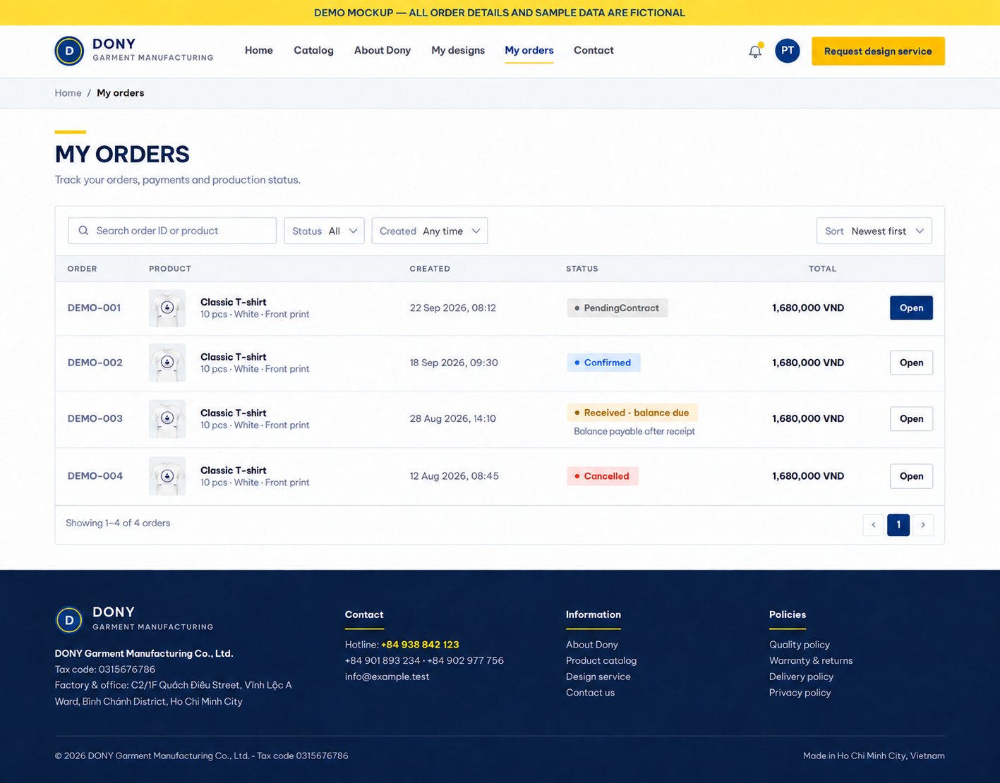

# Screen Spec: S34 Customer Order List

| Field | Value |
|---|---|
| Screen ID | `S34` |
| Screen name | Customer Order List |
| Actor | Customer owner |
| Priority | Must (MVP) |
| Belongs to module | [MFG-07](../specs/spec-MFG-07.md) |
| Route | `/orders` |
| Mockup image | `img/S34-01-customer-orders.png` |
| Status | Resolved implementation specification |

## 1. Purpose

**Shown when:** The customer lists only orders they own, with status, order number, placed date, total VND and allowlisted filters. All identifiers and permissions come from the server session; list filters are allowlisted and recoverable failures preserve entered values.

**The user leaves this screen when:** An authorized action in section 5 succeeds, the user follows a role-allowed global route, or they return to the validated originating route.

## 2. Mockup

The mockup illustrates the defined workflow. Fictional sample values do not replace the field, lifecycle and release-scope rules below.

### Mockup deviations

- Hide the header “Request design service” action in MVP; S24 is post-MVP.

## 3. Element inventory

| # | Element | Type | Content / data source | Required | Validation |
|---|---|---|---|---|---|
| 1 | Screen heading | Heading | Customer Order List | Yes | Static route title. |
| 2 | Route | Navigation target | /orders | Yes | Access checked on server. |
| 3 | page/page_size/status | Field / control | integer page>=1, size1..100 default20; canonical status enum | As specified | Allowlist `AwaitingDigitalApproval`, `DigitalDesignApproved`, `SampleInPreparation`, `SampleShipped`, `PendingContract`, `AwaitingDeposit`, `Confirmed`, `InProduction`, `Shipped`, `DeliveredAwaitingBalance`, `Completed`, `Cancelled`; allow date sorting. |
| 4 | Rows | Field / control | order_id UUID (link target only), order_number, created_at, status, total_vnd integer, product summary. | As specified | Display `order_number` (MFG-06 BR-017) as the visible order reference; do not display the UUID. |
| 4a | Order number search | Search field | Exact `order_number`, case-insensitive | Optional | Trim input; matches only the current customer's orders; a non-matching or foreign number returns the normal empty result. |
| 5 | ownership_scope | Field / control | session-derived, read-only | As specified | Return only the current customer's orders; filters cannot broaden ownership. |
| 6 | API errors | Field / control | standard API error envelope | As specified | 400 malformed; 422 invalid fields; 409 stale/duplicate; 429 rate limit; 503 dependency failure |
| 7 | Open order | Action | Load current customer's order detail and actions. | Available when authorized | Destination: S35 |
| 8 | Filter/sort | Action | Query only owned orders. | Available when authorized | Destination: S34 |

## 4. States

**Loading, access, errors and retry:** Show a labelled Loading state while reads resolve. A missing or inaccessible route returns a safe 401/403/404 without disclosing protected records. Error states show the API code, message, field_errors and request_id while preserving safe input. Retry transient reads; retry a mutation only with the original idempotency key and identical payload. Preserve safe user input after recoverable failures.

| State | What the user sees | Trigger |
|---|---|---|
| Empty | Show “No orders yet” and link to start an order; enforce customer ownership scope. | Screen has no eligible or matching record |
| Success | Refresh the committed Customer Order List data and show the next action permitted by its lifecycle and actor. | Valid action commits |
| Conflict | The Customer Order List data or lifecycle changed concurrently; reload authoritative state and do not replay a stale mutation. | Stale version, duplicate or invalid lifecycle transition |
## 5. Interactions and navigation

| # | Element | User action | System response | Goes to screen |
|---|---|---|---|---|
| 1 | Open order | Activate | Load current customer's order detail and actions. | S35 |
| 2 | Filter/sort | Activate | Query only owned orders. | S34 |

Portal: Customer owner. Route: /orders. Back preserves the originating route and filters. 

## 6. Screen-level rules

| Rule ID | Rule | Source |
|---|---|---|
| SR-001 | Check access and ownership on the server; never trust submitted customer, company, role, price, stage or provider status. Apply the documented 401/403/404 behavior and field rules. | Project baseline |
| SR-002 | IDs are UUIDs; timestamps are UTC and displayed in Asia/Ho_Chi_Minh; money and quantities are integers. Mutations use expected versions and idempotency keys where specified. | Project baseline |
| SR-003 | Apply the owning module's lifecycle and validation rules; preserve immutable submitted snapshots and design versions. | Project baseline |
| SR-004 | Use documented project assumptions; do not invent factual company, author, client-approval or course identifiers. | Project baseline |

### Acceptance scenarios

1. Customer sees only own orders with the current design/sample/contract/payment/fulfillment status and immutable VND total.
2. Opening another customer's order id returns 404 without revealing its existence.

## 7. Linked requirements

| FR ID (from the module spec) | What this screen does for it |
|---|---|
| MFG-07/F-ORD-001 | **Order List View** — List the authenticated customer’s own orders with newest-first pagination and allowlisted status/date filters; an empty result is valid. |

## 8. Responsive and accessibility notes

Support 360px through desktop; stack columns and use labelled horizontal-scroll tables on narrow screens. Controls are keyboard-operable with visible focus, logical headings, associated form labels, and aria-live status/error announcements. Text contrast is at least 4.5:1 (large text 3:1); pointer targets are at least 24px. Preserve user-entered data after recoverable failures. Confirm destructive actions, disable duplicate submit while pending, and enforce idempotency on the server.

## 9. Open questions

| # | Question | Blocking? | Status |
|---|---|---|---|
| 1 | No unresolved screen behavior questions remain; routes, fields, permissions, and defaults are resolved in this specification and its linked module requirements. | No | Resolved |

## Completion checklist

- [x] Route, actor, module, priority, and mockup status are identified.
- [x] Element fields, actions, validation, and data ownership are documented.
- [x] Loading, empty, forbidden, error, retry, success, and conflict states are documented.
- [x] Navigation and acceptance scenarios are explicit.
- [x] Responsive and accessibility requirements are documented in this screen.
- [x] No unresolved screen-level decisions remain.
