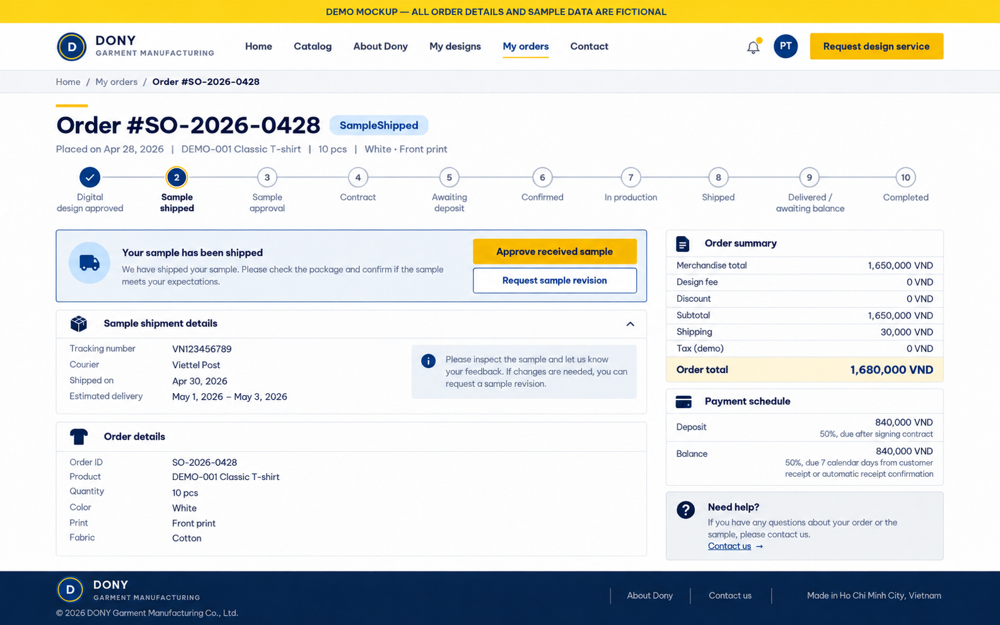

# Screen Spec: S35 Customer Order Detail

| Field | Value |
|---|---|
| Screen ID | `S35` |
| Screen name | Customer Order Detail |
| Actor | Customer owner |
| Priority | Must (MVP) |
| Belongs to module | [MFG-07](../specs/spec-MFG-07.md) |
| Route | `/orders/{order_id}` |
| Mockup image | `img/S35-01-customer-order-detail.png` |
| Status | Resolved implementation specification |

## 1. Purpose

**Shown when:** The customer sees one owned made-to-order order’s immutable design, physical-sample, quantity, delivery, price, contract, deposit, balance and production snapshots, with only the action owned by the current lifecycle state enabled. All identifiers and permissions come from the server session; list filters are allowlisted and recoverable failures preserve entered values.

**The user leaves this screen when:** An authorized action in section 5 succeeds, the user follows a role-allowed global route, or they return to the validated originating route.

**MVP rules (MFG-06 BR-019):** Cancel order is offered only from `AwaitingDigitalApproval` through `AwaitingDeposit` while no deposit has succeeded; there is no refund, no auto-confirmation countdown and no Overdue state. After Dony records verified delivery evidence, the Customer confirms receipt here, or Sales Admin may confirm it on the Customer's behalf in S37. `balance_due_at` is shown for information only. Rows and scenarios below that mention post-deposit cancellation, refunds or the countdown describe the post-MVP behavior.

## 2. Mockup

The mockup illustrates the defined workflow. Fictional sample values do not replace the field, lifecycle and release-scope rules below.

### Mockup deviations

- The stepper omits `SampleInPreparation`; include it in the implemented lifecycle display.
- `SO-2026-0428` is an example of the MFG-06 BR-017 `order_number` format; render the server-provided value.
- The "Estimated delivery" row in the sample shipment panel is the optional MFG-06 BR-018 range entered by Sales Admin; omit the row when no range was recorded.

## 3. Element inventory

| # | Element | Type | Content / data source | Required | Validation |
|---|---|---|---|---|---|
| 1 | Screen heading | Heading | Customer Order Detail | Yes | Static route title. |
| 2 | Route | Navigation target | /orders/{order_id} | Yes | Access checked on server. |
| 3 | order_id / order_number / item_snapshot | Field / control | UUID (route only), customer-visible order number and read-only snapshot | As specified | Owner only; heading shows `order_number` (MFG-06 BR-017); show immutable quantities, address and price breakdown. |
| 4 | status enum | Field / control | canonical MFG-06 lifecycle plus Cancelled | As specified | `AwaitingDigitalApproval`, `DigitalDesignApproved`, `SampleInPreparation`, `SampleShipped`, `PendingContract`, `AwaitingDeposit`, `Confirmed`, `InProduction`, `Shipped`, `DeliveredAwaitingBalance`, `Completed`, `Cancelled`. |
| 5 | design / sample / contract / deposit / balance / refund / batch | Field / control | read-only related projections | As specified | Show version/evidence and authoritative current states; never infer state from email or browser return. |
| 6 | cancellation_eligibility / reason | Field / control | server boolean plus required string 1..500 | As specified | MVP: pre-deposit states only, with no refund. Post-MVP: also pre-production Confirmed, including ScheduledOpen/Locked assignment with atomic release and plan revalidation; captured funds start policy-based refund. |
| 7 | carrier / tracking_number / shipped_at / estimated_delivery_from–to / delivery_evidence_verified_at / auto_confirm_at / received_at | Fulfillment timeline | Read-only sample and goods shipment and receipt evidence | By lifecycle state | Show each shipment's optional estimated delivery range labelled "Estimated by Dony" (MFG-06 BR-018); omit it when absent and never derive a date. Verified delivery proof and countdown are visible while Shipped; receipt timestamp appears after Customer confirmation or scheduled auto-confirmation at DeliveredAwaitingBalance/Completed. |
| 8 | API errors | Field / control | standard API error envelope | As specified | 400 malformed; 422 invalid fields; 409 stale/duplicate; 429 rate limit; 503 dependency failure |
| 9 | Cancel order | Action | Confirm; enforce state/preproduction with atomic release of any scheduled/locked assignment; schedule policy-based refund for captured funds. | Available when authorized | Destination: S34 |
| 10 | Approve digital design | Action | Bind current design/quote version and advance `AwaitingDigitalApproval→DigitalDesignApproved`; stale version requires review. | Only in AwaitingDigitalApproval | Destination: S35 |
| 11 | Approve received sample | Action | Confirm physical receipt and approval of the current sample/design version; advance `SampleShipped→PendingContract`. | Only in SampleShipped | Destination: S35 |
| 12 | Request sample revision | Action | Submit reason and return through a new immutable digital-design/quote approval cycle; do not overwrite prior evidence. | Only in SampleShipped | Destination: S35 |
| 13 | View contract | Action | Open the authorized current contract only after sample approval. | Only in PendingContract or later | Destination: S38 |
| 14 | Pay deposit | Action | Open exact `DEPOSIT` amount only after current contract is Signed and order is `AwaitingDeposit`. | Only in AwaitingDeposit | Destination: S40 |
| 15 | Confirm delivery receipt | Action | Record Customer receipt evidence and immediately advance `Shipped→DeliveredAwaitingBalance`; no dispute action is in MVP. | Only in Shipped | Destination: S35 |
| 16 | Pay remaining balance | Action | Open exact positive `BALANCE` amount only after receipt is recorded; a zero balance follows automatic completion without a payment action. | Only in DeliveredAwaitingBalance with positive balance | Destination: S40 |

When staff records verified carrier/POD evidence, S35 shows the evidence timestamp. Post-MVP only: it also shows a three-calendar-day auto-confirmation countdown. There is no dispute button or dispute state in the MVP. If the Customer does not confirm before expiry, the scheduled event records receipt and changes the order to `DeliveredAwaitingBalance`.

## 4. States

**Loading, access, errors and retry:** Show a labelled Loading state while reads resolve. A missing or inaccessible route returns a safe 401/403/404 without disclosing protected records. Error states show the API code, message, field_errors and request_id while preserving safe input. Retry transient reads; retry a mutation only with the original idempotency key and identical payload. Preserve safe user input after recoverable failures.

| State | What the user sees | Trigger |
|---|---|---|
| Empty | Not applicable to this single-record route; a missing or inaccessible record uses Forbidden/not found. | The route identifies one record. |
| Success | Refresh authoritative order timeline; no dispute action exists, and proof of delivery does not immediately change Shipped. | Valid action commits |
| Conflict | Order changed since load: refresh events and suppress actions invalid for the new status. | Stale version, duplicate or invalid lifecycle transition |
## 5. Interactions and navigation

| # | Element | User action | System response | Goes to screen |
|---|---|---|---|---|
| 1 | Cancel order | Activate | Confirm eligibility and schedule a policy-based refund for captured funds. | S34 |
| 2 | Approve digital design | Activate | Bind reviewed design/quote versions and request sample preparation. | S35 |
| 3 | Approve or revise received sample | Activate | Persist immutable approval/revision evidence and select the corresponding next state. | S35 |
| 4 | View contract | Activate | Open the current sample-bound contract. | S38 |
| 5 | Pay deposit or remaining balance | Activate | Pass server-derived purpose and exact payable amount. | S40 |
| 6 | Confirm delivery receipt | Activate | Record receipt before exposing BALANCE payment. | S35 |

Portal: Customer owner. Route: /orders/{order_id}. Back preserves the originating route and filters. 

### Flexible-production dates (after MFG-10 activation)

Match [S31](S31-production-option.md), [S32](S32-production-terms.md) and the [MFG-10 calendar](../specs/spec-MFG-10.md#53-calendar-and-daily-capacity-calculation). Display the accepted incentive and standard/flexible terms independently of actual routing. After readiness, show readiness working day 1, the day-7 waiting limit and the maximum completion date (day 21 for full-wait flexible terms). Clearly label any quantity-based estimated completion and actual production start separately; an approval-required notice is not InProduction. Before readiness, show the relative 7-day waiting plus 8–14-day production rule without invented absolute dates. Early completion keeps the incentive; late Admin approval cannot silently extend the promised maximum. Do not expose shared-run customers or their artwork/terms.

## 6. Screen-level rules

| Rule ID | Rule | Source |
|---|---|---|
| SR-001 | Check access and ownership on the server; never trust submitted customer, company, role, price, stage or provider status. Apply the documented 401/403/404 behavior and field rules. | Project baseline |
| SR-002 | IDs are UUIDs; timestamps are UTC and displayed in Asia/Ho_Chi_Minh; money and quantities are integers. Mutations use expected versions and idempotency keys where specified. | Project baseline |
| SR-003 | Apply the owning module's lifecycle and validation rules; preserve immutable submitted snapshots and design versions. | Project baseline |
| SR-004 | Use documented project assumptions; do not invent factual company, author, client-approval or course identifiers. | Project baseline |

### Acceptance scenarios

1. Digital approval binds the reviewed version; stale design/quote returns 409 and cannot start sample preparation.
2. Only the current shipped sample can be approved or revised; approval opens contract generation, while revision preserves history and restarts digital approval.
3. Cancellation succeeds only in an allowed pre-production state; release scheduled/locked assignment and revalidate the plan atomically; captured funds use the stored refund policy.
4. Deposit payment is visible only in `AwaitingDeposit`; remaining-balance payment is visible only in `DeliveredAwaitingBalance` after receipt evidence and when the balance is positive; zero balance completes through the authoritative MFG-06 path without a provider attempt.
5. Cancellation of a ScheduledOpen/Locked Confirmed order before human production start releases membership atomically and invalidates the plan/lock for revalidation. Cancellation at or after InProduction returns 409 and leaves the order unchanged.

## 7. Linked requirements

| FR ID (from the module spec) | What this screen does for it |
|---|---|
| MFG-07/F-ORD-002 | **Order Detail View** — Show only the authenticated customer’s authorized order snapshot, lifecycle timeline, contract/payment/refund summaries and shipment tracking; never recalculate historical prices. |
| MFG-07/F-ORD-003 | **Cancel eligible order and request refund** — Allow cancellation only in permitted pre-production states, require a reason and idempotency/version checks, and request a policy-based refund without allowing the client to set its amount. |
| MFG-07/F-ORD-004 | **Cancel Notify Logic** — Notify the customer and Dony Sales Admin after committed cancellation; deduplicate events and include refund status when relevant. |
| MFG-06/F-PAY-003 | **Create Order and Control Approvals** — Bind Customer digital-design and physical-sample approval, receipt and revision actions to immutable versions. |
| MFG-06/F-PAY-004 | **Initiate Payment** — Open the exact eligible DEPOSIT or BALANCE attempt. |
| MFG-06/F-PAY-006 | **Show Order State** — Present authoritative order, receipt, refund and balance state. |

## 8. Responsive and accessibility notes

Support 360px through desktop; stack columns and use labelled horizontal-scroll tables on narrow screens. Controls are keyboard-operable with visible focus, logical headings, associated form labels, and aria-live status/error announcements. Text contrast is at least 4.5:1 (large text 3:1); pointer targets are at least 24px. Preserve user-entered data after recoverable failures. Confirm destructive actions, disable duplicate submit while pending, and enforce idempotency on the server.

## 9. Open questions

| # | Question | Blocking? | Status |
|---|---|---|---|
| 1 | No unresolved screen behavior questions remain; routes, fields, permissions, and defaults are resolved in this specification and its linked module requirements. | No | Resolved |

## Completion checklist

- [x] Route, actor, module, priority, and mockup status are identified.
- [x] Element fields, actions, validation, and data ownership are documented.
- [x] Loading, empty, forbidden, error, retry, success, and conflict states are documented.
- [x] Navigation and acceptance scenarios are explicit.
- [x] Responsive and accessibility requirements are documented in this screen.
- [x] No unresolved screen-level decisions remain.
