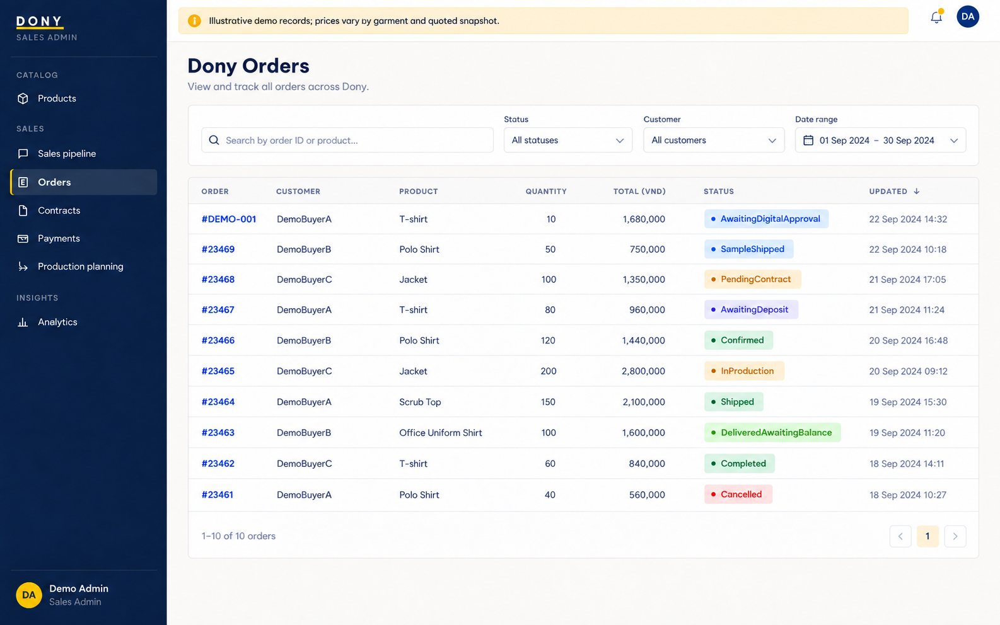

# Screen Spec: S36 Staff Order List

| Field | Value |
|---|---|
| Screen ID | `S36` |
| Screen name | Staff Order List |
| Actor | Sales Admin / Assigned Sales |
| Priority | Must (MVP) |
| Belongs to module | [MFG-07](../specs/spec-MFG-07.md) |
| Route | `/admin/orders` |
| Mockup image | img/S36-01-staff-orders.png |
| Status | Resolved implementation specification |

## 1. Purpose

**Shown when:** The Sales Admin sees Dony orders and may filter by status, date, product and assigned Sales employee. Assigned Sales has read-only access to assigned-customer orders in the MVP. All identifiers and permissions come from the server session.

**The user leaves this screen when:** An authorized action in section 5 succeeds, the user follows a role-allowed global route, or they return to the validated originating route.

## 2. Mockup

The mockup illustrates the defined workflow. Fictional sample values do not replace the field, lifecycle and release-scope rules below.

## 3. Element inventory

| # | Element | Type | Content / data source | Required | Validation |
|---|---|---|---|---|---|
| 1 | Screen heading | Heading | Staff Order List | Yes | Static route title. |
| 2 | Route | Navigation target | /admin/orders | Yes | Access checked on server. |
| 3 | page / page_size / filters | Field / control | paginated query | As specified | Use positive bounded paging; allow only canonical design/sample/contract/payment/production status, date, product and customer filters. |
| 4 | Rows Dony-scoped | Field / control | order_id (link target only), order_number, customer display name, status, total_vnd, created_at, version. | As specified | Display `order_number` (MFG-06 BR-017) as the visible order reference. |
| 4a | Order number search | Search field | Exact `order_number`, case-insensitive | Optional | Trim input; search stays within the viewer's Dony-wide or assigned-customer scope; no match returns the normal empty result. |
| 5 | staff_or_assignment_scope | Field / control | server-derived | As specified | Sales Admin sees Dony rows; Sales sees assigned-customer rows; System Admin has no implicit operational access. |
| 6 | API errors | Field / control | standard API error envelope | As specified | 400 malformed; 422 invalid fields; 409 stale/duplicate; 429 rate limit; 503 dependency failure |
| 7 | Open order | Action | Sales Admin opens any Dony order; Sales opens an assigned-customer order only. | Available when authorized | Destination: S37 |
| 8 | Manage next lifecycle action | Action | Sales Admin may perform the allowed sample/production/shipping action; Sales is read-only in MVP. Neither role may fake Customer approval, receipt, deposit or balance settlement. | Available when authorized | Destination: S37 |
| 9 | Merge console | Action | Sales Admin only after MFG-10 activation; open S46 existing runs, recommendations and waiting/fallback status. Preserve validated origin and order-list filters. | Available when authorized | Destination: S46 |

## 4. States

**Loading, access, errors and retry:** Show a labelled Loading state while reads resolve. A missing or inaccessible route returns a safe 401/403/404 without disclosing protected records. Error states show the API code, message, field_errors and request_id while preserving safe input. Retry transient reads; retry a mutation only with the original idempotency key and identical payload. Preserve safe user input after recoverable failures.

| State | What the user sees | Trigger |
|---|---|---|
| Empty | Show an empty filtered order queue and retain status/date filters. | Screen has no eligible or matching record |
| Success | Refresh the committed Staff Order List data and show the next action permitted by its lifecycle and actor. | Valid action commits |
| Conflict | The Staff Order List data or lifecycle changed concurrently; reload authoritative state and do not replay a stale mutation. | Stale version, duplicate or invalid lifecycle transition |
## 5. Interactions and navigation

| # | Element | User action | System response | Goes to screen |
|---|---|---|---|---|
| 1 | Open order | Activate | Sales Admin opens any Dony order; Sales opens an assigned-customer order only. | S37 |
| 2 | Manage next lifecycle action | Activate | Open the order with server-derived allowed actions. | S37 |
| 3 | Merge console | Activate | Sales Admin only after MFG-10 activation; open S46 existing runs, recommendations and waiting/fallback status. Preserve validated origin and order-list filters. | S46 |

Portal: Sales Admin / Assigned Sales. Route: /admin/orders. Back preserves the originating route and filters. 

### Production-console consistency

[S46 Merge Console](S46-production-planning.md) reuses this screen's staff navigation, order identity/table, filters, pagination and role checks. Opening the console never changes order state. ScheduledOpen/Locked batch status is displayed separately from Confirmed order status. Assigned Sales receives no S46 actions or access to other members' data.

### Shared Sales / Sales Admin view

This same screen supports both Sales Admin and Sales; no duplicate screen is created. Sales Admin sees the Dony-wide queue. Sales sees only orders tied to their current customer assignment and can read design/sample, contract acknowledgement, deposit/balance, production/shipping, delivery-proof and receipt progress. The server applies assignment scope to rows, totals and filters and rechecks it on detail/deep links; reassignment removes the previous Sales employee’s access immediately. Sales cannot gain access through a submitted employee/customer ID or a broader filter.

Visibility does not grant contract administration, cancellation, delivery-proof verification, payment settlement or batch approval. In the MVP, Sales is read-only and Sales Admin performs the operational mutations; outside the MVP, existing assigned-Sales fulfillment permissions keep their module role/state gates. The mockup remains the Sales Admin example; Sales uses the same layout with role-restricted controls.

## 6. Screen-level rules

| Rule ID | Rule | Source |
|---|---|---|
| SR-001 | Check access and ownership on the server; never trust submitted customer, company, role, price, stage or provider status. Apply the documented 401/403/404 behavior and field rules. | Project baseline |
| SR-002 | IDs are UUIDs; timestamps are UTC and displayed in Asia/Ho_Chi_Minh; money and quantities are integers. Mutations use expected versions and idempotency keys where specified. | Project baseline |
| SR-003 | Apply the owning module's lifecycle and validation rules; preserve immutable submitted snapshots and design versions. | Project baseline |
| SR-004 | Use documented project assumptions; do not invent factual company, author, client-approval or course identifiers. | Project baseline |

### Acceptance scenarios

1. Sales Admin list filters cannot return a different system operator's order or financial data.
2. Allowlisted status/date filter returns stable pagination and preserves filter state on detail/back.
3. Assigned Sales sees only assigned-customer orders. In the MVP, fulfillment actions are hidden and rejected server-side; outside the MVP, only the existing assigned-Sales fulfillment permissions apply. Merge, cancellation, contract and financial-administration actions stay hidden and are rejected server-side.

## 7. Linked requirements

| FR ID (from the module spec) | What this screen does for it |
|---|---|
| MFG-07/F-ORD-005 | **Staff Order Dashboard** — Provide Sales Admin with the Dony-wide queue and Sales with only their current assigned-customer orders and progress. |

## 8. Responsive and accessibility notes

Support 360px through desktop; stack columns and use labelled horizontal-scroll tables on narrow screens. Controls are keyboard-operable with visible focus, logical headings, associated form labels, and aria-live status/error announcements. Text contrast is at least 4.5:1 (large text 3:1); pointer targets are at least 24px. Preserve user-entered data after recoverable failures. Confirm destructive actions, disable duplicate submit while pending, and enforce idempotency on the server.

## 9. Open questions

| # | Question | Blocking? | Status |
|---|---|---|---|
| 1 | No unresolved screen behavior questions remain; routes, fields, permissions, and defaults are resolved in this specification and its linked module requirements. | No | Resolved |

## Completion checklist

- [x] Route, actor, module, priority, and mockup status are identified.
- [x] Element fields, actions, validation, and data ownership are documented.
- [x] Loading, empty, forbidden, error, retry, success, and conflict states are documented.
- [x] Navigation and acceptance scenarios are explicit.
- [x] Responsive and accessibility requirements are documented in this screen.
- [x] No unresolved screen-level decisions remain.

MVP: Sales uses these same screens for read-only progress; Sales Admin retains the required operational mutations. Existing broader fulfillment permissions apply only when their owning module capability is enabled. No MFG-08 queue is needed to render an already assigned order; no assignment returns an empty scoped list.
